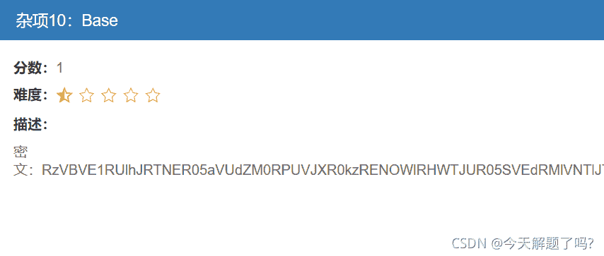
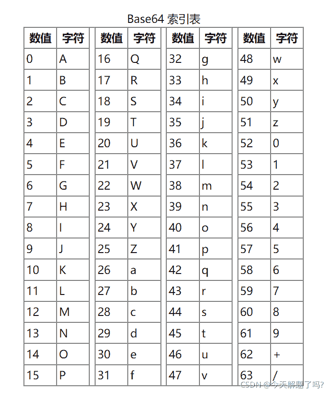
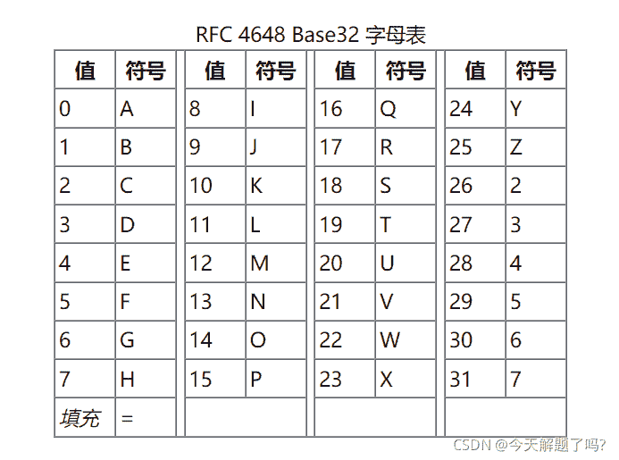
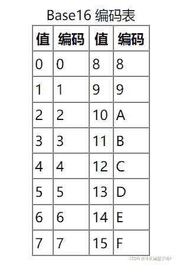

<!--yml
category: 未分类
date: 2022-04-26 14:47:44
-->

# CTF解题记录-Misc-Base_今天解题了吗?的博客-CSDN博客_ctf misc 这才是base

> 来源：[https://blog.csdn.net/qq_45537463/article/details/120328162](https://blog.csdn.net/qq_45537463/article/details/120328162)

题目中的密文： RzVBVE1RUlhJRTNER05aVUdZM0RPUVJXR0kzRENOWlRHWTJUR05SVEdRMlVNTlJTR1lZVE9NWldHVVpUQ01aV0c1Q0E9PT09

根据题目的提示依次进行了base64，base32，base16解码

最终得到flag：zkzctf{base64_base16}

编码转换链接：[Base64编码转换工具，Base64加密解密](https://www.qqxiuzi.cn/bianma/base64.htm "Base64编码转换工具，Base64加密解密")

知识点补充：

**Base64编码**是使用64个可打印ASCII字符（A-Z、a-z、0-9、+、/）将任意字节序列数据编码成ASCII字符串，另有“=”符号用作后缀用途。

Base64将输入字符串按**字节**切分，取得每个字节对应的**二进制值**（若不足8比特则高位补0），然后将这些二进制数值串联起来，再按照6比特一组进行切分（因为2^6=64），最后一组若不足6比特则末尾补0。将每组二进制值转换成十进制，然后在上述表格中找到对应的符号并串联起来就是Base64编码结果。

由于二进制数据是按照8比特一组进行传输，因此Base64按照6比特一组切分的二进制数据必须是24比特的倍数（6和8的最小公倍数）。24比特就是3个字节，若原字节序列数据长度不是3的倍数时且剩下1个输入数据，则在编码结果后加2个**=**；若剩下2个输入数据，则在编码结果后加1个**=**。

完整的Base64定义可见RFC1421和RFC2045。因为Base64算法是将3个字节原数据编码为4个字节新数据，所以Base64编码后的数据比原始数据略长，为原来的4/3。在电子邮件中，根据RFC822规定，每76个字符，还需要加上一个回车换行。可以估算编码后数据长度大约为原长的135.1%。

Base64可用于任意数据的底层二进制数据编码，以应用于只能传输ASCII字符的场合。不过最常用于文本数据的处理传输，例如在MIME格式的电子邮件中，Base64可以用来编码邮件内容，方便在不同语言计算机间传输而不乱码，注意是传输而不是显示，例如在西欧地区计算机上使用utf-8编码即可正常显示中文（安装有对应字库），但是它未必能正常传输中文，这时转换为Base64便无此顾虑。

Base64编码若无特别说明，通常约定非ASCII字符按照UTF-8字符集进行编码处理。

**Base32编码**是使用32个可打印字符（字母A-Z和数字2-7）对任意字节数据进行编码的方案，编码后的字符串不用区分大小写并排除了容易混淆的字符，可以方便地由人类使用并由计算机处理。

Base32将任意字符串按照字节进行切分，并将每个字节对应的二进制值（不足8比特高位补0）串联起来，按照5比特一组进行切分，并将每组二进制值转换成十进制来对应32个可打印字符中的一个。

由于数据的二进制传输是按照8比特一组进行（即一个字节），因此Base32按5比特切分的二进制数据必须是40比特的倍数（5和8的最小公倍数）。例如输入单字节字符“%”，它对应的二进制值是“100101”，前面补两个0变成“00100101”（二进制值不足8比特的都要在高位加0直到8比特），从左侧开始按照5比特切分成两组：“00100”和“101”，后一组不足5比特，则在末尾填充0直到5比特，变成“00100”和“10100”，这两组二进制数分别转换成十进制数，通过上述表格即可找到其对应的可打印字符“E”和“U”，但是这里只用到两组共10比特，还差30比特达到40比特，按照5比特一组还需6组，则在末尾填充6个“=”。填充“=”符号的作用是方便一些程序的标准化运行，大多数情况下不添加也无关紧要，而且，在URL中使用时必须去掉“=”符号。

与Base64相比，Base32具有许多优点：

*   适合不区分大小写的文件系统，更利于人类口语交流或记忆。
*   结果可以用作文件名，因为它不包含路径分隔符 “/”等符号。
*   排除了视觉上容易混淆的字符，因此可以准确的人工录入。（例如，RFC4648符号集忽略了数字“1”、“8”和“0”，因为它们可能与字母“I”，“B”和“O”混淆）。
*   排除填充符号“=”的结果可以包含在URL中，而不编码任何字符。

Base32也比Base16有优势：

*   Base32比Base16占用的空间更小。（1000比特数据Base32需要200个字符，而Base16则为250个字符）

Base32的缺点：

*   Base32比Base64多占用大约20％的空间。因为Base32使用8个ASCII字符去编码原数据中的5个字节数据，而Base64是使用4个ASCII字符去编码原数据中的3个字节数据。

**Base16编码**使用16个ASCII可打印字符（数字0-9和字母A-F）对任意字节数据进行编码。Base16先获取输入字符串每个字节的二进制值（不足8比特在高位补0），然后将其串联进来，再按照4比特一组进行切分，将每组二进制数分别转换成十进制，在下述表格中找到对应的编码串接起来就是Base16编码。可以看到8比特数据按照4比特切分刚好是两组，所以Base16不可能用到填充符号“=”。

Base16编码后的数据量是原数据的两倍：1000比特数据需要250个字符（即 250*8=2000 比特）。换句话说：Base16使用两个ASCII字符去编码原数据中的一个字节数据。

Base16编码是一个标准的十六进制字符串（注意是字符串而不是数值），更易被人类和计算机使用，因为它并不包含任何控制字符，以及Base64和Base32中的“=”符号。

输入的非ASCII字符，使用UTF-8字符集。

知识点来源： [Base16编码解码，Base16在线转换工具 - 千千秀字](https://www.qqxiuzi.cn/bianma/base.php?type=16 "Base16编码解码，Base16在线转换工具 - 千千秀字")