<!--yml
category: 未分类
date: 2022-04-26 14:48:08
-->

# CTF论剑场web解题_梳刘海的杰瑞的博客-CSDN博客

> 来源：[https://blog.csdn.net/weixin_45664911/article/details/103001089](https://blog.csdn.net/weixin_45664911/article/details/103001089)

### web1

分析代码，是Extract（）函数引起的变量覆盖漏洞，搜索关于变量覆盖漏洞的知识。(一下是我参考的几篇文章)

> [https://blog.51cto.com/12332766/2120865](https://blog.51cto.com/12332766/2120865) 比较通俗易懂易懂，与题目类型相似
> [https://www.cnblogs.com/bmjoker/p/9025351.html](https://www.cnblogs.com/bmjoker/p/9025351.html) 一系列关于变量覆盖漏洞的题目

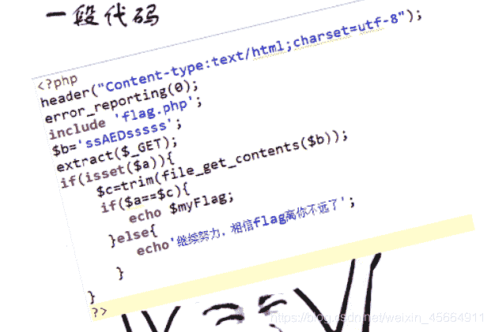
刚开始得知出现flag的条件是a=c（php中$表示定义一个变量），逐步推上去，发现吧的值是ssADEsssss，所以在网址栏中使得a=ssADEsssss.

有一丝奇怪，看完题解后，换成"?a&b=ssADEsssss"
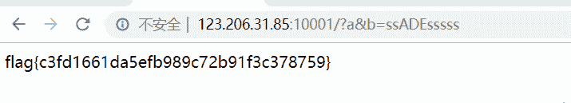
大佬给出的解释是“有b才会有c”,依旧钻牛角尖的我
尝试了:
a&b&c=ssADEsssss;
a&c=ssADEsssss;
a&b=s;
a&c=s;
这些都可以得出flag，而没有a的如：b&c=s就无法得出flag。
总结来讲，这段代码的实质是将a和c等值，从而得出flag。

* * *

### web2

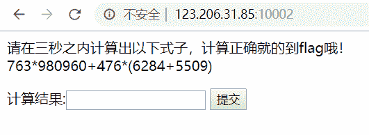
三秒之内。。。。手速没有那么快，而且每一次刷新都有新的式子出现，所以题目肯定不是为了让你死算。
参考大佬的博客，利用python脚本跑出flag

```
import re 
import requests
​
s = requests.Session()  
url = '题目的URL'
r = s.get(url)
r.encoding = 'utf-8' 
print(r.text)
num = re.findall(re.compile(r'<br/>\s+(.*?)</p>'), r.text)[0]  
print(num)
r = s.post(url, data={'result': eval(num)})      
print(r.text) 
```

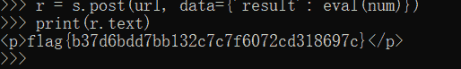
看到这个题目让我想到了很久之前的bugku的一道web题，那道题比较简单，把最大长度改成答案长度，计算出答案输入就好了（计算比较简单）。

* * *

### web3

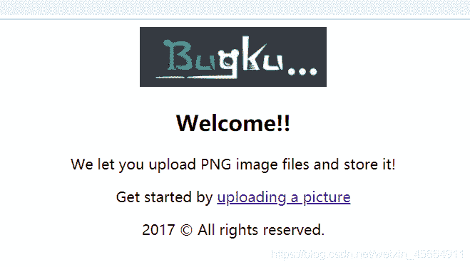

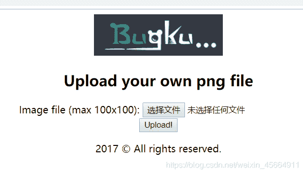
看到页面的第一反应是文件上传题，先上传一个图片试试。
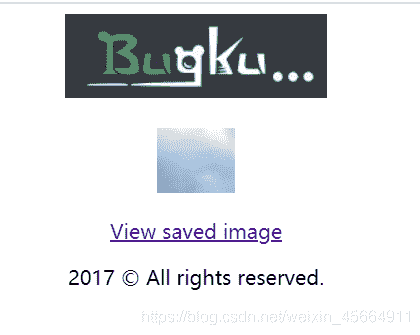
url:
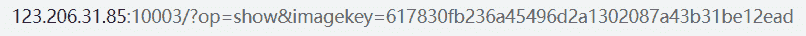
尝试利用图片一句话木马做文件上传绕过：
在文件夹中建立三个文件：
1.普通的符合上传格式要求的图片
2.内容是cmd的bat文件
3.内容是一句话木马的PHP文件
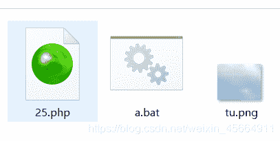
打开a.bat文件进入dos命令，输入**copy tu.png/b+25.php tu25.png**文件夹中就形成了一个内含一句话木马的png图片。
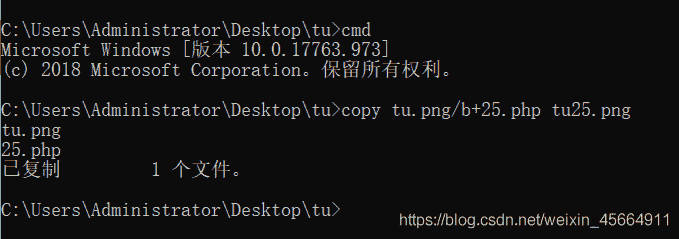
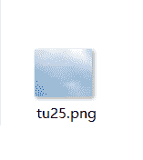
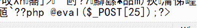
*注：不能直接用记事本打开后添加一句话木马，会造成文件损坏 *
打开蚁剑准备连接进行文件绕过，但是看到url跟上次做的文件上传题目格式不太一样，是我孤陋寡闻？尝试一下吧。
URL：http://http://123.206.31.85:10003/index.php?file=php://filter/read=convert.base64-decode/resource=uploads/tu25.png

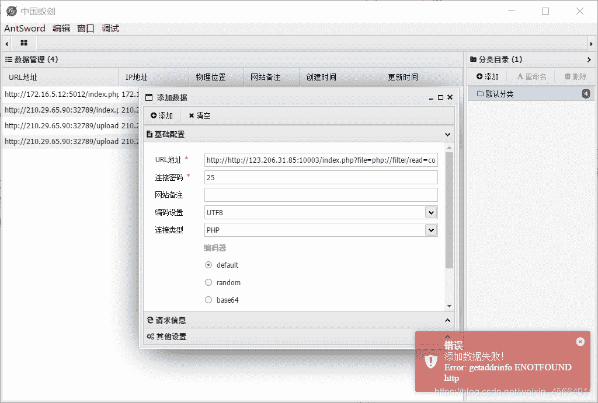
上传失败，不知道是我URL有问题还是本来就不行。文件上传是一个挺重要的知识点，涵盖了很多东西，需要花很长时间去理解吸收。
看了大佬的writeup说，从URL看出是一道文件包含的题目
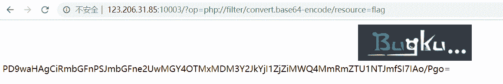

```
payload:http://123.206.31.85:10003/?op=php://filter/convert.base64-encode/resource=flag 
```

* * *

### web 4

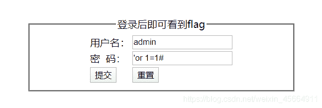
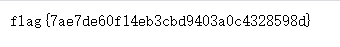

> **知识点：sql注入——万能密码**
> 账号：admin
> 密码：’ or ‘1’='1或’or 1=1#

***原理***：用户进行用户名和密码验证时，网站需要查询数据库。查询数据库就是执行SQL语句。
用户登录时，后台执行的数据库查询操作（SQL语句）是：
【Select user_id,user_type,email From users Where user_id=’用户名’ And password=’密码’】。
2.由于网站后台在进行数据库查询的时候没有对单引号进行过滤，当输入用户名【admin】和万能密码【2’or’1】时，执行的SQL语句为：
【Select user_id,user_type,email From users Where user_id=’admin’ And password=’2’or’1’】。
3.由于SQL语句中逻辑运算符具有优先级，【=】优先于【and】，【and】优先于【or】，且适用传递性。因此，此SQL语句在后台解析时，分成两句：
【Select user_id,user_type,email From users Where user_id=’admin’ And password=’2’】和【’1’】，两句bool值进行逻辑or运算，恒为TRUE。
SQL语句的查询结果为TRUE，就意味着认证成功，也可以登录到系统中。

输入用户名【admin】，密码【2’or’1】，即可登录成功。(加粗部分为切入点，其他随意填写)

```
username=' or ''='&password=' or ''=' 

解析：select * from admin where username=''=''and password=''=''
即(username='')='' 等价于 null=null导致输出所有内容 
```

一篇关于sql注入——万能密码的文章：[https://cloud.tencent.com/developer/article/1076691](https://cloud.tencent.com/developer/article/1076691)

* * *

### web 5

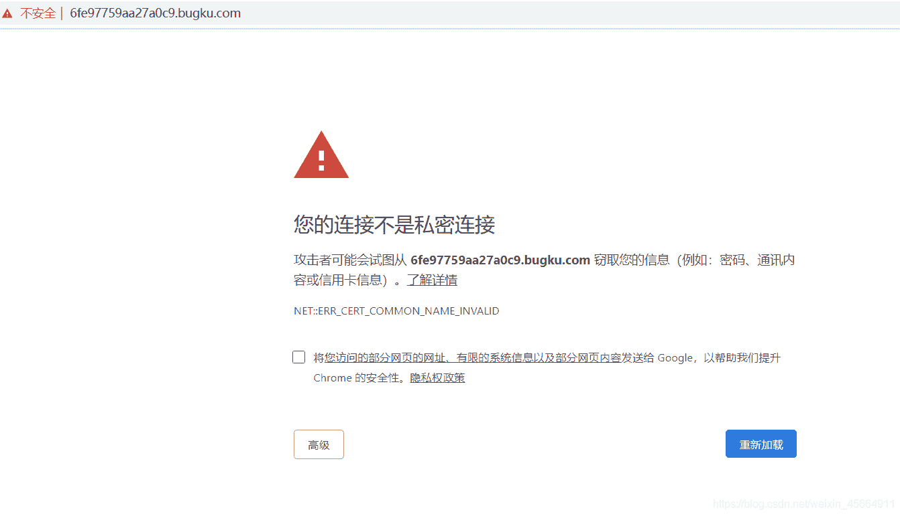
网址有点奇怪，跟别人题解中的网址也不一样。

* * *

### web 6

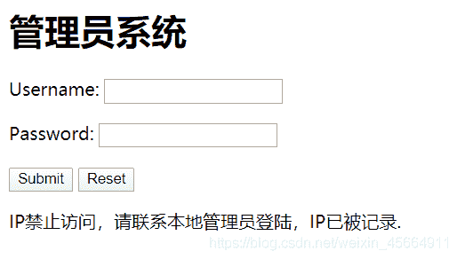
刚开始使用万能密码尝试登录，之后发现需要本地登录。bp抓包之后改一下请求头。
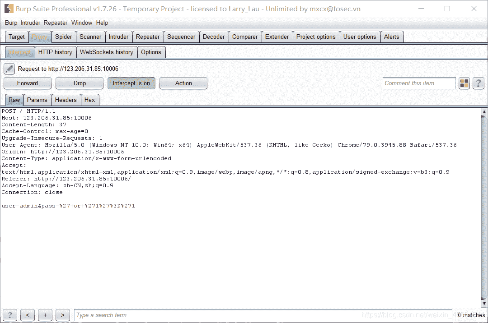
send to repeater，左边添加红线框中的内容，go
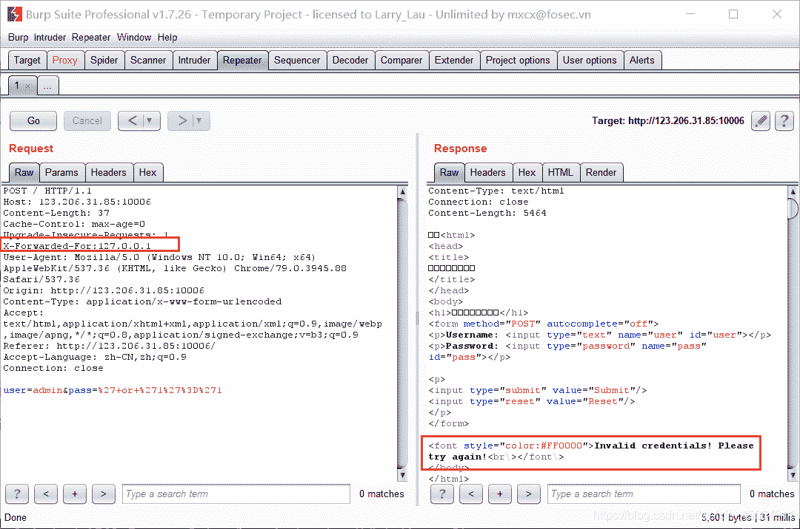

> **X-Forwarded-For** 是一个 HTTP 扩展头部。HTTP/1.1（RFC 2616）协议并没有对它的定义，它最开始是由 Squid 这个缓存代理软件引入，用来表示 HTTP 请求端真实 IP。
> 在 Nginx 所处服务器上访问，无论直连还是走 Nginx 代理，Remote Address 都是 **127.0.0.1**。
> **Remote Address**是nginx与客户端进行TCP连接过程中，获得的客户端真实地址. 无法伪造

刚开始如果没有添加，go出来的是IP小方框小方框,而现在改变后变成了please try again。
尝试改密码，还是错误的。将response拖到最下面，发现了一串base64编码，解码得test123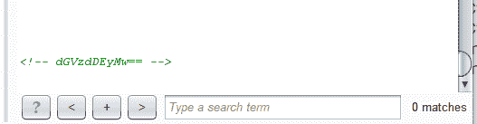
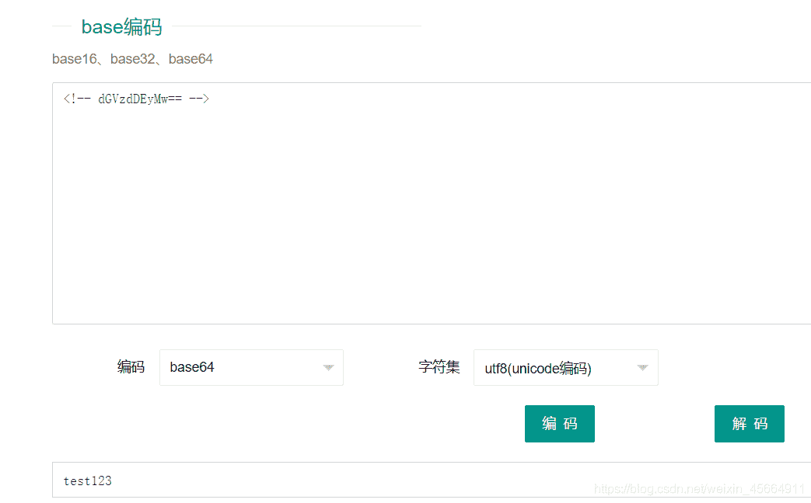
可能是密码吧，将pass改成test123，go


* * *

### web 7

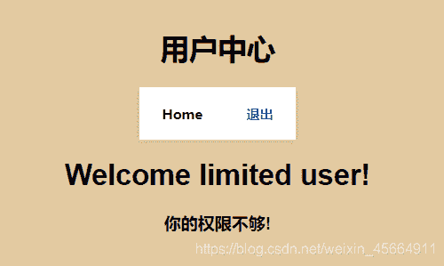
不管是随意登录还是注册之后在登录都是可以直接登录的，并且出现提示权限不够的界面。根据题目提示小饼干，想到了cookie，bp抓包一下，看cookie值
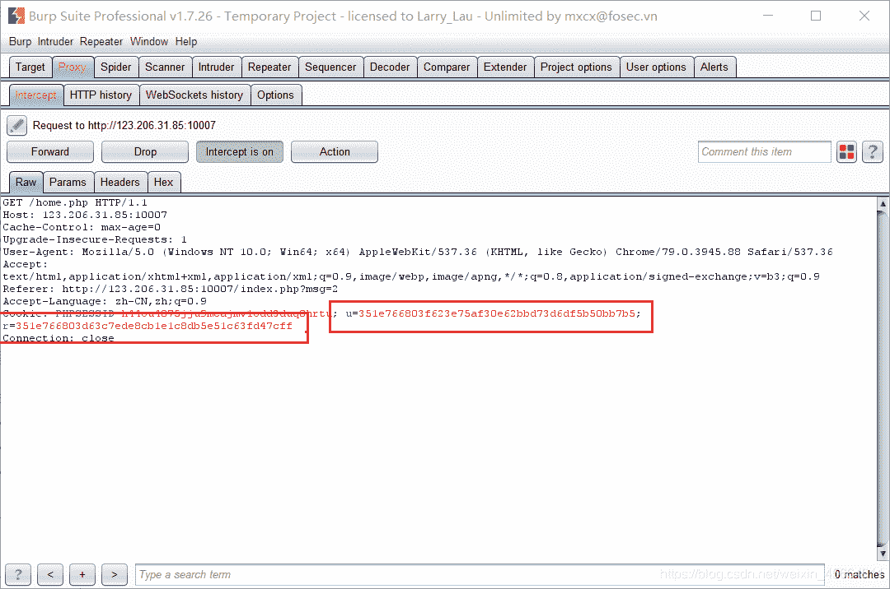
由图可知，u和r，应该对应的用户名和密码，字符串前面都是一样的，后面的数据不一样

> u=351e766803 21232f297a57a5a743894a0e4a801fc3
> r= 351e766803 d63c7ede8cb1e1c8db5e51c63fd47cff

将后面的字符串进行md5加密（[https://www.somd5.com/](https://www.somd5.com/)）
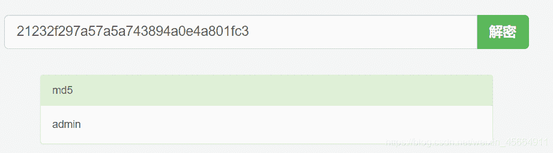
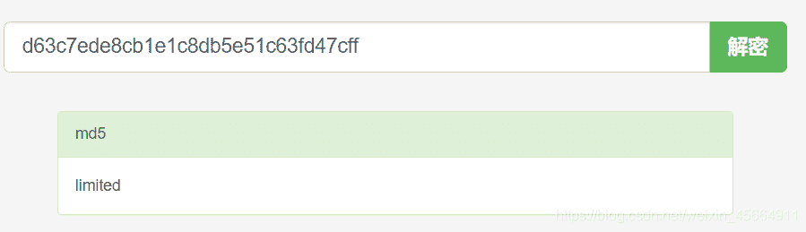

##### cookie欺骗

cookie的欺骗是用户在登录的时候极为容易被他人获取权限，植入浏览器中，从而访问到后台。
先简要认识一下cookie，cookie机制是在浏览网页的时候，服务器将你的登录信息，浏览信息等发送给客户端并保存一定的时间。当你下一次访问这个网站的时候，就能读取上一次你的记录。例如自动登录等。很多的网站都是由cookie来辨认登录者的信息。它可以起到登录验证的作用，从而存在了漏洞，可以绕过验证直接登录到后台。

本文参考文章：
[https://blog.csdn.net/godhhh/article/details/81335729](https://blog.csdn.net/godhhh/article/details/81335729) [https://blog.csdn.net/paradise3011/article/details/82752347](https://blog.csdn.net/paradise3011/article/details/82752347)