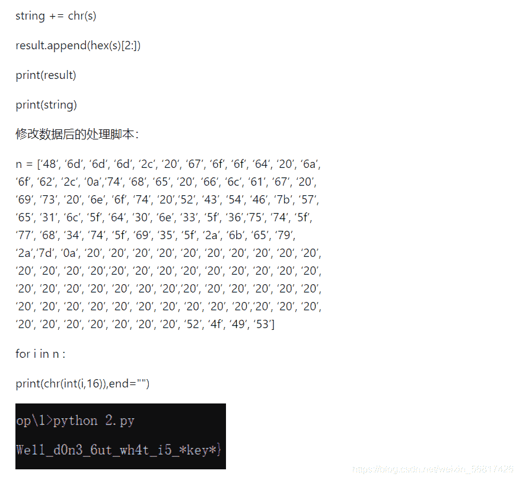
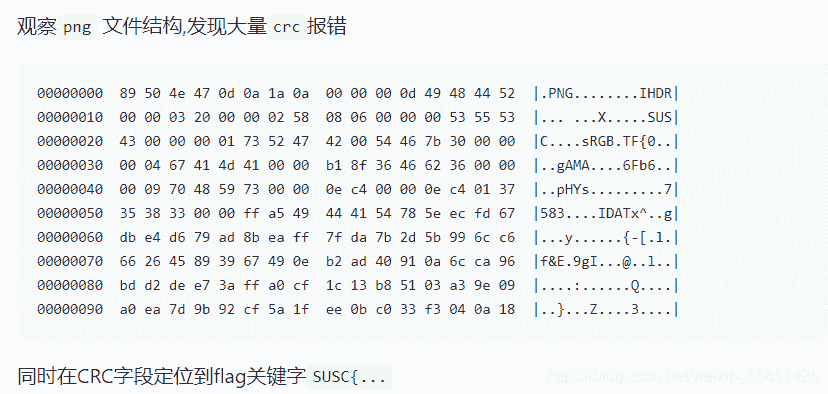
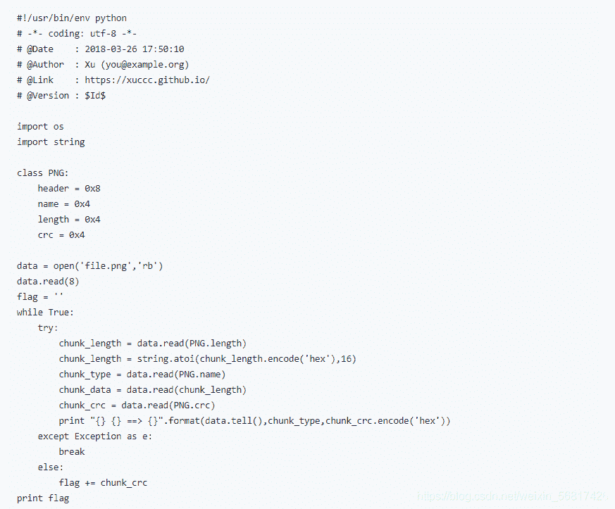
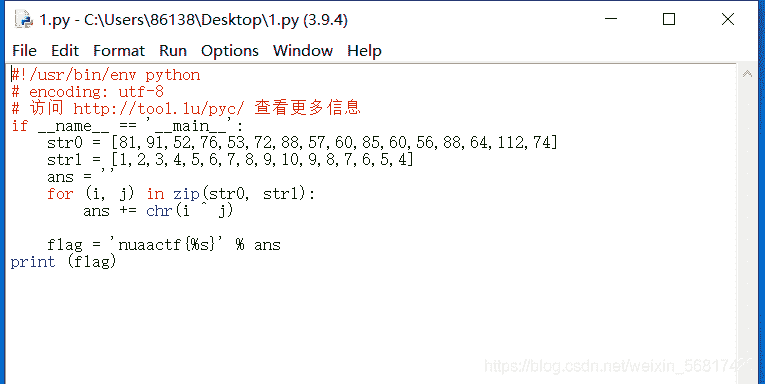
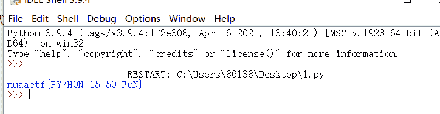

<!--yml
category: 未分类
date: 2022-04-26 14:55:22
-->

# CTF部分题目解析_阿峰啊啊啊的博客-CSDN博客

> 来源：[https://blog.csdn.net/weixin_56817426/article/details/116926343](https://blog.csdn.net/weixin_56817426/article/details/116926343)

题目：xor-md5

# 一、读题

当异或和md5同时存在时，你先异或还是md5

# 二、审题

windex 异或

# 三、解题

下载下来是一个无后缀名的文件，用hex打开看到十六进制的内容中有几行是重复的，加上题目是 异或 xor，怀疑 重复的内容就是 xor key

题目：2018SUSCTFunKnow

# 一、读题

NULL

# 二、审题

题目没给出什么信息

# 三、解题

题目：NUAACTFpychon

# 一、读题

NULL

# 二、审题

题目没给出什么信息

# 三、解题

