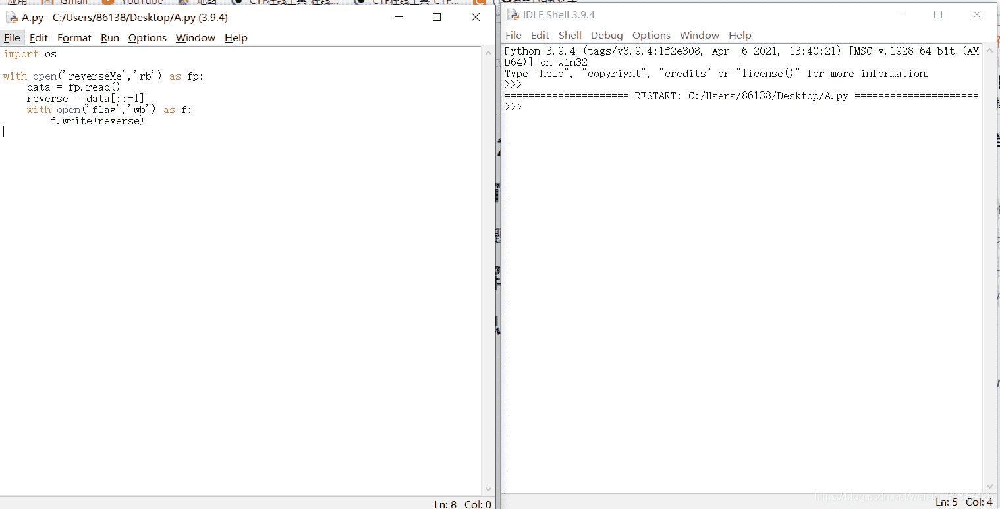
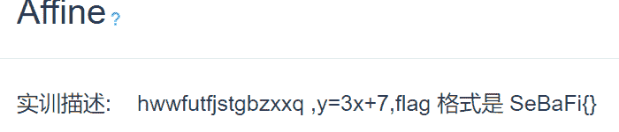
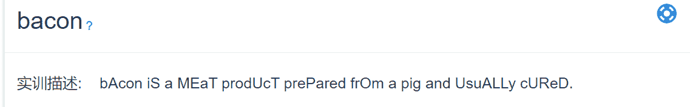
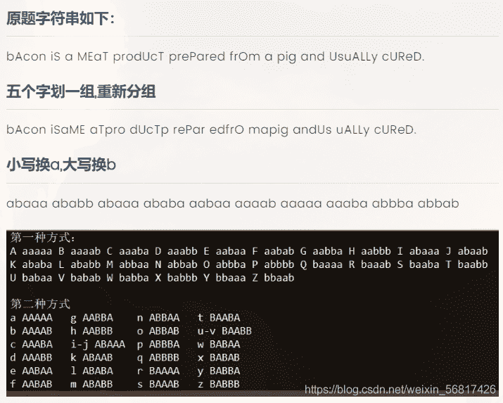
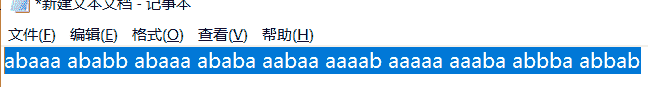

<!--yml
category: 未分类
date: 2022-04-26 14:55:15
-->

# CTF部分题目解析_阿峰啊啊啊的博客-CSDN博客_ctf竞赛试题及答案

> 来源：[https://blog.csdn.net/weixin_56817426/article/details/115870862](https://blog.csdn.net/weixin_56817426/article/details/115870862)

# CTF竞赛题目解析

# 1.2017世安杯ReverseMe

# 读题:

杂项类

# 审题:

由题可知他是反转类型的题目。

# 解题：

执行代码会出现一个名为flag的图片文件
再使用画图打开再水平反转就可以得到flag.

# 2.Affine

# 读题:

密码学

# 审题:

由于题目名字是Affine，我们猜测是仿射密码

# 解题:

# 3.一步之遥

# 读题:

位移密码

# 审题:

从题目以及描述来看位移了一位

# 解题:

考察移位密码，题目提示64m/s的速度，联想到base64编码。>>联想到==，ascii码差了一位题目本身也提示一步（A Step），所以移动位数为1位。

编写python脚本，再base64解码得到flag

a=“b3W6f3FzOHKkZ3KiN{B5NkSmZXJ5[ERxNUZ5Z3ZyZ{Gn[kWigR>>”
s=[""]*len(a)
for j in range(26):
for i in range(len(a)):
s[i]=chr(ord(a[i])-j)
print ("".join(s))
flag：SeBaFi{a24bccba30824eab8d40168cf1c1ff5a}

# 4.bacon

# 读题:

描述：bAcon iS a MEaT prodUcT prePared frOm a pig and UsuALLy cUReD.

# 审题:

题目名字是bacon，中文翻译就是培根。但是中间的个别字母被人为强行大写了。猜测是培根加密算法

# 解题:

再将这串字符解密
得到flag:ilikebacon