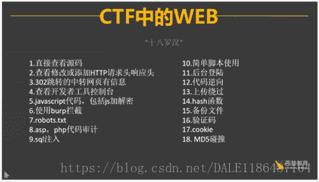
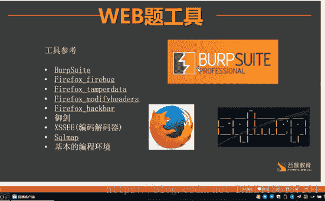

<!--yml
category: 未分类
date: 2022-04-26 14:35:33
-->

# CTF里面的WEB题的一些解决思路_F10W3RDANC3的博客-CSDN博客_ctfweb思路

> 来源：[https://blog.csdn.net/DALE1186487104/article/details/80012659](https://blog.csdn.net/DALE1186487104/article/details/80012659)

# CTF里面解决WEB题的一些常用思路：

# （福利：末尾有视频链接）

## 如图( 十八罗汉)

                                            

                                            PS：（下文的序列号是对图片中序列号的一些补充）

#### WEB题中常用的工具

                                     

**(1):直接查看源码：查看源码的方法除了鼠标右键查看外，还可以通过在网址栏前面加入”view-source:“，语句或者通过F12键打开控制台，通过控制台改变一些元素的信息来获取flag**

**(2)  查看修改过添加HTTP请求头响应头：对于这种类型的题目，可能直接修改信息行不通，那就得用到BP这个工具了，通过修改代理来间接改变成题目所需要的信息，再通过软件运行，即可得到flag，对于一些有SQL语句预防的情况下可以使用“’ or 1=1 group by pwd with rollup limit 1 offset 2#   ”这条语句直接得到flag**

**(3) 后台登录   绕过登录获得FLAG**

**(4)利用开发者工具控制台 如果打开题目是很多的代码，可以将代码粘贴至控制台（例如jother代码属于js代码的一种）然后控制台会执行该代码**

**(5)使用BP拦截  BP是一个很强大的软件，如果对于该软件不怎么了解的话，可以参考BP的手册Burp-Suite-使用手册.docx，可以很快的使用这个软件完成各种功能**

**（链接https://pan.baidu.com/s/1t3Oq7DS2E_hTTIUVfX-1Pw）**

**(6)上传绕过  由于文件上传功能实现代码没有严格限制用户上传到文件后缀以及文件类型，导致攻击者能够向某个可通过WEB访问的目录上传恶意文件，并被脚本解析器执行，这样就可以在远程服务器上执行恶意脚本 例如  一句话木马**

**文件截断：在文件头末尾改变一下，把十六进制的空格（20）改成空字节（00）**

**(7)SQL注入  SQL注入就是把sql语句以精妙的方式放到输入框中，送到后台去执行，从而获取非法的信息**

**判断是否存在SQL注入的一些语句：”1‘ and 1=1，””and 1=2”**

**(8)cookie 登录网站的时候会产生cookie信息，通过获取cookie信息来绕过登录**

**用BP来获取数据包，通过删掉cookie信息来得到flag**

**(9)HASH函数 利用sha函数的漏洞（sha函数默认传入的是字符串，传入其他类型得到的结果是false)**

**(视频连接:**

**https://pan.baidu.com/s/1SpvUb6twpNR1UnofmhBm4A)**