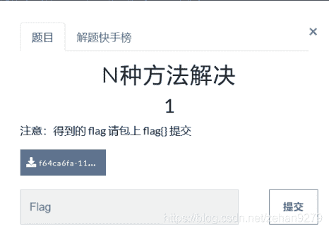
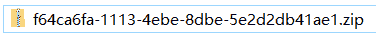
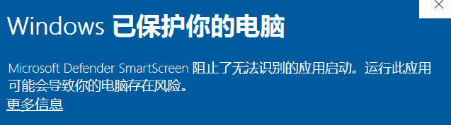
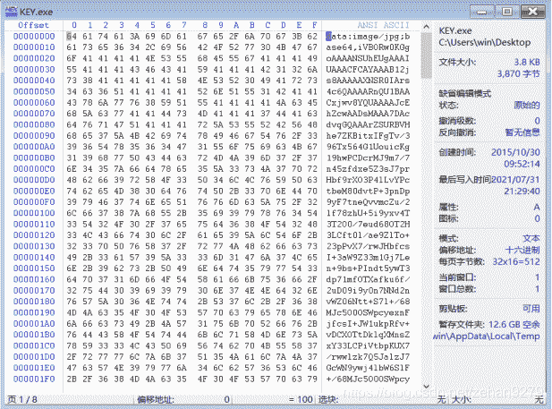
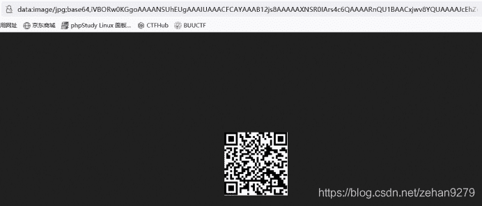
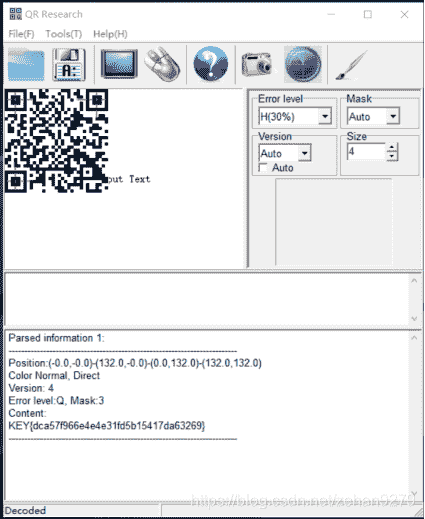

<!--yml
category: 未分类
date: 2022-04-26 14:36:12
-->

# CTF题之BUUCTF系列：BUUCTF Misc N种方法解决_一只小蜜蜂飞飞飞的博客-CSDN博客_buuctf解题

> 来源：[https://blog.csdn.net/zehan9279/article/details/119282461](https://blog.csdn.net/zehan9279/article/details/119282461)

**一、名称**

BUUCTF Misc  N种方法解决

**二、题目链接：https://buuoj.cn/challenges**

解压缩后是一个exe执行文件

双击执行后，弹出以下提示：

 无法打开，未获得结果，换其它解决方法。

**三、解题步骤**
1、使用winhex工具打开KEY.exe文件，查看一下内部结构

2、发现文档后面有两个等号（==），前面有着data:image/jpg;base64。猜测可能是一个经过base64编码的图片，于是将那一串字符串作为网址，粘贴到浏览器中，打开后得到一张二维码图片：

将获得的二维码作为图片保存。
3、使用QR工具进行解析

4、解析后得到了flag值

KEY{dca57f966e4e4e31fd5b15417da63269}

 5、提交答案flag为

flag{dca57f966e4e4e31fd5b15417da63269}

此题第2步中，也可以将那一串字符串通过工具解密，得到二维码图片，不一定非要通过浏览器打开才能得到。