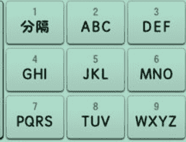

<!--yml
category: 未分类
date: 2022-04-26 14:39:30
-->

# CTF题库>奇怪的短信_就是217的博客-CSDN博客

> 来源：[https://blog.csdn.net/qq_42777804/article/details/99292030](https://blog.csdn.net/qq_42777804/article/details/99292030)

收到一条奇怪的短信:

          335321414374744361715332

          你能帮我解出隐藏的内容嘛？！

格式：CTF{xxx}

看到这个 哈哈哈哈哈  虽然不常用九键 的我 习惯用二十六键的我  也是知道点的哈哈哈

发现每个数字的第二个都不超过4   不就是选位置嘛  （对应键位的第一二三四中的某个字母）

问我是从哪里发现的？？？？？

33（F）53（L）21（A）41（G）

哈哈哈直接给顺下来

FLAGISIMPLE

按照格式  

CTF{FLAGISIMPLE}

改成小写

CTF{flagissimple}

就可以啦