<!--yml
category: 未分类
date: 2022-04-26 14:20:17
-->

# CTF题目Misc解题历程（持续更新）_回头上岸的博客-CSDN博客_misc解题

> 来源：[https://blog.csdn.net/dbsod007520/article/details/118940190](https://blog.csdn.net/dbsod007520/article/details/118940190)

# 1、gif文件修复

题目为一张名为xx.gif的图片，无法正常打开，我们使用WinHex来进行解析，发现图片头文件有问题。正常gif图片的头文件为47494638，而这张图片头只有38
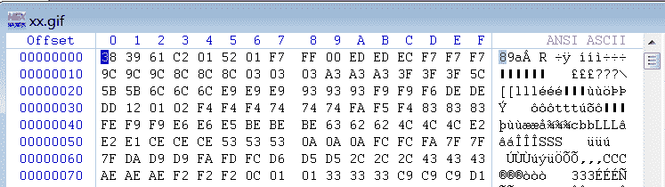

此使我们右键复制474946 光标处于第一个字符处,点击编辑-剪贴板数据-粘贴，弹出对话框点击确定
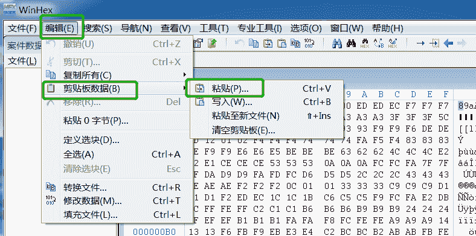
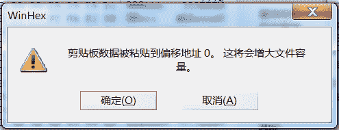
选择ASCII_Hex 点击确定
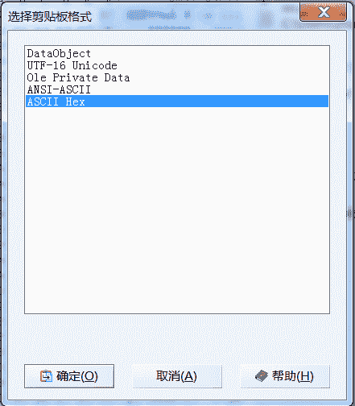
修改头文件后，保存，gif图片就能正常打开了

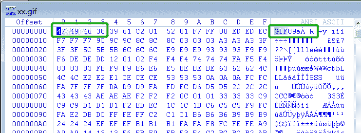

GIF图是动态图，可以用微信拍个小视频，一步一步暂停观看。最终可到图片显示内容为
key is: dGhpcyBpcyBhIGdpZg== 可以明显看出是base64加密后的字符，对其进行解密后得出flag为
key is: this is a gif

# 2、灌篮高手


用StegSolve将图片打开，点击Analyse-Data Extract
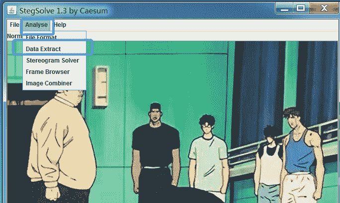
勾选红绿蓝的0位，点击Preview，再点击Save Bin，命名111，保存

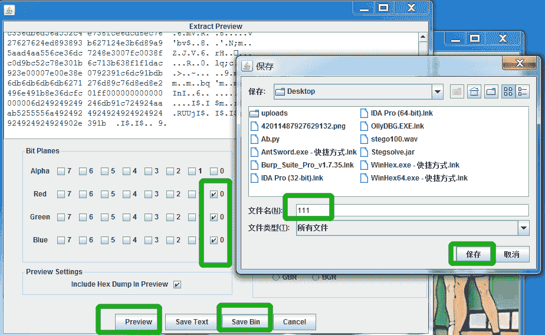
使用WinHex打开这个111文件，发现文件头为504B0304 这是.zip的头文件，可以将其后缀改为.zip
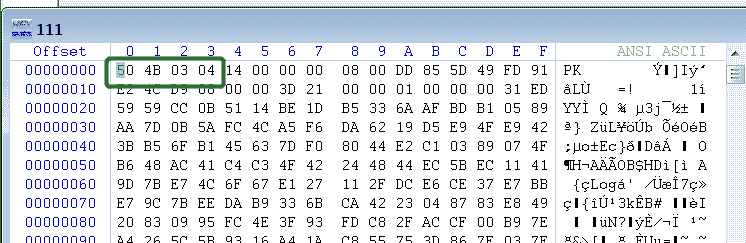
解压发现111.zip文件损坏，用WinRAR打开，点击工具-修复压缩文件，可以在当前路径下看到一个rebuilt.111.zip的压缩包，解压后发现一个名为 1 的文件
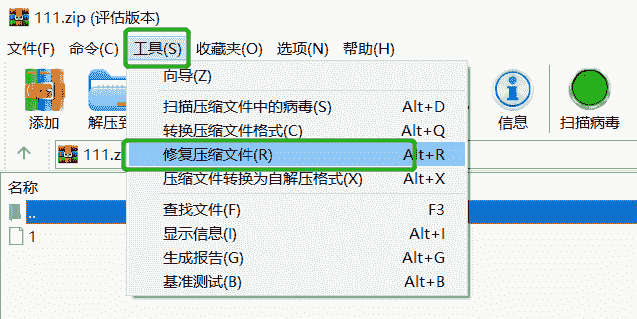
在kali里面用file命令查看一下1文件，可以看到这个1是linux下的可执行文件
┌──(kali㉿kali)-[~]
└─$ **file 1**
1: ELF 64-bit LSB executable, x86-64, version 1 (SYSV), dynamically linked, interpreter /lib64/ld-linux-x86-64.so.2, for GNU/Linux 2.6.24, BuildID[sha1]=8df45089fa39fec83423ec37a944e81065d16bee, not stripped

执行以下这个1 得到flag

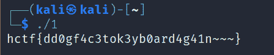

# 3、base


题目提供了一张base.jpg的图片，在kali下使用binwalk看以下，发现图片中包括一个RAR文件，使用foremost将其分离出来
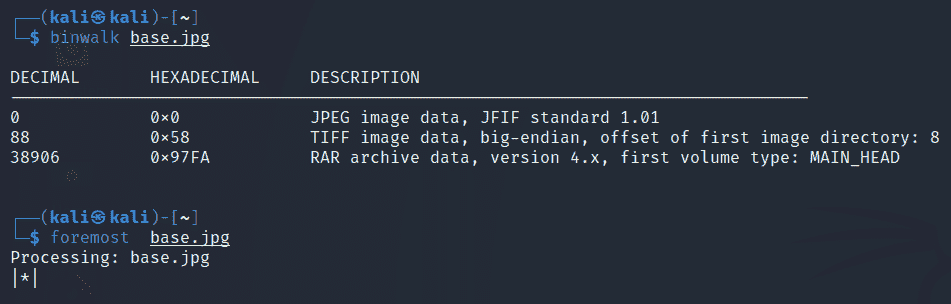
在kali当前路径下出现一个output文件夹，分离得到一个压缩包，进行各种爆破还是爆破不出密码。使用strings命令，在最后看到一个提示，shiyanbar
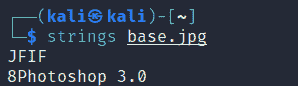
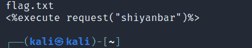
由于本题目名叫base，所以shiyanbar进行base64编码，得出的字符串就是压缩包密码，解密后得到flag为CTF{simpleware}
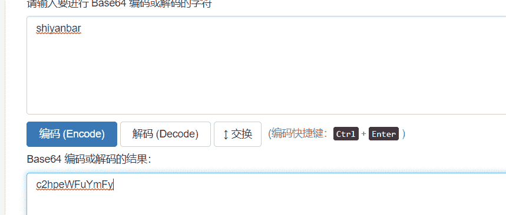

# 4、challenge（bpg文件）


使用010Editor打开，发现图片中附加有BPG文件，以42 50 47 FB开头
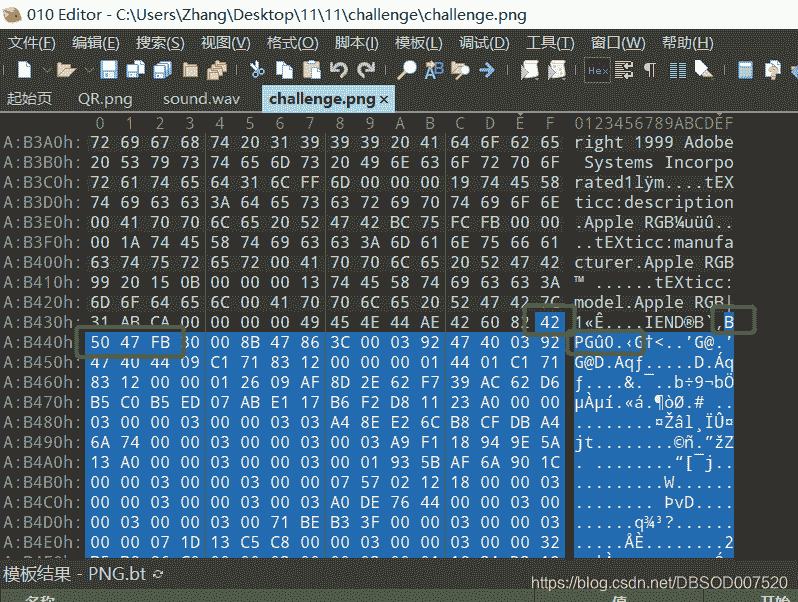
将其选中以后，右键“选择”-“保存选择”，另存为一个.bpg后缀的文件
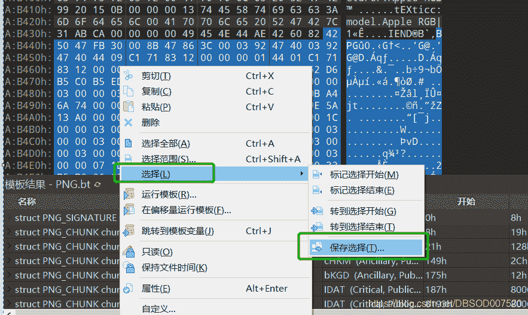
.bpg文件正常无法打开，必须使用专用工具查看[工具下载](https://bellard.org/bpg/)
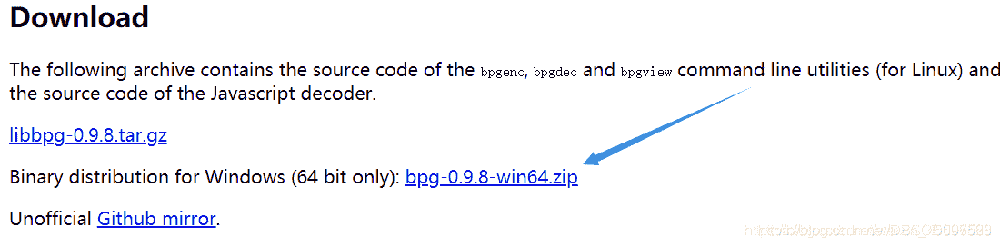
打开.bpg文件后，发现一个base64码，解码后得到flag `bsides_delhi{BPG_i5_b3tt3r_7h4n_JPG}`
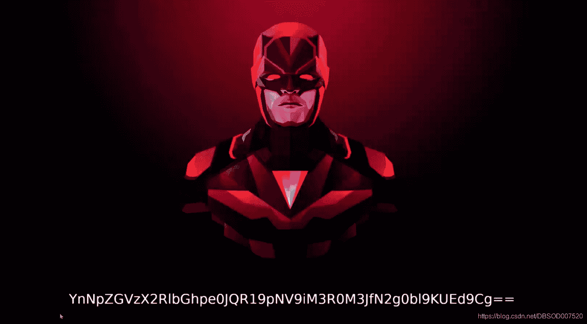

# 5、decode（解码）

题目提供了一串字符，从开头的0x可以看出是16进制数

```
0x253464253534253435253335253433253661253435253737253464253531253666253738253464
25343425363725346225346625353425366225346225346425353425343525373825343325366125
34352537372534662535312536662537382534642534342534352534622534642535342534352533
32253433253661253435253738253464253531253666253738253464253534253535253462253464
25353425343125333025343325366125343525373725346525353125366625373825346425366125
34352534622534662535342536332534622534642535342534352537372534332536612536622533
34253433253661253662253333253433253661253435253738253465253431253364253364 
```

使用Converter工具，将这一串字符转为文本，可以看出转换后的是url编码
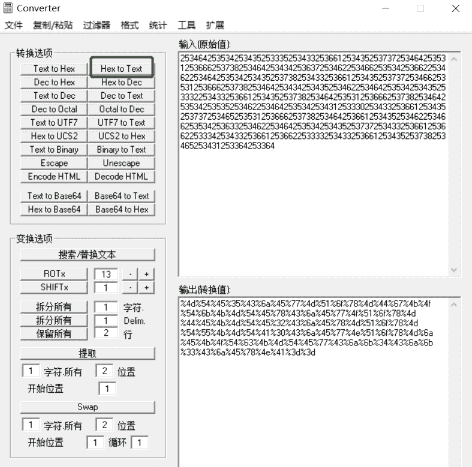
使用在线URL解码工具将其解码后，可以看出解密后的是base64编码的字符串
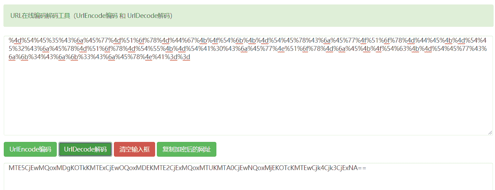
base64解码后得出一串数字，可以看出是ASCII码
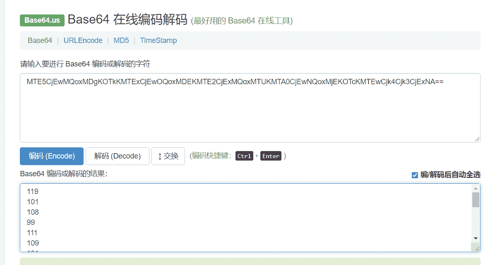
使用Converter工具，将ASCII码转换为字符，得出flag为welcometoshiyanbar
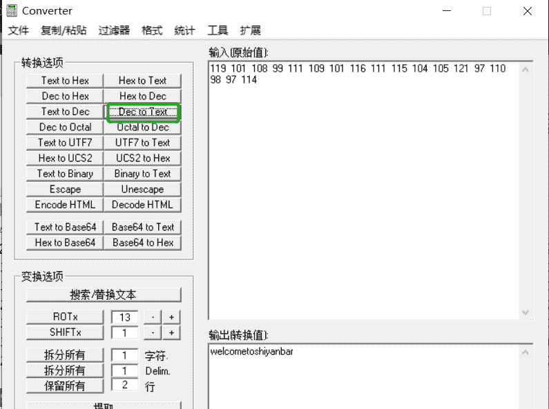

# 6、明文攻击

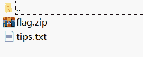
题目为一个压缩包和一个txt。我们打开压缩包的tips.txt，里面提示：密码是十位大小写字母、数字、特殊符号组成的，你爆破的开么？！这个提示告诉我们爆破是基本不可能了。然后我们发现falg.zip里面也有个tips.txt
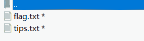
然后我猜想flag.zip里面的tips.txt和另外一个tips.txt是不是同一个文件。然后把tips.txt压缩后可以发现，他们两个的crc32是一样的

所以我们用工具ARCHPR对flag.zip进行明文攻击，把tips.txt进行压缩作为明文文件路径
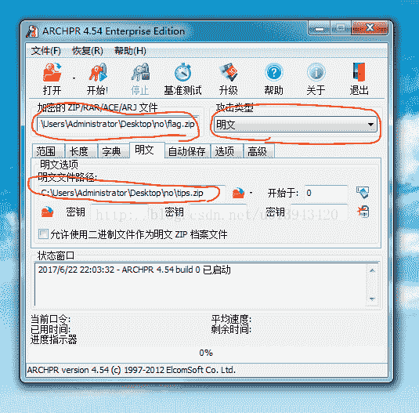

密码跑出来以后，一定要使用旁边的复制，千万别手敲，密码后面有空格
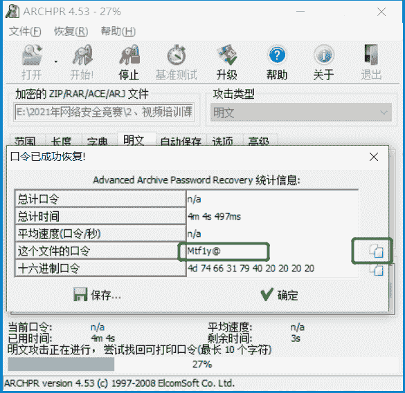
解压后得到flag为flag{Mtf1y@ }
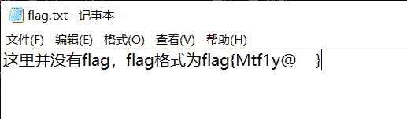

# 7、乌云邀请码

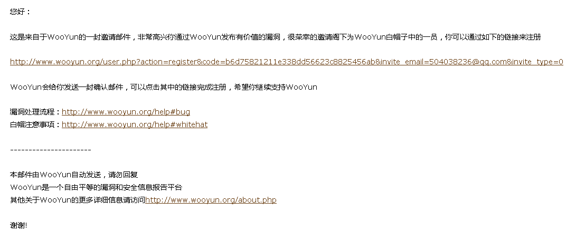
题目为一个图片，里面有一堆链接，其实链接都是假的
放入Stegsolve查看，选择Analyse 的Data Extract进行分析，勾选红绿蓝的0层，选择BGR模式，然后点击Preview，滚动条滑到最上，发现flag
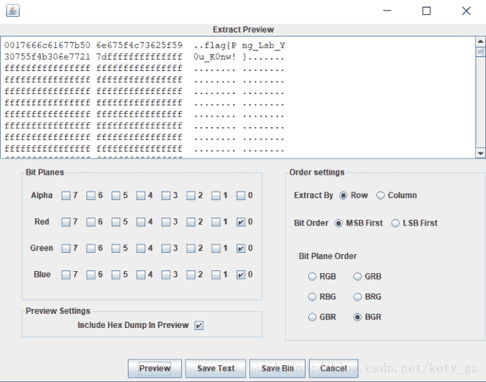

# 8、一枝独秀

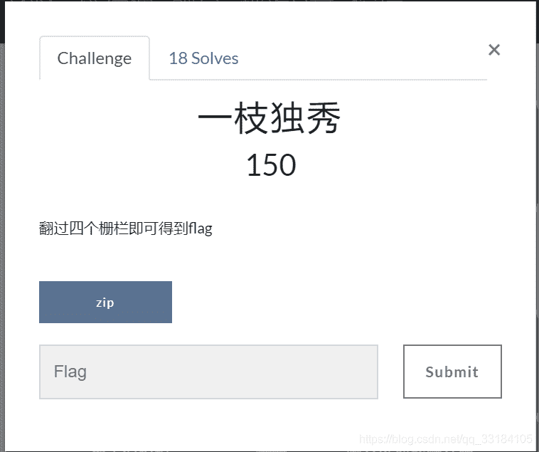

题目为一个压缩包，名为一枝独秀，双击发现有一堆名为floewr的图片，其中有一张81号图片的CRC32校验值和其他都不一样
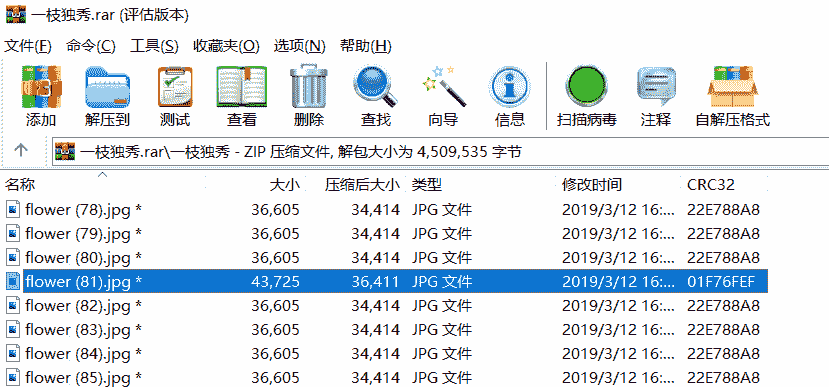
使用工具爆破出密码为12345678 打开81号图片属性，发现属性为flowers
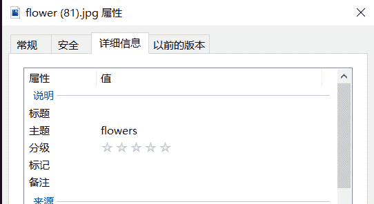
使用JPHS工具打开81号图，点击Seek，输入密码flowers，点击OK，将图片另存为a
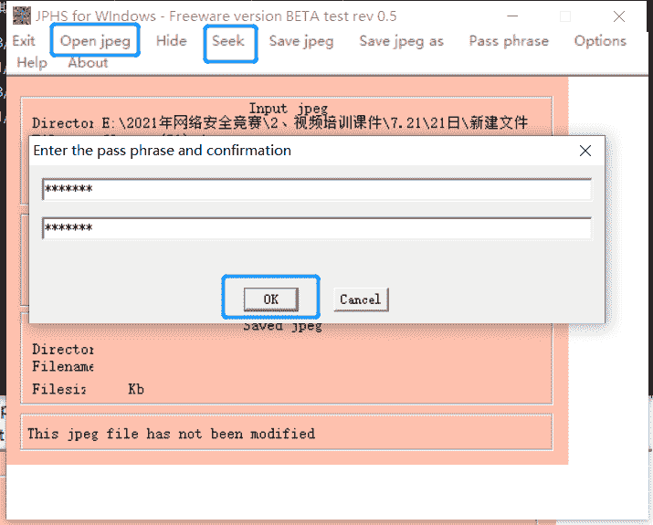
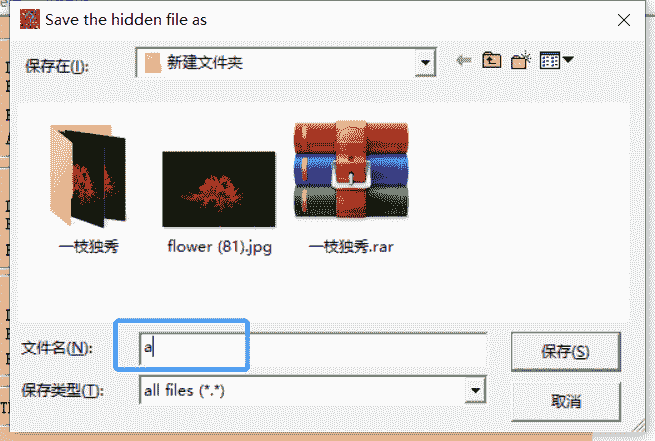
使用WinHex打开这个a文件，发现头文件是504B0304，说明这是一个zip文件，将后缀改为.zip解压

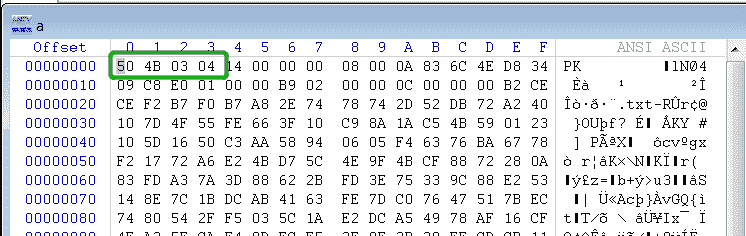
发现里面又有一个参悟佛法的文件
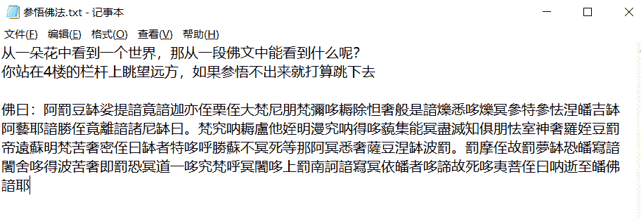
使用这个网站https://www.keyfc.net/bbs/tools/tudoucode.aspx
将佛曰粘进去，点击参悟佛所言的真意，得到一串字符
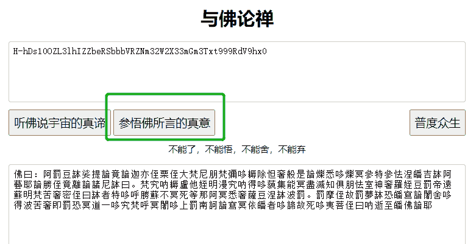
想起来栅栏加密，以及前面提示“翻越4个栅栏即可得flag” 于是输入字符进行栅栏解密，得到另一串字符
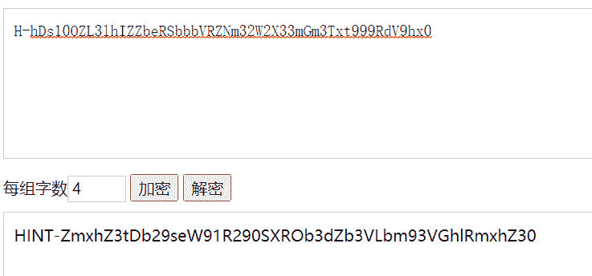
再进行base64解码，最终得到flag

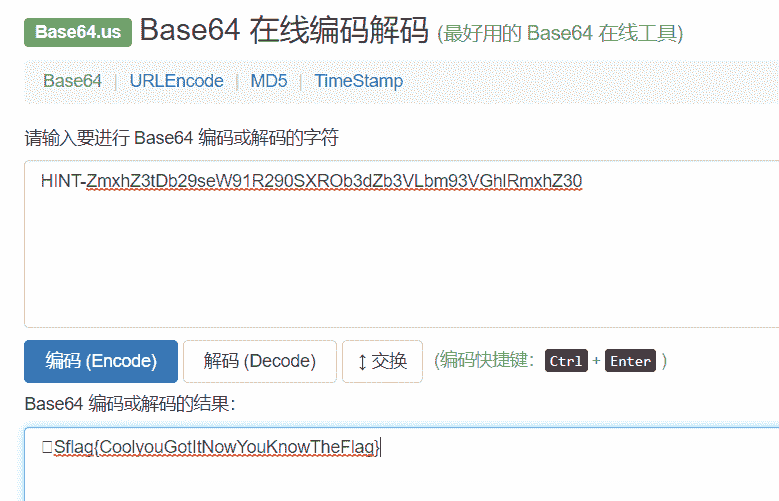

# 9、fllllllag.gif（gif图分离，合成）

题目为一个极其窄的gif文件，无法看清内容
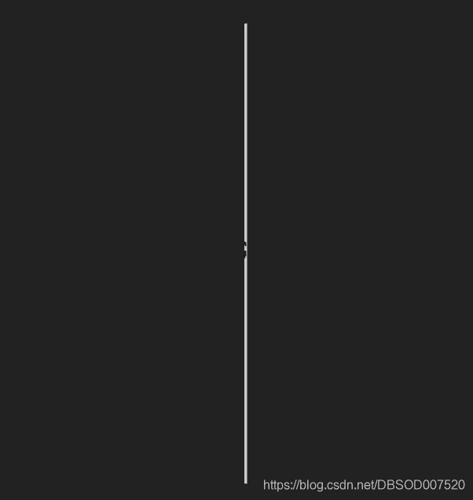
在kali中将gif图片与如下脚本放在同一目录下，执行脚本，生成output文件夹，将gif图片分离为png图片

```
 import os
from PIL import Image,ImageSequence
gif = Image.open(r'fllllllag.gif')                            
if os.path.exists("output") == False: 
    os.mkdir("output")
    for i,frame in enumerate(ImageSequence.Iterator(gif),1):
        frame.save(r'output/test%d.png'%i) 
```

再执行如下脚本，将大量的png文件拼接为一个文件

```
from PIL import Image
import os
import math
import random

dir = 'output'

HEIGHT_PER_PIC = 500

WIDTH_PER_PIC = 2

def getImagesName(dir):
    allPicPath = []  
    for i in range(1,203):
        allPicPath.append(dir + ('/test%d.png' % i))
    return allPicPath

def transferSize(allPicPath):
    for i in range(len(allPicPath)):

        im = Image.open(allPicPath[i])

        out = im.resize((HEIGHT_PER_PIC, WIDTH_PER_PIC), Image.ANTIALIAS)

        out.save(dir +  '/' + str(i) + '.jpeg')

def main(dir):
    allPicPath = getImagesName(dir)
    print (allPicPath)
    allTransPicPath = allPicPath

    numOfPic = len(allTransPicPath)

    perPicNum = numOfPic
    print (perPicNum)

    toImage = Image.new('RGBA', (HEIGHT_PER_PIC, perPicNum * WIDTH_PER_PIC))
    for i in range(numOfPic):

        fromImage = Image.open(allTransPicPath[i])

        loc = (i * WIDTH_PER_PIC, 0)

        print(loc)
        toImage.paste(fromImage, loc)
    toImage.save("flag.png")
if __name__ == '__main__':
    main(dir) 
```

最终得到flag


# 10、file.zip（零宽隐写）

在文件属性-注释中可以看到一串很明显的摩尔斯电码，解密后是解压密码
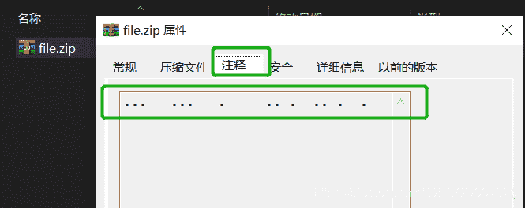
解密后发现一串字符，很像HEX码，但是他是MD5码
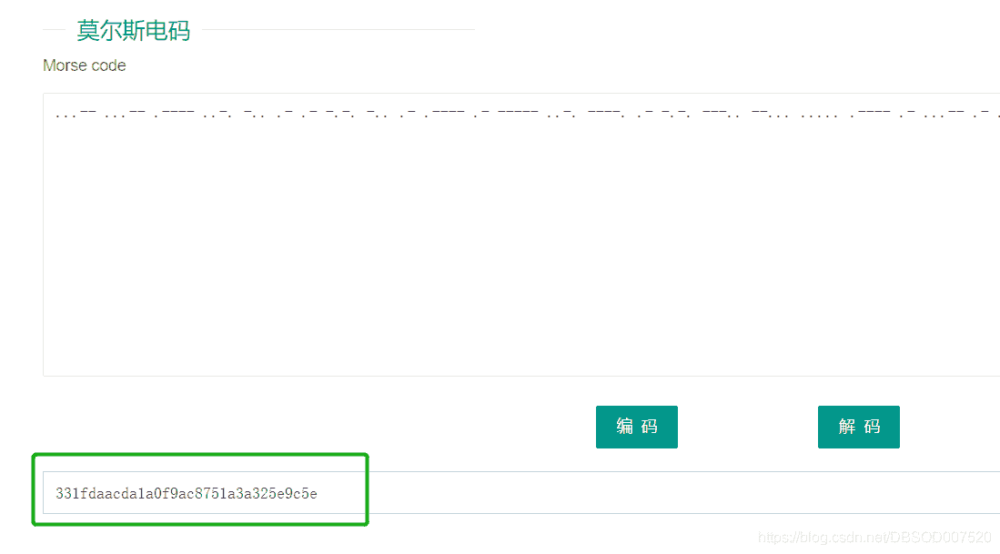
MD5解密后是明文是qwe!123 这就是解压密码
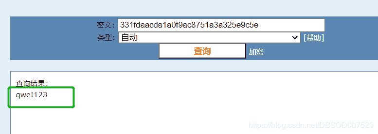
解压后有一个file文件，用010 Editor打开看，发现头文件是89504147
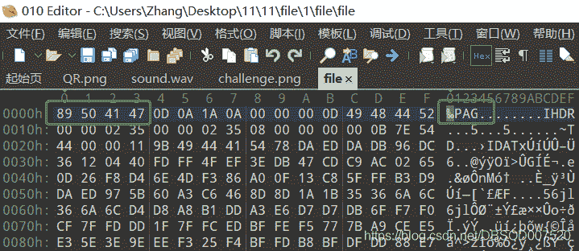
改成png的头文件89 50 4E 47后保存，再将文件后缀改为.png后打开
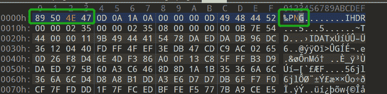
打开是一个二维码，使用微信或相机扫码后，发现一局英文
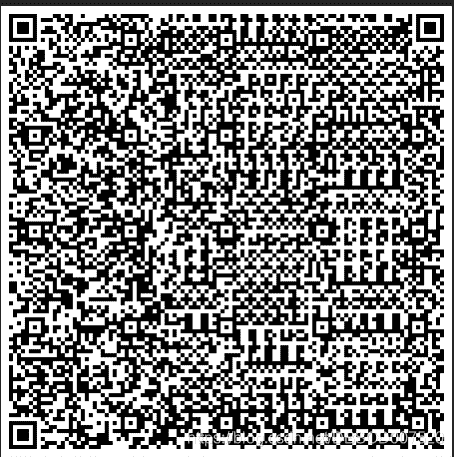
新建一个.txt文件，将英文复制进来，光标放在最后时，发现显示是第310列，但是文本中并没有几个单词，说明文本中存在不可见字符（零宽隐写）
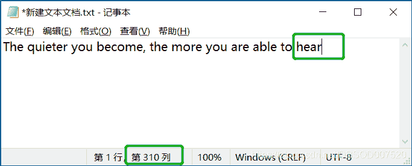
打开零宽隐写在线工具[工具链接](http://330k.github.io/misc_tools/unicode_steganography.html)，复制字符串，解码，即可得到flag

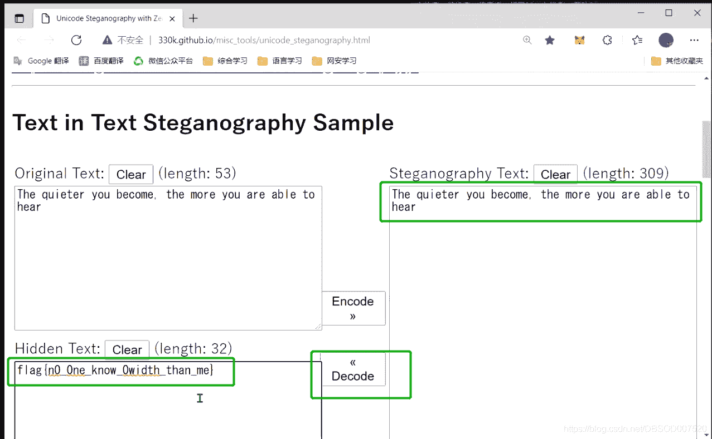

# 11、QR_code.png（Linux下使用fcrackzip爆破密码）

使用foremost分离QR_code.png文件，提示密码是4位数字
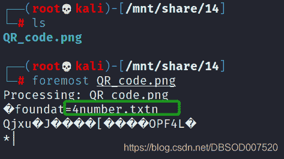
使用fcrackzip命令爆破压缩包密码，为7639，解压后得到flag为 `CTF{vjpw_wnoei}`

```
fcrackzip -b -u -c 1 -p 0000 00000000.zip     //-b爆破;-u显示结果;-c 密码类型，1表示是数字类型;-p 密码起始位置 
```

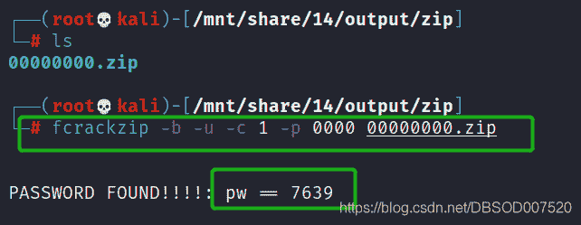

# 12、这不是真正的安全.zip（伪加密）

将压缩包拖入010Editor，发现两个50 4B头文件，第一个的加密标志位是08 00说明是真加密；第二个加密标志位是01 00 说明是伪加密，将其改为00 00后保存。
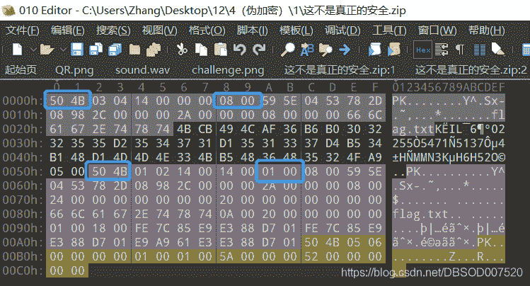

即可直接解压，得到flag为`flag{38822552-1744-4671-948d-ecf6e8c0e27d}`

# 13、example.zip（伪加密+明文爆破+CRC32爆破）

将压缩包拖入010Editor，ctrl+F搜索50 4B头文件，把加密标志位的09 00全部改为00 00后保存
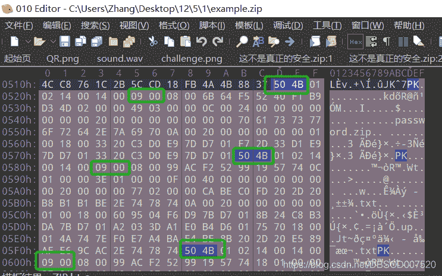
双击压缩包，发现只有“示例-副本.txt”可以打开，且CRC32值一样
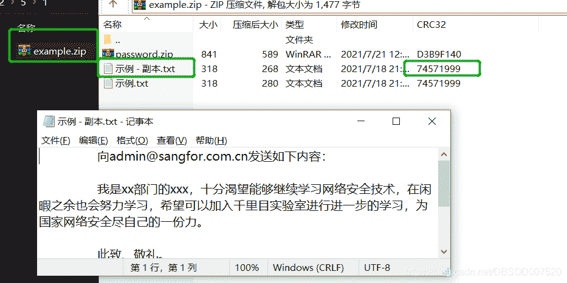
将 示例-副本.txt 文件拖出来，使用WinRAR将其压缩为.zip文件（文件格式要和待爆破的压缩包一致）CRC32值也要一致
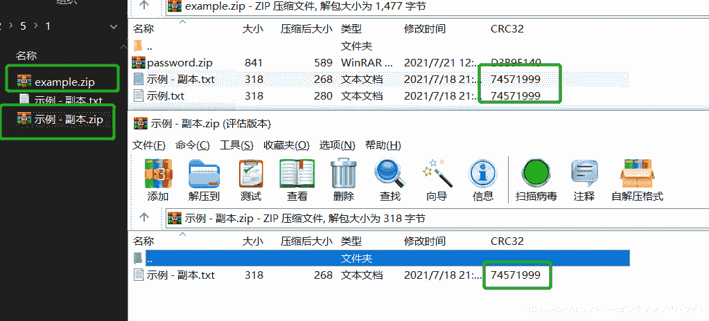
使用爆破工具打开未经改动的题目example.zip文件，攻击方式选择明文，明文路径选择示例-副本.zip，开始爆破
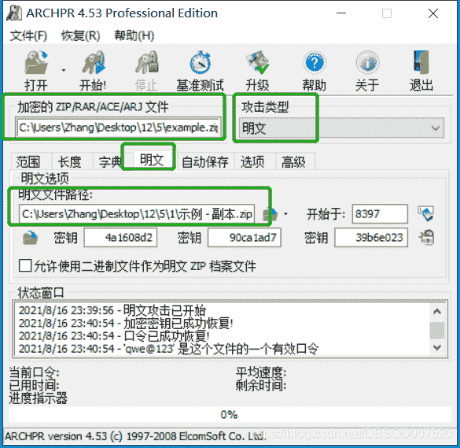
最终爆破出口令为qwe@123
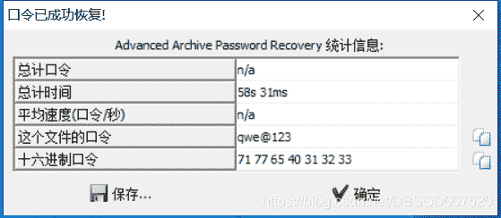
解压example.zip后又得到password.zip文件，里面有3个6字节大小的文件（CRC32爆破只能是6字节大小），其CRC32的值分别为0x21137233，0x4B8F7BE7，0x1028C889
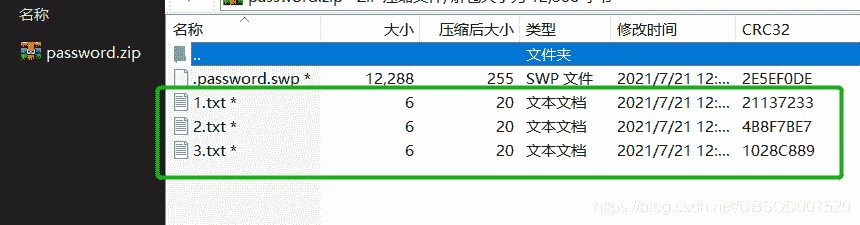
使用CRC32爆破工具crc32hack，分别对password.zip中的1.txt 2.txt 3.txt文件的CRC32值进行解析，根据解析结果猜测最像是密码的字符进行组合
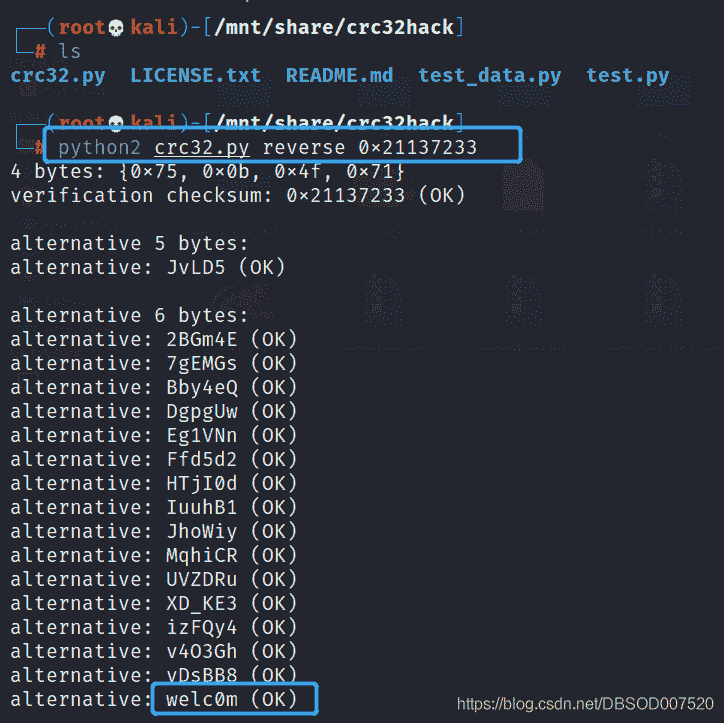
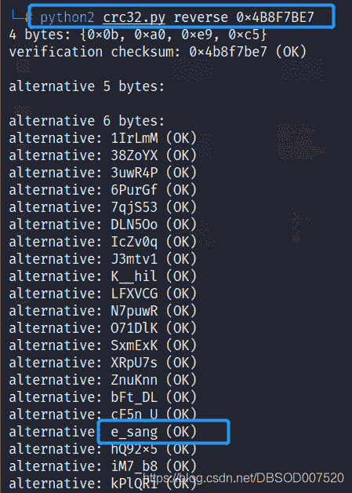
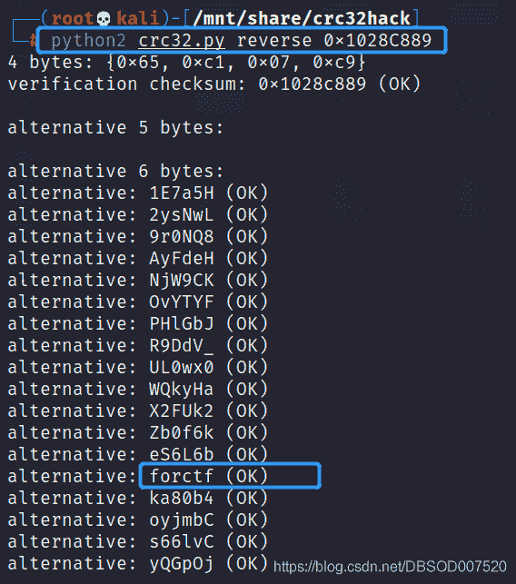
最终得到最像是密码的是`welc0me_sangforctf` 解压password.zip后得到.password.swp文件，是Linux下的隐藏文件
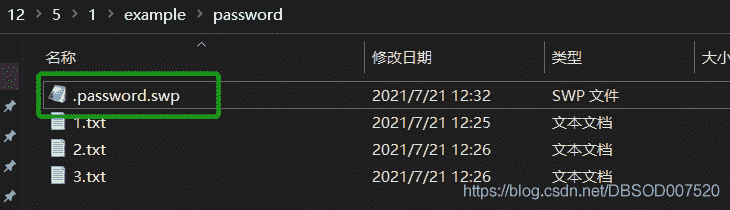
我们将其拖入到Kali的桌面，拖过去后你会发现桌面啥也没有，因为是隐藏文件，所以在终端中输入ls -al命令，即可显示隐藏文件。再使用`vim -r .password.swp`命令查看
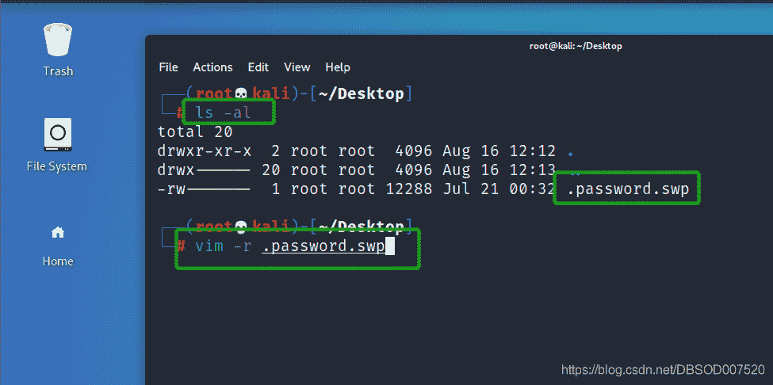
最终得到账号密码
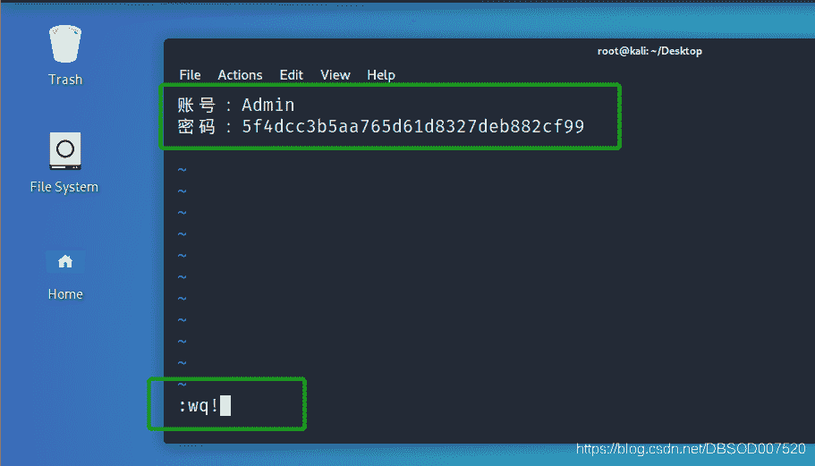

# 14、soul sipse（音频隐写，steghide工具分离）

将文件解压后是一个out.wav文件
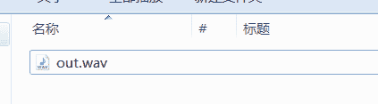
Kali下使用steghide工具查看；在out.wav的存放目录下，执行如下命令提取隐藏文件，提示输入密码，直接回车忽略，执行后提示分离出download.txt

```
steghide extract -sf out.wav 
```

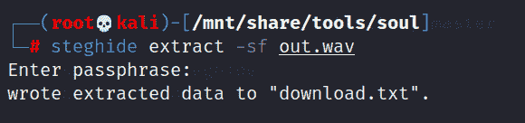
在路径下找到了download.txt，打开里面是一个url
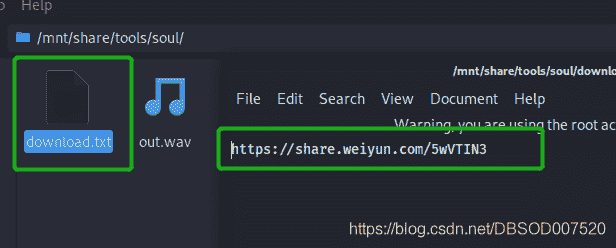
打开url是一个.png图片分享，下载下来，发现不能正常打开
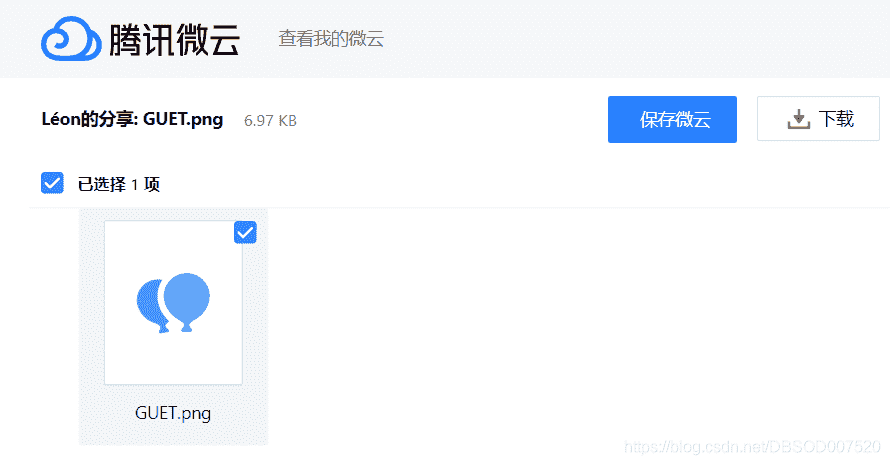
使用010 Editor打开，发现头文件不对，改成89 50 4E 47后保存
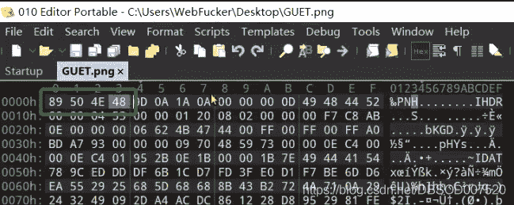
正常打开后是一串unicode编码
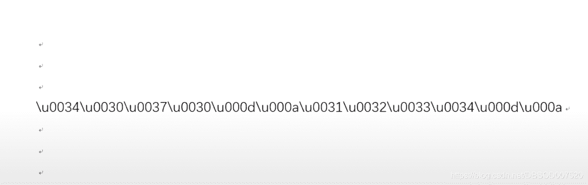
在线解码后得到flag
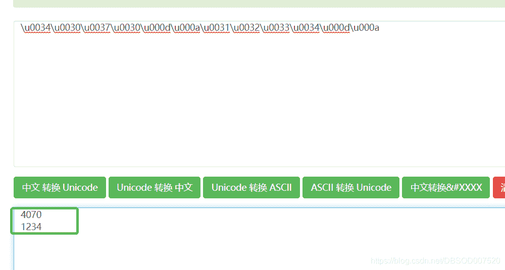

# 15、冰冰（java盲水印）

| 题目及工具脚本下载 | 链接：https://pan.baidu.com/s/1mbOv79w4BryvumJEWf-Hzg 提取码：lvni |
| --- | --- |
| 涉及关键工具 | BlindWatermark.jar，键盘流量分析脚本 |

题目是一个受损的压缩吧，使用010打开，将17H处的84修改为80，保存后即可解压，解压后还有一个压缩包和冰冰的照片
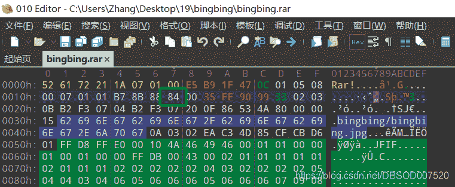

java盲水印，得到一张图片，内容是gnibgnib 这是压缩包的密码，解压后得到一个bingbing.pcapng流量文件

```
java -jar BlindWatermark.jar decode -c bingbing.jpg 1.jpg 
```

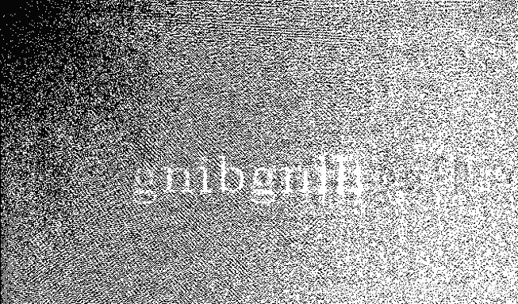
分析出是键盘流量文件
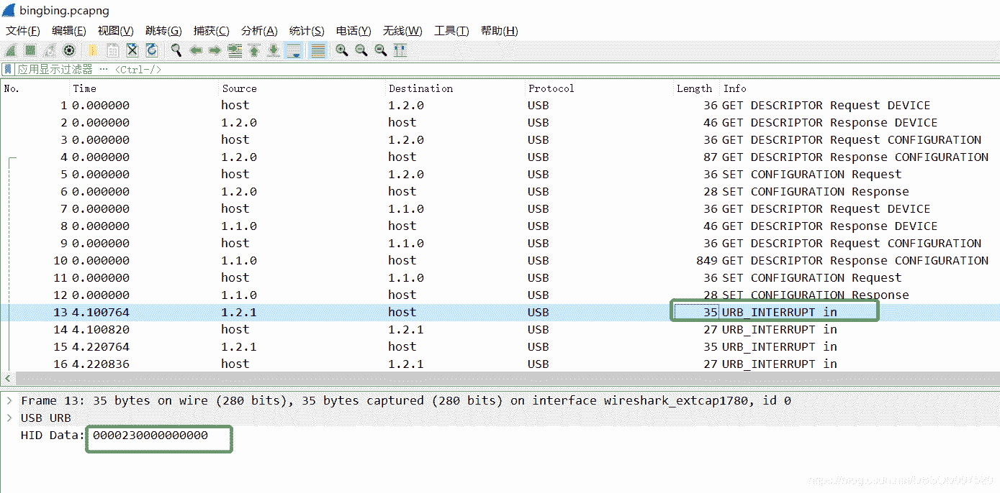
kali下使用tshark提取USB流量

```
tshark -r bingbing.pcapng -T fields -e usb.capdata | sed '/^\s*$/d' > usbdata.txt 
```

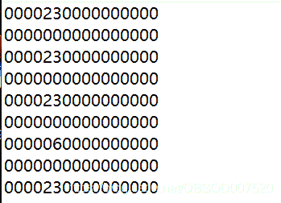
再加冒号

```
f=open('usbdata.txt','r')
fi=open('out.txt','w')
while 1:
    a=f.readline().strip()
    if a:
        if len(a)==16: 
            out=''
            for i in range(0,len(a),2):
                if i+2 != len(a):
                    out+=a[i]+a[i+1]+":"
                else:
                    out+=a[i]+a[i+1]
            fi.write(out)
            fi.write('\n')
    else:
        break

fi.close() 
```

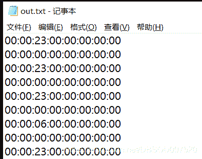
加键盘通用脚本

```
mappings = { 0x04:"A",  0x05:"B",  0x06:"C", 0x07:"D", 0x08:"E", 0x09:"F", 0x0A:"G",  0x0B:"H", 0x0C:"I",  0x0D:"J", 0x0E:"K", 0x0F:"L", 0x10:"M", 0x11:"N",0x12:"O",  0x13:"P", 0x14:"Q", 0x15:"R", 0x16:"S", 0x17:"T", 0x18:"U",0x19:"V", 0x1A:"W", 0x1B:"X", 0x1C:"Y", 0x1D:"Z", 0x1E:"1", 0x1F:"2", 0x20:"3", 0x21:"4", 0x22:"5",  0x23:"6", 0x24:"7", 0x25:"8", 0x26:"9", 0x27:"0", 0x28:"\n", 0x2a:"[DEL]",  0X2B:"    ", 0x2C:" ",  0x2D:"-", 0x2E:"=", 0x2F:"[",  0x30:"]",  0x31:"\\", 0x32:"~", 0x33:";",  0x34:"'", 0x36:",",  0x37:"." }

nums = []
keys = open('out.txt')
for line in keys:
    if line[0]!='0' or line[1]!='0' or line[3]!='0' or line[4]!='0' or line[9]!='0' or line[10]!='0' or line[12]!='0' or line[13]!='0' or line[15]!='0' or line[16]!='0' or line[18]!='0' or line[19]!='0' or line[21]!='0' or line[22]!='0':
         continue
    nums.append(int(line[6:8],16))

keys.close()

output = ""
for n in nums:
    if n == 0 :
        continue
    if n in mappings:
        output += mappings[n]
    else:
        output += '[unknown]'

print 'output :\n' + output 
```

运行脚本可得
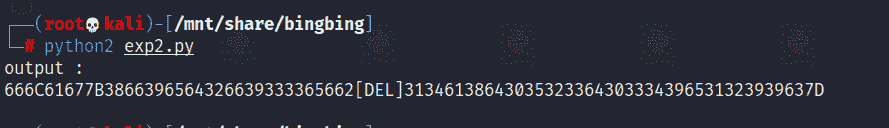
删除中间的[DEL]键，用脚本将其转换为字符

```
m="666C61677B38663965643266393333656631346138643035323364303334396531323939637D"
s=bytes.fromhex(m)
print(s) 
```

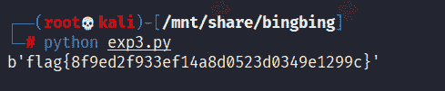
得到flag

```
b'flag{8f9ed2f933ef14a8d0523d0349e1299c}' 
```