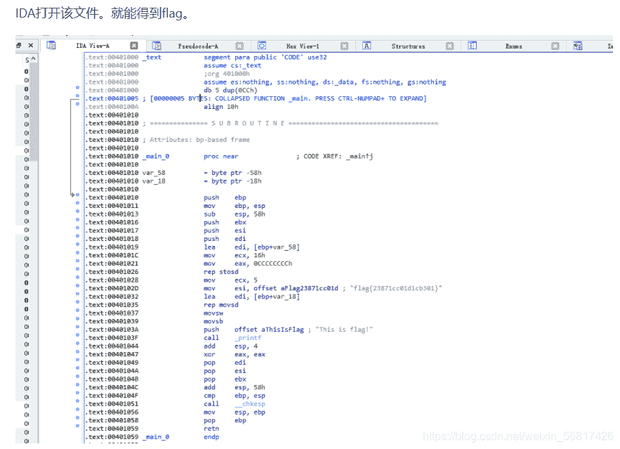
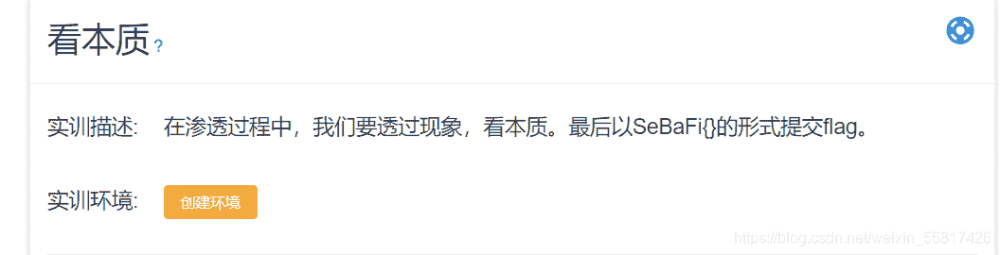
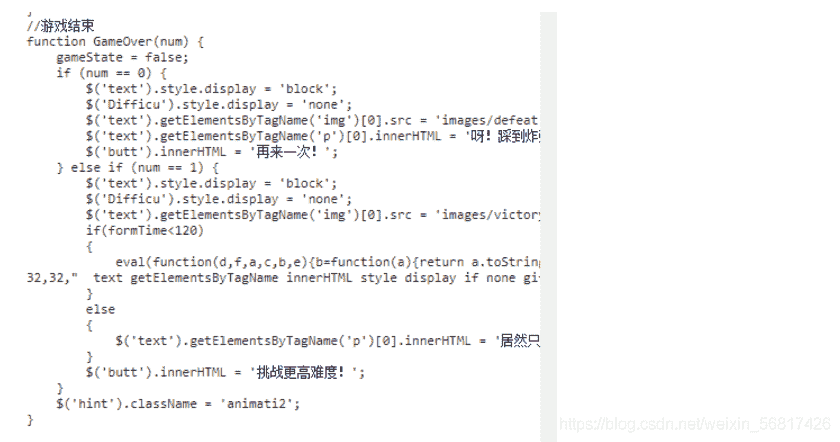
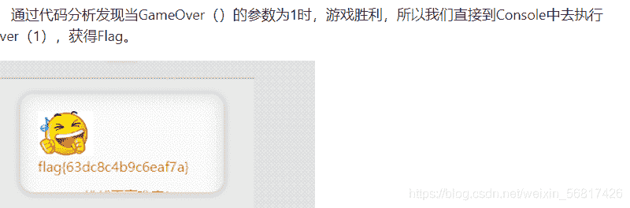
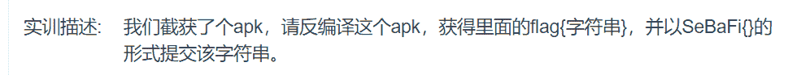
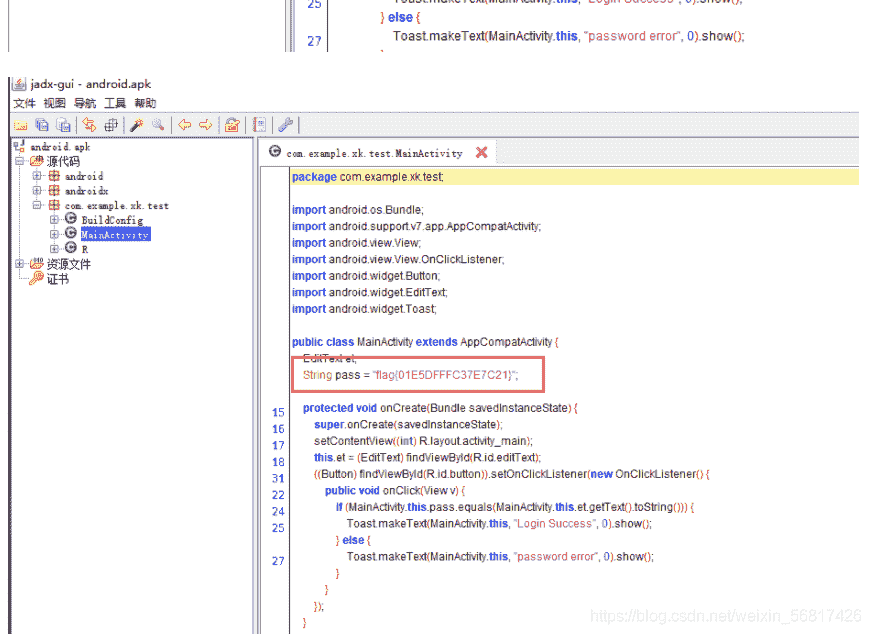

<!--yml
category: 未分类
date: 2022-04-26 14:55:17
-->

# CTF题目部分解析_阿峰啊啊啊的博客-CSDN博客_ctf题目

> 来源：[https://blog.csdn.net/weixin_56817426/article/details/117225939](https://blog.csdn.net/weixin_56817426/article/details/117225939)

# 一、题目一：exe逆向

# 二、读题

描述：我们获得了敌方某个exe文件，尝试逆向这个exe文件，获得里面的flag{字符串}，以SeBaFi{}的形式提交字符串。

# 三、审题

找到隐藏在exe中的flag。

# 一、题目二：看本质

# 二、读题

描述：在渗透过程中，我们要透过现象，看本质。

# 三、审题

第一步 ：打开给出的网页发现是一个扫雷游戏，但是无论选择那种难度游戏开始后都是困难。

# 一、题目三：apk逆向1

# 二、读题

找到隐藏在apk中的flag。

# 三、审题

Jadx打开apk，查看得到答案 flag{01E5DFFFC37E7C21}，根据题目要求提交flag：SeBaFi{01E5DFFFC37E7C21}。

