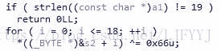
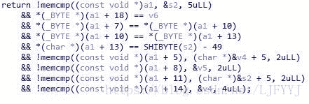

<!--yml
category: 未分类
date: 2022-04-26 14:21:19
-->

# CTF题解三 逆向 where is your flag（ISCC2017）_目标是技术宅的博客-CSDN博客

> 来源：[https://blog.csdn.net/LJFYYJ/article/details/81006047](https://blog.csdn.net/LJFYYJ/article/details/81006047)

#### 直接进入test函数：

下面的代码进行第一步操作：



首先a1的长度应该为19。

接下来对s2进行异或处理。

题目中给出的s2的值如下：

```
 s2 = 0x3929531D01070A00LL;
 v4 = 0x391257391F150703LL;
 v5 = 0x150F;
 v6 = 0x1B;
```

s2是int64类型，共有8个字节。由于s2、v4、v5和v6的地址是相连的，所以当从s2的起始地址开始进行19个字节的异或处理时，v4、v5和v6中的数值也会被处理。

由于s2占据了多个字节，在存储的过程中，一定存在着先分配的字节放在高地址还是低地址的问题。在s2中先分配的字节应该是放在了低地址处。

对s2、v4、v5和v6中的元素按顺序写出，应为：

```
 s2 = 0x00,0x0A,0x07,0x01,0x1D,0x53,0x29,0x39;
 v4 = 0x03,0x07,0x15,0x1F,0x39,0x57,0x12,0x39;
 v5 = 0x0F,0x15;
 v6 = 0x1B;
```

然后对其进行异或处理，s2、v4、v5和v6中的元素实际对应的字母为：

```
 s2 = "flag{50_";
 v4 = "easy_lt_";
 v5 = "is";
 v6 = "}";
```



对于之后每一步，只要挨着分析即可：

1.  a1前5位为’flag{‘
2.  a1最后1位为’}’
3.  a1第7、10、13位应该为’_’-49，即’.’
4.  a1第5、6位为’lt’
5.  a1第8、9位为’is’
6.  ……
7.  得到a1为：

flag{lt.is.50.easy}

#### 反思：

本题主要对于s2的异或理解上出现了问题，忘记考虑了与s2地址相连的其它变量。对于16进制的表示以及小端的特性还是不够熟悉。