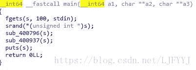
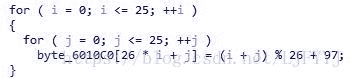
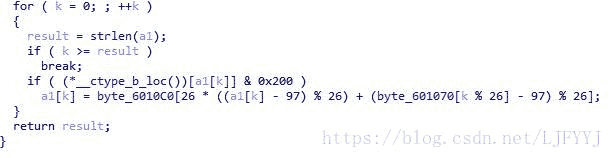
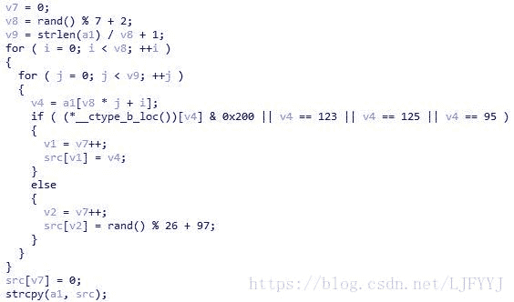

<!--yml
category: 未分类
date: 2022-04-26 14:19:12
-->

# CTF题解四 逆向 顺藤摸瓜（ISCC2017）_目标是技术宅的博客-CSDN博客

> 来源：[https://blog.csdn.net/ljfyyj/article/details/81017322](https://blog.csdn.net/ljfyyj/article/details/81017322)

#### 观察：

##### 1.首先在IDA中找到main函数：



首先输入字符串s，接着把字符串s作为随机数的种子。

调用sub_400796函数和sub_400937函数。

由于s未知，所以需要猜测**s的哪部分**作为随机数的种子。

##### 2.观察sub_400796函数：

该函数主要分为两部分，第一部分是**对byte_6010C0进行赋值**：


第二部分是利用byte_6010C0和byte_601070以及a1原来的值，**求得a1第一次加密后的值**：



所以，如果要求解a1原来的值，需要已知：

byte_6010C0（已知）、byte_601070（已知）、a1第一次加密后的值（未知，需要解密下一个函数才能得到）。

##### 3.观察sub_400937函数：



`_ctype_b_loc`这里为判断是否为小写字母。分析上一个函数，可以看出a1中所有的字母都满足`*__ctype_b_loc())[v4] & 0x200`该条件。

所以src与a1相比，只是将**字母的顺序进行了调换**。

另外，由于a1的长度最小为**v8*v9 - v8**，而src的长度为**v8*v9。**所以a1中长度不够的部分需要**随机生成**。

##### 4.总结：

本题的求解顺序为：

1.猜测随机数的种子。

2.根据题目中给出的字符串，对sub_400937函数中的加密过程进行解密。

3.将解密的结果代入sub_400796函数中，求得s的值。

#### 求解：

##### 1.猜测随机数的种子：

猜测s的前四位为”flag”,由于小端问题，转换为16进制后应该为：

`0x67616C66`。

##### 2.sub_400937解密：

由于src的长度正好等于v8*v9.所以在编写解密程序时，v9不用再加1了。

解密程序的主要工作就是行列的调换。

```
char a[] = "vfnlhthn__bneptls}xlragp{__vejblxpkfygz_wsktsgnv";
srand(0x67616C66);
int v7 = 0;
int v8 = rand() % 7 + 2;
int v9 = strlen(a) / v8;
for (int i = 0; i < v9; i++) {
    for (int j = 0; j < v8; j++) {
        printf("%c", a[j*v9 + i]);
    }
}
```

最后得到输出为：

`vhex{bykfnpl_lgtn_tr_xzsl_lavp_ghbsgekwntn}pjfsv`

不考虑后面几位随机生成的数字，可以得到a1为：

`vhex{bykfnpl_lgtn_tr_xzsl_lavp_ghbsgekwntn}`

##### 3.sub_400796解密：

首先编程求解出byte_6010C0,并找到byte_601070的值。

然后编程求解a1，主要方法就是穷搜。

```
char a[] = "qwertyuiopasdfghjklzxcvbnm";
char b[] = "abcdefghijklmnopqrstuvwxyzbcdefghijklmnopqrstuvwxyzacdefghijklmnopqrstuvwxyzabdefghijklmnopqrstuvwxyzabcefghijklmnopqrstuvwxyzabcdfghijklmnopqrstuvwxyzabcdeghijklmnopqrstuvwxyzabcdefhijklmnopqrstuvwxyzabcdefgijklmnopqrstuvwxyzabcdefghjklmnopqrstuvwxyzabcdefghiklmnopqrstuvwxyzabcdefghijlmnopqrstuvwxyzabcdefghijkmnopqrstuvwxyzabcdefghijklnopqrstuvwxyzabcdefghijklmopqrstuvwxyzabcdefghijklmnpqrstuvwxyzabcdefghijklmnoqrstuvwxyzabcdefghijklmnoprstuvwxyzabcdefghijklmnopqstuvwxyzabcdefghijklmnopqrtuvwxyzabcdefghijklmnopqrsuvwxyzabcdefghijklmnopqrstvwxyzabcdefghijklmnopqrstuwxyzabcdefghijklmnopqrstuvxyzabcdefghijklmnopqrstuvwyzabcdefghijklmnopqrstuvwxzabcdefghijklmnopqrstuvwxy";
char c[] = "vhex{bykfnpl_lgtn_tr_xzsl_lavp_ghbsgekwntn}";
int k = 0;
while (k < strlen(c)) {
    if(c[k]>96&&c[k]<123){
        for (int i = 97; i < 123; i++) {
            if (c[k] == b[26 * ((i - 97) % 26) + (a[k % 26] - 97) % 26]) {
                printf("%c", i);
                break;
            }
        }
    }
    else printf("%c", c[k]);
    k++;
}
```

运行程序得到flag：

flag{decrypt_game_is_very_very_interesting}

#### 反思：

本题主要卡在两个地方：

1.猜测随机数的种子。

2.猜测&0x200的意义。