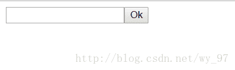
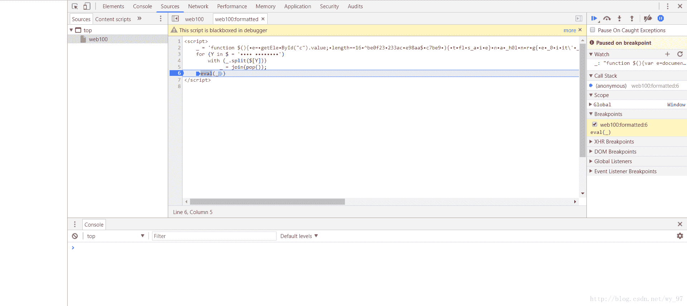
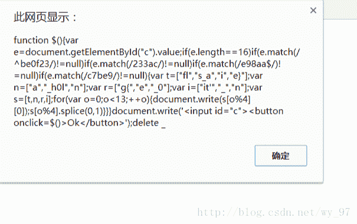

<!--yml
category: 未分类
date: 2022-04-26 14:40:31
-->

# CTF/合天网安实验室-web100题解【eval与alert的利用】_Sp4rkW的博客-CSDN博客

> 来源：[https://blog.csdn.net/wy_97/article/details/77198391](https://blog.csdn.net/wy_97/article/details/77198391)

原题内容：

http://www.hetianlab.com/CTFrace.html

web100打开可以看到只有一个很干净的zip文件下载（忍不住扫了一下目录，也bp看了一下，，没啥发现）

回到下载，解开压缩版，web100，无后缀名，个人的经验是不急着加后缀名啥的，直接用记事本直接打开

可得代码如下：

```
<script>_='function $(){e=getEleById("c").value;length==16^be0f23233ace98aa$c7be9){tfls_aie}na_h0lnrg{e_0iit\'_ns=[t,n,r,i];for(o=0;o<13;++o){	[0]);.splice(0,1)}}}	\'<input id="c">< onclick=$()>Ok</>\');delete _var ","docu.)match(/"];/)!=null=["	write(s[o%4]buttonif(e.ment';for(Y in $='	')with(_.split($[Y]))_=join(pop());eval(_)</script>
```

很有意思啊，很混乱的代码，但很明显头尾的script表面这肯定和script有关，既然如此，不凡用浏览器打开一试



预感，这是输入满足条件的数据获取flag

至于条件是啥，肯定要读懂给的web100表示的意思了

首先我想到的是在（博主用的是google浏览器）浏览器自带的开发者模式下进行调试，

思路就是卡住最后一步，加断点，然后看变量‘_’的内容

至于为啥要这样，首先粗略看出来_变量赋值了一段代码，因为eval（_），eval函数是执行代码段的函数，卡住执行代码，然后查看代码段

结果图如下：


右边watch中可见_的值，为代码，分析最终可得flag（此处不公布答案了，代码拿到其实就很简单了）

至于如何调试，详情参考我的博客[谷歌浏览器调试javascript教程](http://blog.csdn.net/wy_97/article/details/77198343)

下面讲第二种方法

获取很容易想到，既然eval是执行函数我将其换成输出函数不就可以将代码段输出了么，没错，确实可以

将eval换成alert

截图如下：



之后如同第一种办法，这里不再解释