<!--yml
category: 未分类
date: 2022-04-26 14:49:12
-->

# CyberCTF 4道MISC_A_dmins的博客-CSDN博客

> 来源：[https://blog.csdn.net/qq_42967398/article/details/95223933](https://blog.csdn.net/qq_42967398/article/details/95223933)

## CyberCTF 4道MISC

**一天一道CTF题目，能多不能少**

虽然说今天课设，但是CTF还是要打的，
就说一下做对的misc解题思路吧

最后一道MISC只有一点点头绪，但是做不出来。。。。。

**第一道MISC Sign in**

签到题，没什么好说的，下载文件打开：
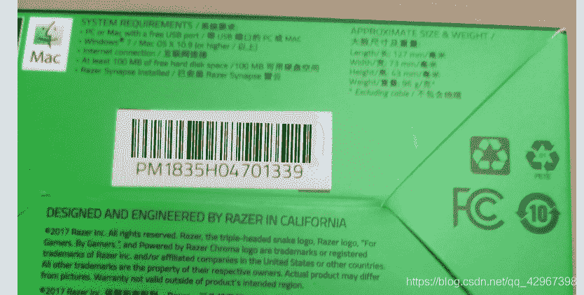
直接扫描条形码就得到了flag~

**第二道MISC No Word**

下载文件，直接打开是一个空白文件。。。。。
其实里面有东西的，
说实话，这道题目还是肝了一会的
一开始以为是什么空白字符的隐写
到最后发现原来是自己想得太多了，就是由tab和空格组成的一个文件
直接tab变成1，空格变成0
得到数字：

```
01100110
01101100
01100001
01100111
01111011
01011001
00110000
01110101
01011111
01100011
00110100
01101110
01011111
01010010
01100101
01100001
01000100
01011111
01101110
01001111
01011111
01010111
01101111
01010010
01100100
01110011
01011111
01100010
01001111
00110000
01001011
01011111
00100001
01111101 
```

直接进行转ascii码
脚本就不贴了，没什么难度

**第三道MISC 基础社工**
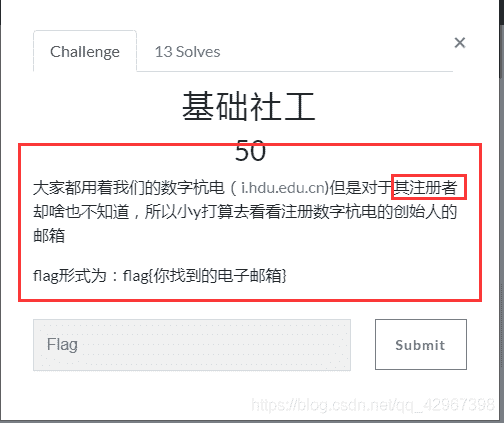
这道题也想了一年，，，，，
一直就思路不对，开始以为在网址里面
还要学号什么的，因为是别人学校的比赛，，，，
后面看见注册者？？？想了一会会不会是查IP之类的什么？？
直接开始：
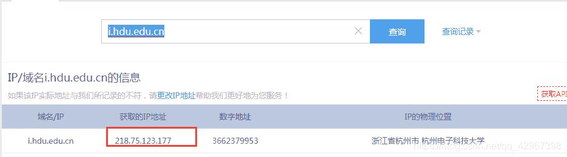
查到IP
进行IP whois:
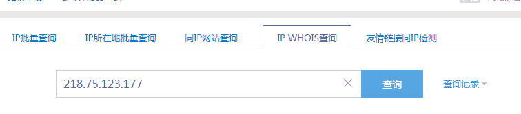
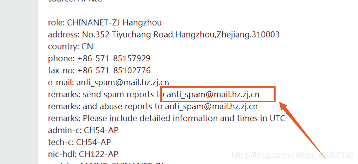
get flag

**第四道MISC The World**

由于在机房没工具，就不进行详细描述了，大致说一下解题思路吧
题目有提示：
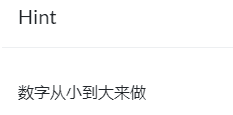、
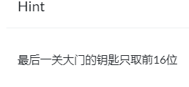
首先下载文件，打开是一张图片
常规操作，lsb一波，没什么
既然如此，那就直接binwalk了
得到三个文件：
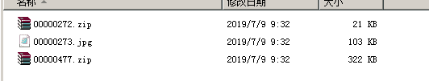
从小到大来做，第一个解压压缩包~~
发现要密码，直接使用暴力破解就能得到
得到密码为abc123
解压之后：
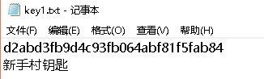
第一步完成
第二步是要解决图片，一开始以为是图片的加密
上网找网址在线解，并没有解出来
后面想到outguess工具
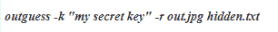
直接使用解码
得到隐藏文件，打开得到：
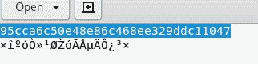
最后一关
一个压缩包，直接解压，得到一个MP3
猜测MP3stego解密
直接取前16位进行解密
果然，最后得到了flag

最后一道题目提示PIL，找图片不同
but还是没有弄出来，一个人都没得，，，
看来这道题的脑洞或者知识点很有意思啊，啊哈哈哈哈哈
希望后面能出WP