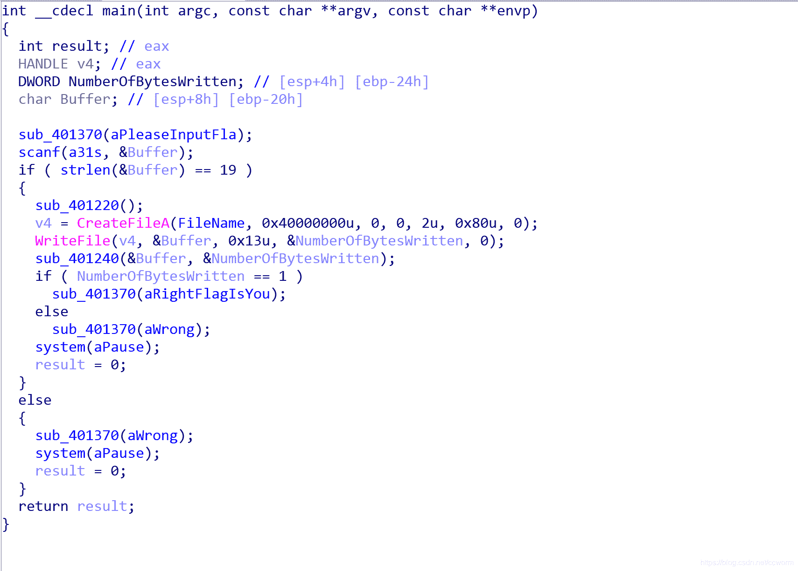
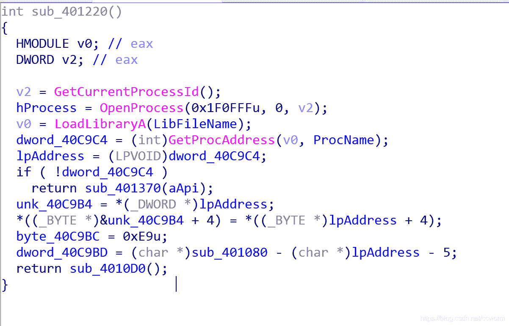
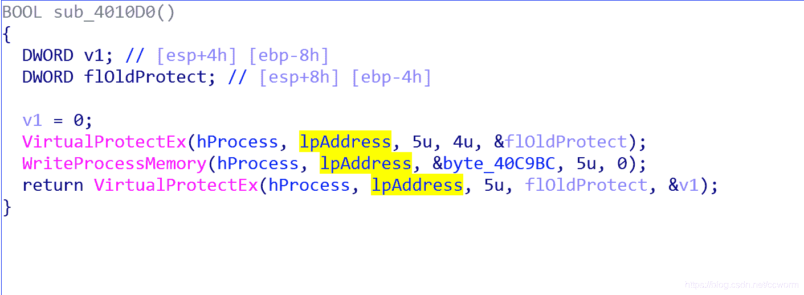
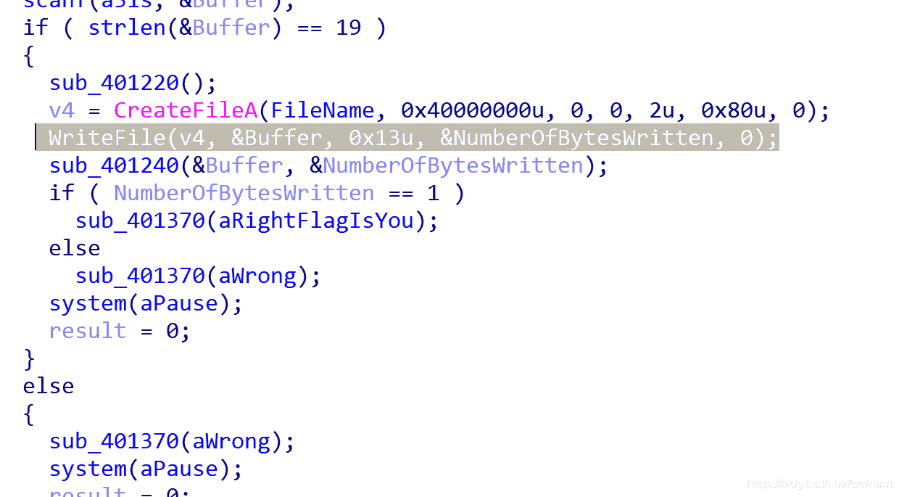
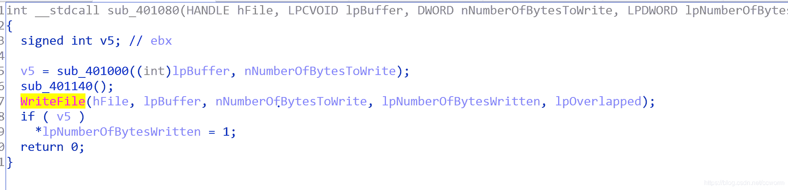
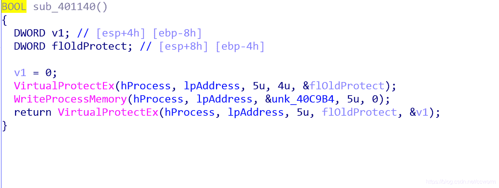
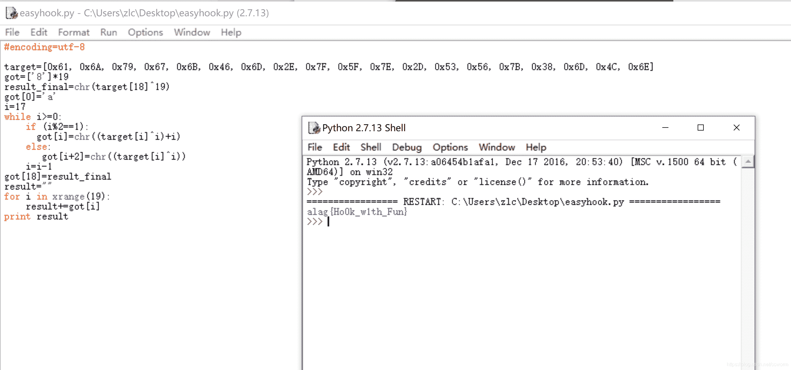

<!--yml
category: 未分类
date: 2022-04-26 14:45:32
-->

# EASYHOOK XCTF 4TH-WHCTF-2017 攻防世界 通过此题理解hook钩子_hincon的博客-CSDN博客

> 来源：[https://blog.csdn.net/ccworm/article/details/112787439](https://blog.csdn.net/ccworm/article/details/112787439)

观察程序此程序逻辑为输入一个19个字符长度的字符串，sub_401220函数可能对字符串做了预处理，然后创建文件，并把输入的字符串写到文件中，最后由401240函数进行尾处理。字符串正确的条件是numberofbyteswritten=1。

按此思路我们先做测试，发现我输入的字符串，到了文件里竟然不是输入的了，故猜测401220()对字符串进行了预处理。

详细分析401220()函数如下：获取当前进程号，打开进程到hprocess,libfilename为一常量kernel32.dll，procname为一常量writefile,故dword_409c4、lpaddress所存为writefile的地址，然后程序复制了lpaddress的地址到unk_40c9b4。下面为关键部分：

几种跳转指令和对应的机器码：
0xE8 CALL后面的四个字节是地址
0xE9 JMP后面的四个字节是偏移
0xEB JMP后面的二个字节是偏移
0xFF15 CALL后面的四个字节是存放地址的地址
0xFF25 JMP后面的四个字节是存放地址的地址
0x68 PUSH后面的四个字节入栈
0x6AP USH后面的一个字节入栈

经过分析40c9bc处所存储为一条jmp语句（无条件跳转），jmp的地址是sub_401080函数，这里-5个字节为jmp语句长度。打开sub_4010d0函数

这里lpaddress已经改为了byte_40c9bc，即jmp指令的地址，此指令执行完后进一步执行执行sub_401080函数。

经过上面的操作，总结如下：当我们在后面调用writefile时，会改为调用sub_401080函数。

故回到main()

在执行writefile时调用了sub_401080(),下面进入sub_401080()

点开sub_401000发现是对输入进行了一系列变换，猜测此即为变换核心函数。打开sub_401140(),

发现lbaddress又变为了writefile的真实地址。故回到sub401080的writefile时，写入的是变换后的输入字符串。至此流程明晰。Sub401080为钩子函数，在此之前先变writefile为此钩子函数地址，待钩子函数做完字符串预处理后，恢复了writefile的真实地址，并调用。故分析sub_401000即可得flag。

需要说明的是，main函数中sub_401240为干扰函数.

