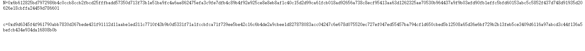

<!--yml
category: 未分类
date: 2022-04-26 14:49:10
-->

# IceCTF Round Rabins!_前方是否可导？的博客-CSDN博客

> 来源：[https://blog.csdn.net/weixin_44110537/article/details/107824536](https://blog.csdn.net/weixin_44110537/article/details/107824536)

## 题目



## decrypt

题目告诉我们是rabin算法 ,我们发现 n是一个平方数 ,于是n=p<sup>2</sup>
即解:
c☰ x<sup>2</sup> (mod p<sup>2</sup> )
该方程的具体解法[点这](https://blog.csdn.net/weixin_44110537/article/details/107821565)

```
import gmpy2
p=8683574289808398551680690596312519188712344019929990563696863014403818356652403139359303583094623893591695801854572600022831462919735839793929311522108161
n=0xd9d6345f4f961790abb7830d367bede431f91112d11aabe1ed311c7710f43b9b0d5331f71a1fccbfca71f739ee5be42c16c6b4de2a9cbee1d827878083acc04247c6e678d075520ec727ef047ed55457ba794cf1d650cbed5b12508a65d36e6bf729b2b13feb5ce3409d6116a97abcd3c44f136a5befcb434e934da16808b0b

def legendre(a,p):
    return gmpy2.powmod(a%p,(p-1)//2,p)
def find_a(n,p):
    for a in range(p):
        if legendre(a**2-n,p)==p-1:
            return a
    return -1
a=0
def expnummul(i1,i2):
    global a
    global n
    global p
    c=a**2-n
    return ((i1[0]*i2[0]+i1[1]*i2[1]%p*c)%p,(i1[1]*i2[0]+i1[0]*i2[1])%p)
def tempmul(i1,i2,p,k,a):
    c=a
    return ((i1[0]*i2[0]+i1[1]*i2[1]%(p**k)*c)%(p**k),(i1[1]*i2[0]+i1[0]*i2[1])%(p**k))
def tempqpow(i,n,p,k,a):
    ans=(1,0)
    while n!=0:
        if n&1!=0:
            ans=tempmul(ans,i,p,k,a)
        i=tempmul(i,i,p,k,a)
        n=n>>1
    return ans
def qpow(i,n):
    ans=(1,0)
    while n!=0:
        if n&1!=0:
            ans=expnummul(ans,i)
        i=expnummul(i,i)
        n=n>>1
    return ans
a=find_a(n,p)

x=qpow((a,1),(p+1)//2)[0]

x=(-x)%p
temp=tempqpow((x,1),2,p,2,n)
c=((temp[0])*gmpy2.invert(temp[1],p**2))%(p**2)
import Crypto.Util.number
print(Crypto.Util.number.long_to_bytes(c)) 
```