<!--yml
category: 未分类
date: 2022-04-26 14:55:13
-->

# Jarvis OJ 刷题题解 RE_pipixia233333的博客-CSDN博客

> 来源：[https://blog.csdn.net/qq_41071646/article/details/102502586](https://blog.csdn.net/qq_41071646/article/details/102502586)

最近比赛有点多 决定把 脱强壳  还有软件调试 还有 漏洞战争 放一放 先刷一些题目压压惊

最终还是选择了 Jarvis OJ   （buuctf 太卡了。。。

以前也写过几道  === 希望能把上面的题目刷个80%。。

PWN的以前写过 到时候拾起来 把那个PWN博客也更一下

然后把我自己以前写的博客直接粘贴到这上面

以前写的 这里就不再说了

Jarvis OJ  软件密码破解-1

[https://mp.csdn.net/postedit/83514674](https://mp.csdn.net/postedit/83514674)

Jarvis OJ Classical CrackMe2    C#的动态调试

[https://mp.csdn.net/postedit/90770515](https://mp.csdn.net/postedit/90770515)

FindKey

这个题目没啥好说的。。

找一个pyc的反编译网站 看一下 然后把代码反退一下就出来结果了 。。

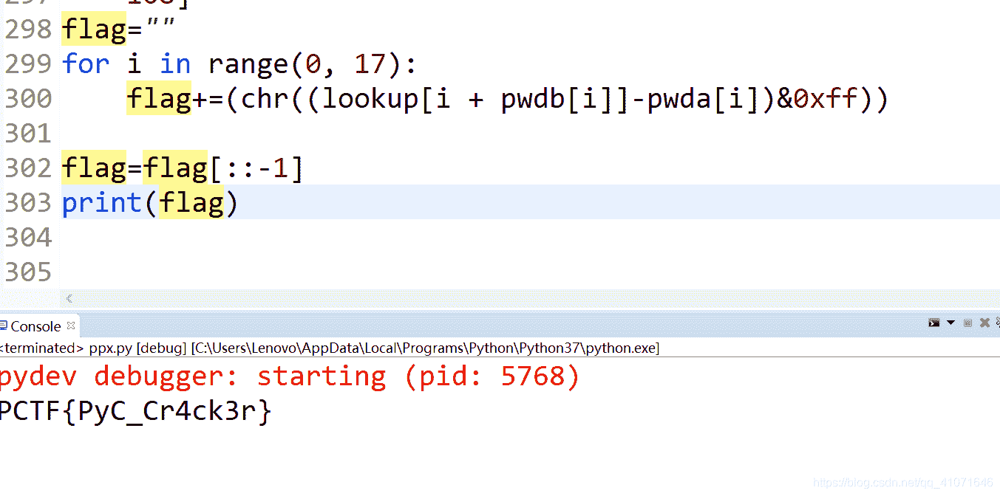

Classical Crackme

这个题目就是典型的 C#题目了。。

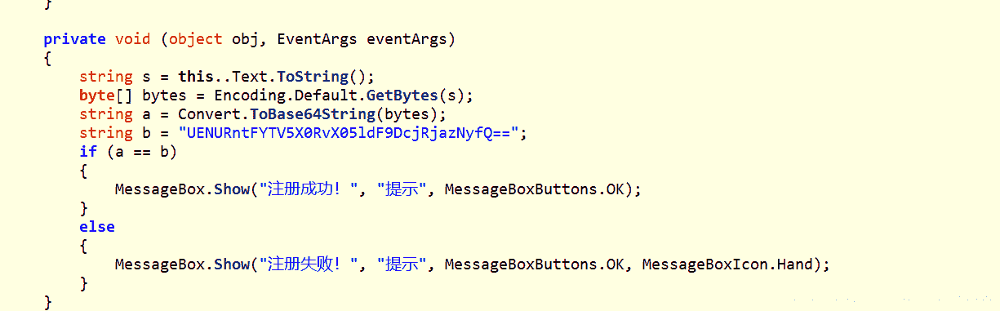

base64解密一下就ok了

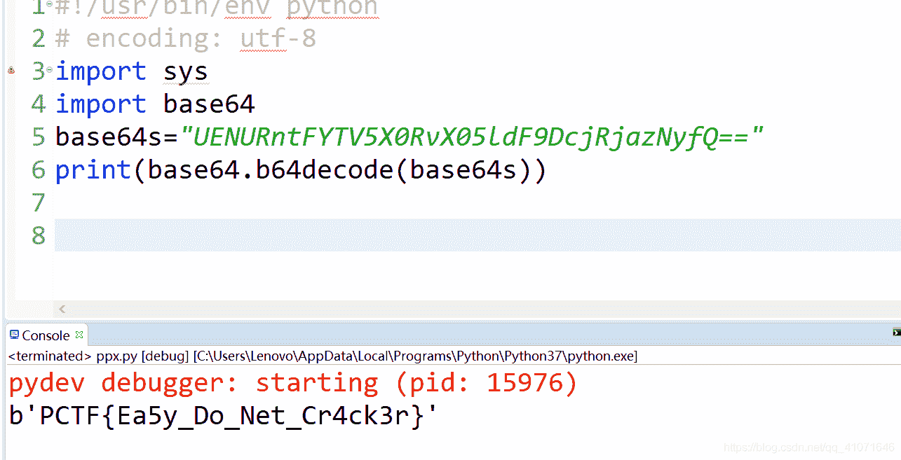

Fibonacci

这个题目我一看就乐了  斐波那契鸭 。。。。

然后后面就自闭了 。。。。

然后拖入ida 发现了很多jar2 的字符串  以前做个类似的题目  但是也没有做出来 但是知道了 是用java  jvm打包成的exe

python的反编译确实很简单  但是这个 java的 有些时候确实比较恶心。。。。

这里参考了夜影师傅的博客。。

[https://blog.csdn.net/whklhhhh/article/details/78682279](https://blog.csdn.net/whklhhhh/article/details/78682279)

首先需要一个工具

 下载链接   [https://github.com/slavemaster/e2j](https://github.com/slavemaster/e2j)

e2j的原理  就是dump  缺点就是 没有执行的函数dump不出来

这里就给了这个题目留下了一个坑点

我们先把这个e2j搞起来

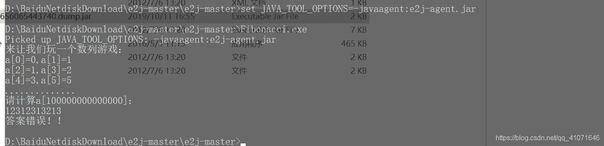

在目录下 执行 set JAVA_TOOL_OPTIONS=-javaagent:e2j-agent.jar  然后运行程序即可

然后 目录下出现了 一个jar文件


拖入我们发现了很多信息 还没有来得及开心的时候。。。。。。 发现了  程序逻辑不对劲  我们找不到flag在哪 。。

想了一下  b这个类应该没有函数 然后就没有执行 也没有dump。。。

那么问题来了。。。。 怎么去找。。

这里夜影师傅给了一个链接  [https://blog.csdn.net/whklhhhh/article/details/78682279](https://blog.csdn.net/whklhhhh/article/details/78682279)

java代码被存放在RCDATA数据中  我们用 PE explorer 来看

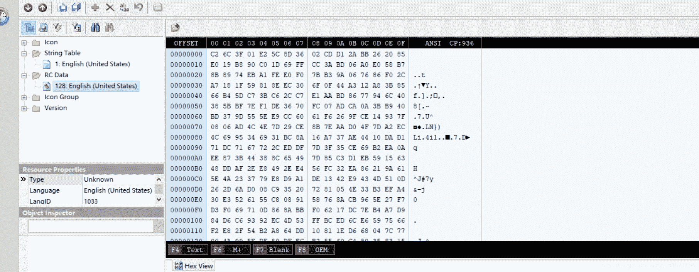

然后找到xdbg 找到这个数据

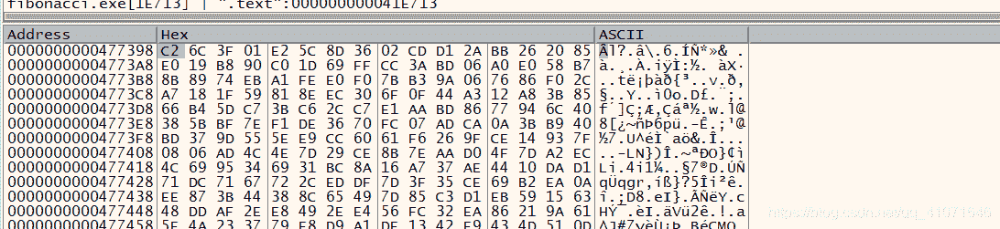

 下硬断 然后循环开始解

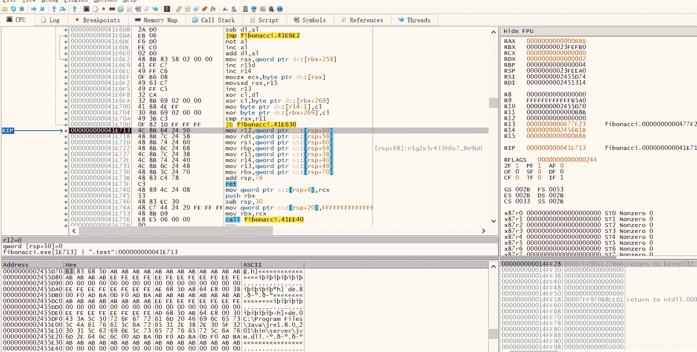

然后把r10指向的内存dump出来

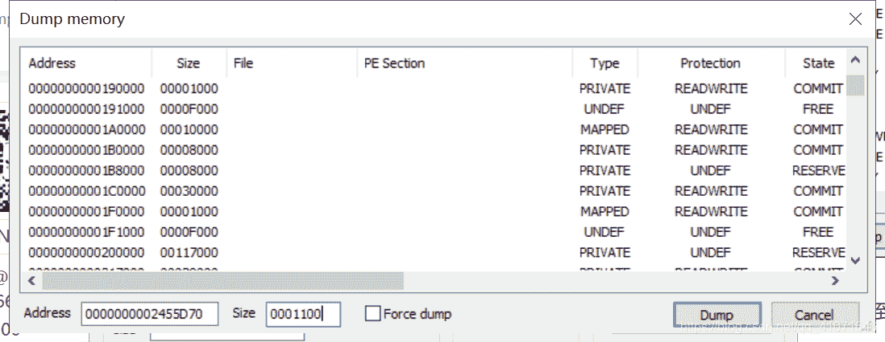

然后 得出 b里面的数据

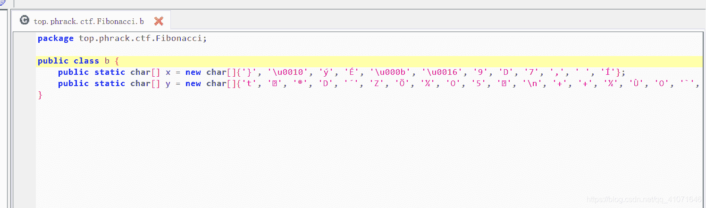

然后直接运行hello 这个函数的程序即可

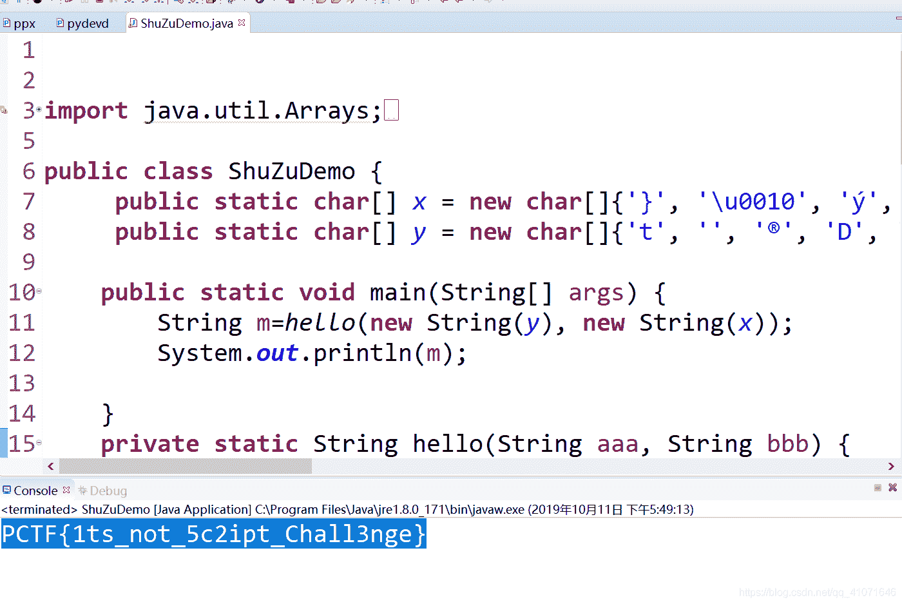

软件破解2

这个我以前貌似看过夜影巨巨的博客 。。。。。 貌似 把这个题就做出来了====

先不说了 直接开撸  可以看到主函数的内容

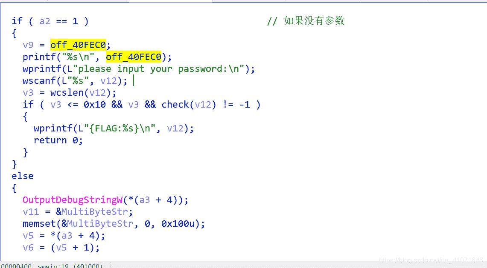

可以看到 主函数还对是否为 参数做了判断

感觉很好玩

还有一个明显的int 3断点

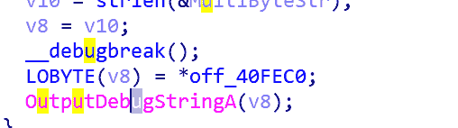

然后去看check 函数

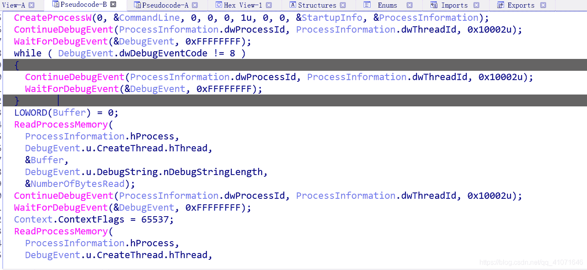

发现了一堆函数， 大概就是创建子进程 然后  写子进程进行读内存还有写内存的操作 

那么 int 3 就是返回一个异常 然后由父进程接收  然后写/读

这里可以看看汇编是什么样子的

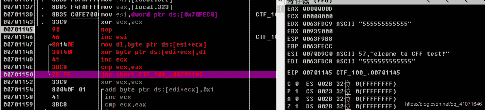

额  输入的字符串和我们的

0070D9C0  57 65 6C 63 6F 6D 65 20 74 6F 20 43 46 46 20 74  Welcome to CFF t
0070D9D0  65 73 74 21                                      est!

进行异或

可以写出脚本 得出flag

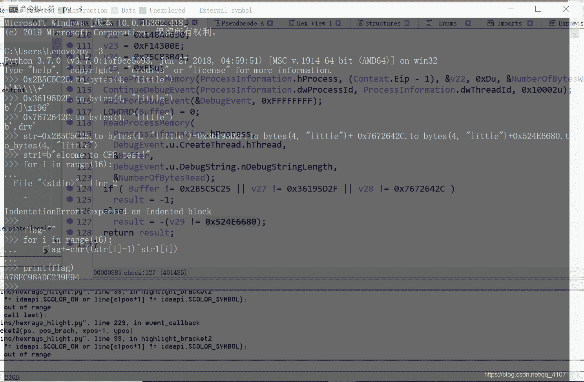

然后下面的一道题就是

文件数据修复

这个题目看起来就花里胡哨的

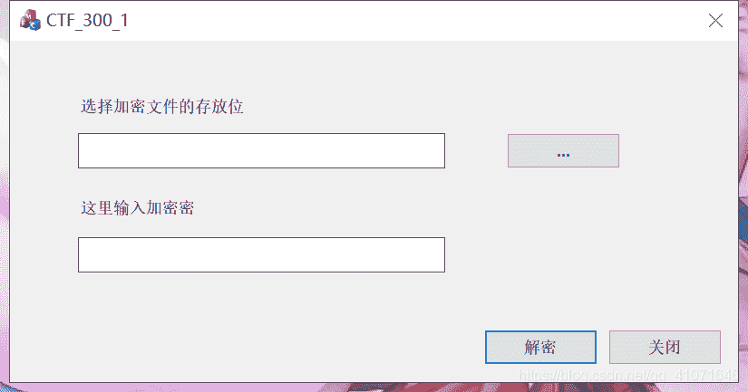

不过定位到关键点就会发现内在逻辑还是很清楚的

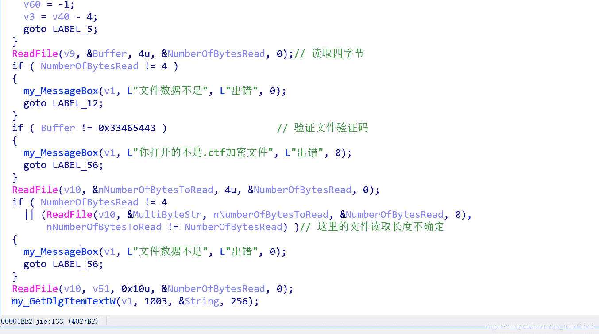

发现了有很多的readfile 的操作 这里先把逻辑给挑出来

四个字节   验证文件的验证码

四个字节   下个部分的字节长度

上面值的字节数   未知作用

0x10字节    key md5两次 和这个作比较

然后四个字节 就是读取后面的所有字节数

然后就是字节数进行解密= ==

这个题 的切入点就是 那个代表后面所有的字节数在哪  如果找到了  那么文件头就可以修复的差不多了 

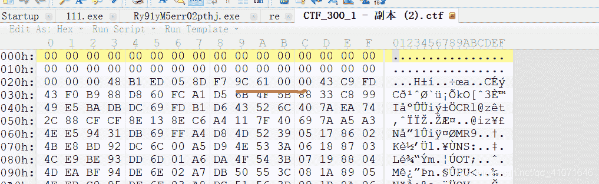

可以看出这个题目的切入点就是这

然后看 key的加密算法 是两次md5 根据前面的爆破 我们可以直接写脚本把这个值爆破出来 因为题目上说的是 8位 数字

```
import hashlib

strr=""
strr=chr(0x48)+chr(0xb1)+chr(0xed)+chr(0x05)+chr(0x8d)+chr(0xf7)
strrs=strr.encode('hex')
print(strr.encode('hex'))

for i in range(10):
	print "[*] "+"i:"+str(i)
	#exit()
	for j in range(10):
		for k in range(10):
			for ii in range(10):
				for jj in range(10):
					for kk in range(10):
						for iii in range(10):
							for jjj in range(10):
								flag=str(i)+str(j)+str(k)+str(ii)+str(jj)+str(kk)+str(iii)+str(jjj)
								flags=(hashlib.md5(hashlib.md5(flag.encode(encoding='UTF-8')).digest()).hexdigest())		
								#print(flags[-12:])
						#exit()
								if flags[-12:]==strrs:
									print(flags)
									print(flag)
									exit()
print("gg")
```

key求出来是 20160610  然后把值输入上去   那个 0x11是通过中间字符个数算的

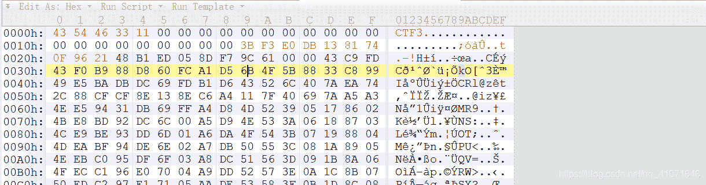

然后发现

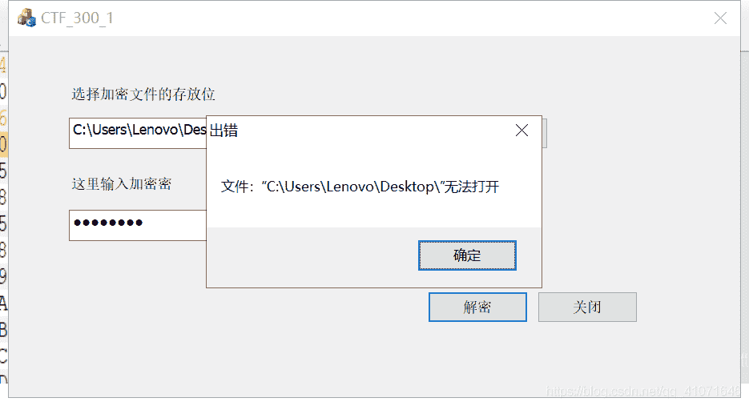

额   然后 试了试输入中间的值 

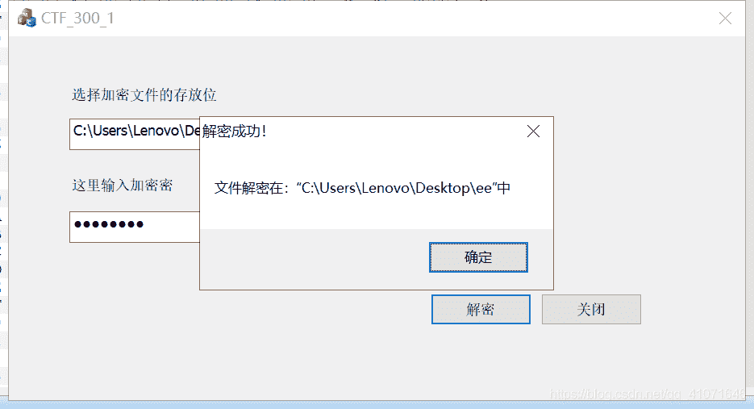

额  中间的值 就是输出的文件名，，

然后用wps打开有了flag

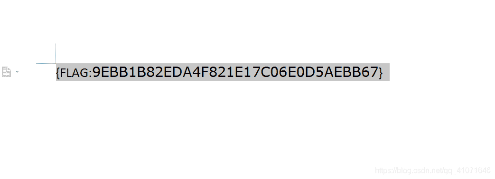

软件破解 3

这个题目就是比较好玩的一道题目了

先看一下程序逻辑。

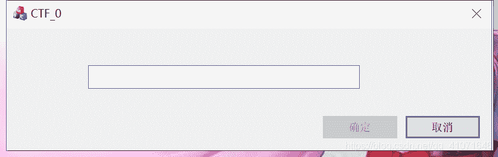

一开始是确定按钮是不可以点击的，  然后随便输入了一些字符 发现确定键可以了   一激动还以为自己输入对了flag  结果只是长度输入正确了 

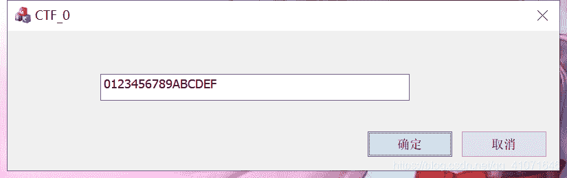

拖入ida 分析一波

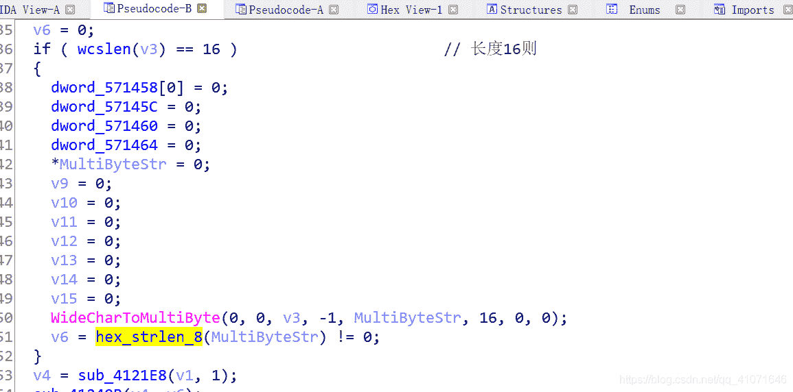

点进去看一眼

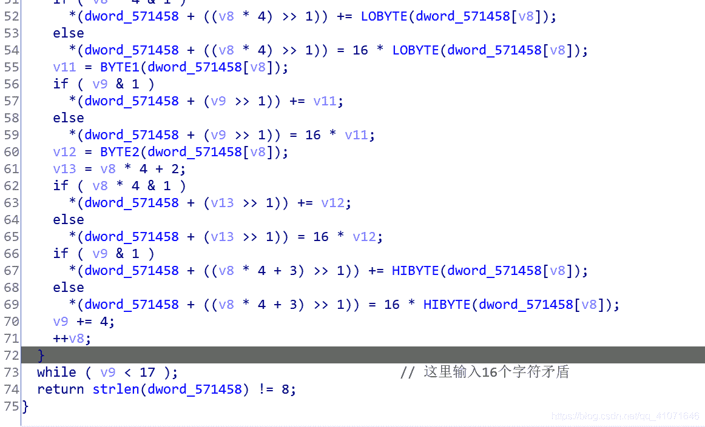

我还以为这个是只算  00 01 这算两个长度 而不是一个长度，，，， 结果我想错了 

OD动态调试了一下 还是0x10  那么 这里就很矛盾，，，

再看出flag的地方

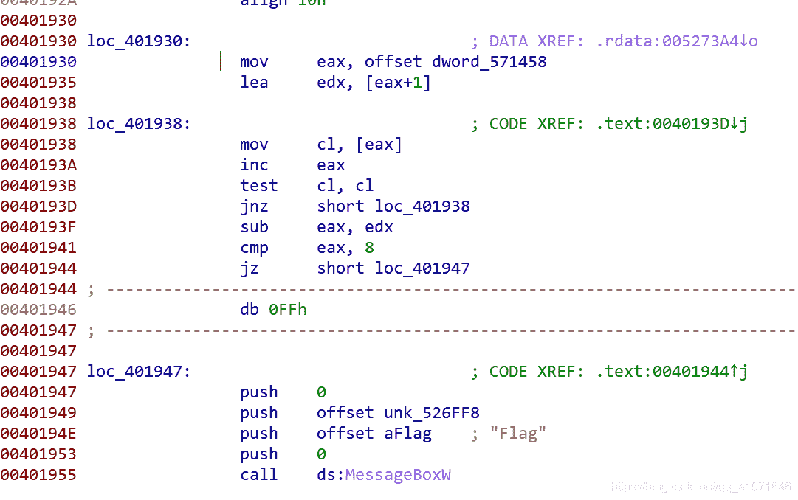

发现了一个盲点，

那就是

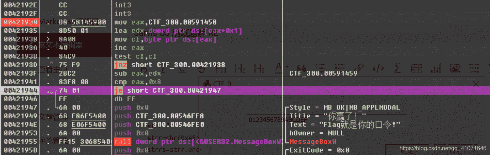

 想有确定按钮就必须有 长度16的地方，，，   但是长度16有到不了这个正确的窗口 ，，，

但是根据我前几天的做windows pwn题的感觉 已经 以前写的一道花指令的题目 这个题目应该是有了异常机制

但是在调用堆栈里 没有发现SHE 。。。。 这就很尴尬了，，然后昨天晚上感觉这个异常应该是会对这个数据处理的 

然后就做了一个硬件断点  和惊喜的发现断下了 ，

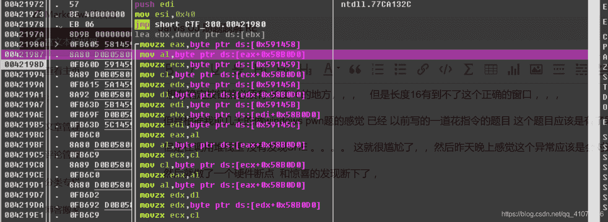

在ida 里面找到 这个地方

然后交叉引用

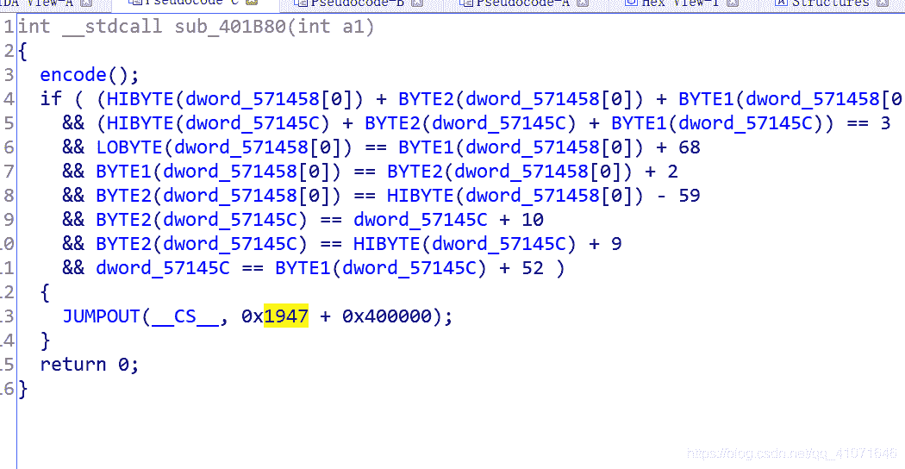

发现了如下的东西 。。

这个方程组很好解决 z3一把梭

那么问题就出在了 怎么去日那个加密函数，

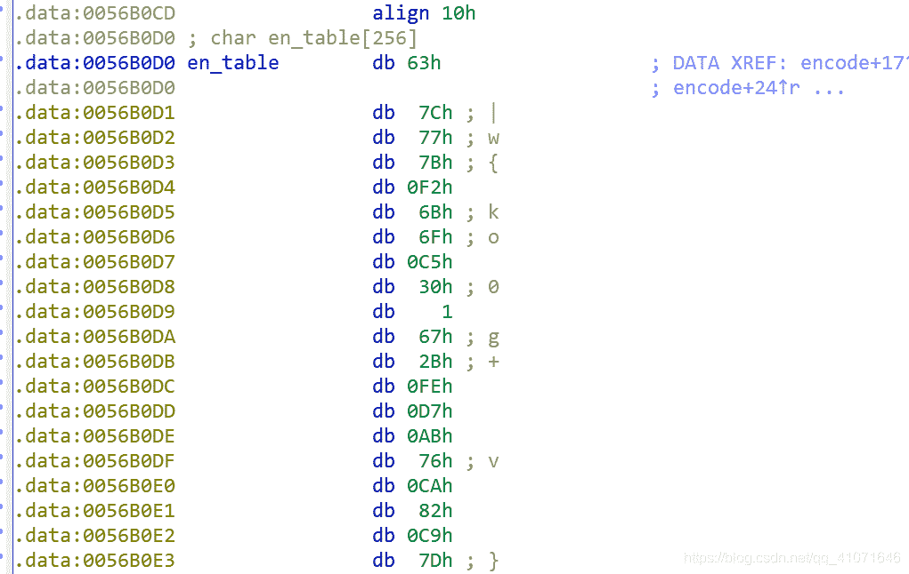

这个表就是 AES 生成s盒的表，，，

然后看了一下   然后搜了一些 然后去逆s盒就ok

下面写出脚本 这里的脚本就下面的参考帖子的脚本写的，，，

```
import hashlib
from z3 import *

re_table = [0x52, 0x09, 0x6A, 0xD5, 0x30, 0x36, 0xA5, 0x38, 0xBF, 0x40, 0xA3, 0x9E, 0x81, 0xF3, 0xD7, 0xFB,
    0x7C, 0xE3, 0x39, 0x82, 0x9B, 0x2F, 0xFF, 0x87, 0x34, 0x8E, 0x43, 0x44, 0xC4, 0xDE, 0xE9, 0xCB,
    0x54, 0x7B, 0x94, 0x32, 0xA6, 0xC2, 0x23, 0x3D, 0xEE, 0x4C, 0x95, 0x0B, 0x42, 0xFA, 0xC3, 0x4E,
    0x08, 0x2E, 0xA1, 0x66, 0x28, 0xD9, 0x24, 0xB2, 0x76, 0x5B, 0xA2, 0x49, 0x6D, 0x8B, 0xD1, 0x25,
    0x72, 0xF8, 0xF6, 0x64, 0x86, 0x68, 0x98, 0x16, 0xD4, 0xA4, 0x5C, 0xCC, 0x5D, 0x65, 0xB6, 0x92,
    0x6C, 0x70, 0x48, 0x50, 0xFD, 0xED, 0xB9, 0xDA, 0x5E, 0x15, 0x46, 0x57, 0xA7, 0x8D, 0x9D, 0x84,
    0x90, 0xD8, 0xAB, 0x00, 0x8C, 0xBC, 0xD3, 0x0A, 0xF7, 0xE4, 0x58, 0x05, 0xB8, 0xB3, 0x45, 0x06,
    0xD0, 0x2C, 0x1E, 0x8F, 0xCA, 0x3F, 0x0F, 0x02, 0xC1, 0xAF, 0xBD, 0x03, 0x01, 0x13, 0x8A, 0x6B,
    0x3A, 0x91, 0x11, 0x41, 0x4F, 0x67, 0xDC, 0xEA, 0x97, 0xF2, 0xCF, 0xCE, 0xF0, 0xB4, 0xE6, 0x73,
    0x96, 0xAC, 0x74, 0x22, 0xE7, 0xAD, 0x35, 0x85, 0xE2, 0xF9, 0x37, 0xE8, 0x1C, 0x75, 0xDF, 0x6E,
    0x47, 0xF1, 0x1A, 0x71, 0x1D, 0x29, 0xC5, 0x89, 0x6F, 0xB7, 0x62, 0x0E, 0xAA, 0x18, 0xBE, 0x1B,
    0xFC, 0x56, 0x3E, 0x4B, 0xC6, 0xD2, 0x79, 0x20, 0x9A, 0xDB, 0xC0, 0xFE, 0x78, 0xCD, 0x5A, 0xF4,
    0x1F, 0xDD, 0xA8, 0x33, 0x88, 0x07, 0xC7, 0x31, 0xB1, 0x12, 0x10, 0x59, 0x27, 0x80, 0xEC, 0x5F,
    0x60, 0x51, 0x7F, 0xA9, 0x19, 0xB5, 0x4A, 0x0D, 0x2D, 0xE5, 0x7A, 0x9F, 0x93, 0xC9, 0x9C, 0xEF,
    0xA0, 0xE0, 0x3B, 0x4D, 0xAE, 0x2A, 0xF5, 0xB0, 0xC8, 0xEB, 0xBB, 0x3C, 0x83, 0x53, 0x99, 0x61,
    0x17, 0x2B, 0x04, 0x7E, 0xBA, 0x77, 0xD6, 0x26, 0xE1, 0x69, 0x14, 0x63, 0x55, 0x21, 0x0C, 0x7D]

def decrypt(c):
    result = b''
    for i in c:
        a = i // 0x10
        b = i % 0x10
        result += re_table[a * 0x10 + b].to_bytes(1, "little")
    return result

l = [Int("l%d"%i) for i in range(8)]
s = Solver()
s.add((l[3] + l[2] + l[1] + l[0] )%256 == 71)
s.add((l[7] + l[6] + l[5])%256 == 3)
s.add(l[0]%256 == l[1] + 68)
s.add(l[1]%256 == l[2] + 2)
s.add(l[2]%256 == l[3] - 59)
s.add(l[6]%256 == l[4] + 10)
s.add(l[6]%256 == l[7] + 9)
s.add(l[4]%256 == l[5] + 52)
for i in l:
    s.add(i>=0)
    s.add(i<256)

while(s.check()==sat):
    c = b''
    m = s.model()

    for i in range(8):
        c +=(((m[l[i]].as_long()).to_bytes(1, 'little')))

    # 输出方程的解
    #print(c)
    for i in c:
        print(hex(i)[2:].zfill(2).upper(), end='')
    print('\t', end='')

    # 查表
    for i in range(64*4):
        p = decrypt(c)
        c = p

    # 输出flag
    for i in c:
        print(hex(i)[2:].zfill(2).upper(), end='')

    #  排除该解后继续求解
    s.add(l[0] != m[l[0]].as_long())
    print("\n")
```

参考链接

[https://www.52pojie.cn/thread-674056-1-1.html](https://www.52pojie.cn/thread-674056-1-1.html)

这里帖子讲的很明白 具体异常的调用过程 可以参考一下

病毒分析

这个题挺难的，，， 我感觉分析了一些东西   但是没有分析完全 这里也写一下把

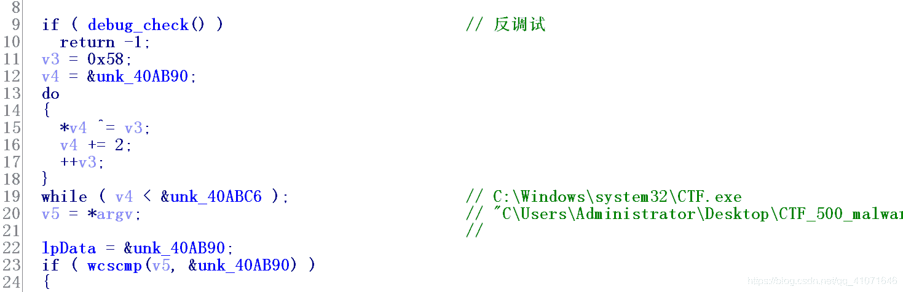

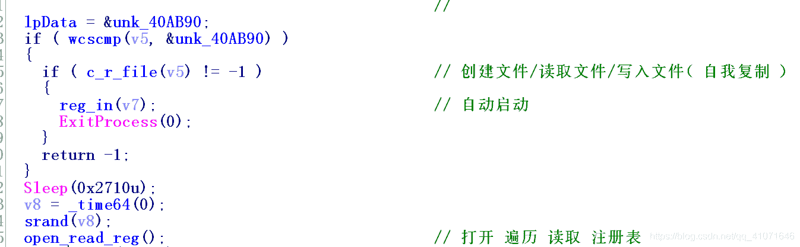

这里的 反调试很好玩，，

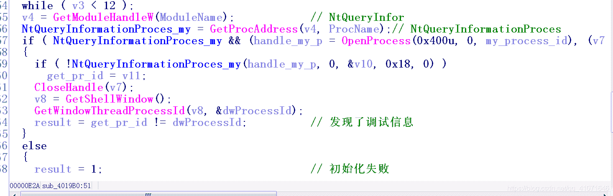

用的是  NtQueryInformationProces 查找父进程的pid  然后对比 

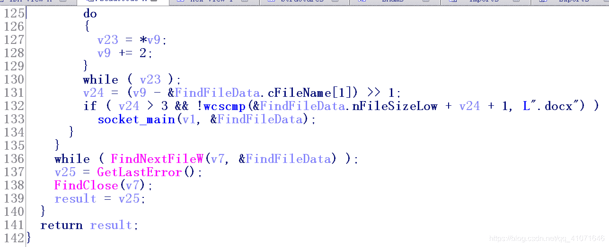

下面就是socket的传输了

遍历文件夹等 然后遇到docx 开始传输==

然后里面的算法看的不是很清楚，。。

这里把静态的字符串恢复脚本安排了  有空 把这个题安排了，。。

```
import hashlib
from z3 import *

filename=(0x3410350F).to_bytes(4, 'little')
filename+=(0x8383324).to_bytes(4, 'little')
filename+=(0x332E272F).to_bytes(4, 'little')
filename+=(0x2835202C).to_bytes(4, 'little')
filename+=(0x33112F2E).to_bytes(4, 'little')
filename+=(0x3224222E).to_bytes(4, 'little')
filename+=(0x41).to_bytes(4, 'little')

str(filename, encoding = "utf-8")  
flag=""
for i in range(len(filename)):
	flag+=chr(filename[i]^0x41)

print(flag)

ModuleName=0x4135412F.to_bytes(4, 'little')
ModuleName+=0x412D4125.to_bytes(4, 'little')
ModuleName+=0x4141412D.to_bytes(4, 'little')

out_put=""
for i in range(len(ModuleName)):
	out_put+=chr(filename[i]^0x41)

print(out_put)

out_str=""
l=[27,99,6,12,53,51,58,48,23,18,62,16,29,22,18,2,5,90,88,55,47,57,40,65,21,9,23]

for i in range(len(l)):
	out_str+=chr(l[i]^(0x58+i))

print(out_str)
'''
#include<idc.idc>
static main()
{    
    auto i,j,form,end;
    form=0x40AB90;
    end=0x40ABC6; 
     for(i=form;i<end;i=i+2)
     {

       Message("%d,",Byte(i));

     }
     Message("\n"+"OK\n");
}
''' 
```

然后就是 APK_500

这个题目就很好玩了，，

我是直接脱入so 开始分析的，，

先说一下我本来的脚本。。

```
baby=[0x85,0x8B,0xEC,0x83,0x6c,0x9c,0x83,0x8d,0xc,0x1,0x75,0x5f,0xc6,0x45,0xf3,0x50]

cmps="ddedd4ea2e7bef168491a6cae2bc660"

#print(len(baby))
#print(len(cmps))

cmpint=[]
for i in range(0,32,2):
	cmpint.append(int("0x"+cmps[i:i+2],16))

#print(cmpint)
#print(len(baby))
for i in range(len(baby)):
	baby[i]=baby[i]^cmpint[i]

ppx=baby[-7:]+baby[:-7]
print(ppx)

for i in range(4):
	baby[i]=baby[i]-1
for i in range(len(baby)):
	baby[i]=baby[i]^i

for i in range(len(baby)):
	print(chr(baby[i]),end="")

'''
#include<idc.idc>
static main()
{    
    auto i,j,form,end;
    form=0x2c87;
    end=0x2ca7; 
     for(i=form;i<end;i=i+1)
     {
       Message("%c",Byte(i)^(57+i-0x2c87));
     }
     Message("\n"+"OK\n");
}
	'''
```

然后跑出一堆乱码  然后

我就自闭了，，，

看了一下夜影师傅的博客 才知道了怎么回事= =

先说一下这个题目是干啥的，

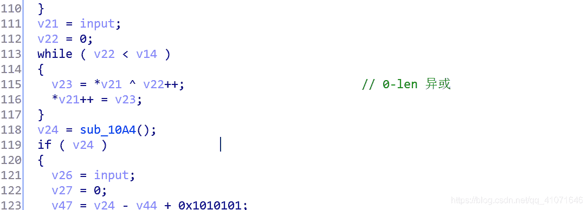

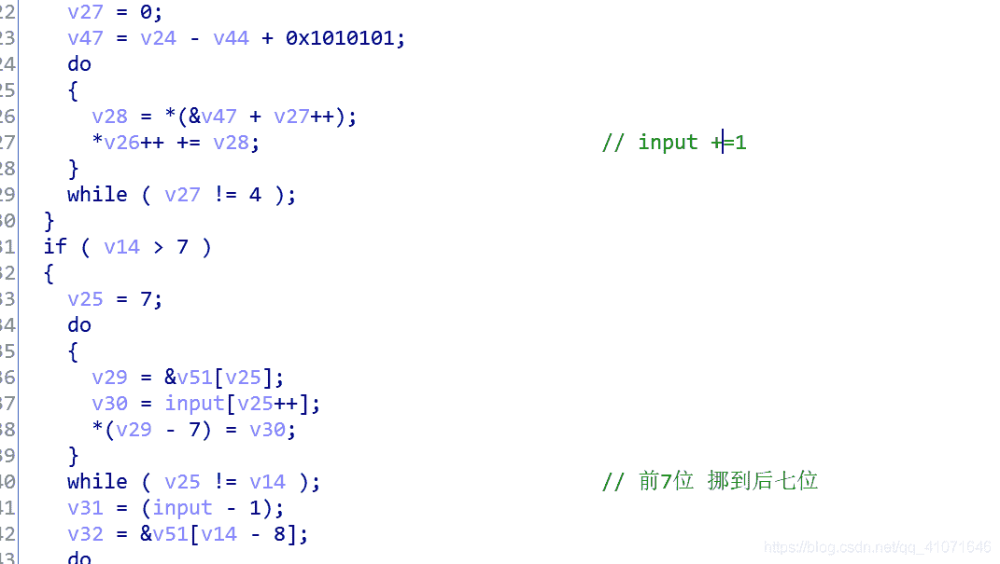

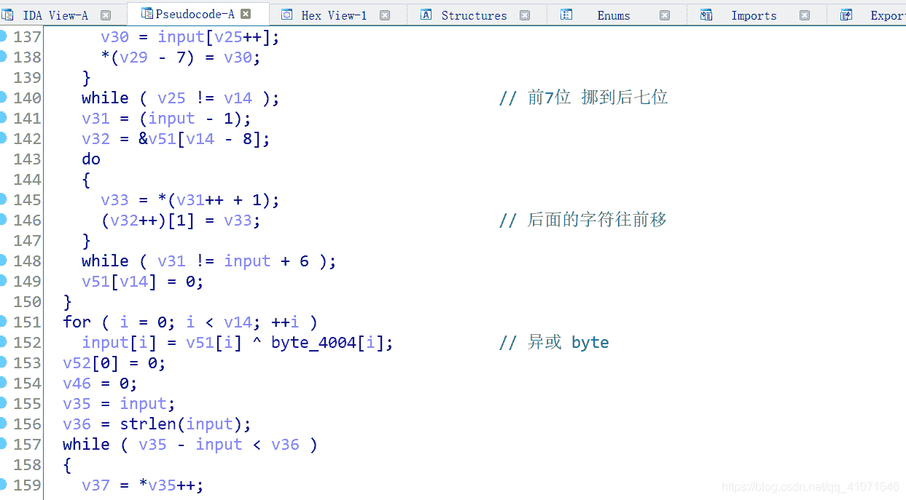

然后有一点就是 交叉引用  

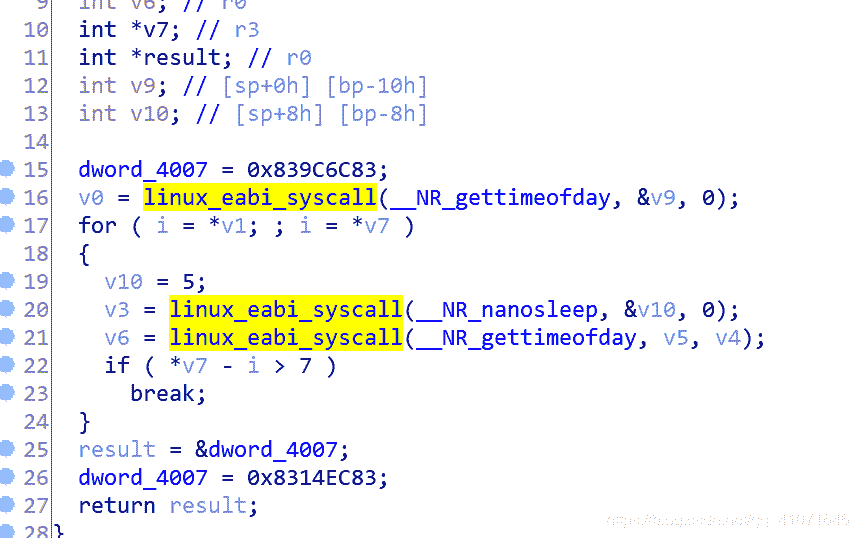

这个因为吃过亏 所以就 认识的比较，，，清楚

然后其实上面的脚本问题我也是吃过亏  但是还是没有长记性 ==  是我太菜了，，

引用夜影师傅的原话

ddedd4ea2e7bef168491a6cae2bc660
脚本调用bytes.fromhex的时候发现它长度不对，只有31位
转十六进制的时候是sprintf(buff, “%x”, input)，注意格式化不是%02x
因此有一个0被消掉了，需要爆破

so  。。。。

只能爆破喽

```
babys=[0x85,0x8B,0xEC,0x83,0x6c,0x9c,0x83,0x8d,0xc,0x1,0x75,0x5f,0xc6,0x45,0xf3,0x50]

cmps="ddedd4ea2e7bef168491a6cae2bc660"

n=[]
for i in range(32):
	st=cmps[:i]+"0"+cmps[i:]
	n.append(bytes.fromhex(st))

#print(len(baby))
#print(len(cmps))

cmpint=[]
for i in range(0,32,2):
	cmpint.append(int("0x"+cmps[i:i+2],16))

for cmpint in n:
	baby=babys
	flag=[]
	#print(cmpint)
	#print(len(baby))
	for i in range(len(baby)):
		flag.append(((cmpint[i]^baby[i])))

	flags=""
	flag=flag[-7:]+flag[:-7]
	#print(ppx)
	#print(flag)
	for i in range(4):
		flag[i] =flag[i] - 1
	for i in range(len(flag)):
		flag[i]=flag[i]^i
		if (flag[i]<=32 or flag[i]>=127):
			break
		flags+=chr(flag[i])

	else:
		print(flags)
```

Broken Drivers

这个题目就。。。

一开始我打开的时候发现是这样子的，，

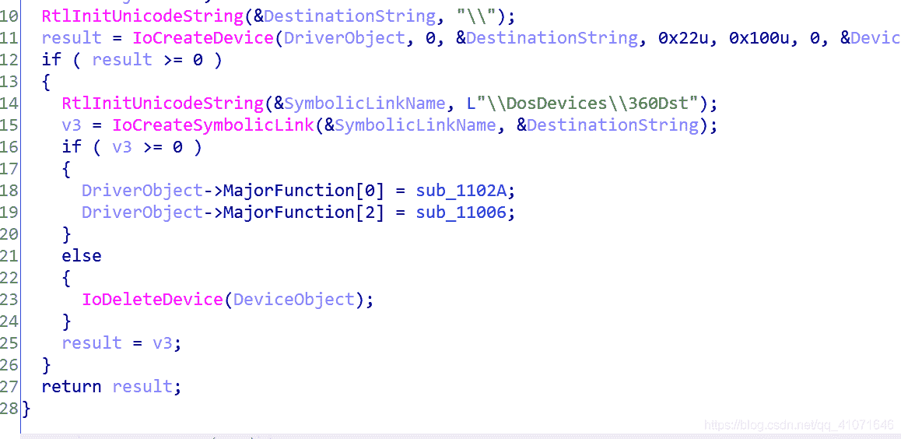

emmmmm 这样不会炸么  只有creat 和close 的派遣函数 。，。

在里面也木有发现什么有用的信息，， 试着安装一下 结果不行，，，

问了一下一个搞驱动开发的老哥 ，，，  然后用loadpe 修复了一下

然后在汇编窗口发现了有个unload的派遣函数

这个是我已经修复好的，

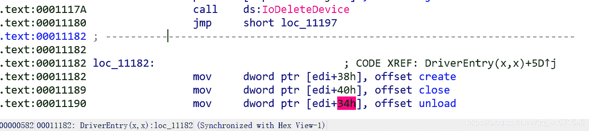

但是发现被标红了  而且 ida  f5 里面也发现了 不正确的反汇编

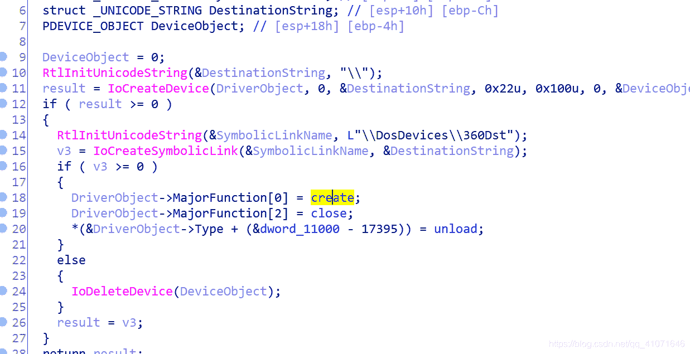

emmmm 这好像有点尴尬 ，   想了好久没有想出来原因。最后感觉是重定位表的问题 因为 ida 分析出来的是 绝对地址，， 但是不知道怎么改 ，，  看了这篇看雪的帖子 恍然大悟  [https://bbs.pediy.com/thread-223239.htm](https://bbs.pediy.com/thread-223239.htm)

和我一开始的想法一样 就是 地址是绝对值 并不是相对的地址 然后不会被重定位表给重定位

那么 我们需要修复一下重定位表

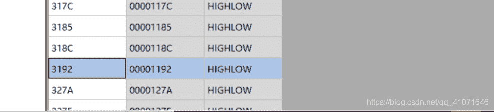

改成1193  然后我们把这个题目PE-checksum 用 Stud_PE_chs 改一下

然后 驱动终于加载了，，，

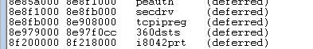

那么用ida 看一下程序逻辑

发现在creat的派遣函数里面

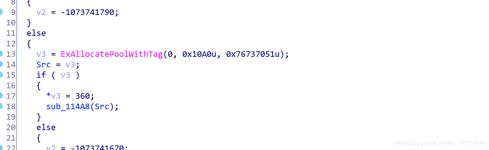

申请了一部分的空间 然后进入了 一个加密函数

然后看卸载函数 发现了

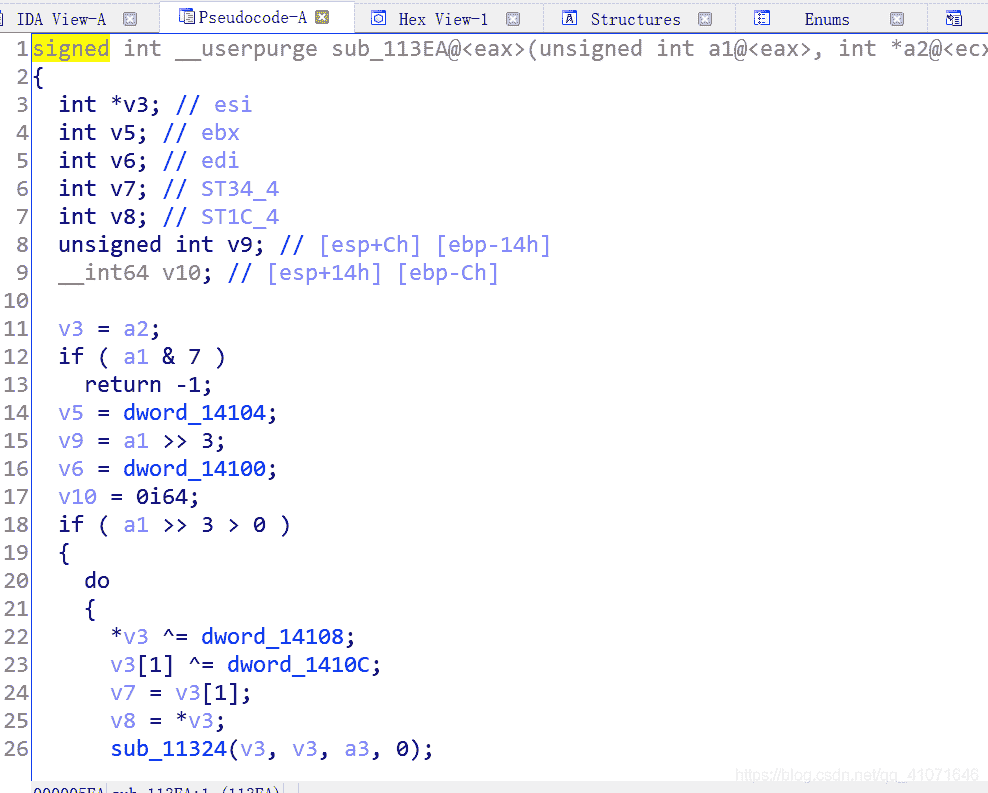

emmmm 动态来一波

因为需要creat 的派遣函数 所以我们写一个r3程序

但是我的一直返回错误是5  访问拒绝 现在还不知道怎么回事 等到get到了补上这个题目的题解

后记：

我太垃圾了  这个题目 还有一个判断就是

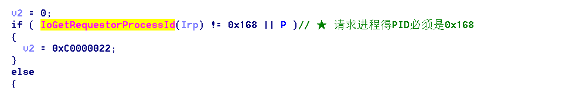

让程序的pid 的判断是 等于 0x168 不然的话 就返回错误码 。。。。。。。。。。。。。。

这个地方没有注意 我真的是太垃圾了。。

然后 nop 或者动态把这个判断过了  然后断下unload

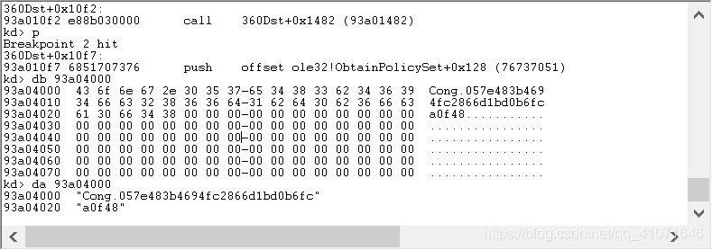

拿到flag

然后就是这个DD - Evil Exe

ddctf的原题 应该是 ，，

这个题目其实就是一个esp的壳  脱完之后然后ida里面逻辑就很清楚

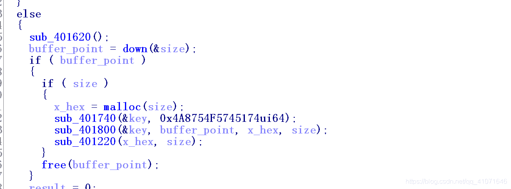

上面的一个函数就是变成docx的 

然后其中逻辑都很简明，，

把这个题目然后直接

写一个脚本 拿到了 字符串


然后写了一个脚本直接拿到flag

```
stst="hcomXhing.hchuxhdidihade@hd9e9h7173hd4aehd69bhb1c4hadachc49bhTF-ch DDChKey:"
flag=""
for i in range(14,-1,-1):
	flag+=stst[i*5+1:i*5+5]

print(flag) 
```


 后面的x是多余的

爬楼梯

这个题比较可惜 反编译不通过  xopsed也没有写出来  然后FindPass用C语言写的出问题了。。。。

我先说一下 反编译没有通过这个题  这个 大家可能都遇到了  本来我是想有个骚操作的  就是xopsed  但是我遇到了一个问题

那就是  这里面的类变量确实没有经过函数传递   这个 我就不知道怎么做了 我知道是通过this 指针传递的。。。。

然后确实比较可惜   没有能够解决掉 要是 有 函数传递 或者是 返回值 我应该是能搞定的   可惜没有搞定。。。

然后我就只能看 别人的博客了

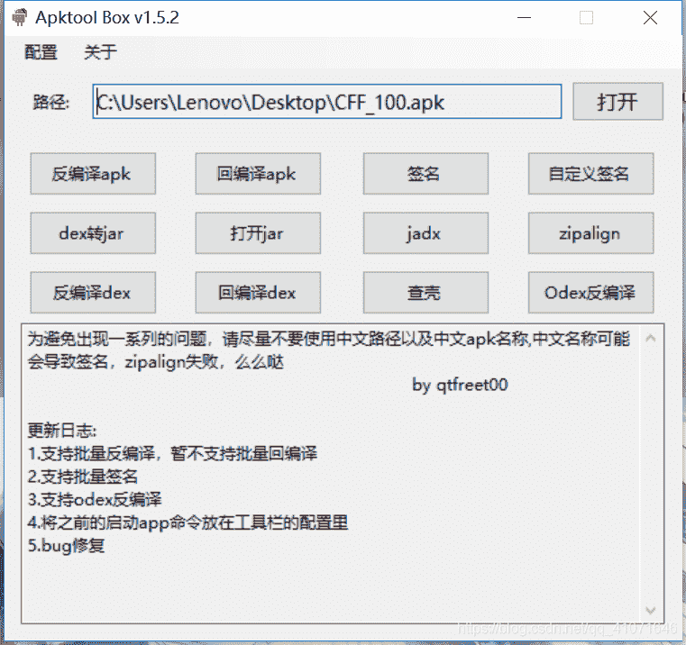

我们需要反编译  把unknown 整个文件夹给删除了就好了 就可以 反编译了 

至于 是改的地方 

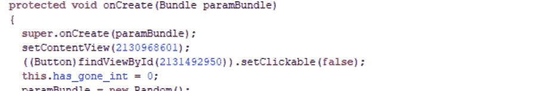

我们可以把按钮变成 ture 就可以了 这个还是比较简单的

 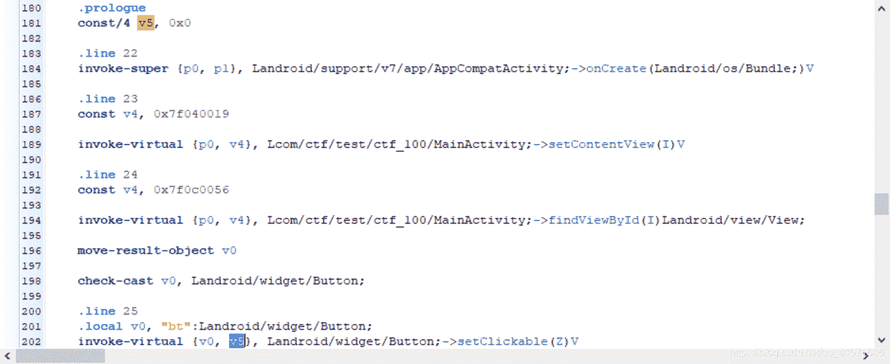

把181那个v5 改成1 就可以了 

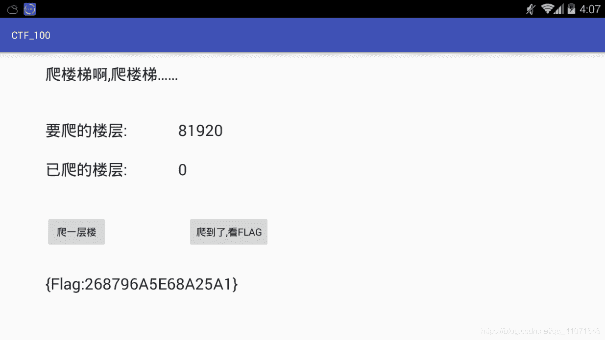

第二题 就更坑爹了    我用的c语言读取  竟然不行 后面全是 0  搞得我很头大 一直也没有解决  上面两个问题 要是有那个大佬解决了  还希望能够指点一二 然后 我就去翻了一下别人的博客  发现了 这样的一篇博客 （看别人的博客上面说  动态调试也可以  我还是分析了一下算法。。)

参考链接

[https://blog.csdn.net/qq_35078631/article/details/78222249](https://blog.csdn.net/qq_35078631/article/details/78222249)

所以 我还是用python了  python真的好用。。（我C语言太菜了000）

那个 eq_str 是根据 编号的出来的

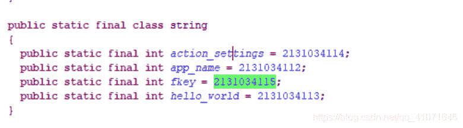

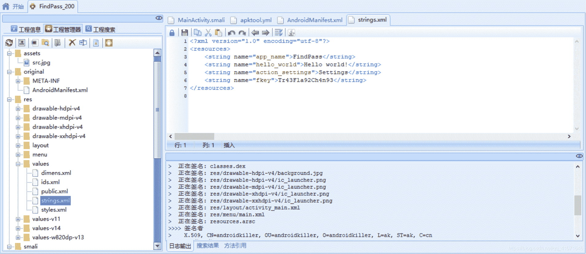

```
#_*_coding:utf-8_*_
imgsrc="src.jpg"
eq_str = "Tr43Fla92Ch4n93"
imarr=[]
fp=open(imgsrc,"rb")
fp.seek(0,0)
for i in range(1024):
    b=fp.read(1)
    imarr.append(ord(b))

flag=""
for i in range(len(eq_str)):
    if imarr[ord(eq_str[i])]<128:
        temp=imarr[ord(eq_str[i])]%10
    else:
        temp=(-(imarr[ord(eq_str[i])]%128))%10

    if i%2==0:
        flag+=chr(ord(eq_str[i])-temp)
    else:
        flag+=chr(ord(eq_str[i])+temp)

print(flag) 
```


得出flag 

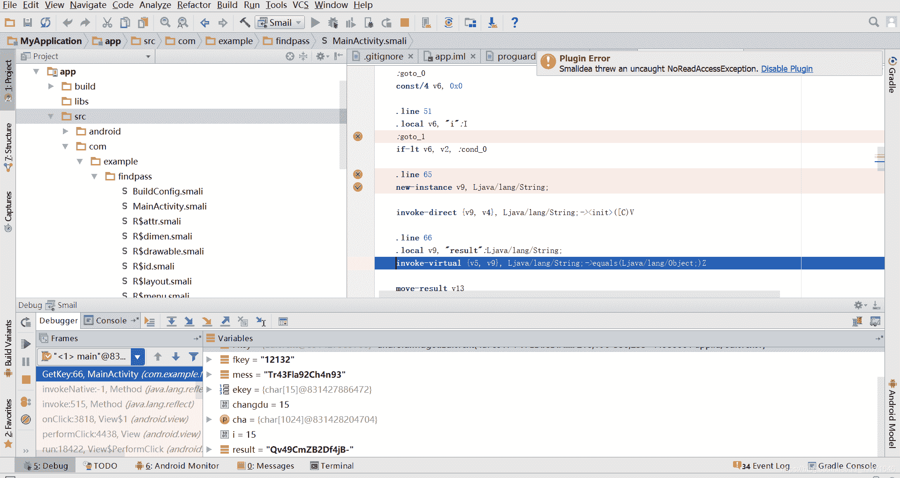

另外附上一张 动态调试得到的flag。。。。。。。

smail 这个题  比较可惜    毕竟自己也不怎看smail 直接 就是java 代码直接撸   但是我从来不否认  smail 的用处  所以 

我就来看了看    果然 。。。。。 不过我将smail 复制进了 smail 里面 一步一步的分析

因为本人的smail 也不是很好 如果有错误  还请指教 谢谢

```
.method public constructor <init>()V
    .locals 1

    .prologue
    .line 22
    invoke-direct {p0}, Ljava/lang/Object;-><init>()V

    .line 21
    const-string v0, "cGhyYWNrICBjdGYgMjAxNg=="    #将这个字符串给v0

    iput-object v0, p0, Lnet/bluelotus/tomorrow/easyandroid/Crackme;->str2:Ljava/lang/String;

    .line 23
    const-string v0, "sSNnx1UKbYrA1+MOrdtDTA=="

    invoke-direct {p0, v0}, Lnet/bluelotus/tomorrow/easyandroid/Crackme;->GetFlag(Ljava/lang/String;)Ljava/lang/String;

    .line 24
    return-void
.end method
```

这里 p0->str2 是 cGhyYWNrICBjdGYgMjAxNg==  而 "sSNnx1UKbYrA1+MOrdtDTA== 为 参数 传进了函数里面

```
const/4 v3, 0x0

    .line 27
    invoke-virtual {p1}, Ljava/lang/String;->getBytes()[B

    move-result-object v2

    invoke-static {v2, v3}, Landroid/util/Base64;->decode([BI)[B     
#"sSNnx1UKbYrA1+MOrdtDTA=="
    move-result-object v0

    .line 29
    .local v0, "content":[B
    new-instance v1, Ljava/lang/String;

    iget-object v2, p0, Lnet/bluelotus/tomorrow/easyandroid/Crackme;->str2:Ljava/lang/String;

    invoke-virtual {v2}, Ljava/lang/String;->getBytes()[B

    move-result-object v2

    invoke-static {v2, v3}, Landroid/util/Base64;->decode([BI)[B   #"cGhyYWNrICBjdGYgMjAxNg==" 

    move-result-object v2 
```

这里是将 两个字符串 给 base64 解密了

```
 invoke-direct {v1, v2}, Ljava/lang/String;-><init>([B)V

    .line 30
    .local v1, "kk":Ljava/lang/String;
    sget-object v2, Ljava/lang/System;->out:Ljava/io/PrintStream;
    #decrypt("cGhyYWNrICBjdGYgMjAxNg==") 

    invoke-direct {p0, v0, v1}, Lnet/bluelotus/tomorrow/easyandroid/Crackme;->decrypt([BLjava/lang/String;)Ljava/lang/String;

    move-result-object v3
     #v3->(v2)  v2="sSNnx1UKbYrA1+MOrdtDTA=="    v3=decrypt
    invoke-virtual {v2, v3}, Ljava/io/PrintStream;->println(Ljava/lang/String;)V

    .line 31
    const/4 v2, 0x0
```

这里面就是 cGhyYWNrICBjdGYgMjAxNg==' base64 后 的字符串 被当成参数传进去   看后面应该是 AES/ECB/NoPadding

那么就可以的出来  写一个python脚本 跑出来

```
#coding:utf-8
import base64
from Crypto.Cipher import AES
if __name__=='__main__':
	str1=base64.b64decode('cGhyYWNrICBjdGYgMjAxNg==')
	str2=base64.b64decode('sSNnx1UKbYrA1+MOrdtDTA==')
	aes=AES.new(str1,AES.MODE_ECB)
	print(aes.decrypt(str2))
```

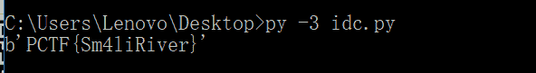

然后第三题  

DD - Hello

我还以为这个题 是安卓题  毕竟ddctf   结果 确实   不是  哈哈啊哈

这个题 很简单   随便找了一下 函数 发现了这个函数 试着 逆向了一下算法

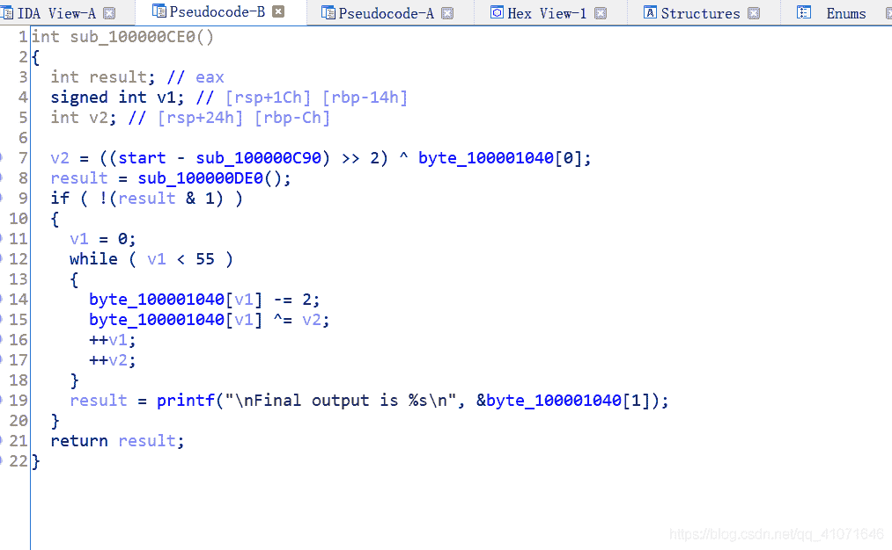

```
#include<stdio.h>
#include<string.h>
#include<algorithm>
#include<iostream>
using namespace std;
int start=0x100000CB0;
int sub=0x100000C90;
char byte_100001040[]={0x41,0x10,0x11,0x11,0x1b,0x0a,0x64,0x67,0x6a,0x68,0x62,0x68,0x6e,0x67,0x68,0x6b,0x62,0x3d,0x65,0x6a,0x6a,0x3d,0x68,0x04,0x05,0x08,0x03,0x02,0x02,0x55,0x08,0x5d,0x61,0x55,0x0a,0x5f,0x0d,0x5d,0x61,0x32,0x17,0x1d,0x19,0x1f,0x18,0x20,0x04,0x02,0x12,0x16,0x1e,0x54,0x20,0x13,0x14};

int main()
{
    int s=((start - sub) >> 2) ^ byte_100001040[0];
    for(int i=0;i<55;i++){
         byte_100001040[i]-=2;
         byte_100001040[i]^=s;
         s++;
    }
    printf("%s\n",byte_100001040+1);
    return 0;
} 
```


 第四题 

DD - Android Easy  这个题也很简单

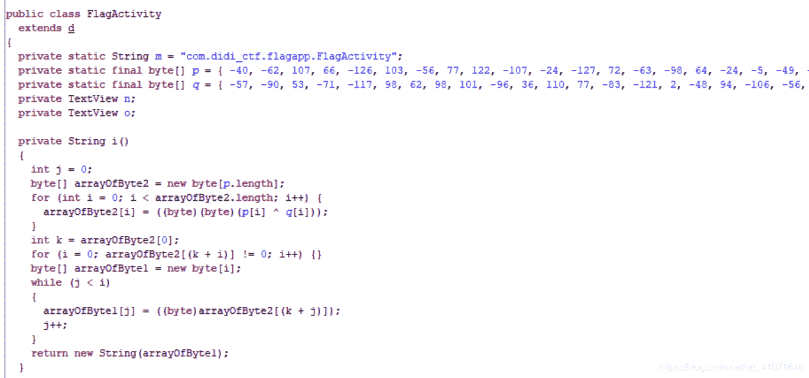

照着写一下就行

```
#include<stdio.h>
#include<string.h>
#include<algorithm>
#include<iostream>
using namespace std;
char p[] = { -40, -62, 107, 66, -126, 103, -56, 77, 122, -107, -24, -127, 72, -63, -98, 64, -24, -5, -49, -26, 79, -70, -26, -81, 120, 25, 111, -100, -23, -9, 122, -35, 66, -50, -116, 3, -72, 102, -45, -85, 0, 126, -34, 62, 83, -34, 48, -111, 61, -9, -51, 114, 20, 81, -126, -18, 27, -115, -76, -116, -48, -118, -10, -102, -106, 113, -104, 98, -109, 74, 48, 47, -100, -88, 121, 22, -63, -32, -20, -41, -27, -20, -118, 100, -76, 70, -49, -39, -27, -106, -13, -108, 115, -87, -1, -22, -53, 21, -100, 124, -95, -40, 62, -69, 29, 56, -53, 85, -48, 25, 37, -78, 11, -110, -24, -120, -82, 6, -94, -101 };
char q[] = { -57, -90, 53, -71, -117, 98, 62, 98, 101, -96, 36, 110, 77, -83, -121, 2, -48, 94, -106, -56, -49, -80, -1, 83, 75, 66, -44, 74, 2, -36, -42, -103, 6, -115, -40, 69, -107, 85, -78, -49, 54, 78, -26, 15, 98, -70, 8, -90, 94, -61, -84, 64, 112, 51, -29, -34, 126, -21, -126, -71, -31, -24, -60, -2, -81, 66, -84, 85, -91, 10, 84, 70, -8, -63, 26, 126, -76, -104, -123, -71, -126, -62, -23, 11, -39, 70, 14, 59, -101, -39, -124, 91, -109, 102, -49, 21, 105, 0, 37, -128, -57, 117, 110, -115, -86, 56, 25, -46, -55, 7, -125, 109, 76, 104, -15, 82, -53, 18, -28, -24 };
char arrayOfByte2[100];
char arrayOfByte1[100];
int main()
{
    int i,j=0;
    //printf("%d\n",strlen(p));
     for (i = 0; i <120; i++) {
      arrayOfByte2[i] =(p[i] ^ q[i]);
      //printf("%d ",arrayOfByte2[i]);
    }

    int k = arrayOfByte2[0];
    for (i = 0; arrayOfByte2[(k + i)] != 0; i++) {}
    while (j < i)
    {
      arrayOfByte1[j] = arrayOfByte2[(k + j)];
      j++;
    }
    printf("%s\n",arrayOfByte1);
    return 0;
}
```

 DD - Android Normal  这个题 是魔鬼吗。。。。

让我分析so库也就算了  还是  。。。。。  emm  反正看起来很头晕  但是感觉动态调试能够一把过 然后就来了一波动态调试 效果还不错

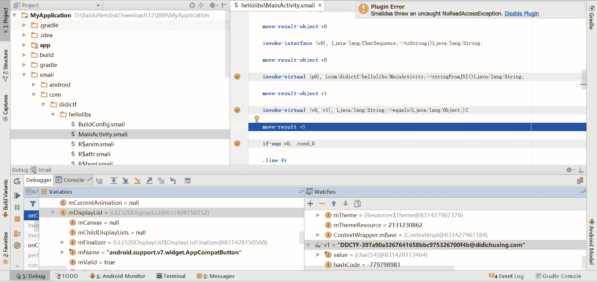

v1的值 就是答案

[61dctf]stheasy 这个题么.....

挺简单的

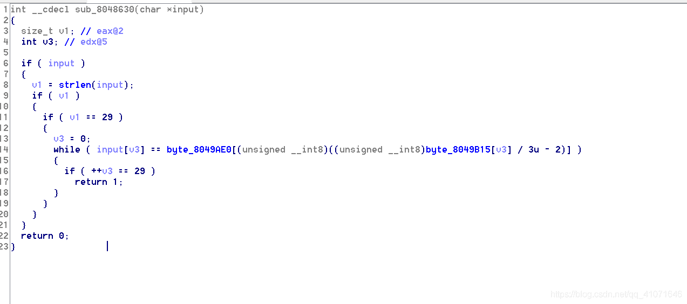

代码逻辑在里面 只需要 写一个脚本就可以了 ida 导出数据 shift+e 是真的好用。。。

```
#include<stdio.h>
#include<string.h>
#include<algorithm>
#include<iostream>
using namespace std;
char str[]="lk2j9Gh}AgfY4ds-a6QW1#k5ER_T[cvLbV7nOm3ZeX{CMt8SZo]U";

int num[100]={72,93, 141, 36, 132, 39, 153, 159, 84, 24, 30, 105,126,51, 21, 114, 141, 51, 36, 99, 33, 84, 12, 120, 120, 120, 120, 120, 27};
int main()
{
     for(int i=0;i<29;i++)
        printf("%c",str[int(num[i]/3)-2]);
    return 0;
} 
```

androideasy 

这个题 就更可惜了

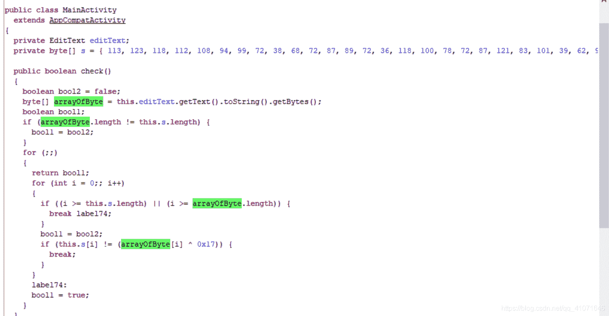

下面是脚本 

```
#include<stdio.h>
#include<string.h>
#include<algorithm>
#include<iostream>
using namespace std;
int s[100] = { 113, 123, 118, 112, 108, 94, 99, 72, 38, 68, 72, 87, 89, 72, 36, 118, 100, 78, 72, 87, 121, 83, 101, 39, 62, 94, 62, 38, 107, 115, 106 };

int main()
{
    for(int i=0;s[i]!=0;i++)
    {
        printf("%c",s[i]^0x17);
    }
    printf("\n");
    return 0;
}
```

参考链接

[https://blog.csdn.net/whklhhhh/article/details/78682279](https://blog.csdn.net/whklhhhh/article/details/78682279)