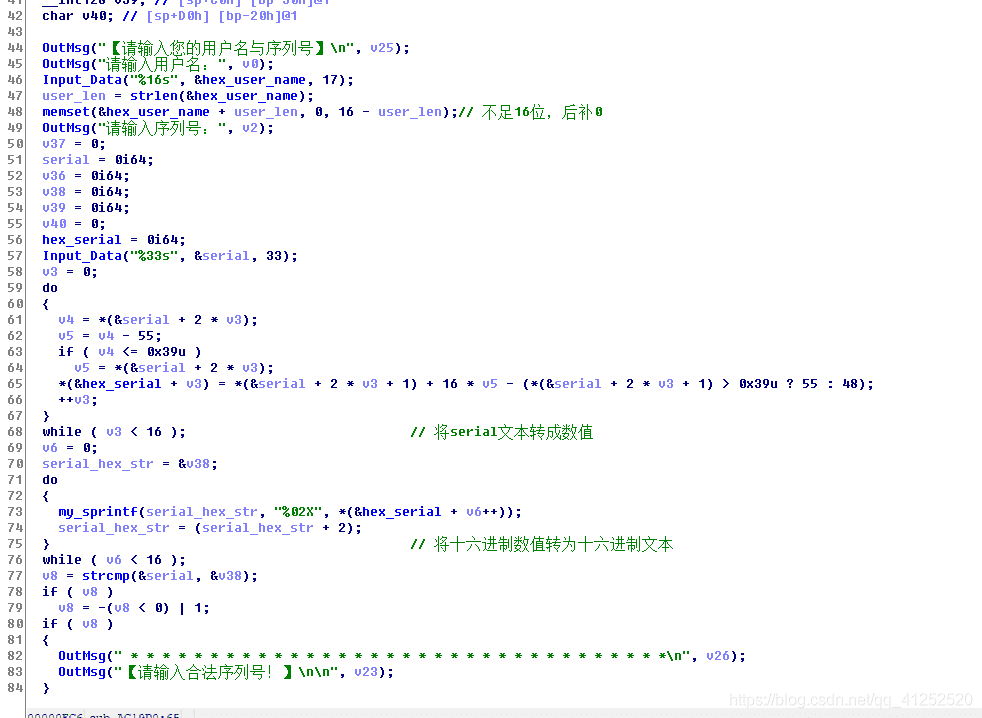
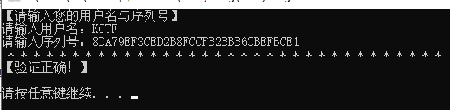

<!--yml
category: 未分类
date: 2022-04-26 14:48:31
-->

# KCTF2019 Q3 签到题WP_飞鸿踏雪（蓝屏选手）的博客-CSDN博客

> 来源：[https://blog.csdn.net/qq_41252520/article/details/101371671](https://blog.csdn.net/qq_41252520/article/details/101371671)

# 前言

*   从这一次开始制定了新规则后，本来就是菜鸡的我连签到题都跪了。┭┮﹏┭┮。赛后看到别人的题解才知道自己栽在了哪里。

# 分析



*   程序首先将输入的user_name转成十六进制，**不足十六位用0补齐**，然后将输入的serial转成相应的数值，与自身比较。这一步主要是为了校验serial是否是大写的十六进制数据。
*   然后将十六进制的serial与十六进制的uername **异或**，后面就是三次MD5。其实后面这三次MD5根本不用管，因为题目已经给出了一组正确的username和serial，要求username= **KCTF** 的serial。只要用之前正确的那组十六进制的serial与十六进制的uername异或的结果再与十六进制的username= **KCTF** 异或即要求的serial。
*   我TM都分析到这了，结果还算错了。错在了程序中将整形传递到xmm寄存器里进行异或时数据的对齐方的理解。
*   应该是在数据的后边用0补齐再异或。

# EXP

```
 user=int("5D78C3FDF21998AC".encode("hex"),16)
serial=0xF3A0FD8D8DE1FEB889808A8FF2D7FDA2
key=user^serial

'''
name=int("KCTF".encode("hex"),16)
print hex(key^name).upper()[2:][::-1]
'''

name=int("KCTF".encode("hex"),16)<<(12*8)
print hex(key^name).upper()[2:-1] 
```

