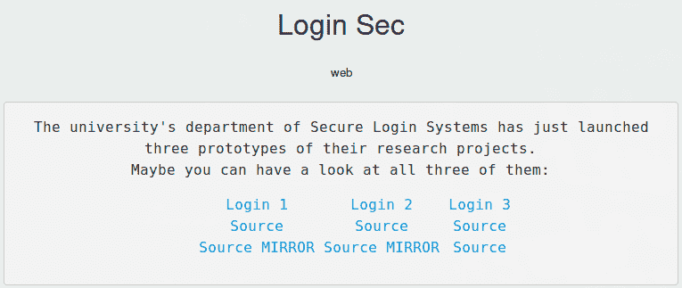
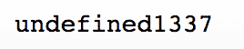
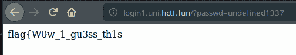
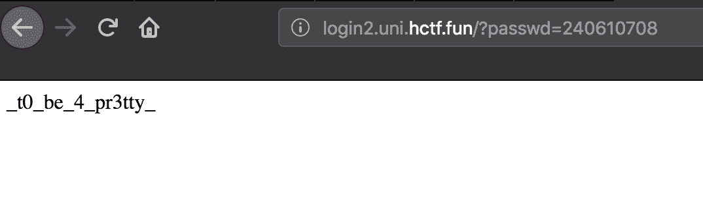
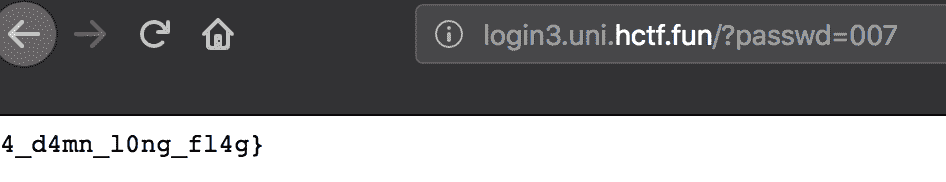

<!--yml
category: 未分类
date: 2022-04-26 14:46:25
-->

# P.W.N. CTF - Web - Login Sec_weixin_30778805的博客-CSDN博客

> 来源：[https://blog.csdn.net/weixin_30778805/article/details/95144764](https://blog.csdn.net/weixin_30778805/article/details/95144764)

# 题目

链接：https://ctftime.org/task/6934



# 题解

## Login 1

题目给出了源码

```
var http = require('http');
const crypto = require('crypto');
var url = require('url');
var fs = require('fs');

var _0x86d1=["\x68\x65\x78","\x72\x61\x6E\x64\x6F\x6D\x42\x79\x74\x65\x73"];

function generatePart1() {
    return
         {
             x: crypto[_0x86d1[1]](8)

         }[x].toString(_0x86d1[0]);
}
function generatePart2() {
    return [+!+[]]+[!+[]+!+[]+!+[]]+[!+[]+!+[]+!+[]]+[!+[]+!+[]+!+[]+!+[]+!+[]+!+[]+!+[]];
}

http.createServer(function (req, res) {
    res.writeHead(200, {'Content-Type': 'text/html'});
    passwd = generatePart1() + generatePart2();
    var url_content = url.parse(req.url, true);

    if (passwd == url_content.query.passwd) {
       res.write(fs.readFileSync('flag.txt', 'utf8'));
    } else {
        res.write('<html><body><form method="get"><input type="text" name="passwd" value="password"><input type="submit" value="login" /></form></body></html>');
    }
    res.end();
}).listen(8888);
```

如果自己电脑里没装nodejs，去找一个在线的nodejs编译器，如https://rextester.com/l/nodejs_online_compiler

把代码改成这个样子

```
var http = require('http');
const crypto = require('crypto');
var url = require('url');
var fs = require('fs');

var _0x86d1=["\x68\x65\x78","\x72\x61\x6E\x64\x6F\x6D\x42\x79\x74\x65\x73"];

function generatePart1() {
    return
         {
             x: crypto[_0x86d1[1]](8)

         }[x].toString(_0x86d1[0]);
}
function generatePart2() {
    return [+!+[]]+[!+[]+!+[]+!+[]]+[!+[]+!+[]+!+[]]+[!+[]+!+[]+!+[]+!+[]+!+[]+!+[]+!+[]];
}

console.log(generatePart1() + generatePart2());
```

跑出来的就是密码：


输入密码就能得到flag，比较简单的一个签到题：


## Login 2

同样给了源码

```
<?php
include("flag.php");
if (isset($_GET['passwd'])) {
        if (hash("md5", $_GET['passwd']) == '0e514198428367523082236389979035')        {
                echo $flag;
        } 
} else {
    echo '<html><body><form method="get"><input type="text" name="passwd" value="password"><input type="submit" value="login" /></form></body></html>';
} 
?>
```

这里比较你提交的password参数的hash值和代码中的hash值，比较用的是两个等号“==”，是php中的[宽松比较](http://www.php.net/manual/en/types.comparisons.php)。宽松比较的情况下，如果MD5值是以0e开头的，那比较的对象就会被看作是浮点数，0的n次方依旧是0，两个零当然是相等的。

从[这里](https://github.com/swisskyrepo/PayloadsAllTheThings/tree/master/PHP%20juggling%20type)找到一个能用的magic hash(240610708)，提交上去，比较就能通过


## Login 3

源码如下：

```
from flask import Flask, request, send_from_directory

app = Flask(__name__)

passwd = open("/opt/passwd.txt").read()
flag = open("/opt/flag.txt").read()

@app.route('/')
def index():
    userpw = request.args.get("passwd", "")
    if userpw == passwd:
        return flag, 200, {"Content-Type": "text/plain"}
    else:
        return '<html><body><form method="get"><input type="text" name="passwd" value="password"><input type="submit" value="login" /></form></body></html>'

if __name__ == '__main__':
    assert(len(passwd) == 3)
    assert(passwd.isdigit())
    app.run() 
```

可以看到密码长度是3,并且是纯数字，写个脚本或者用wfuzz之类的工具暴力跑一遍，Flag : flag{W0w_1_gu3ss_th1s_t0_be_4_pr3tty_4_d4mn_10ng_fl4g}

