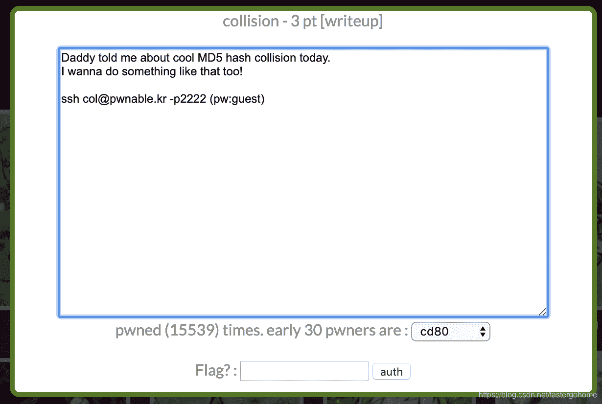

<!--yml
category: 未分类
date: 2022-04-26 14:32:16
-->

# PWN collision [pwnable.kr]CTF writeup题解系列2_3riC5r的博客-CSDN博客

> 来源：[https://blog.csdn.net/fastergohome/article/details/103793789](https://blog.csdn.net/fastergohome/article/details/103793789)

题目地址：[http://pwnable.kr/play.php](http://pwnable.kr/play.php)

先看看题目



 都是简单题目，我直接把过程贴出来

```
root@mypwn:/ctf/work/reverse# ssh col@pwnable.kr -p2222
col@pwnable.kr's password: 
 ____  __    __  ____    ____  ____   _        ___      __  _  ____  
|    \|  |__|  ||    \  /    ||    \ | |      /  _]    |  |/ ]|    \ 
|  o  )  |  |  ||  _  ||  o  ||  o  )| |     /  [_     |  ' / |  D  )
|   _/|  |  |  ||  |  ||     ||     || |___ |    _]    |    \ |    / 
|  |  |  `  '  ||  |  ||  _  ||  O  ||     ||   [_  __ |     \|    \ 
|  |   \      / |  |  ||  |  ||     ||     ||     ||  ||  .  ||  .  \
|__|    \_/\_/  |__|__||__|__||_____||_____||_____||__||__|\_||__|\_|

- Site admin : daehee87@gatech.edu
- IRC : irc.netgarage.org:6667 / #pwnable.kr
- Simply type "irssi" command to join IRC now
- files under /tmp can be erased anytime. make your directory under /tmp
- to use peda, issue `source /usr/share/peda/peda.py` in gdb terminal
Last login: Tue Dec 31 23:39:30 2019 from 125.238.93.17
col@prowl:~$ ls -la
total 36
drwxr-x---   5 root    col     4096 Oct 23  2016 .
drwxr-xr-x 116 root    root    4096 Nov 12 21:34 ..
d---------   2 root    root    4096 Jun 12  2014 .bash_history
-r-sr-x---   1 col_pwn col     7341 Jun 11  2014 col
-rw-r--r--   1 root    root     555 Jun 12  2014 col.c
-r--r-----   1 col_pwn col_pwn   52 Jun 11  2014 flag
dr-xr-xr-x   2 root    root    4096 Aug 20  2014 .irssi
drwxr-xr-x   2 root    root    4096 Oct 23  2016 .pwntools-cache
col@prowl:~$ exit
logout
Connection to pwnable.kr closed.
root@mypwn:/ctf/work/reverse# scp col@pwnable.kr:/home/col/col ./
ssh: connect to host pwnable.kr port 22: Connection refused
root@mypwn:/ctf/work/reverse# scp -P 2222 col@pwnable.kr:/home/col/col ./
col@pwnable.kr's password: 
col                                                                                    100% 7341    26.7KB/s   00:00    
root@mypwn:/ctf/work/reverse#
```

下载之后打开ida做反编译，代码如下：

```
int __cdecl main(int argc, const char **argv, const char **envp)
{
  int result; // eax

  if ( argc > 1 )
  {
    if ( strlen(argv[1]) == 20 )
    {
      if ( check_password((int)argv[1]) == hashcode )
        system("/bin/cat flag");
      else
        puts("wrong passcode.");
      result = 0;
    }
    else
    {
      puts("passcode length should be 20 bytes");
      result = 0;
    }
  }
  else
  {
    printf("usage : %s [passcode]\n", *argv);
    result = 0;
  }
  return result;
}

int __cdecl check_password(int *arr_dwPasscode)
{
  signed int i; // [esp+4h] [ebp-Ch]
  int v3; // [esp+8h] [ebp-8h]

  v3 = 0;
  for ( i = 0; i <= 4; ++i )
    v3 += arr_dwPasscode[i];
  return v3;
} 
```

还有一个关键变量定义

```
.data:0804A020                 public hashcode
.data:0804A020 hashcode        dd 21DD09ECh
```

然后就是要让下面这个判断成立

```
 if ( check_password((int)argv[1]) == hashcode )
        system("/bin/cat flag");
```

那就根据题目的意思写入5个32位的整数，因为不能有null（\x00），我就设置了4个p32(0x01010101)，这样就没有null了。

具体的python脚本如下：

```
#coding:utf8
#!/usr/bin/env python

from pwn import *

context.log_level = 'debug'
process_name = './col'
passcode = 0x21DD09EC
payload = p32(passcode-4*0x01010101) + p32(0x01010101)*4
p = process(argv=[process_name, payload], env={'LD_LIBRARY_PATH':'./'})
# p = process([process_name], env={'LD_LIBRARY_PATH':'./'})
# elf = ELF(process_name)

p.recv()
p.interactive() 
```

服务器上不能写文件，但是可以打开python，执行情况如下：

```
col@prowl:~$ python
Python 2.7.12 (default, Nov 12 2018, 14:36:49) 
[GCC 5.4.0 20160609] on linux2
Type "help", "copyright", "credits" or "license" for more information.
>>> #coding:utf8
... #!/usr/bin/env python
...  
... from pwn import *
>>>  
... context.log_level = 'debug'
>>> process_name = './col'
>>> passcode = 0x21DD09EC
>>> payload = p32(passcode-4*0x01010101) + p32(0x01010101)*4
>>> p = process(argv=[process_name, payload], env={'LD_LIBRARY_PATH':'./'})
[x] Starting local process './col' argv=['./col', '\xe8\x05\xd9\x1d\x01\x01\x01\x01\x01\x01\x01\x01\x01\x01\x01\x01\x01\x01\x01\x01']  env={'LD_LIBRARY_PATH': './'} 
[+] Starting local process './col' argv=['./col', '\xe8\x05\xd9\x1d\x01\x01\x01\x01\x01\x01\x01\x01\x01\x01\x01\x01\x01\x01\x01\x01']  env={'LD_LIBRARY_PATH': './'} : pid 319647
>>> # p = process([process_name], env={'LD_LIBRARY_PATH':'./'})
... # elf = ELF(process_name)
... 
>>> p.recv()
[DEBUG] Received 0x34 bytes:
    'daddy! I just managed to create a hash collision :)\n'
'daddy! I just managed to create a hash collision :)\n'
>>> p.interactive()
[*] Switching to interactive mode
[*] Process './col' stopped with exit code 0 (pid 319647)
[*] Got EOF while reading in interactive
[DEBUG] Sent 0x1 bytes:
    '\r' * 0x1
[*] Got EOF while sending in interactive 
```