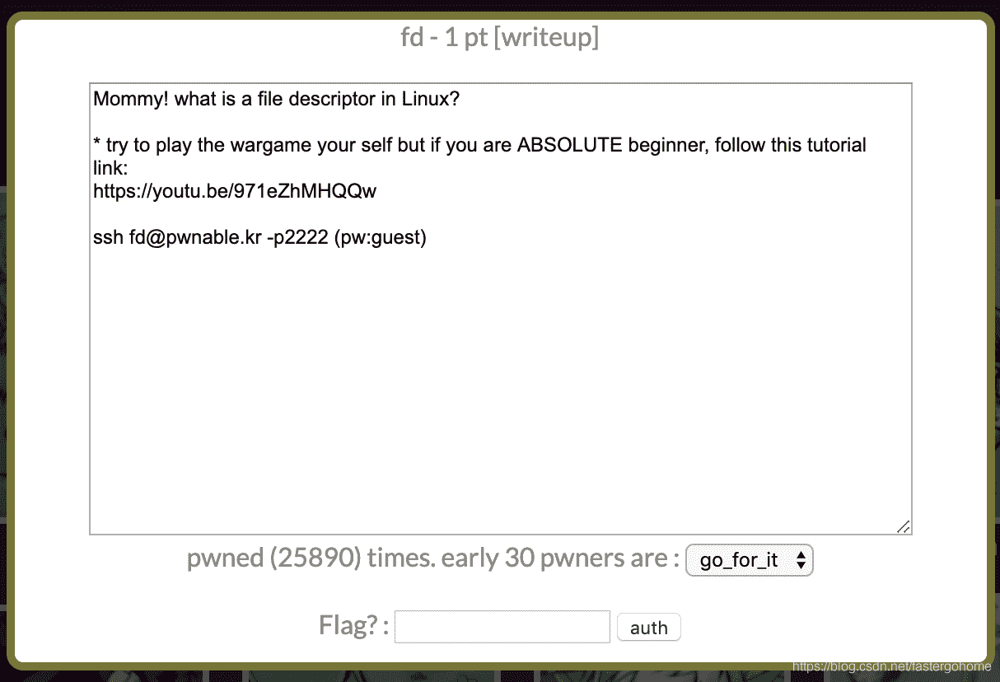

<!--yml
category: 未分类
date: 2022-04-26 14:30:06
-->

# PWN fd [pwnable.kr]CTF writeup题解系列1_3riC5r的博客-CSDN博客

> 来源：[https://blog.csdn.net/fastergohome/article/details/103793492](https://blog.csdn.net/fastergohome/article/details/103793492)

题目地址：[http://pwnable.kr/play.php](http://pwnable.kr/play.php)

题目地址页面，看看还是挺有意思的，还有一些图片。


看看题目：



题目比较简单，直接把解题过程列出来

```
root@mypwn:/ctf/work/reverse# ssh fd@pwnable.kr -p2222
The authenticity of host '[pwnable.kr]:2222 ([128.61.240.205]:2222)' can't be established.
ECDSA key fingerprint is SHA256:I9nWMZvctQv4Vypnh9ICs6aB2g20WV/EjTIYJ83P0K8.
Are you sure you want to continue connecting (yes/no)? yes
Warning: Permanently added '[pwnable.kr]:2222,[128.61.240.205]:2222' (ECDSA) to the list of known hosts.
fd@pwnable.kr's password: 
Permission denied, please try again.
fd@pwnable.kr's password: 
 ____  __    __  ____    ____  ____   _        ___      __  _  ____  
|    \|  |__|  ||    \  /    ||    \ | |      /  _]    |  |/ ]|    \ 
|  o  )  |  |  ||  _  ||  o  ||  o  )| |     /  [_     |  ' / |  D  )
|   _/|  |  |  ||  |  ||     ||     || |___ |    _]    |    \ |    / 
|  |  |  `  '  ||  |  ||  _  ||  O  ||     ||   [_  __ |     \|    \ 
|  |   \      / |  |  ||  |  ||     ||     ||     ||  ||  .  ||  .  \
|__|    \_/\_/  |__|__||__|__||_____||_____||_____||__||__|\_||__|\_|

- Site admin : daehee87@gatech.edu
- IRC : irc.netgarage.org:6667 / #pwnable.kr
- Simply type "irssi" command to join IRC now
- files under /tmp can be erased anytime. make your directory under /tmp
- to use peda, issue `source /usr/share/peda/peda.py` in gdb terminal
Last login: Tue Dec 31 23:55:37 2019 from 67.197.48.165
fd@prowl:~$ ls
fd  fd.c  flag
fd@prowl:~$ ls -la
total 40
drwxr-x---   5 root   fd   4096 Oct 26  2016 .
drwxr-xr-x 116 root   root 4096 Nov 12 21:34 ..
d---------   2 root   root 4096 Jun 12  2014 .bash_history
-r-sr-x---   1 fd_pwn fd   7322 Jun 11  2014 fd
-rw-r--r--   1 root   root  418 Jun 11  2014 fd.c
-r--r-----   1 fd_pwn root   50 Jun 11  2014 flag
-rw-------   1 root   root  128 Oct 26  2016 .gdb_history
dr-xr-xr-x   2 root   root 4096 Dec 19  2016 .irssi
drwxr-xr-x   2 root   root 4096 Oct 23  2016 .pwntools-cache
fd@prowl:~$ id
uid=1002(fd) gid=1002(fd) groups=1002(fd)
fd@prowl:~$ sudo -l
[sudo] password for fd: 
Sorry, user fd may not run sudo on prowl.lawn.gatech.edu.
fd@prowl:~$ pwd
/home/fd
fd@prowl:~$ ls -la
total 40
drwxr-x---   5 root   fd   4096 Oct 26  2016 .
drwxr-xr-x 116 root   root 4096 Nov 12 21:34 ..
d---------   2 root   root 4096 Jun 12  2014 .bash_history
-r-sr-x---   1 fd_pwn fd   7322 Jun 11  2014 fd
-rw-r--r--   1 root   root  418 Jun 11  2014 fd.c
-r--r-----   1 fd_pwn root   50 Jun 11  2014 flag
-rw-------   1 root   root  128 Oct 26  2016 .gdb_history
dr-xr-xr-x   2 root   root 4096 Dec 19  2016 .irssi
drwxr-xr-x   2 root   root 4096 Oct 23  2016 .pwntools-cache
fd@prowl:~$ cat fd.c 
#include <stdio.h>
#include <stdlib.h>
#include <string.h>
char buf[32];
int main(int argc, char* argv[], char* envp[]){
	if(argc<2){
		printf("pass argv[1] a number\n");
		return 0;
	}
	int fd = atoi( argv[1] ) - 0x1234;
	int len = 0;
	len = read(fd, buf, 32);
	if(!strcmp("LETMEWIN\n", buf)){
		printf("good job :)\n");
		system("/bin/cat flag");
		exit(0);
	}
	printf("learn about Linux file IO\n");
	return 0;

}

fd@prowl:~$ ls -la
total 40
drwxr-x---   5 root   fd   4096 Oct 26  2016 .
drwxr-xr-x 116 root   root 4096 Nov 12 21:34 ..
d---------   2 root   root 4096 Jun 12  2014 .bash_history
-r-sr-x---   1 fd_pwn fd   7322 Jun 11  2014 fd
-rw-r--r--   1 root   root  418 Jun 11  2014 fd.c
-r--r-----   1 fd_pwn root   50 Jun 11  2014 flag
-rw-------   1 root   root  128 Oct 26  2016 .gdb_history
dr-xr-xr-x   2 root   root 4096 Dec 19  2016 .irssi
drwxr-xr-x   2 root   root 4096 Oct 23  2016 .pwntools-cache
fd@prowl:~$ ./fd
pass argv[1] a number
fd@prowl:~$ ./fd 4660
LETMEWIN
good job :)
mommy! I think I know what a file descriptor is!!
fd@prowl:~$ Connection to pwnable.kr closed by remote host.
Connection to pwnable.kr closed.
root@mypwn:/ctf/work/reverse# 
```

本题考试点就是需要知道read的第一个参数，如果从command line中输入数据需要设置为0.