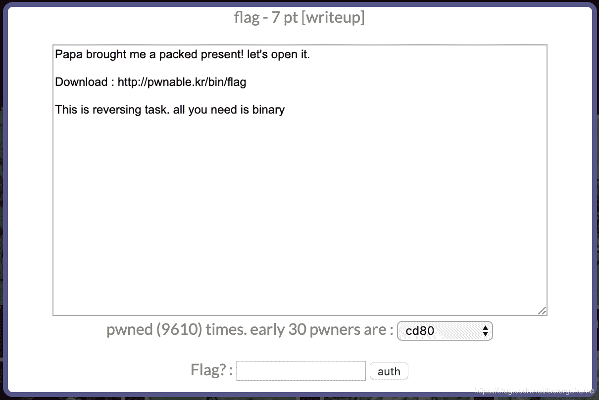
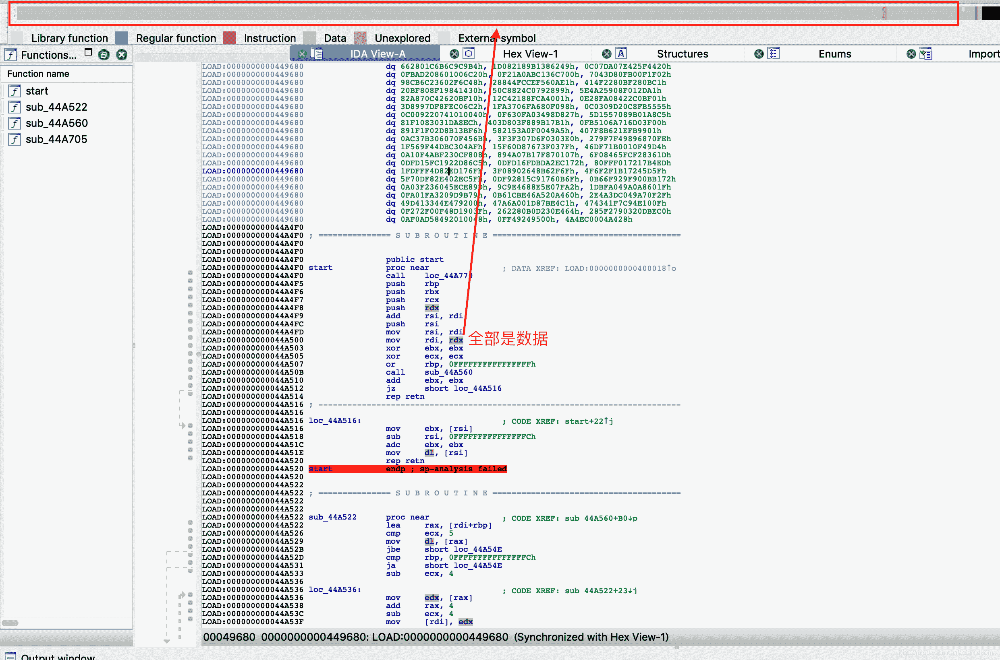
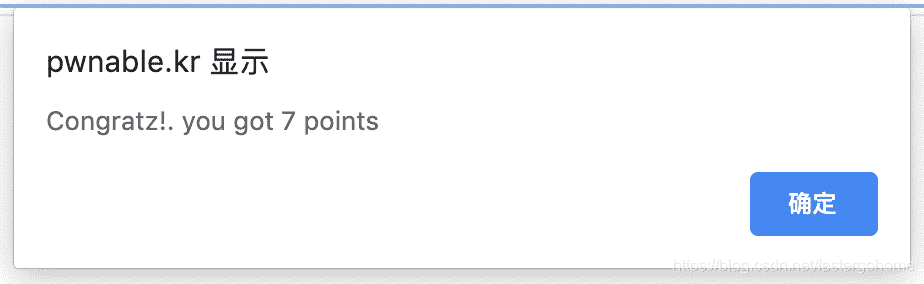

<!--yml
category: 未分类
date: 2022-04-26 14:21:23
-->

# PWN flag [pwnable.kr]CTF writeup题解系列4_3riC5r的博客-CSDN博客

> 来源：[https://blog.csdn.net/fastergohome/article/details/103794451](https://blog.csdn.net/fastergohome/article/details/103794451)

直接看题目




这是一道逆向题目，直接下载下来看看

```
root@mypwn:/ctf/work/pwnable.kr# wget http://pwnable.kr/bin/flag
--2020-01-01 09:37:31--  http://pwnable.kr/bin/flag
Resolving pwnable.kr (pwnable.kr)... 128.61.240.205
Connecting to pwnable.kr (pwnable.kr)|128.61.240.205|:80... connected.
HTTP request sent, awaiting response... 200 OK
Length: 335288 (327K)
Saving to: ‘flag’

flag                           100%[=================================================>] 327.43K   162KB/s    in 2.0s    

2020-01-01 09:37:34 (162 KB/s) - ‘flag’ saved [335288/335288]

root@mypwn:/ctf/work/pwnable.kr# 
```

用ida看看情况



看到全部都是数据，估计就是加壳了。

这种初级的题目加壳，基本都是upx壳，不可能让新手去手动脱壳的，哈哈！

安装一下upx工具

```
root@mypwn:/ctf/work/pwnable.kr# upx -d
bash: upx: command not found
root@mypwn:/ctf/work/pwnable.kr# apt install upx
Reading package lists... Done
Building dependency tree       
Reading state information... Done
Note, selecting 'upx-ucl' instead of 'upx'
The following additional packages will be installed:
  libucl1
The following NEW packages will be installed:
  libucl1 upx-ucl
0 upgraded, 2 newly installed, 0 to remove and 12 not upgraded.
Need to get 401 kB of archives.
After this operation, 2,083 kB of additional disk space will be used.
Do you want to continue? [Y/n] Y
Get:1 https://mirrors.tuna.tsinghua.edu.cn/ubuntu bionic/universe amd64 libucl1 amd64 1.03+repack-4 [23.9 kB]
Get:2 https://mirrors.tuna.tsinghua.edu.cn/ubuntu bionic/universe amd64 upx-ucl amd64 3.94-4 [377 kB]                   
Fetched 401 kB in 9s (44.8 kB/s)                                                                                        
Selecting previously unselected package libucl1:amd64.
(Reading database ... 45161 files and directories currently installed.)
Preparing to unpack .../libucl1_1.03+repack-4_amd64.deb ...
Unpacking libucl1:amd64 (1.03+repack-4) ...
Selecting previously unselected package upx-ucl.
Preparing to unpack .../upx-ucl_3.94-4_amd64.deb ...
Unpacking upx-ucl (3.94-4) ...
Setting up libucl1:amd64 (1.03+repack-4) ...
Processing triggers for libc-bin (2.27-3ubuntu1) ...
Setting up upx-ucl (3.94-4) ...
update-alternatives: error: no alternatives for upx
update-alternatives: using /usr/bin/upx-ucl to provide /usr/bin/upx (upx) in auto mode
update-alternatives: warning: skip creation of /usr/share/man/man1/upx.1.gz because associated file /usr/share/man/man1/upx-ucl.1.gz (of link group upx) doesn't exist
root@mypwn:/ctf/work/pwnable.kr# apt install upx
Reading package lists... Done
Building dependency tree       
Reading state information... Done
Note, selecting 'upx-ucl' instead of 'upx'
upx-ucl is already the newest version (3.94-4).
0 upgraded, 0 newly installed, 0 to remove and 12 not upgraded.
root@mypwn:/ctf/work/pwnable.kr# upx
                       Ultimate Packer for eXecutables
                          Copyright (C) 1996 - 2017
UPX 3.94        Markus Oberhumer, Laszlo Molnar & John Reiser   May 12th 2017

Usage: upx [-123456789dlthVL] [-qvfk] [-o file] file..

Commands:
  -1     compress faster                   -9    compress better
  -d     decompress                        -l    list compressed file
  -t     test compressed file              -V    display version number
  -h     give more help                    -L    display software license
Options:
  -q     be quiet                          -v    be verbose
  -oFILE write output to 'FILE'
  -f     force compression of suspicious files
  -k     keep backup files
file..   executables to (de)compress

Type 'upx --help' for more detailed help.

UPX comes with ABSOLUTELY NO WARRANTY; for details visit https://upx.github.io
root@mypwn:/ctf/work/pwnable.kr# upx -d flag
                       Ultimate Packer for eXecutables
                          Copyright (C) 1996 - 2017
UPX 3.94        Markus Oberhumer, Laszlo Molnar & John Reiser   May 12th 2017

        File size         Ratio      Format      Name
   --------------------   ------   -----------   -----------
    883745 <-    335288   37.94%   linux/amd64   flag

Unpacked 1 file.
root@mypwn:/ctf/work/pwnable.kr#
```

直接执行upx -d脱壳完成，没问题了，再来ida分析一下

下面是分析之后的代码，超简单!

```
int __cdecl main(int argc, const char **argv, const char **envp)
{
  char *dest; // ST08_8

  puts("I will malloc() and strcpy the flag there. take it.", argv, envp);
  dest = (char *)malloc(100LL);
  strcpy(dest, flag);
  return 0;
}
```

在flag的位置找到：


上传flag

