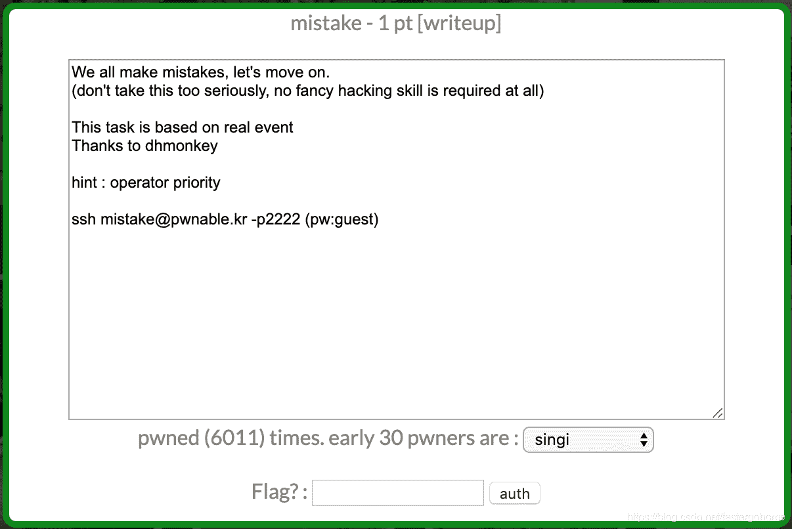

<!--yml
category: 未分类
date: 2022-04-26 14:19:48
-->

# PWN mistake [pwnable.kr]CTF writeup题解系列8_3riC5r的博客-CSDN博客

> 来源：[https://blog.csdn.net/fastergohome/article/details/103797893](https://blog.csdn.net/fastergohome/article/details/103797893)

**目录**

[0x01 题目](#0x01%20%E9%A2%98%E7%9B%AE)

[0x02 解题思路](#0x02%20%E8%A7%A3%E9%A2%98%E6%80%9D%E8%B7%AF)

[0x03 题解](#0x03%20%E9%A2%98%E8%A7%A3)

* * *

# 0x01 题目




# 0x02 解题思路

这个题目比较简单，我就直接贴出来下载和检查过程

```
root@mypwn:/ctf/work/pwnable.kr# ssh mistake@pwnable.kr -p2222
mistake@pwnable.kr's password: 
 ____  __    __  ____    ____  ____   _        ___      __  _  ____  
|    \|  |__|  ||    \  /    ||    \ | |      /  _]    |  |/ ]|    \ 
|  o  )  |  |  ||  _  ||  o  ||  o  )| |     /  [_     |  ' / |  D  )
|   _/|  |  |  ||  |  ||     ||     || |___ |    _]    |    \ |    / 
|  |  |  `  '  ||  |  ||  _  ||  O  ||     ||   [_  __ |     \|    \ 
|  |   \      / |  |  ||  |  ||     ||     ||     ||  ||  .  ||  .  \
|__|    \_/\_/  |__|__||__|__||_____||_____||_____||__||__|\_||__|\_|

- Site admin : daehee87@gatech.edu
- IRC : irc.netgarage.org:6667 / #pwnable.kr
- Simply type "irssi" command to join IRC now
- files under /tmp can be erased anytime. make your directory under /tmp
- to use peda, issue `source /usr/share/peda/peda.py` in gdb terminal
Last login: Wed Jan  1 09:55:46 2020 from 182.96.176.177
mistake@prowl:~$ ls -la
total 44
drwxr-x---   5 root        mistake 4096 Oct 23  2016 .
drwxr-xr-x 116 root        root    4096 Nov 12 21:34 ..
d---------   2 root        root    4096 Jul 29  2014 .bash_history
-r--------   1 mistake_pwn root      51 Jul 29  2014 flag
dr-xr-xr-x   2 root        root    4096 Aug 20  2014 .irssi
-r-sr-x---   1 mistake_pwn mistake 8934 Aug  1  2014 mistake
-rw-r--r--   1 root        root     792 Aug  1  2014 mistake.c
-r--------   1 mistake_pwn root      10 Jul 29  2014 password
drwxr-xr-x   2 root        root    4096 Oct 23  2016 .pwntools-cache
mistake@prowl:~$ exit
logout
Connection to pwnable.kr closed.
root@mypwn:/ctf/work/pwnable.kr# scp -P 2222 mistake@pwnable.kr:/home/mistake/mistake ./
mistake@pwnable.kr's password: 
mistake                                                                                100% 8934    32.5KB/s   00:00    
root@mypwn:/ctf/work/pwnable.kr# scp -P 2222 mistake@pwnable.kr:/home/mistake/mistake.c ./
mistake@pwnable.kr's password: 
mistake.c                                                                              100%  792     2.5KB/s   00:00    
root@mypwn:/ctf/work/pwnable.kr# checksec mistake
[*] '/ctf/work/pwnable.kr/mistake'
    Arch:     amd64-64-little
    RELRO:    Partial RELRO
    Stack:    Canary found
    NX:       NX enabled
    PIE:      No PIE (0x400000)
root@mypwn:/ctf/work/pwnable.kr# ./mistake 
can't open password 1
root@mypwn:/ctf/work/pwnable.kr# echo "test" > password
root@mypwn:/ctf/work/pwnable.kr# ./mistake 
can't open password 1
root@mypwn:/ctf/work/pwnable.kr# mkdir -p /home/mistake
root@mypwn:/ctf/work/pwnable.kr# mv password /home/mistake/
root@mypwn:/ctf/work/pwnable.kr# ./mistake 
do not bruteforce...
aaaaaaaaaaaaaaa
input password : Wrong Password
```

看下提供的c代码：

```
#include <stdio.h>
#include <fcntl.h>

#define PW_LEN 10
#define XORKEY 1

void xor(char* s, int len){
	int i;
	for(i=0; i<len; i++){
		s[i] ^= XORKEY;
	}
}

int main(int argc, char* argv[]){

	int fd;
	if(fd=open("/home/mistake/password",O_RDONLY,0400) < 0){
		printf("can't open password %d\n", fd);
		return 0;
	}

	printf("do not bruteforce...\n");
	sleep(time(0)%20);

	char pw_buf[PW_LEN+1];
	int len;
	if(!(len=read(fd,pw_buf,PW_LEN) > 0)){
		printf("read error\n");
		close(fd);
		return 0;		
	}

	char pw_buf2[PW_LEN+1];
	printf("input password : ");
	scanf("%10s", pw_buf2);

	// xor your input
	xor(pw_buf2, 10);

	if(!strncmp(pw_buf, pw_buf2, PW_LEN)){
		printf("Password OK\n");
		system("/bin/cat flag\n");
	}
	else{
		printf("Wrong Password\n");
	}

	close(fd);
	return 0;
} 
```

我下载了执行程序，用ida反编译了一下

```
int __cdecl main(int argc, const char **argv, const char **envp)
{
  int v3; // eax
  int result; // eax
  int v5; // eax
  char buf; // [rsp+20h] [rbp-30h]
  char s2; // [rsp+30h] [rbp-20h]
  unsigned __int64 v8; // [rsp+48h] [rbp-8h]

  v8 = __readfsqword(0x28u);
  v3 = open("/home/mistake/password", 0, 256LL, argv);
  if ( v3 >= 0 )
  {
    puts("do not bruteforce...");
    v5 = time(0LL);
    sleep(v5 % 20);
    if ( (signed int)read(0, &buf, 0xAuLL) > 0 )
    {
      printf("input password : ", &buf);
      __isoc99_scanf("%10s", &s2);
      xor(&s2, 10LL);
      if ( !strncmp(&buf, &s2, 0xAuLL) )
      {
        puts("Password OK");
        system("/bin/cat flag\n");
      }
      else
      {
        puts("Wrong Password");
      }
      close(0);
      result = 0;
    }
    else
    {
      puts("read error");
      close(0);
      result = 0;
    }
  }
  else
  {
    printf("can't open password %d\n", (unsigned int)v3 >> 31);
    result = 0;
  }
  return result;
}
```

 好像不太一样，拿gdb跟踪了一下程序，比较的位置就是我们输入的两个字符串，其中一个做了xor操作


# 0x03 题解

题解非常简单：

```
root@mypwn:/ctf/work/pwnable.kr# ssh mistake@pwnable.kr -p2222
mistake@pwnable.kr's password: 
 ____  __    __  ____    ____  ____   _        ___      __  _  ____  
|    \|  |__|  ||    \  /    ||    \ | |      /  _]    |  |/ ]|    \ 
|  o  )  |  |  ||  _  ||  o  ||  o  )| |     /  [_     |  ' / |  D  )
|   _/|  |  |  ||  |  ||     ||     || |___ |    _]    |    \ |    / 
|  |  |  `  '  ||  |  ||  _  ||  O  ||     ||   [_  __ |     \|    \ 
|  |   \      / |  |  ||  |  ||     ||     ||     ||  ||  .  ||  .  \
|__|    \_/\_/  |__|__||__|__||_____||_____||_____||__||__|\_||__|\_|

- Site admin : daehee87@gatech.edu
- IRC : irc.netgarage.org:6667 / #pwnable.kr
- Simply type "irssi" command to join IRC now
- files under /tmp can be erased anytime. make your directory under /tmp
- to use peda, issue `source /usr/share/peda/peda.py` in gdb terminal
Last login: Wed Jan  1 11:43:35 2020 from 120.84.12.64
mistake@prowl:~$ ./mistake 
do not bruteforce...
CCCCCCCCCC
input password : BBBBBBBBBB
Password OK
Mommy, the operator priority always confuses me :(
mistake@prowl:~$ Connection to pwnable.kr closed by remote host.
Connection to pwnable.kr closed.
root@mypwn:/ctf/work/pwnable.kr# 
```