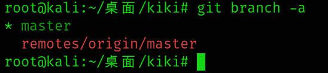
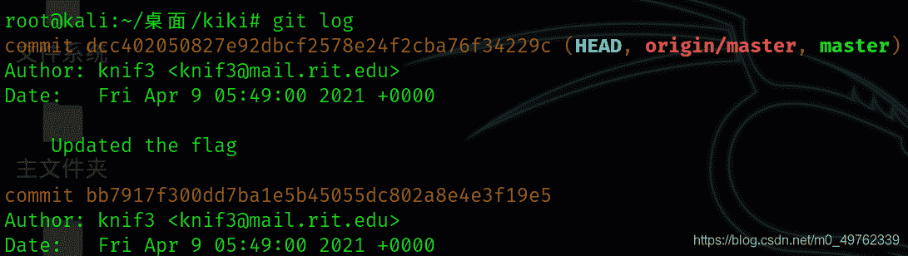
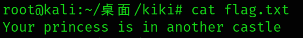
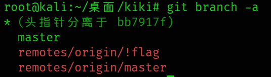
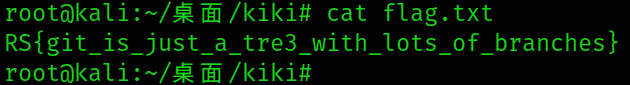
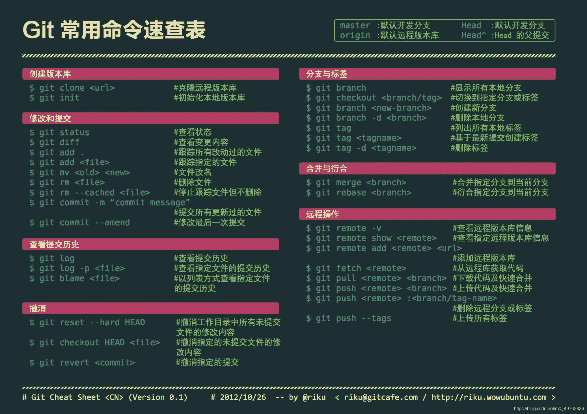

<!--yml
category: 未分类
date: 2022-04-26 14:40:14
-->

# RITSEC CTF2021 Forensics1597题解记录_k_i_k_i的博客-CSDN博客

> 来源：[https://blog.csdn.net/m0_49762339/article/details/115675307](https://blog.csdn.net/m0_49762339/article/details/115675307)

**题目地址：**[http://git.ritsec.club:7000/1597.git/](http://git.ritsec.club:7000/1597.git/)

这是一道与git版本管理有关的题目

## 解题过程：

**一、很明显第一步将远程仓库克隆到本地**
`git clone http://git.ritsec.club:7000/1597.git/`

其中一共有两个文件打开后发现flag.txt为空文件，README.md文件显示：

```
# 1597
A git challenge series? Sounds fun. 
```

没有用!!!
**二、推测（看大佬WP）查看版本记录。**
1.`mkdir kiki;cd kiki`创建一个目录用于建立本地git仓库
2.`git init`初始化仓库
3.`git romote add origin http://git.ritsec.club:7000/1597.git/`连接远程仓库
4.`git pull origin master`拉去最新分支
5.这时查看当前分支下的flag.txt不出意外仍然是空
6.`git branch -a`查看所有分支，之后切换到另外一个分支发现还是空的这时便验证了应该是版本更新后将其删了。

4.`git log`查看历史记录

5\. `git checkout bb7917f300dd7ba1e5b45055dc802a8e4e3f19e5`切换为历史版本
6.再次查看`flag.txt`提示你在另一个分支里

7\. `git fetch`将本地版本与远程仓库保持一致这时出现了新的分支

8.`git checkout remotes/origin/\!flag`切换至!flag分支（PS:这里!需要转义）

9.成功！


## 附：Git常用命令表

