<!--yml
category: 未分类
date: 2022-04-26 14:36:28
-->

# RSA密码的学习以及几种常见CTF题型的总结(收集RSA解题脚本)_m0re的博客-CSDN博客_rsa脚本

> 来源：[https://blog.csdn.net/qq_45836474/article/details/105279838](https://blog.csdn.net/qq_45836474/article/details/105279838)

# 放在最前面

大师傅博客
[从数盲到口算 ——带你玩转RSA加密算法（一）](https://www.freebuf.com/column/148185.html)
[你想要的RSA解题技巧（二）](https://www.freebuf.com/column/148898.html)
前言：gmpy2库终于安装好了，那就能开心的玩耍了。
一个平台一个平台的“扫荡”
RSA这类题真是每次看见都着急，学脚本吧？但是又没有gmpy2。无奈，现在终于有了，我要把之前每写出来的题扫一遍。
关于RSA的这个密码。数学逻辑比较……那啥一点，跟着B站上的一个up主学的，讲的挺好，听着听着睡着了。让我找到了高中的感觉。跑题了，，咳咳。当然还有师傅们的博客提供学习帮助。

# RSA密码原理

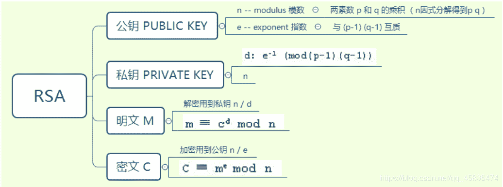
数学知识：
首先：取模运算知识，就是取余数。可以使用python的pow函数来解
pow的解法如下：

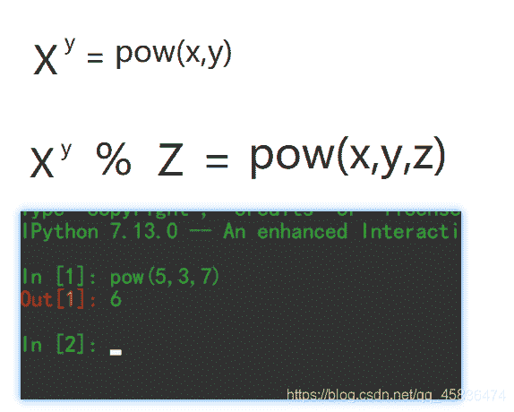
其次：同余运算。两个整数a,b，它们除以整数M所得的余数相等：a ≡ b(mod m)，比如说5除3余数为2，11除3余数也为2，于是可写成11 ≡ 5(mod 3)。
RSA加密算法：
一个原理图，从漏斗社区借鉴的
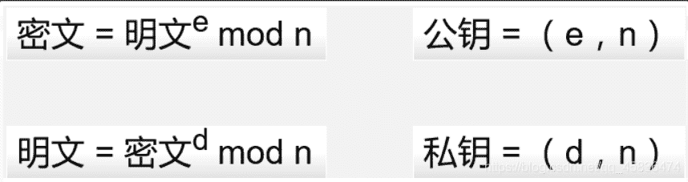
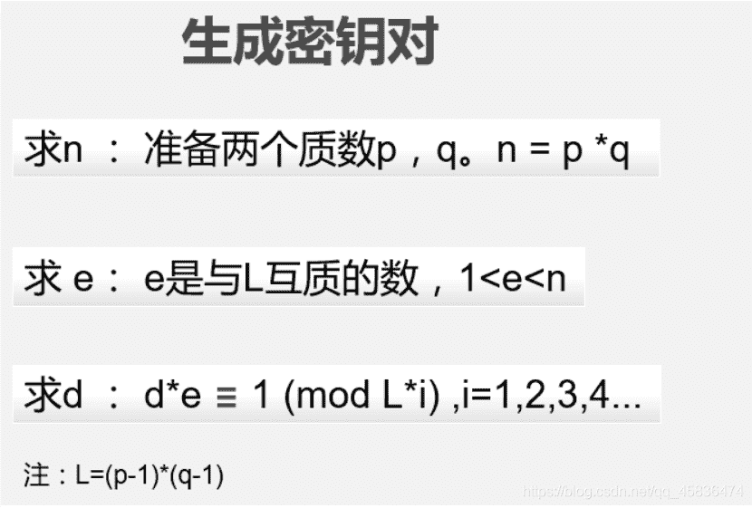
这两张图对于理解rsa加密很有帮助，我从这两张图中理解后思路变的更清晰了。
还有一张解析CTF中的rsa基础题型的图。声明：是漏斗社区的师傅写的，我只是搬过来做个笔记，方便以后查询使用。
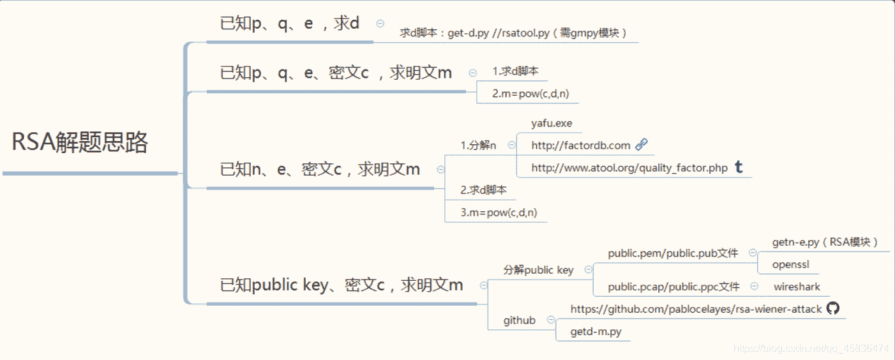
做几个类型的题目记录一下，防止以后忘记方便复习。

# BUUCTF

## RSA

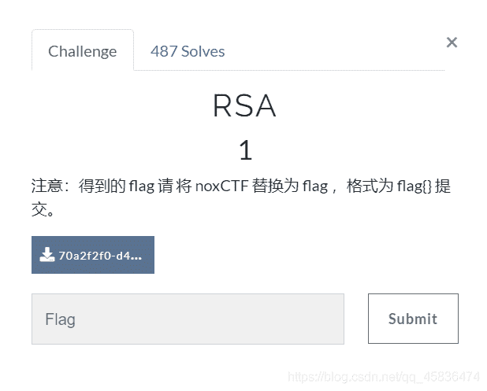
这道题是一种类型，已知p,q,e，求d
可以用求d的脚本直接解出，运行脚本需要用到gmpy2第三方库。
直接上脚本

```
 import gmpy2
from Crypto.Util import number
p = 473398607161
q = 4511491
e = 17
d = gmpy2.invert(e,(p-1)*(q-1))
print (d) 
```

flag{125631357777427553}

## rsarsa

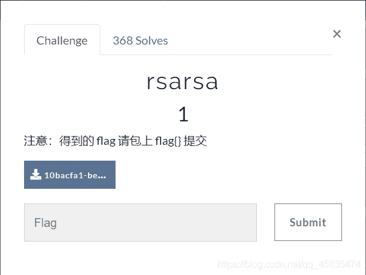
脚本关。

```
import gmpy2
def Decrypt(c,e,p,q):
	L=(p-1)*(q-1)
	d=gmpy2.invert(e,L)
	n=p*q
	m=gmpy2.powmod(c,d,n)
	flag=str(m)
	print("flag{"+flag+"}")
if __name__ == '__main__':
	p =  9648423029010515676590551740010426534945737639235739800643989352039852507298491399561035009163427050370107570733633350911691280297777160200625281665378483
	q =  11874843837980297032092405848653656852760910154543380907650040190704283358909208578251063047732443992230647903887510065547947313543299303261986053486569407
	e =  65537
	c =  83208298995174604174773590298203639360540024871256126892889661345742403314929861939100492666605647316646576486526217457006376842280869728581726746401583705899941768214138742259689334840735633553053887641847651173776251820293087212885670180367406807406765923638973161375817392737747832762751690104423869019034
	Decrypt(c,e,p,q) 
```

注释：
`__name__=='__main__'`一个python文件通常有两种使用方法，
第一是作为脚本直接执行，
第二是 import 到其他的 python 脚本中被调用（模块重用）执行。因此 `if __name__ == 'main':` 的作用就是控制这两种情况执行代码的过程，在 `if __name__ == 'main':` 下的代码只有在第一种情况下（即文件作为脚本直接执行）才会被执行，而 import 到其他脚本中是不会被执行的，忘了就再看看大佬的博客[大佬博客](https://blog.csdn.net/heqiang525/article/details/89879056)
flag其他没什么了。flag直接得到。

## RSA1


其实通过这道题我学到很多，一点一点看

```
dp=d%(p-1)
dq=d%(q-1) 
```

这个脚本不会写，我只会写那种异常的简单的小脚本，这种不会写。本人脸皮厚当个script boy。😪😪

```
import gmpy2
import libnum
def decrypt(dp,dq,p,q,c):
    InvQ = gmpy2.invert(q, p)
    mp = pow(c, dp, p)
    mq = pow(c, dq, q)
    m = (((mp-mq)*InvQ) % p)*q+mq
    print (libnum.n2s(m))

p = 8637633767257008567099653486541091171320491509433615447539162437911244175885667806398411790524083553445158113502227745206205327690939504032994699902053229 
q = 12640674973996472769176047937170883420927050821480010581593137135372473880595613737337630629752577346147039284030082593490776630572584959954205336880228469 
dp = 6500795702216834621109042351193261530650043841056252930930949663358625016881832840728066026150264693076109354874099841380454881716097778307268116910582929 
dq = 783472263673553449019532580386470672380574033551303889137911760438881683674556098098256795673512201963002175438762767516968043599582527539160811120550041 
c = 24722305403887382073567316467649080662631552905960229399079107995602154418176056335800638887527614164073530437657085079676157350205351945222989351316076486573599576041978339872265925062764318536089007310270278526159678937431903862892400747915525118983959970607934142974736675784325993445942031372107342103852
decrypt(dp,dq,p,q,c) 
```

结果得到：
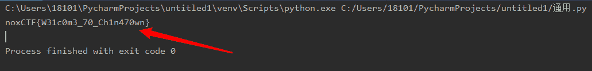

## RSA2

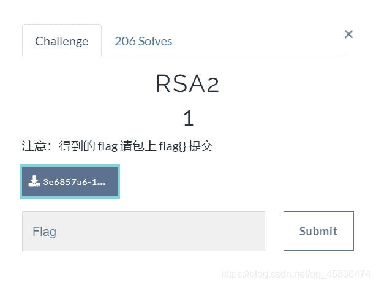
知道dp，n，e;求明文m.，我还是不会写脚本，现在才发现我这篇博客就是用来收集脚本的。

```
import gmpy2 as gp

e = 65537
n = gp.mpz(248254007851526241177721526698901802985832766176221609612258877371620580060433101538328030305219918697643619814200930679612109885533801335348445023751670478437073055544724280684733298051599167660303645183146161497485358633681492129668802402065797789905550489547645118787266601929429724133167768465309665906113)
dp = gp.mpz(905074498052346904643025132879518330691925174573054004621877253318682675055421970943552016695528560364834446303196939207056642927148093290374440210503657)

c = gp.mpz(140423670976252696807533673586209400575664282100684119784203527124521188996403826597436883766041879067494280957410201958935737360380801845453829293997433414188838725751796261702622028587211560353362847191060306578510511380965162133472698713063592621028959167072781482562673683090590521214218071160287665180751)

for x in range(1, e):
    if(e*dp%x==1):
        p=(e*dp-1)//x+1
        if(n%p!=0):
            continue
        q=n//p
        phin=(p-1)*(q-1)
        d=gp.invert(e, phin)
        m=gp.powmod(c, d, n)
        if(len(hex(m)[2:])%2==1):
            continue
        print('--------------')
        print(m)
        print(hex(m)[2:])
        print(bytes.fromhex(hex(m)[2:])) 
```

结果：
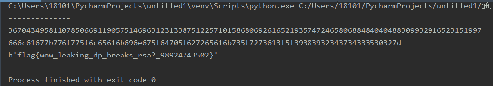

## RSA3

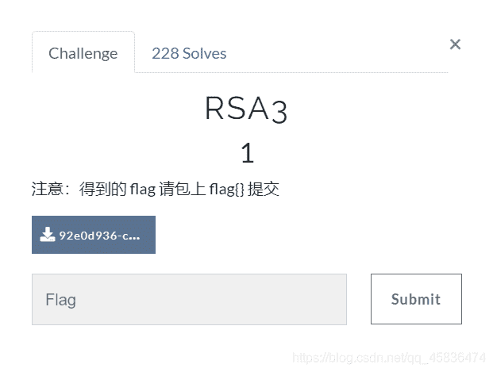
已知c1、c2、e1、e1、n 的情况

```
from gmpy2 import *
import libnum

n=22708078815885011462462049064339185898712439277226831073457888403129378547350292420267016551819052430779004755846649044001024141485283286483130702616057274698473611149508798869706347501931583117632710700787228016480127677393649929530416598686027354216422565934459015161927613607902831542857977859612596282353679327773303727004407262197231586324599181983572622404590354084541788062262164510140605868122410388090174420147752408554129789760902300898046273909007852818474030770699647647363015102118956737673941354217692696044969695308506436573142565573487583507037356944848039864382339216266670673567488871508925311154801
e1=11187289
e2=9647291
s = gcdext(e1, e2)
s1 = s[1]
s2 = -s[2]

c1=22322035275663237041646893770451933509324701913484303338076210603542612758956262869640822486470121149424485571361007421293675516338822195280313794991136048140918842471219840263536338886250492682739436410013436651161720725855484866690084788721349555662019879081501113222996123305533009325964377798892703161521852805956811219563883312896330156298621674684353919547558127920925706842808914762199011054955816534977675267395009575347820387073483928425066536361482774892370969520740304287456555508933372782327506569010772537497541764311429052216291198932092617792645253901478910801592878203564861118912045464959832566051361
c2=18702010045187015556548691642394982835669262147230212731309938675226458555210425972429418449273410535387985931036711854265623905066805665751803269106880746769003478900791099590239513925449748814075904017471585572848473556490565450062664706449128415834787961947266259789785962922238701134079720414228414066193071495304612341052987455615930023536823801499269773357186087452747500840640419365011554421183037505653461286732740983702740822671148045619497667184586123657285604061875653909567822328914065337797733444640351518775487649819978262363617265797982843179630888729407238496650987720428708217115257989007867331698397
e2=9647291
c2 = invert(c2, n)
m = (pow(c1,s1,n) * pow(c2 , s2 , n)) % n
print (m)
print (libnum.n2s(m)) 
```

结果：
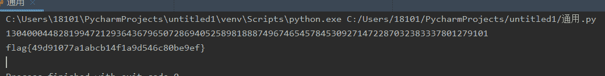

## RSA

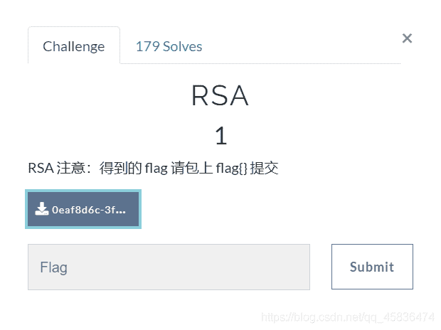
打开压缩包，是两个文件
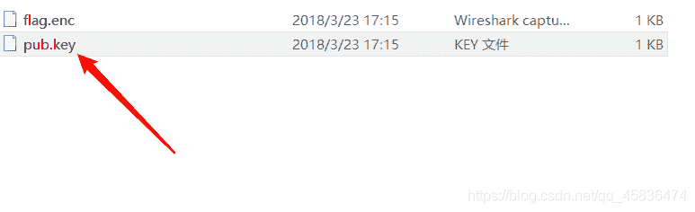
打开这个文件(txt打开或者notepad++)
发现了公钥
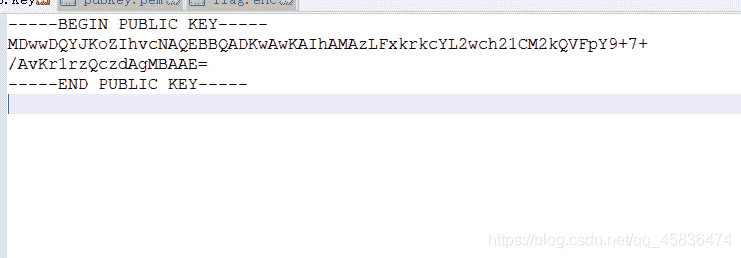
在线解析公钥的网站直接解析出我们需要的信息[在线解析公钥](https://www.ssleye.com/pub_asysi.html)
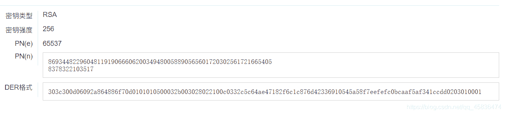
得到n和e
分解n得到p和q ,可以使用yafu因数分解大数
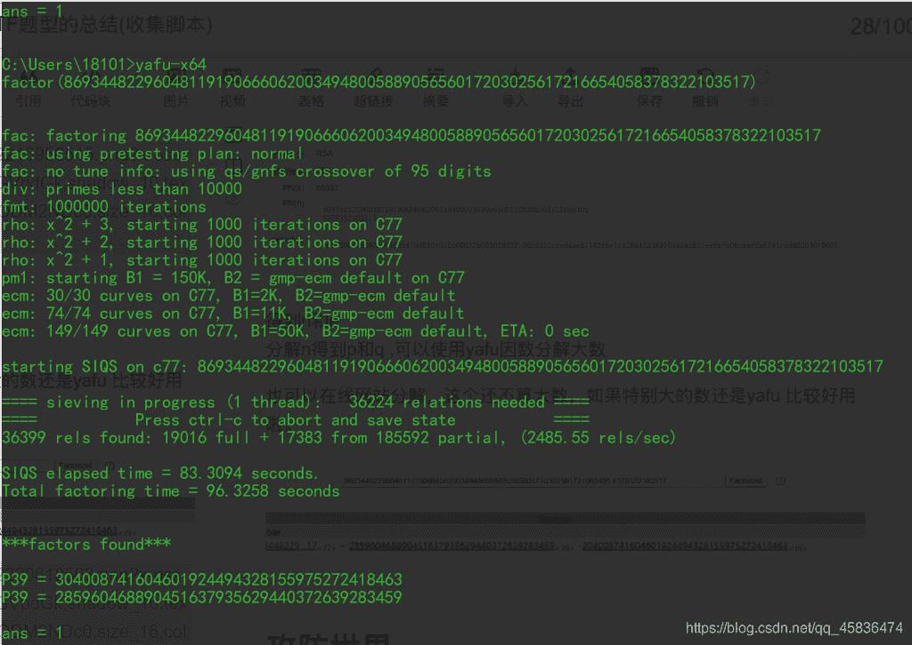
也可以在线网站分解，这个还不算大数，如果特别大的数还是yafu 比较好用啦。
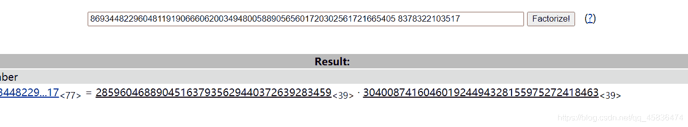
最后都能得出结果来
脚本：

```
import gmpy2
import rsa

p = 285960468890451637935629440372639283459
q = 304008741604601924494328155975272418463
e = 65537
n = 86934482296048119190666062003494800588905656017203025617216654058378322103517

d = gmpy2.invert(e,(q-1)*(p-1))
print(d)

d = 81176168860169991027846870170527607562179635470395365333547868786951080991441

key = rsa.PrivateKey(n,e,d,p,q)
print(key)

with open("flag.enc","rb") as f:
	print(rsa.decrypt(f.read(),key).decode()) 
```

运行结果：
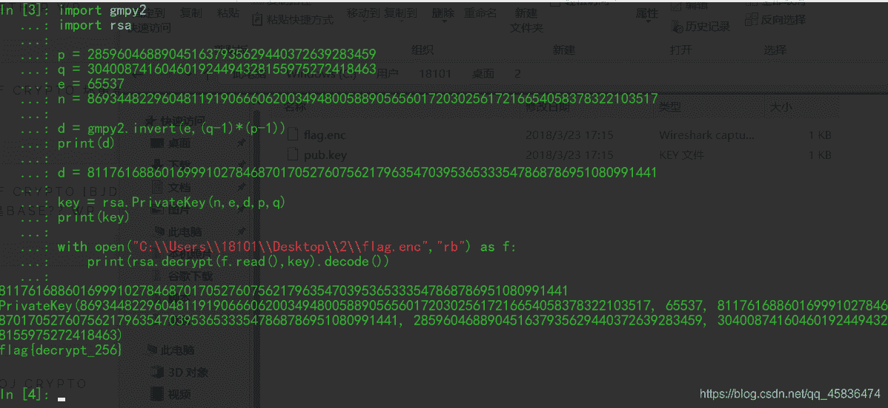
过程中遇到的错误：
原本我是在pycharm里跑脚本，但是跑这个脚本的时候 报错了。报错信息是这样的。
`AttributeError: module 'rsa' has no attribute 'PrivateKey'`
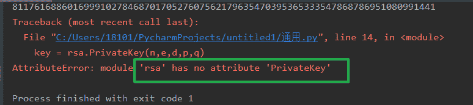
这种报错毫无头绪，百度找不到类似的错误，然后我怀疑脚本的问题，然后又找找其他的脚本，但是发现报错信息差不多，都是这个地方。想起来我电脑上还安装了ipython，于是就试试，但是也跑不出来。就去问了问学长。学长说在kali里面试试。这个我还没试，因为那里面还没安装gmpy2这个库。明天再安装。这期间我发现错误就是路径的问题。倒数第二行代码，打开文件`flag.enc`这个文件，要添加路径，路径中原本的`\`在这里使用`\\`因为转义。我于是又在pycharm里跑了一次，但是没有结果，同样的错误。
**重点**：我在ipython中试了一下，结果惊喜来了，成功了。就得到了上面的运行结果。
回头kali安装好gmpy2这个库之后我再试试这个题。
我还以为这篇博客真的要成为一篇纯粹收集脚本的文章了呢。还是有自己的收获的。